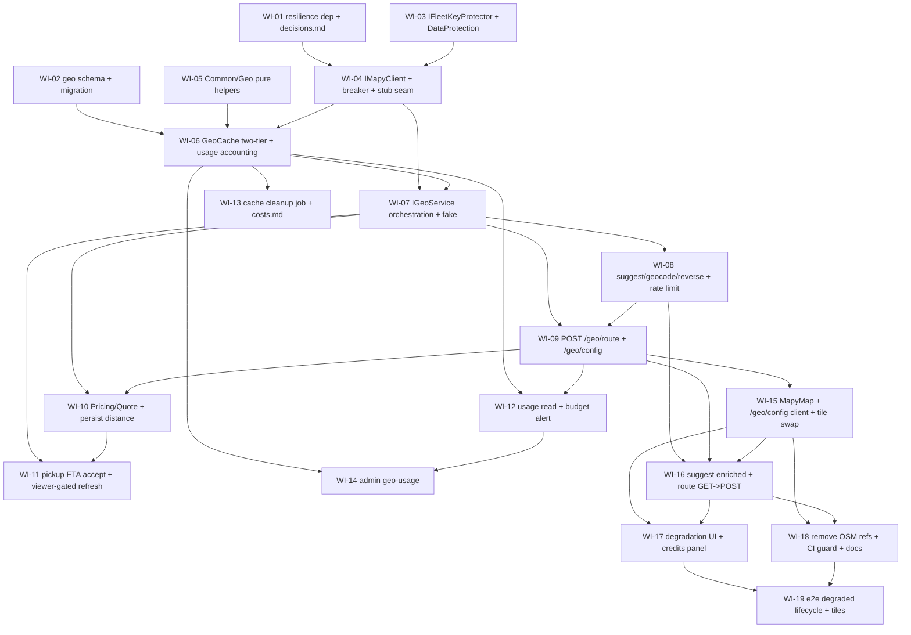

# UC-010 — Mapy.com REST API (work items)

Spec: `docs/specs/in-progress/010_UC_010_mapy.md`. Replaces OSM tiles + OSRM + Nominatim + Photon with the Mapy.com REST API behind our backend proxy, with two-tier caching, per-fleet credit budgets, and graceful degradation.

## Assumptions

Three design forks were resolved to the recommended defaults (AskUserQuestion is unavailable in this agent context — the conductor/user should confirm or override):

1. **Config endpoint — `/geo/config` only.** Spec §1 + AC#7 mention `GET /me/config`, which does not exist in the codebase. We add a dedicated **`GET /geo/config`** (anonymous + `X-Fleet-Slug`, mirroring the existing anonymous `GET /public/fleet`) carrying browser key + tile template + attribution + map center/zoom. This resolves the AC#4/tracking-map ambiguity: the logged-out customer tracking map must render without a JWT, and `/public/fleet` proves anonymous fleet resolution already works. AC#7's server-key-leak scan is repointed to `/geo/config` + `/public/fleet`. No `/me/config` is created.
2. **AC#3 ETA gating gets its own WI (WI-11), flagged `needs_library_research`.** SignalR exposes **no native group-membership count**, so the driver→pickup ETA refresh throttle (≤60 s, gated on an active viewer of `order:{id}` or the dispatcher detail being open) needs a custom subscriber-tracker. The impl agent must design that mechanism (an `OrderSubscriptionTracker` incremented in `FleetHub.Subscribe` / decremented in `OnDisconnectedAsync`). The create-time single quote call lives separately in WI-10; WI-11 layers the accept-time call + the viewer-gated refresh loop on top.
3. **WI granularity — merges applied.** Budget-alert + cache-cleanup would each be tiny; the cleanup sweep is WI-13 and the budget alert folds into the usage-read endpoint WI-12 (both touch `geo_usage`). §7 doc edits are distributed onto their motivating code WIs (`decisions.md`→WI-01; `costs.md`→WI-13; runbook/context/assignments→WI-18) rather than one weak docs-only WI.

Other grounding decisions (from the code, not invented):

- **Two geo layers in `Infrastructure/Geo/`:** `IMapyClient` (low-level typed `HttpClient` + resilience + server key) and `IGeoService` (high-level cache→client→degradation, successor to the current `IGeoProvider`). `QuoteEndpoint` calls the provider **in-process** (verified — it injects `IGeoProvider`, not an HTTP client), so it is repointed to `IGeoService`.
- **`GeoResult` is a discriminated union** (`Success | Unavailable`); the `try/catch` for infra (4 s timeout, retry-exhausted 5xx, breaker-open) lives **inside** `MapyClient` and maps to `Unavailable` there — the sanctioned "log and continue degraded" carve-out of `error-handling.md`. Endpoints guard-clause; no handler `try/catch`; never `null`.
- **Resilience library:** `Microsoft.Extensions.Http.Resilience 10.x` is verified .NET 10-compatible on nuget.org. WI-01 pins the exact version and records `docs/decisions.md`; if it conflicts with the EF-pin in `Directory.Build.props`, WI-01 falls back to a ~40-line `DelegatingHandler` breaker.
- **Encrypted keys** use `IDataProtectionProvider` via a `Common/Security/IFleetKeyProtector` (**not** an EF `ValueConverter`, which would break the design-time `TaxiDbContextFactory`). `AddDataProtection().PersistKeysToFileSystem(<volume>).SetApplicationName("taxi")` is **mandatory** — without a persisted key-ring, stored fleet keys become permanently undecryptable on restart.
- **`geo_cache` / `geo_usage` are NOT `ITenantEntity`** (no query filter) — read from varied scopes incl. background jobs, mirroring the `RefreshToken`/`SmsCode` no-filter precedent. Explicit `Where(c => c.FleetId == .. && ..)`.
- **Demo/first-day fleets** use env fallback keys (`Mapy__ServerKey` / `Mapy__BrowserKey`); `DevelopmentSeeder` writes no encrypted columns (leaves them null), so the seeder and design-time factory stay untouched.
- **AC#5 wording** (`orientační odhad` / wider ±20 % band) is a **response-body** estimate-mode field, not the debug `X-Geo-*` header. `X-Geo-Source`/`X-Geo-Cache` are debug-only headers on the 4 proxy endpoints; `/geo/config` uses `Cache-Control: max-age=604800` instead.

### Acceptance-criteria → WI map

| AC | WIs |
|----|-----|
| AC#1 no OSM/OSRM/Nominatim/Photon hosts + CI check | WI-18 |
| AC#2 suggest returns street+town; 2nd query is a cache hit (assert on client counter) | WI-04 (client counter over stub handler), WI-06 (cache), WI-08 (suggest endpoint + header), WI-16 (UI street+town) |
| AC#3 route call budget (create ≤1, accept +1, 5-min watch ≤5, none→0) | WI-10 (create-once + persist), WI-11 (accept + viewer-gated refresh) |
| AC#4 Mapy tiles + logo + attribution in all three apps | WI-15, WI-19 (e2e render) |
| AC#5 503 degradation: create/assign/complete + degraded banners + wider "orientační odhad" | WI-07 (fake Unavailable), WI-10 (fallback), WI-17 (UI), WI-19 (e2e) |
| AC#6 `geo_usage` = misses only; settings estimate; 80 % alert at budget 100 | WI-06 (misses only), WI-12 (settings + alert) |
| AC#7 browser key not in logs/non-tile; server key never to browser (scan `/geo/config` + `/public/fleet`) | WI-04 (no log), WI-09 (structural DTO guard) |
| AC#8 docs updated; `decisions.md` entry | WI-01 (decisions.md), WI-13 (costs.md), WI-18 (context + assignments + runbook) |

## Dependency Graph

Independent roots (parallelizable): WI-01, WI-02, WI-03, WI-05. Shared-file serialization (edges added so no two *parallel* agents touch one file — verified by a shared-file/DAG-order check, zero unordered collisions remain):
- `SeedAndEndToEndTests.cs` `expected` allowlist + `docs/api.md`: WI-08 → WI-09 → WI-12 → WI-14 chained.
- `GeoFeatureConfiguration.cs` (DI): WI-04 → WI-06 (→ WI-07).
- `client.ts` + `cs.json` + `en.json`: WI-15 → WI-16 (→ WI-17).
- `MapyMap.tsx` WI-15→WI-17, `leafletSetup.ts` WI-15→WI-18, `GeoUsageRecorder.cs` WI-06→WI-12 are already ordered by existing edges.

---

## WI-01: Verify resilience dependency + record docs/decisions.md — lane api, XS

**Required reads:** `Taxi.Api.csproj`, `api/Directory.Build.props`, `docs/decisions.md`, CLAUDE.md#EF-Core-package-version-conflict.
**Deliverables:** add `Microsoft.Extensions.Http.Resilience` (10.x) to the API project; `docs/decisions.md` UC-010 entry (choice, verified credit prices, estimated consumption, resilience-lib decision). No production code.
**Error paths:** EF-pin version conflict → document DelegatingHandler-breaker fallback instead.
**Tests:** build only. **Verification:** `dotnet-build`.

## WI-02: Geo schema + migration — lane api, L

**Required reads:** ef-core rules (dbset/indexes/enums/migrations/date-types), naming#migrations, csharp#guid-pks/xml-doc, CLAUDE.md SpotDbContext/jsonb/UUIDv7; `FleetSettings.cs`, `Order.cs`, `RefreshToken.cs`, `SmsCode.cs`, `FleetSettingsConfiguration.cs`, `OrderEventConfiguration.cs`, `TaxiDbContext.cs`, `TaxiDbContextFactory.cs`.
**Deliverables:** `fleet_settings` +6 cols (all non-null with `HasDefaultValue`); `orders` +`DistanceM`/`DurationS` (nullable, no index); `GeoCacheEntry` (composite PK `(FleetId,Kind,Key)`, jsonb value, `CreatedAt` index, no query filter) + `GeoCacheKind` enum; `GeoUsage` (composite PK `(FleetId,Day,Kind)`, `Day` `DateOnly`, no filter); both DbSets registered; `AddMapyGeoSchema` migration (`--output-dir Infrastructure/Migrations`).
**Error paths:** migration must be additive-only (ADD COLUMN + CREATE TABLE); design-time factory still constructs.
**Tests:** migration applies on Testcontainers; composite-PK uniqueness. **Verification:** `dotnet-test ~GeoSchema`.

## WI-03: IFleetKeyProtector + DataProtection — lane api, M

**Required reads:** architecture#common-infrastructure, csharp#sealed-internal/xml-doc, logging#what-must-not-appear-in-logs, `Program.cs`, `ICurrentTenant.cs`.
**Deliverables:** `Common/Security/IFleetKeyProtector` + impl over `CreateProtector("FleetSettings.MapyKeys")`; `Program.cs` `AddDataProtection().PersistKeysToFileSystem(<configured>).SetApplicationName("taxi")`; **`Common/Security/DataProtectionKeyRingGuard.cs` — PRIMARY safeguard: a fail-fast startup guard that refuses to boot (throws before the app starts) in non-Development when the configured keys dir is ephemeral/non-persistent (missing, unwritable, or container-ephemeral), so a redeploy can never silently mint a throwaway ring (which would make every stored fleet key permanently undecryptable). Development relaxes the guard to the local default dir.** Keys-volume mount is ALSO provisioned in the infra compose by WI-18 (deployment provision paired with this guard).
**Error paths:** persisted key-ring is mandatory (else keys undecryptable on restart) — proven by a simulated-restart test; ephemeral keys dir → boot fails fast.
**Tests:** round-trip; restart survival; **boot fails fast on an ephemeral keys dir (`Boot_WithEphemeralKeysDir_FailsFast`)**. **Verification:** `dotnet-test ~FleetKeyProtector`.

## WI-04: IMapyClient + resilience/breaker + HttpMessageHandler seam — lane api, XL, needs_library_research

**Required reads:** architecture#common-infrastructure/#banned-patterns, error-handling#exceptions-for-infrastructure/#no-exceptions-for-control-flow, csharp#sealed-internal/records/xml-doc/async, logging#style/#what-must-not-appear, CLAUDE.md#FakeGeoProvider-shared-singleton; `IGeoProvider.cs`, `PhotonOsrmGeoProvider.cs`, `GeoFeatureConfiguration.cs`, `INotificationService.cs`, `IFleetKeyProtector.cs`.
**Deliverables:** `IMapyClient` typed methods (`/v1/suggest`, `/v1/geocode`, `/v1/rgeocode`, `/v1/routing/route`) returning `GeoResult<T>`; typed `HttpClient` with 4 s timeout + 1 retry on 5xx + breaker (5 fail/30 s, half-open); `MapyKeyResolver` (per-fleet server key, env fallback); remove photon/osrm named clients.
**Error paths:** infra failure → `Unavailable` inside the client boundary; breaker-open short-circuits (no call, no credit).
**Tests (over stub handler, real client):** success parse; 5×503 opens breaker + skips upstream (call-counter assert); timeout → Unavailable. **Verification:** `dotnet-test ~MapyClient`.

## WI-05: Common/Geo pure helpers — lane api, S

**Deliverables:** `GeoCacheKey` (fold/round per kind), `HaversineDistance`, `GeoEstimateFallback` (×1.3, ETA=d/35 km/h, ±20 % band) — all pure static.
**Tests:** diacritics folding; known-pair haversine; fallback band. **Verification:** `dotnet-test ~GeoHelpers`.

## WI-06: GeoCache two-tier + geo_usage accounting — lane api, L

**Required reads:** architecture#common-infrastructure/#banned-patterns, ef-core#asnotracking/#projections, csharp#sealed-internal/timeprovider/xml-doc, CLAUDE.md#JsonDocument-projection / geo_usage-atomic-upsert; `GeoCacheKey.cs`, `GeoCacheEntry.cs`, `GeoUsage.cs`.
**Deliverables:** scoped `GeoCache` (singleton `IMemoryCache` L1 + scoped `TaxiDbContext` L2 + `TimeProvider`), app-enforced per-kind TTL, jsonb loaded-then-read; `GeoUsageRecorder` atomic `INSERT..ON CONFLICT DO UPDATE` via `ExecuteSqlInterpolatedAsync`.
**Error paths:** stale L2 row treated as miss; concurrent misses must not race.
**Tests:** 2nd read = L1 hit no DB no usage; stale L2 = miss; concurrent-misses atomic count. **Verification:** `dotnet-test ~GeoCache`.

## WI-07: IGeoService orchestration + fake — lane api, L

**Deliverables:** `IGeoService` (Suggest/Geocode/Reverse/Route + QuickPlace), composes cache→client→degradation; single accounting site on cache-miss-success (+4); delete `IGeoProvider`/`PhotonOsrmGeoProvider`; `FakeGeoService` (Reset() discipline) wired into `TaxiApiFactory`.
**Error paths:** `Unavailable` → no usage increment + degraded result.
**Tests:** cache-hit no credit/no client; Unavailable route → haversine estimate flagged wider; QuickPlace never calls client. **Verification:** `dotnet-test ~GeoService`.

## WI-08: suggest (enriched) + geocode + reverse + rate limit + headers — lane api, XL, needs_library_research

**Required reads:** api-design (endpoint/configure/send/routes/authorization/dont-catch), validation#when/#error-codes, error-handling#send-for-expected, csharp#records/guard/xml-doc, CLAUDE.md double-query-trap / required-STJ / WithTag-using / OpenAPI-allowlist; `SuggestEndpoint.cs`, `SuggestItemDto.cs`, `SuggestValidator.cs`, `ErrorCodes.cs`, `AuthorizationPolicies.cs`, `GeoProxyTests.cs`, `SeedAndEndToEndTests.cs`.
**Deliverables:** suggest grows `Near` (lenient parse) + `SuggestItemDto(Label, Street?, Municipality?, Lat, Lng)`; new `GET /geo/geocode` (min 3 → 400 `Geo.GeocodeQueryTooShort`; match → 200 Found=true with resolved coords+label; no match → 200 Found=false); new `GET /geo/reverse` (string coords, round 4 dp, valid → 200 resolved street+municipality; invalid → 400 `Geo.ReverseCoordsInvalid`); `GeoRateLimiter` 5 req/s/user → 429 `Geo.RateLimited`; `X-Geo-*` headers; allowlist + `docs/api.md`.
**Error paths:** suggest/reverse upstream Unavailable → 200 empty/nulls (never 502).
**Tests:** cache-hit header no client call; **geocode match → 200 Found (`HandleAsync_GeocodeMatch_Returns200Found`)**; geocode too short 400; **reverse valid coords → 200 address (`HandleAsync_ReverseValidCoords_Returns200Address`)**; reverse Unavailable 200 nulls; over-rate 429. **Verification:** `dotnet-test ~GeoProxy`.

## WI-09: POST /geo/route + GET /geo/config + allowlist — lane api, L

**Required reads:** api-design (endpoint/configure/send/authorization/dont-catch), validation#when/#error-codes, error-handling#send-for-expected, csharp#records/xml-doc, CLAUDE.md required-STJ / OpenAPI-allowlist; `RouteEndpoint.cs`+DTOs, `GetFleetEndpoint.cs`, `GetFleetResponse.cs`, `SeedAndEndToEndTests.cs`.
**Deliverables:** `GET /geo/route` → `POST /geo/route` `{from:{lat,lng},to:{lat,lng}}` (`GeoPoint` real `double`, no `required`, reject (0,0)); response gains geometry (≤200 pts) + estimate-mode; `GET /geo/config` (AllowAnonymous + X-Fleet-Slug, browser key + tile template + attribution + center/zoom, `Cache-Control max-age=604800`, **no** server-key member); allowlist GET→POST route + add config; `docs/api.md`.
**Error paths:** route Unavailable → 502 `Geo.RouteUnavailable` (Pricing does the fallback, not this endpoint).
**Tests:** valid POST body → distance/duration/geometry; (0,0) → 400; **route upstream Unavailable → 502 `Geo.RouteUnavailable` (`HandleAsync_RouteUpstreamUnavailable_Returns502` — the proxy's own 502, distinct from WI-10's downstream Pricing fallback)**; config anonymous returns browser not server key; config+public-fleet never expose server key (AC#7). **Verification:** `dotnet-test ~GeoRoute`.

## WI-10: Pricing/Quote on IGeoService + persist distance — lane api, M

**Required reads:** **api-design#endpoint-pattern/#send-pattern** (edits `QuoteEndpoint.cs` + `CreateOrderEndpoint.cs`), architecture#no-horizontal-layers, error-handling#core-principle/#send-for-expected, ef-core#asnotracking, csharp#guard/xml-doc; `QuoteEndpoint.cs`, `GeoEstimateFallback.cs`, `IGeoService.cs`, `Order.cs`, `PricingQuoteTests.cs`.
**Deliverables:** `QuoteEndpoint` injects `IGeoService`; known-dropoff → one route call; Unavailable → haversine ×1.3 wider ±20 % band + `orientační odhad` body field (no more 502 from Quote); Fixed route → 0 geo calls; persist `DistanceM`/`DurationS` on create.
**Tests:** quote-once + persist; Unavailable wider-band `orientační odhad`; Fixed zero calls. **Verification:** `dotnet-test ~PricingQuote`.

## WI-11: pickup ETA — accept-time call + viewer-gated refresh — lane api, XL, needs_library_research

**Required reads:** **api-design#endpoint-pattern** (edits `AcceptOrderEndpoint.cs`), architecture#no-horizontal-layers/#banned-patterns, error-handling#core-principle, csharp#timeprovider/xml-doc, logging#style, CLAUDE.md#SignalR-hub-tenant-scope / Background-job-testability; `FleetHub.cs`, `SignalRRealtimePublisher.cs`, `OrderService.cs`, `AcceptOrderEndpoint.cs`, `IGeoService.cs`.
**Scout first:** SignalR has no native group-member count — design an `OrderSubscriptionTracker` (inc in `Subscribe` / dec in `OnDisconnectedAsync` for `order:{id}`, plus dispatcher-detail-open signal); document the mechanism in notes. **`OrderSubscriptionTracker` is an in-memory singleton (mirrors the `DriverPositionStore` precedent) — DI-register it as a singleton and reset it per-test (shared across the test collection, so tests must clear it to avoid cross-test leakage, exactly like `FakeGeoProvider`/`DriverPositionStore`).**
**Deliverables:** accept-time single route call; refresh ≤60 s only while a viewer is subscribed; extrapolate between refreshes; assign-picker distances stay haversine (0 calls).
**Tests:** accept = 1 call; 5-min watch ≤5; no-watcher = 0 + extrapolate; picker = 0. **Verification:** `dotnet-test ~PickupEta`.

## WI-12: usage read + 80/100 % budget alert — lane api, M

**Deliverables:** `GET /settings/geo-usage` — **`Policies(nameof(AuthorizationPolicies.FleetAdminOnly))`** (the settings/budget page is a FleetAdmin surface; the concrete policy is resolved to `FleetAdminOnly`, NOT `DispatcherOnly`) — month estimate + %; new `NotificationEvent.GeoBudgetWarning`; alert enqueued via notification engine on crossing 80 %/100 %, once per fleet-month (dedup per fleet + ISO-month on the `NotificationLog` unique index); allowlist + `docs/api.md`.
**Tests:** budget 100 → 80 % alert fires once and does not re-fire while still in the 80–100 % band (`GeoUsage_Budget100_At80Percent_FiresAlertOnce`); **budget 100 → 100 % alert fires once (`GeoUsage_Budget100_At100Percent_FiresAlertOnce`) — AC#6 requires alerts at BOTH 80 % and 100 %**; usage read; cache-hit doesn't increment. **Verification:** `dotnet-test ~GeoBudgetAlert`.

## WI-13: cache cleanup job + costs.md — lane api, M

**Deliverables:** `GeoCacheCleanupJob` (RunTickAsync shell, registered in `AddJobs`), per-kind `ExecuteDeleteAsync` of expired rows except QuickPlace (forever); `docs/costs.md` tile-credit estimate placeholder.
**Tests:** expired non-QuickPlace deleted; QuickPlace never deleted. **Verification:** `dotnet-test ~GeoCacheCleanup`.

## WI-14: admin geo-usage — lane api, M

**Deliverables:** `GET /api/v1/admin/geo-usage` (SuperAdminOnly, `EndpointWithoutRequest`, `IgnoreQueryFilters`, current month) — per-fleet rows + totals + %budget; allowlist + `docs/api.md`.
**Error paths:** non-SuperAdmin → 403.
**Tests:** SuperAdmin sees both fleets; non-SuperAdmin 403. **Verification:** `dotnet-test ~AdminGeoUsage`.

## WI-15: shared MapyMap + /geo/config client + tile swap — lane web, L

**Required reads:** web-architecture (feature-folders/api-client/state-tiers/banned), web-react-style (styled/component/ts-strict/i18n), web-performance (query-keys/code-splitting), web-accessibility#semantics, web-testing (test-ordering/a11y/i18n-parity/queries-over-testids); `leafletSetup.ts`, `MapPanel.tsx`, `TrackingMapInner.tsx`, `client.ts`, `PickupMapInner.tsx`.
**Deliverables:** `getGeoConfig()` + `useGeoConfig` (['geo','config']); pure `tileTemplate.ts` (basic 256 px, @2x only >1.5 dpr); `MapyMap.tsx` (MapContainer + Mapy TileLayer + mandatory logo + attribution control, center/zoom from config); swap all TileLayer users to `MapyMap`; remove `OSM_TILE_URL`/`OSM_ATTRIBUTION`; i18n keys in both locales.
**Tests:** tileTemplate @2x rule; attribution + accessible logo; axe. **Verification:** `vitest shared/map`.

## WI-16: suggest enriched + route GET→POST — lane web, M

**Deliverables:** `GeoSuggestItem` +`street?`/`municipality?`; both suggest lists render street+town; `getGeoRoute` GET→POST body + `GeoRouteResponse` geometry/estimateMode; update `useRouteEstimate` + `useOfferRoute` + tests; preserve 350 ms debounce/min-3/cancellation; i18n parity.
**Tests:** autocomplete shows street+municipality; route posts body + maps geometry; offer degrades silently. **Verification:** `vitest features/board/useRouteEstimate`.

## WI-17: degradation UI + credits panel — lane web, M

**Deliverables:** `MapUnavailableBanner` (role=alert grey-tile "Mapa dočasně nedostupná"); order card "bez souřadnic"; reverse-degraded shows coords; estimate wider range + "orientační odhad" label (AC#5); `GeoUsagePanel` + `useGeoUsage`; i18n parity; axe.
**Tests:** banner role=alert + axe; wider-range orientační odhad; panel estimate+%. **Verification:** `vitest shared/map/MapUnavailableBanner`.

## WI-18: remove OSM refs + CI guard + docs §7 — lane web, S

**Deliverables:** remove the 4 legacy hostnames from `web/src`; `noLegacyMapHosts.test.ts` grep guard + eslint no-restricted-syntax/npm-script CI check (AC#1); `00-PROJECT-CONTEXT.md` §4 + assignments 02/04/06/08 (08 gains Mapy console runbook + DataProtection keys-volume note + cost line); **infra compose (`docker-compose.prod.yml` + `docker-compose.dev.yml`) mount a PERSISTENT named volume for the DataProtection key-ring onto the `api` service's keys dir so the ring survives redeploys (deployment provision paired with WI-03's fail-fast guard — without a persistent ring every stored fleet Mapy key becomes permanently undecryptable on redeploy).**
**Tests:** no legacy hostname under `web/src`. **Verification:** `vitest shared/map/noLegacyMapHosts`.

## WI-19: e2e degraded lifecycle + tiles — lane web, M

**Deliverables:** `mapy-degraded.spec.ts` — with geo forced 503, dispatcher creates/assigns/completes an order + degraded banners + "orientační odhad" (AC#5); happy-path Mapy attribution/logo render (AC#4); own serial spec.
**Verification:** `playwright`.
