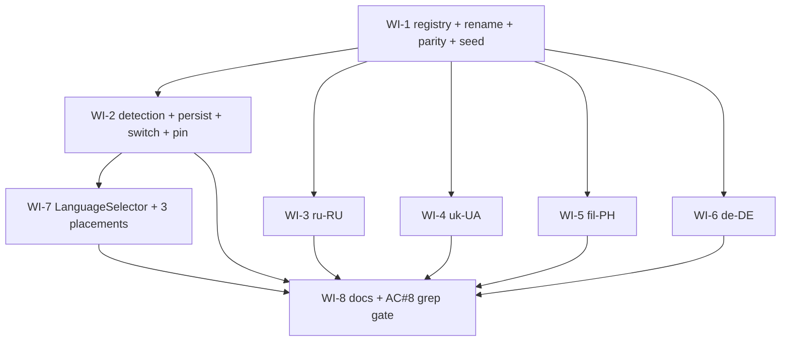

# UC-011 Multilingual UI — Work Items

Spec: `docs/specs/in-progress/011_UC_011_multilingual.md`. All work is frontend-only (`web/`); every WI is `lane: web`.

## Assumptions

- **Placeholder-seed strategy (load-bearing).** WI-1 registers all six locales in `locales.ts`, wires all six imports/resources in `index.ts`, generalizes the parity test, **and creates the four new JSON files as key-complete copies of `cs-CZ.json`** (Czech placeholder values). This is what keeps `npm-build`/`npm-tsc`/parity green from WI-1 onward — the generalized parity test and `index.ts` both import every locale's JSON, so the files must exist and be key-complete before anything else runs. Each language WI (WI-3…6) then **overwrites exactly one JSON file** with real translations and **adds its own code to `ENFORCED_LOCALES`** in the shared `sentinelKeys.ts` (a one-line edit per locale). The four remain logically independent (no `depends_on` edge), so they parallelize; because they all append to the same `ENFORCED_LOCALES` array, concurrent branches may need a trivial one-line merge on that array — safe to parallelize regardless.
- **Sentinel translation gate (design-review round 1, HIGH).** Parity (keys) alone can go GREEN with Czech placeholders, giving no observable RED for WI-3…6 — the pipeline could complete shipping Czech copies. So WI-1 also seeds a **sentinel gate**: `sentinelKeys.ts` defines `SENTINEL_KEYS`, a curated set of **six non-brand full-sentence keys** (3 dispatcher, 3 customer) that MUST differ from the `cs-CZ` value for each *enforced* locale, plus `ENFORCED_LOCALES` (seeded **empty** so WI-1 stays GREEN). `locales.sentinel.test.ts` iterates `ENFORCED_LOCALES` and asserts each SENTINEL_KEYS value differs from `cs-CZ`. Each language WI flips its locale into `ENFORCED_LOCALES` → observable **RED** against the seed copy, **GREEN** after real translation; enforcement accrues one locale per language WI and the final state (after WI-6) enforces all four. Do **not** harden WI-1 with a static "all four enforced" check — with the empty seed that would make WI-1 RED; the conductor's full-suite gate exercises all four at the end. The sentinel keys are deliberately **non-brand full sentences** (login/validation/dialog text), so the earlier "brand tokens legitimately match" objection does not apply — parity still guards keys, sentinel now guards translation-actuality. Native-speaker *quality* review remains a tracked follow-up per spec §5; the sentinel gate only proves each locale was actually translated, not that it is native-quality.
- **The six sentinel keys (defined once in `sentinelKeys.ts`, referenced by WI-3…6):** dispatcher — `login.invalidCredentials`, `board.form.validation.phoneInvalid`, `settings.accessDenied`; customer — `customer.order.loginPrompt`, `customer.tracking.cancelDialogBody`, `customer.login.codeMismatch`. All are full Czech sentences in `cs-CZ.json` today, none is a brand token, and each genuinely differs in de/ru/uk/fil. WI-3…6 consume this set — they never restate it.
- **`common.language` key** (selector `aria-label`) is added to `cs-CZ.json` in WI-1 and propagated to all six locales there, so parity holds before the language WIs start.
- **Rename ripple is fully enumerated.** Direct importers of the JSON beyond `index.ts` + parity test: `src/shared/audit/auditEventLabel.test.ts`, `src/features/orders/eventTimeline.test.ts`. Runtime coupling to the old resource key: `src/features/admin/PlatformScreen.test.tsx` calls `i18n.changeLanguage('cs')` → must become `'cs-CZ'`. All four are in WI-1's `files_touched`. (Every other `lng:` hit in the codebase is a geo-longitude field, not i18n.)
- **Unit-test Czech baseline preserved:** `index.ts` keeps a static `lng: DEFAULT_LOCALE` ('cs-CZ'); detection lives only in `applyInitialLanguage()` called once from `main.tsx`. `test-setup.ts` is untouched. The ~1,464 existing tests stay in Czech.
- **Playwright locale pin ships with the detection wiring (WI-2), not later** — `applyInitialLanguage()` makes startup detect the browser locale, which would flip every existing e2e to `en-US`. The `use.locale: 'cs-CZ'` edit and the `main.tsx` call are the same WI; blocking AC#7 otherwise.
- **Selector placement is one WI.** `LanguageSelector` lives in `shared/i18n` (no route group); the three placements are ~3 lines each. This is a cross-cutting shared-component rollout, not feature logic crossing a route-group boundary, so `rules/web-architecture.md#route-groups` is satisfied. Verified as a unit (AC#4).
- **Formatting is a non-goal** (spec §21) — money stays `cs-CZ` (`… Kč`), dates stay `Europe/Prague` in every UI language. AC#6 gets a cheap real test in WI-2 (`formatStaysCs.test.ts`) so the non-goal is machine-verified rather than merely assumed.
- **No new e2e spec.** Spec §6 requires only the Playwright locale pin (keep existing specs Czech); AC#2/#3 are covered at unit level (`resolveInitialLanguage`, `languageStorage`, `useLanguage`, `LanguageSelector`).
- **Registry-derived detection + parity (makes AC#8 literally true, not just green).** The parity test iterates the **resources map exported from `index.ts`** (never re-imports individual JSONs), so parity carries zero per-locale literals. `resolveInitialLanguage`'s primary-subtag map is **derived** from `SUPPORTED_LOCALES` (`code.split('-')[0] → code`); only the `tl → fil-PH` legacy alias (Tagalog, not derivable) is hardcoded — so a hypothetical 7th locale auto-detects with no edit to that module. The WI-8 extensibility scan therefore targets **non-test production source** (test files legitimately name codes and are excluded) and whitelists exactly `{locales.ts, index.ts, resolveInitialLanguage.ts}`.
- **The AC#8 scan flags only the FIVE non-default codes (design-review round 1, HIGH).** `'cs-CZ'` is **spec-MANDATED as a formatting literal** in ~30 non-test production files (`money.ts` `Intl.NumberFormat('cs-CZ')`, `TrackingPage`, `HistoryRow`, `PlatformScreen`, `AuditPage`, `DriverDrilldown`, `smsCostDisplay`, `csvExport`, …) — the spec's formatting non-goal keeps money `cs-CZ`/`Kč` and dates `Europe/Prague` in every UI language. So the scan is **unsatisfiable** if it flags `cs-CZ`. WI-8's `extensibility.test.ts` flags **only** `{en-US, ru-RU, uk-UA, fil-PH, de-DE}`; `cs-CZ` is exempt and its ~30 formatting occurrences are correct. One existing non-test file also uses a non-default code as a pure formatting literal: `shared/date/analyticsRange.ts` calls `Intl.DateTimeFormat('en-US', { timeZone: 'Europe/Prague' })` to extract date parts (locale-agnostic, not a UI-language reference) — it is added to the whitelist alongside the three registry modules. The test file carries a source comment saying WHY these are exempt, so an impl agent does not "fix" them back into the flagged set.
- **WI-1 gate is the full vitest suite, not a filter.** WI-1's rename ripples into files whose paths contain no "i18n" (`eventTimeline.test.ts`, `auditEventLabel.test.ts`, `PlatformScreen.test.tsx`); a filtered run would go green while the suite breaks. WI-1 runs the whole suite. WI-2…8 filters are safe (their touched files sit under the filtered path).

## Dependency Graph

The five children of WI-1 (WI-2…6) run in parallel. WI-3…6 each edit their own JSON plus append one line to `ENFORCED_LOCALES` in the shared `sentinelKeys.ts`; that append may need a trivial one-line merge across concurrent branches, but introduces no `depends_on` edge — the WIs stay logically independent and the parallel shape holds. Acyclic; topo order e.g. `WI-1, [WI-2,WI-3,WI-4,WI-5,WI-6], WI-7, WI-8`.

## AC → WI coverage

| AC | Covered by |
|----|-----------|
| 1 — six locales key-complete, parity fails loudly, each translation actually differs from Czech | WI-1 (generalized parity + sentinel gate seed) + WI-3…6 (each locale: parity keys + sentinel RED→GREEN) |
| 2 — switch re-renders whole UI, no reload; persists across reload | WI-2 (`useLanguage`, `languageStorage`) + WI-7 (selector) |
| 3 — auto-detect on first visit, unsupported → Czech | WI-2 (`resolveInitialLanguage`, `applyInitialLanguage`) |
| 4 — selector in all three clients, a11y label, 48 px, axe | WI-7 |
| 5 — `<html lang>` reflects active language | WI-2 (`applyInitialLanguage` + `useLanguage`) |
| 6 — money `Kč`/`cs-CZ`, dates `Europe/Prague` in every language | WI-2 (`formatStaysCs.test.ts`) |
| 7 — quality gates green (tsc/lint/vitest/e2e) | every WI's `verification` + conductor gate; e2e stays Czech via WI-2's pin |
| 8 — adding a 7th locale = one file + one registry entry + one import; no other locale-code refs | WI-8 (`extensibility.test.ts` grep gate, flags only the five non-default codes — `cs-CZ` exempt as a spec-mandated formatting literal); honored by WI-7 (selector maps registry) + WI-2 (subtag map is the one documented exception) |

---

## WI-1: Locale registry + culture-code rename + N-locale parity gate + placeholder JSON seed

**Required reads:** spec §1, §2, §6; `rules/web-architecture.md#feature-folders`, `rules/web-testing.md#i18n-parity`, `rules/web-testing.md#red-green-refactor`, `rules/web-testing.md#colocation-and-naming`, `rules/web-react-style.md#typescript-strict`.

**Deliverables:**
- `locales.ts` — `SUPPORTED_LOCALES` (six `{code, nativeName}` entries, `as const`), `LocaleCode` type, `DEFAULT_LOCALE = 'cs-CZ'`.
- Rename `cs.json → cs-CZ.json`, `en.json → en-US.json`; add `common.language` to `cs-CZ.json`.
- Seed `ru-RU.json`, `uk-UA.json`, `fil-PH.json`, `de-DE.json` as key-complete copies of `cs-CZ.json`.
- `index.ts` rewrite: resources from the six JSONs keyed by culture code; `lng: DEFAULT_LOCALE` (static), `fallbackLng: 'en-US'`, `supportedLngs` from the registry, `escapeValue: false`. No detection here.
- `index.ts` exports the built `resources` map (keyed by culture code) for parity/registry consumers.
- Generalize `locales.parity.test.ts` to iterate the exported resources map vs `cs-CZ` (no per-locale JSON imports).
- `sentinelKeys.ts` — `SENTINEL_KEYS` (the six curated non-brand full-sentence dot-paths above, frozen) + `ENFORCED_LOCALES: LocaleCode[]` **seeded empty**. This is the shared, single-source key set WI-3…6 consume; each language WI adds only its own code to `ENFORCED_LOCALES`.
- `locales.sentinel.test.ts` — iterates `ENFORCED_LOCALES`; for each, asserts every `SENTINEL_KEYS` value in that locale (resolved from the `index.ts` resources map) differs from the `cs-CZ` value. Empty `ENFORCED_LOCALES` ⇒ GREEN in WI-1.
- Fix importers: `auditEventLabel.test.ts`, `eventTimeline.test.ts` (path rename); `PlatformScreen.test.tsx` (`changeLanguage('cs')` → `'cs-CZ'`).

**Error paths:** none (config + data). A missing/extra key in any seeded file → parity RED (intended gate); an enforced locale whose sentinel values still equal `cs-CZ` → sentinel RED.

**Tests:** parity across six locales via the resources map (observe RED with a deliberately missing key, then GREEN); sentinel GREEN with `ENFORCED_LOCALES` empty (temporarily enforcing a placeholder locale shows RED, proving the gate bites before any WI-3…6 translation); `i18n.language === 'cs-CZ'` on isolated import; timeline/audit tests green on new paths; PlatformScreen suite green.

**Verification:** `vitest` (full suite — the rename ripples outside the `i18n` path).

---

## WI-2: Detection + persistence + switching + main.tsx apply + format guard + Playwright pin

**Required reads:** spec §3, §6; `rules/web-architecture.md#pure-logic-modules`, `#state-tiers`, `rules/web-react-style.md#typescript-strict`, `#dates-and-money`, `rules/web-testing.md#test-ordering`, `#timers-and-async`.

**Deliverables:**
- `languageStorage.ts` — key `app.language`, driverSettings try/catch pattern, validates against `SUPPORTED_LOCALES`; not in `authStorage`.
- `resolveInitialLanguage.ts` — pure: stored → exact culture match → primary-subtag → `DEFAULT_LOCALE`. Subtag map **derived** from `SUPPORTED_LOCALES` (`code.split('-')[0] → code`); only `tl → fil-PH` (Tagalog legacy alias) is hardcoded, so a 7th locale auto-detects with no edit here (AC#8).
- `applyInitialLanguage.ts` — resolve `navigator.languages` + stored, `changeLanguage`, set `documentElement.lang`. Called once from `main.tsx`.
- `useLanguage.ts` — `{ current, setLanguage }`; `setLanguage` = `changeLanguage` + `setStoredLanguage` + set `documentElement.lang`.
- `main.tsx` — call `applyInitialLanguage()` before render.
- `playwright.config.ts` — add `locale: 'cs-CZ'` to top-level `use`.
- `formatStaysCs.test.ts` — AC#6 guard.

**Error paths:** `localStorage` throws → storage helpers return safely (null / no-op). Unknown/empty navigator langs → `DEFAULT_LOCALE`.

**Tests:** `resolveInitialLanguage` (exact, subtag, stored-wins, unknown→cs-CZ, empty→cs-CZ); `languageStorage` (round-trip, invalid ignored, throw-safe); `useLanguage` (switch + persist + `<html lang>`); `formatStaysCs` (money/date unchanged after switching to `de-DE`).

**Verification:** `vitest --filter i18n`.

---

## WI-3…6: Language files (`ru-RU`, `uk-UA`, `fil-PH`, `de-DE`)

One WI per language; each overwrites exactly one JSON file **and appends its own code to `ENFORCED_LOCALES`** in the shared `sentinelKeys.ts` — a one-line edit that may need a trivial merge across concurrent branches, but adds no dependency edge, so the four stay parallel-safe.

**Required reads:** spec §5; `rules/web-testing.md#i18n-parity`, `rules/web-testing.md#red-green-refactor`, `rules/web-react-style.md#i18n-czech-first`.

**Deliverables:** all keys (+`common.language`) translated, native-quality; identical key structure to `cs-CZ.json`. Add this locale's code to `ENFORCED_LOCALES` in `sentinelKeys.ts`.

**Error paths:** dropped/added key → parity RED; sentinel values still equal `cs-CZ` after enforcing → sentinel RED.

**Rules:** preserve every `{{placeholder}}` verbatim; do not localize brand/proper nouns or non-text tokens (app name, `SMS`, `PWA`, `Kč`, error-code-like values); register split — customer formal, driver informal (German `Sie`/`du`; Filipino `po/opo` vs informal).

**Tests:** the generalized parity test (from WI-1) passes for the locale; the **sentinel test** — after adding this code to `ENFORCED_LOCALES`, every `SENTINEL_KEYS` value (defined once in WI-1's `sentinelKeys.ts`, not restated here) must differ from `cs-CZ`. Observe RED against the placeholder seed **before** translating, GREEN after real translation lands.

**Verification:** `vitest --filter locales.` (matches both `locales.parity.test.ts` and `locales.sentinel.test.ts`).

---

## WI-7: Shared LanguageSelector + placement in all three clients

**Required reads:** spec §4; `rules/web-react-style.md#styled-components`, `#component-conventions`, `#i18n-czech-first`, `rules/web-accessibility.md#a11y-gate`, `#semantics`, `#touch-targets`, `rules/web-testing.md#a11y-assertion`, `#queries-over-testids`, `rules/web-architecture.md#route-groups`.

**Deliverables:**
- `LanguageSelector.tsx` — styled native `<select>` (VehicleSelector pattern), `min-height: theme.touchTargets.min` (≥48 px), one `<option>` per `SUPPORTED_LOCALES` (`nativeName`), `value = i18n.language`, `onChange → useLanguage().setLanguage`, `aria-label={t('common.language')}`.
- Placements: `AppLayout.tsx` `<Nav>` (before mute/logout); `DriverSettingsPage.tsx` (settings section, NavAppPreference style, not bottom nav); `CustomerLayout.tsx` header next to `CallButton`.

**Error paths:** none (pure UI; selection is idempotent).

**Tests:** renders all six options; selecting calls `setLanguage`; `value` reflects `i18n.language`; vitest-axe clean (preconfigured helper); each of the three hosts renders the selector.

**Verification:** `vitest --filter LanguageSelector`.

---

## WI-8: Docs + AC#8 extensibility grep gate

**Required reads:** spec §7; `rules/web-react-style.md#i18n-czech-first`, `rules/web-react-style.md#dates-and-money`, `rules/web-architecture.md#feature-folders`.

**Deliverables:**
- `rules/web-react-style.md#i18n-czech-first` — note `SUPPORTED_LOCALES` as source of truth, N-locale parity, formatting stays `cs-CZ`/`Europe/Prague`.
- `00-PROJECT-CONTEXT.md` — record the six-locale set + registry.
- `docs/decisions.md` — six-locale decision, full-culture-code convention, auto-detect→Czech fallback.
- `extensibility.test.ts` — AC#8 gate: scan **non-test production source** under `web/src` (exclude `*.test.ts`/`*.test.tsx` and the whitelist `{locales.ts, index.ts, resolveInitialLanguage.ts, shared/date/analyticsRange.ts}`) for the **five non-default culture codes** `{en-US, ru-RU, uk-UA, fil-PH, de-DE}`; assert none appears. **`cs-CZ` is exempt** — it is a spec-mandated formatting literal in ~30 non-test files (`money.ts` `Intl.NumberFormat('cs-CZ')`, `TrackingPage`, `HistoryRow`, `PlatformScreen`, `AuditPage`, …). **`analyticsRange.ts` is whitelisted** — its `Intl.DateTimeFormat('en-US', { timeZone: 'Europe/Prague' })` is a locale-agnostic date-parts extractor, not a UI-language reference, so its `en-US` is a formatting literal. The test file carries a source comment stating WHY both are exempt so an impl agent does not re-add them to the flagged set. Also assert the 7th-locale contract holds structurally (selector maps the registry, parity iterates the resources map, detection derives its subtag map).

**Error paths:** a stray **non-default** locale-code literal in non-test production source → test RED. (`cs-CZ` occurrences are correct and not flagged.)

**Tests:** the extensibility scan (none of the five non-default codes leaks into non-test source; `cs-CZ` formatting literals are allowed; selector/detection/parity iterate the registry; adding a 7th locale needs no `resolveInitialLanguage` edit).

**Verification:** `vitest --filter extensibility`.
