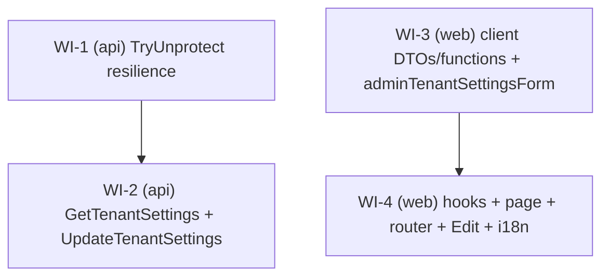

# UC-012 — Work Items — SuperAdmin per-tenant settings editor

Source spec: `docs/specs/in-progress/012_UC_012_admin-tenant-settings.md`
Branch: `uc-012-admin-tenant-settings`

## Assumptions

- **Two independent lanes.** The web lane is built against the **agreed JSON contract** (the GET/PUT DTO shapes defined here and mirrored in `client.ts`), not against a running API. Therefore no `depends_on` edge crosses lanes: `{WI-1, WI-3}` are first-wave roots and `{WI-2, WI-4}` follow within their own lane. The contract must stay byte-compatible: GET returns all Fleet+FleetSettings fields + `mapyBrowserKey` (nullable) + `mapyServerKeyConfigured` (bool) and **no server-key value**; PUT takes number fields as numbers, `mapyServerKey`/`mapyBrowserKey` as `string | null`.
- **GET+PUT merged into one API WI (WI-2).** They share `SeedAndEndToEndTests.cs` (OpenAPI allowlist), `docs/api.md`, `Common/ErrorCodes.cs`, `AdminFeatureConfiguration`, and the `Admin/` test folder — splitting would create write contention and neither ships useful alone. The spec's (a)/(b)/(c) sub-parts are one write-side vertical slice pair.
- **`AdminFeatureConfiguration` is reused**, not re-created — both new endpoints do `new AdminFeatureConfiguration()` (it already exists under `Features/Admin/`).
- **Server key has no UI clear affordance.** The write-only server-key field always loads blank; a blank submit means **keep** (request sends `null`). The `""`=clear semantic is API-only and is exercised by backend integration tests, never by the UI. This is the single highest-risk detail — a naive form that maps blank→`""` would silently wipe every tenant's server key on save.
- **No new entity, no migration** — all target columns already exist on `Fleet`/`FleetSettings`.
- **No e2e.** The spec does not require a Playwright flow; per rules Playwright is reserved for critical cross-role flows. Coverage is backend integration + web unit/component/axe.
- **`docs/API-KEYS.md` is pre-staged by the user** (pipeline `pre_existing_worktree_note`). WI-2 does a **targeted Edit of §1.3 only** and preserves the rest — it must not clobber the user's staged content.
- **Response DTO is a property-based record** (`{ get; init; }` + per-property `
`), not a large positional record, to avoid the CS1573 all-or-nothing `<param>` trap under `-warnaserror` (CLAUDE.md OrderDetailDto fact).
- **Request DTO carries no C# `required`** (STJ 500-trap, CLAUDE.md WI-11); the validator catches missing/invalid values as 400.
- Backend builds/tests run via the **user-local dotnet SDK** (bare `dotnet` is SDK 9 → NETSDK1045).

## Dependency Graph

First wave (parallel): **WI-1**, **WI-3**. Second wave: **WI-2** (after WI-1), **WI-4** (after WI-3). No cross-lane dependency.

---

## WI-1 — TryUnprotect resilience (api, S)

Root of the API lane. Makes the geo-config path resilient to un-decryptable / legacy raw values so a bad key degrades to the configured fallback instead of HTTP 500.

**Required Reads:** spec §1.4; `IFleetKeyProtector.cs`, `FleetKeyProtector.cs`, `GeoConfigEndpoint.cs`, `MapyKeyResolver.cs`; tests `Geo/GeoConfigTests.cs`, `Geo/FleetKeyProtectorTests.cs`.

**Deliverables:**
- `string? TryUnprotect(string?)` on `IFleetKeyProtector`, implemented in `FleetKeyProtector` — returns `null` on null/empty input **and** on `System.Security.Cryptography.CryptographicException`; otherwise the plaintext. `Unprotect` unchanged (additive).
- `GeoConfigEndpoint` browser-key resolution swaps `Unprotect` → `TryUnprotect` (line ~71).
- `MapyKeyResolver.Resolve` swaps `Unprotect` → `TryUnprotect` (line ~19).

**Error Paths:** a raw/legacy column value no longer throws — it decrypts to `null` and the caller falls back to `Mapy:BrowserKey` / `Mapy__ServerKey` config.

**Tests (RED first):**
- `TryUnprotect_ValidCiphertext_ReturnsPlaintext`, `TryUnprotect_RawNonCiphertextValue_ReturnsNull`, `TryUnprotect_NullOrEmpty_ReturnsNull`.
- `GeoConfigTests.HandleAsync_FleetHasRawBrowserKey_ReturnsFallbackNot500` (regression) + existing happy-path stays green.

**Verification:** `dotnet-test` filter `Taxi.Api.Tests.Geo`; then `dotnet build -warnaserror` + full `dotnet test`.

---

## WI-2 — GetTenantSettings + UpdateTenantSettings SuperAdmin slices (api, L)

Depends on **WI-1** (GET decrypts the browser key via `TryUnprotect`). Two `internal sealed`, `DontCatchExceptions()`, `SuperAdminOnly` endpoints under `Features/Admin/`, mirroring `CreateFleet`/`DeactivateFleet` cross-tenant writes and `UpdateFleetSettings` upsert shape.

**Required Reads:** spec §1.1–1.3, §5; `CreateFleetEndpoint.cs`, `DeactivateFleetEndpoint.cs`, `AdminFeatureConfiguration.cs`, `UpdateFleetSettings/*`, `GetFleetSettingsEndpoint.cs`, `Fleet.cs`, `FleetSettings.cs`, `ErrorCodes.cs`, `IFleetKeyProtector.cs`, `MapyKeyResolver.cs`, `Seed/SeedAndEndToEndTests.cs`, `Admin/AdminGeoUsageTests.cs`, `docs/API-KEYS.md`.

**Deliverables:**
- `GetTenantSettings/`: `GetTenantSettingsEndpoint` (`GET admin/fleets/{id:guid}/settings`) + `GetTenantSettingsResponse` (property-based record). Loads Fleet + FleetSettings by id with `IgnoreQueryFilters()` + `AsNoTracking()`; 404 if missing; entity defaults if no FleetSettings row. Carries all editable fields, `mapyBrowserKey` (via `TryUnprotect`), and `mapyServerKeyConfigured` — **server-key value structurally absent**.
- `UpdateTenantSettings/`: `UpdateTenantSettingsEndpoint` (`PUT admin/fleets/{id:guid}/settings`) + `UpdateTenantSettingsRequest` (plain class, no `required`, `double` lat/lng) + `UpdateTenantSettingsValidator`. Tracked `IgnoreQueryFilters()` load, upsert FleetSettings, assign all fields, **stamp `currentTenant.FleetId = id` (CurrentTenant concrete) before `SaveChangesAsync`**, return 204; 404 if fleet missing.
- **Key write semantics** (both keys): `null`=keep, `""`=clear to `null`, non-empty=`Protect(value)`. Never log either key.
- New `ErrorCodes.Validation.*` constants (timeZone, currency, autoDispatchAfterSeconds, maxOfferRadiusKm, smsUnitCost, smsSenderName len, mapCenterLat/Lng, mapZoom, geoMonthlyCreditBudget, mapy key len).
- OpenAPI allowlist: add `GET`/`PUT /api/v1/admin/fleets/{id}/settings` (constraint-stripped) to `expected` in `SeedAndEndToEndTests.cs`; regenerate + stage `docs/api.md`.
- `docs/API-KEYS.md` §1.3 targeted Edit (settings UI now exists; keep env fallback + key-ring warning; note write-only server-key contract).

**Error Paths:** unknown fleet → 404; non-SuperAdmin → 403; invalid body → 400 with stable error code.

**Tests (RED first):** SuperAdmin update→204 & row changed; Mapy round-trip via **real** `IFleetKeyProtector` (ciphertext≠plaintext, `MapyKeyResolver.Resolve` returns plaintext); GET has flag but no server-key value; blank server key keeps, `""` clears; browser-key three branches; 403 non-SuperAdmin; 404 unknown fleet; 400 invalid body; GET defaults when no settings row; validator unit tests per rule; OpenAPI allowlist + api.md regen.

**Verification:** `dotnet-test` filter `Taxi.Api.Tests.Admin`; then `dotnet build -warnaserror` + full `dotnet test`.

---

## WI-3 — client DTOs/functions + adminTenantSettingsForm pure module (web, M)

Root of the web lane. Pure-logic-first: the form module and its tests carry the security-critical key-mapping rule.

**Required Reads:** spec §2, §1.3; `features/settings/fleetSettingsForm.ts` (+ its test); `shared/api/client.ts` (admin section).

**Deliverables:**
- `client.ts`: `AdminTenantSettingsDto` (GET shape, `mapyBrowserKey: string | null`, `mapyServerKeyConfigured: boolean`, no server-key field), `UpdateAdminTenantSettingsRequest` (PUT shape, keys `string | null`), `getAdminTenantSettings(fleetId)`, `putAdminTenantSettings(fleetId, req)` — mirror existing admin functions.
- `adminTenantSettingsForm.ts`: `AdminTenantSettingsFormValues` (numbers carried as strings), `validateAdminTenantSettingsForm` (field→`admin.tenant.validation.*` map, mirrors server bounds), `toUpdateRequest`, `fromDto`.

**Security rule:** `toUpdateRequest` maps a blank/untouched key input → `null` (**keep**), never `""`. `fromDto` seeds the server-key field blank always and exposes `mapyServerKeyConfigured`; seeds the browser-key from `dto.mapyBrowserKey`.

**Tests (RED first):** valid→empty map + one failure per bound; **key mapping guard** (blank→null keep, typed→value, for both keys); string→number conversion; `fromDto` seeding (server key blank, flag exposed, browser key from DTO).

**Verification:** `vitest` filter `adminTenantSettingsForm`; then `npm run tsc` + `npm run lint`.

---

## WI-4 — hooks + AdminTenantSettingsPage + router + Edit button + i18n (web, L)

Depends on **WI-3**. Wires the editor into the `/admin` group.

**Required Reads:** spec §2, §3; `features/settings/FleetTab.tsx` (+ test), `useFleetSettingsMutations.ts`, `features/admin/useAdminFleets.ts`, `AdminFleetsPage.tsx`, `app/router.tsx`, `shared/i18n/cs-CZ.json`, `locales.parity.test.ts`, `shared/test/axe.ts`.

**Deliverables:**
- `useAdminTenantSettings.ts`: `useAdminTenantSettings(fleetId)` (query key `['admin','fleets',fleetId,'settings']`) + `useUpdateAdminTenantSettings(fleetId)` (on success invalidate **exactly** that key + `['admin','fleets']`).
- `AdminTenantSettingsPage.tsx`: grouped sections (Fleet / Dispatch / SMS / Map & Mapy / Geo), seeded via `fromDto`; server-key `type="password"` blank with configured/not-set hint; save banner `role="status" aria-live="polite"`; field errors `role="alert"` + `aria-invalid`; all strings via `t()`; theme-token styled-components; touch targets ≥ 48 px; ships an axe test.
- `AdminFleetsPage.tsx`: per-row Edit link to `/admin/fleets/${id}/settings`.
- `router.tsx`: `/admin/fleets/:fleetId/settings` under `AdminGuard` via `lazyDispatch`, sibling to `/admin`.
- i18n: `admin.tenant.*` keys (section titles, labels+hints, save states, key hints, `admin.tenant.validation.*`, Edit label) in **all six** locales, cs-CZ authoritative, neutral formal register.

**Error Paths:** invalid field → inline `role="alert"` + `aria-invalid`, no submit; mutation failure → error banner.

**Tests (RED first):** seed from mocked GET (server key blank + configured hint); valid submit calls `putAdminTenantSettings` + success banner; **security** (blank server-key→`null`, typed→value; mirror browser key); invalid field blocks submit; failure→error banner; axe no violations; AdminFleetsPage Edit link; parity passes.

**Verification:** `vitest` filter `features/admin`; then `npm run tsc` + `npm run lint` (0) + `npm run test` + `npm run build` + `npm run size`.
