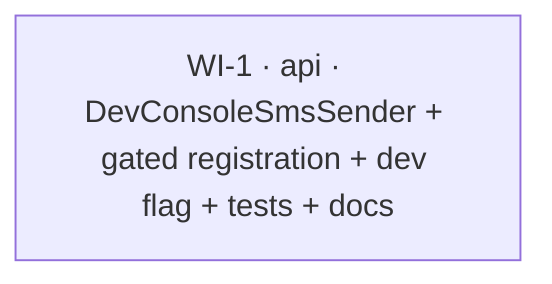

# UC-013 — Development-only customer OTP code log — Work Items

Spec: `docs/specs/todo/013_UC_013_dev-otp-log.md` (moved to `in-progress/` on combined approval).
Lane: `api` only. Complexity: routine → **one** vertical-slice work item.

## Assumptions

- **Single WI is correct.** The change is one new infra class plus a one-line gated
  registration, a dev config value, one test file, and a one-line docs note. There is
  no new endpoint, no DB/entity change, and no web change — nothing to split by lane
  or by side.
- **No OpenAPI allowlist change.** Because no endpoint is added, the
  `SeedAndEndToEndTests` route-allowlist and `docs/api.md` regeneration are untouched.
- **The `IHostEnvironment` check is the security boundary, not the flag.** AC#2 requires
  that even `Sms:DevLogCode=true` in a non-Development environment must not leak the OTP.
  The gate flag only *selects* the sender at DI time; the sender's own
  `env.IsDevelopment()` runtime check is what guarantees no production leak. The
  production-safety unit test therefore does **not** set the flag — it stubs a Production
  `IHostEnvironment` and asserts the body is absent.
- **Testing uses a hand-written logger spy, not FakeItEasy.** FakeItEasy is in the test
  csproj but cannot proxy `ILogger<T>` over an `internal` `T` (per CLAUDE.md and
  `rules/logging.md#testing-logger-output`). `DevConsoleSmsSender` is `internal sealed`,
  so the test captures output through a small hand-rolled `ILogger<DevConsoleSmsSender>`
  spy.
- **Docs consistency.** `API-KEYS.md` §9 currently states the base `Sms:` section is "not
  used by the current code." After this UC, `Sms:DevLogCode` *is* used, on the
  customer-OTP `ISmsSender` auth path — which is distinct from the GoSms/SmsBrana
  `Notifications` provider that §2 otherwise documents. The new §2 note is phrased to make
  that distinction explicit so it does not read as contradicting §9.
- **The phone stays masked in both branches (round 2, F2).** The dev branch's only PII
  exception is the OTP **body**. The phone number is masked to last-4 in *both* branches
  (same behavior as `ConsoleSmsSender`), so the dev affordance never widens the PII
  surface beyond the single documented exception. The dev test asserts the code IS
  present **and** the full E.164 phone is NOT.
- **The factory selection is unit-tested (round 2, F1).** Beyond the two sender-behavior
  tests, a focused DI test drives `AuthFeatureConfiguration.AddFeatureDependencies`
  itself with `Sms:DevLogCode` true / false / unset and asserts the resolved concrete
  `ISmsSender` type — AC#1 and AC#3 are no longer only manually verified.

## Dependency Graph

## WI-1: Development-only ISmsSender that logs the full customer OTP

**Lane:** `api` · **Complexity:** S · **Depends on:** none

### Required Reads

- `docs/specs/in-progress/013_UC_013_dev-otp-log.md`
- `api/src/Taxi.Api/Infrastructure/Sms/ConsoleSmsSender.cs` — mirror the masked branch exactly
- `api/src/Taxi.Api/Infrastructure/Sms/ISmsSender.cs` — the interface to implement
- `api/src/Taxi.Api/Features/Auth/AuthFeatureConfiguration.cs` — the registration to gate
- `api/src/Taxi.Api/Features/Auth/RequestCode/RequestCodeEndpoint.cs` — context (do NOT change)
- `api/src/Taxi.Api/appsettings.Development.json` / `appsettings.json` — flag placement
- `api/tests/Taxi.Api.Tests/Geo/FleetKeyProtectorTests.cs` (~lines 194-208) — the
  `ProductionEnvironment : IHostEnvironment` stub precedent; build a Development twin
- `docs/API-KEYS.md` — §2 SMS section for the dev note

### Rules Cited

`rules/logging.md#style-message-templates`, `#what-must-not-appear-in-logs`,
`#testing-logger-output`; `rules/csharp-style.md#primary-constructors`,
`#sealed-internal`, `#xml-documentation`; `rules/architecture.md#common-infrastructure`;
`rules/naming.md#test-naming`; CLAUDE.md (FakeItEasy cannot proxy `ILogger` over internal `T`).

### Deliverables

1. **`api/src/Taxi.Api/Infrastructure/Sms/DevConsoleSmsSender.cs`** —
   `internal sealed class DevConsoleSmsSender(ILogger<DevConsoleSmsSender> logger, IHostEnvironment env) : ISmsSender`
   in namespace `Taxi.Api.Infrastructure.Sms`.
   - Compute the **masked** phone (last-4, mirroring `ConsoleSmsSender`, incl. the
     `"****"` fallback for phones < 4 chars) **once**, and use it in both branches.
   - `env.IsDevelopment()` → `logger.LogInformation("Dev SMS {Phone} {Body}", masked, message)`
     — `{Phone}` is the **masked** value; the raw `message` is `{Body}` (the intended dev
     exception is the OTP body **only**; the phone is never logged raw — round 2, F2).
   - otherwise → identical to `ConsoleSmsSender`:
     `logger.LogInformation("Sms sent {Phone}", masked)`, body never logged.
   - XML `/// 
` on the class **plus a bold comment** stating it is
     Development-only, that it intentionally logs the OTP **body** (and only the body —
     the phone stays masked), and that the runtime `IHostEnvironment.IsDevelopment()`
     check is the guarantee against a production leak (documented exception to
     `rules/logging.md#what-must-not-appear-in-logs`).
2. **`AuthFeatureConfiguration.cs`** — replace the unconditional
   `services.AddSingleton<ISmsSender, ConsoleSmsSender>();` with a factory that reads
   `configuration.GetValue<bool>("Sms:DevLogCode")` and registers `DevConsoleSmsSender`
   when true, else `ConsoleSmsSender`. Keep the **singleton** lifetime and the
   `ISmsSender` service type. Mirrors the `Seed:Enabled` precedent (one path chosen at
   startup, order-independent).
   - **Update the `AddFeatureDependencies` XML `/// 
` (round 2, F3):** it
     currently claims `ConsoleSmsSender` is "registered unconditionally" and calls the
     lifetime "scoped". Rewrite it to describe the `Sms:DevLogCode` gate
     (`DevConsoleSmsSender` when true, else the masked `ConsoleSmsSender`), state the
     `ISmsSender` lifetime is **singleton**, and drop the "registered unconditionally"
     phrase (`rules/csharp-style.md#xml-documentation`).
3. **`appsettings.Development.json`** — add `"Sms": { "DevLogCode": true }`.
   Base `appsettings.json` stays untouched (its existing `"Sms": { "ApiKey": "" }`
   remains; the flag absent → `GetValue<bool>` defaults false → masked sender).
4. **`docs/API-KEYS.md` §2** — one line: in Development, `Sms:DevLogCode=true` (already set
   in `appsettings.Development.json`) prints the customer OTP to the API console so you can
   complete `/customer` login; never enable it in production. Scope the wording to the
   OTP/customer-auth `ISmsSender`, distinct from the GoSms/SmsBrana provider.
5. **`api/tests/Taxi.Api.Tests/Infra/DevConsoleSmsSenderTests.cs`** — see Tests.

### Error Paths

None. `SendAsync` has no expected-error branches — it only chooses which log line to
write based on the injected `IHostEnvironment`. No `Send.*`/HTTP concerns (this is an
infra class, not an endpoint).

### Tests

Logger-spy pattern per `rules/logging.md#testing-logger-output` — hand-written
`ILogger<DevConsoleSmsSender>` spy recording `(LogLevel, template, state args)`; assert
on `LogLevel` + an args substring, never the full rendered string. `IHostEnvironment`
stubbed after the `FleetKeyProtectorTests` precedent.

**Sender-behavior tests** (logger spy):

- `SendAsync_DevelopmentEnvironment_LogsFullBodyMaskedPhone` — Development stub, call
  `SendAsync("+420777123456", "Your Taxi verification code: 123456", ct)` → captured
  `Information` entry **contains** the body/code (`"123456"`) **and does NOT contain the
  full phone** (`"+420777123456"`); `{Phone}` is the last-4 masked value (round 2, F2).
- `SendAsync_ProductionEnvironment_MasksAndOmitsBody` — Production stub (flag **not** set)
  → captured log is the masked marker (last-4 phone) and does **not** contain the
  code/body. **The production-safety pin for AC#2.**
- `SendAsync_ProductionEnvironment_ShortPhone_MasksToStars` — optional edge; phone < 4
  chars → fixed `"****"` marker (mirror `ConsoleSmsSender`).

**Factory sender-selection DI tests** (round 2, F1 — same test file, no logger spy;
build a `ServiceCollection` with `AddLogging()` + an in-memory `IConfiguration` via
`ConfigurationBuilder().AddInMemoryCollection(...)`, call
`AuthFeatureConfiguration.AddFeatureDependencies(services, config)`, `BuildServiceProvider`,
resolve `ISmsSender`):

- `AddFeatureDependencies_DevLogCodeTrue_ResolvesDevConsoleSmsSender` — `Sms:DevLogCode=true`
  → resolved `ISmsSender` is `DevConsoleSmsSender` (pins AC#1's sender selection).
  **DI trap:** this branch's factory resolves `IHostEnvironment`, which a bare
  `ServiceCollection` does **not** register — the test must also
  `AddSingleton<IHostEnvironment>(devStub)` (reuse the Development stub) or resolution
  throws `No service for type IHostEnvironment` before the type assertion. The env
  *value* is irrelevant to the resolved type; the *registration* is mandatory. The
  false/unset cases resolve `ConsoleSmsSender` (logger only), so `AddLogging` alone
  suffices there.
- `AddFeatureDependencies_DevLogCodeFalse_ResolvesConsoleSmsSender` — `Sms:DevLogCode=false`
  → resolved `ISmsSender` is `ConsoleSmsSender`.
- `AddFeatureDependencies_DevLogCodeUnset_ResolvesConsoleSmsSender` — key absent →
  `GetValue<bool>` defaults false → `ConsoleSmsSender` (pins AC#3's default).

**Regression:** existing `RequestCode`/auth integration tests stay green (they register
their own fake `ISmsSender`, so the gated registration is inert for them).

### Verification

`dotnet test --filter "FullyQualifiedName~DevConsoleSmsSender"` — then the full gate
(`dotnet build -warnaserror`, `dotnet test`) per AC#5.
