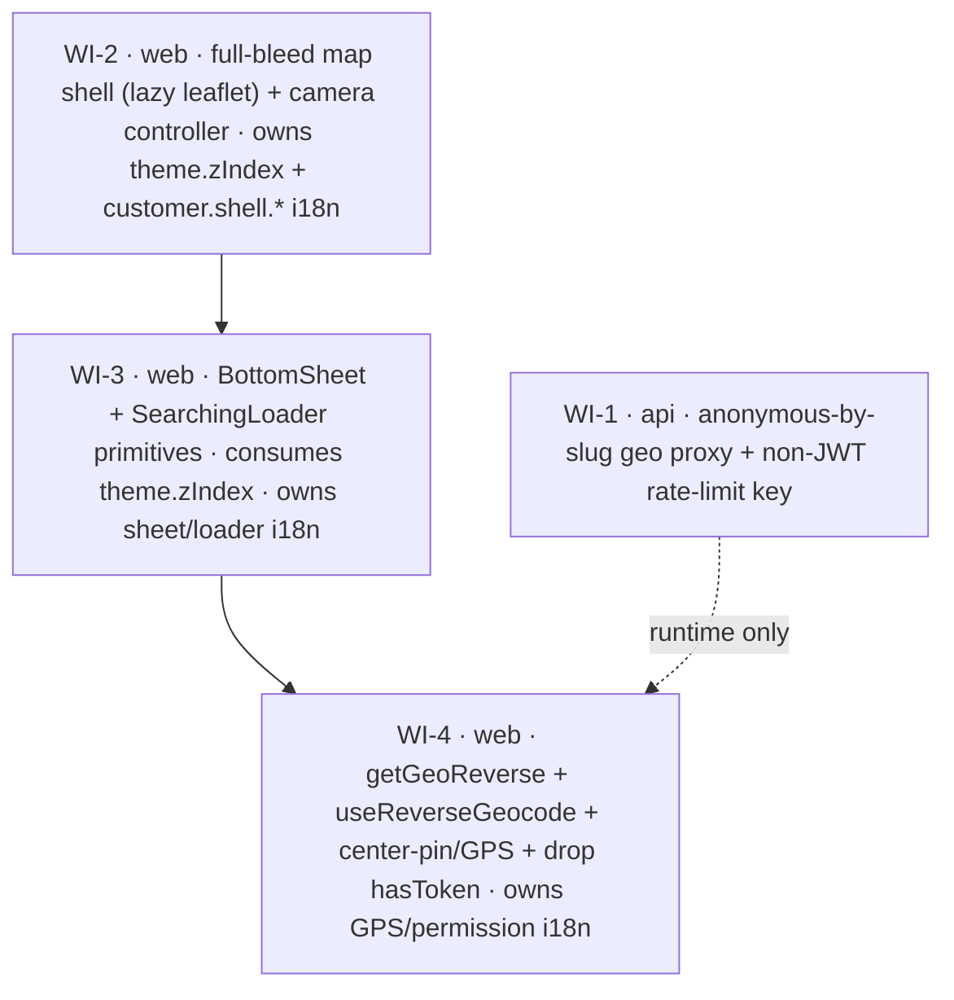

# UC-014 — Customer map-first shell & shared primitives — Work Items

Part 1/3 of the Uber/Bolt customer redesign. One backend slice (anonymous-by-slug geo) + three web foundations (full-bleed map shell, shared primitives, reverse-geocode/center-pin). UC-015 (order flow) and UC-016 (live tracking) compose these; this UC must **not break the existing customer pages** — they keep rendering until UC-015/016 replace them.

## Assumptions

- **Composition (least-risk, pinned):** the shell is a **new component** (`CustomerMapShell.tsx`), not a refactor of `CustomerLayout`. `CustomerLayout` renders `<Content><Outlet/></Content>` as a flex column; converting it to a 100dvh background map would break `CustomerHomePage`/`CustomOrderPage`/`RouteOrderPage`/`TrackingPage` and red the e2e. The shell re-implements the CustomerLayout behaviors (slug, branding, silent-refresh, language, call) itself. No `/customer` router entry is added in this UC (keeps e2e untouched); UC-015 wires the shell in as it replaces the home screen.
- **Anonymous rate-limit key:** key by `HttpContext.Connection.RemoteIpAddress` (fallback: resolved fleet slug, then a fixed `anon` literal), hashed to a `Guid` so it reuses the existing `TryAcquire(Guid)` bucket path. Rejected slug-only keying (one shared bucket per fleet → a single fast typist throttles co-tenants). **`ForwardedHeaders` is not configured today** (grep confirmed) — behind a reverse proxy `RemoteIpAddress` is the proxy IP, so anonymous keying currently degrades to a per-proxy bucket: still bounded (never unlimited, satisfies AC#2), but true per-client keying needs `ForwardedHeaders` configured later. Note this in code.
- **The backend change is a re-key, not a policy flip, and not a guard move (F4).** The current guard `if (!Guid.TryParse(sub, …) || !TryAcquire(userId)) => 429` returns 429 for every no-sub request. Flipping `Policies` to `AllowAnonymous` alone would 429 all anonymous calls. The guard **stays first in `HandleAsync`** (400-before-429 ordering preserved — FE validation runs before the handler); only the keyed Guid changes so it falls through to the non-JWT `ip|slug|'anon'` key when `sub` is absent.
- **geocode/reverse have NO `Guid.Empty` service-level bypass (F1) — the endpoint short-circuit is mandatory.** Only `SuggestAsync` bypasses cache on `Guid.Empty` (UC-010 WI-07). For geocode/reverse, calling `GeoService` with `Guid.Empty` hits the FK-constrained `geo_cache`/`geo_usage` writes → `InvalidOperationException` → **500**. So AC#5 ("never 500") **requires** the endpoint to return `found:false`/empty **before** calling `GeoService` when no fleet resolves. Do not fix this inside `GeoService`.
- **`geo/route` stays `CustomerOrStaff`** — only suggest/geocode/reverse relax. The existing route-403 access tests remain green.
- **Leaflet stays lazy:** `MapyMap` (which statically imports react-leaflet + leafletSetup) is imported only inside a `React.lazy` inner (`CustomerMapBackground`). `npm run size` gates it; verified in `dist`.
- **i18n = all SIX locales** (`cs-CZ`, `en-US`, `ru-RU`, `uk-UA`, `fil-PH`, `de-DE`) per `SUPPORTED_LOCALES` + the parity test — the `web-testing.md#i18n-parity` "cs.json and en.json" wording is stale.
- **`size` is not in the verification tool enum** — web WIs verify with `vitest`; the `npm run build && npm run size` + dist-leaflet-lazy check is an acceptance criterion the developer runs manually before marking done.
- The `dot`-decimal reverse coord is rounded to 4 decimals client-side to match the backend `Math.Round(..,4)` and stabilize the TanStack query key against map jitter.

## Dependency Graph

The **web WIs are a strict sequential chain: WI-2 → WI-3 → WI-4** (corrected in round 2). Two independent constraints force this, both enforced by `depends_on`:

- **F2 (WI-3 → WI-2):** `theme.ts` has `touchTargets` but **no `zIndex`** today. WI-2 owns adding `theme.zIndex` + the `theme.d.ts` augmentation; WI-3's `BottomSheet` consumes that token, so WI-3's own `tsc`-green AC cannot pass until WI-2 lands. Single owner for the token = WI-2.
- **F3 (shared i18n serialization):** WI-2, WI-3 and WI-4 **all edit the same six locale JSONs** (`cs-CZ`/`en-US`/`ru-RU`/`uk-UA`/`fil-PH`/`de-DE`). Three parallel writers to the same files collide, so they run sequentially. Each WI adds only its own non-overlapping key group: **WI-2 → `customer.shell.*` overlay/map** (map aria-label, top/bottom slot labels); **WI-3 → sheet/loader** (`customer.sheet.*` aria-label(s) + `customer.loader.searching`); **WI-4 → GPS/permission** (`customer.shell.gpsDenied`/`gpsUnavailable`/`locating`).

**WI-1 (api) runs in parallel with the whole web chain** — it shares no files with the web WIs. WI-4 has a *runtime* dependency on WI-1 (anonymous geo only succeeds once auth is relaxed) but **not** a build/test dependency — WI-4's tests mock the api client — so WI-1 is not a `depends_on` of WI-4; the runtime ordering is documented in WI-4. (Round-1 claimed "all four independently verifiable / concurrent"; that was wrong for the web chain and is corrected here.)

---

## WI-1: Anonymous-by-slug geo proxy (api)

**Required Reads:** the three geo endpoints (Suggest/Geocode/Reverse), `GeoRateLimiter`, `TenantResolutionMiddleware`, `AuthorizationPolicies`, the three access test files, `TaxiApiFactory`/`AuthHelpers`, `SeedAndEndToEndTests`, `docs/api.md`. Rule anchors: `api-design.md#authorization`/`#dont-catch-exceptions`, `error-handling.md#send-for-expected-errors`, `csharp-style.md#guard-clauses`.

**Deliverables:**
- Flip `Policies(CustomerOrStaff)` → `AllowAnonymous()` on `geo/suggest`, `geo/geocode`, `geo/reverse`. No route/verb change.
- **Re-key the rate-limit guard IN PLACE (F4):** the guard stays the **first** statement in `HandleAsync` — do not move, split, or reorder it (the 400-before-429 ordering is preserved because FE validation, e.g. suggest's min-3-chars, runs before `HandleAsync`). Only the keyed Guid changes: parseable `sub` → key on that Guid (5 req/s per user, unchanged); no `sub` → key on a non-JWT identifier combined as `ip|slug|'anon'` (IP → slug → `anon` fallback) hashed to a Guid, reusing `TryAcquire`.
- **Mandatory endpoint short-circuit for geocode + reverse (F1):** geocode/reverse have **NO `SuggestAsync`-style `Guid.Empty` bypass inside `GeoService`** — only `SuggestAsync` short-circuits on `Guid.Empty` (UC-010 WI-07). `GeocodeAsync`/`ReverseAsync` call `geoCache.GetOrAddAsync(Guid.Empty,…)` unconditionally → on cache-miss + upstream success they Add a `GeoCacheEntry{FleetId=Guid.Empty}` + `usageRecorder.RecordAsync(Guid.Empty)`, both FK-constrained to `fleets` → `InvalidOperationException` → **real 500** via `DontCatchExceptions()`. Therefore, when the resolved `FleetId` is `Guid.Empty`, the **endpoint** returns the empty/`found:false` 200 response **WITHOUT calling GeoService at all**. Do not add a bypass inside `GeoService` for these methods — the endpoint-level guard is the fix. (Suggest keeps its existing service-level `Guid.Empty` bypass.)
- Update endpoint `Summary` blocks (drop 401/403 docs, add the anonymous-by-slug note) → regenerate + stage `docs/api.md`.
- Update `SuggestAccessTests`/`RouteAccessTests`/`GeoProxyTests`; add `GeoAnonymousAccessTests`.

**Error Paths:** unresolvable fleet → 200 empty/`found:false` (not 500) via the **mandatory endpoint short-circuit** for geocode/reverse; anonymous burst >5/s → 429 `Geo.RateLimited`; upstream Mapy down → existing 200-empty/`found:false` path unchanged.

**Tests:**
- anonymous+slug 200 (the key restructure pin — proves the no-`sub` path is not auto-429'd).
- **RED-able degradation guard (F1):** `Reverse_Anonymous_NoFleetSlug_DegradesFoundFalse` — set `FakeGeoService.ReverseResult` to a **POSITIVE** (`Found=true`) result **before** the call, no `X-Fleet-Slug`, assert the endpoint **still** returns 200 `Found=false` with no label. Because `FakeGeoService` ignores `fleetId`, this FAILS unless the endpoint short-circuits on `Guid.Empty` before calling the service (the positive fake would otherwise leak through). Mirror `Geocode_Anonymous_NoFleetSlug_DegradesFoundFalse` (positive `GeocodeResult`). `Suggest_Anonymous_NoFleetSlug_DegradesEmptyList` documents the existing safe service-level path.
- **anon-hash stability (F4, REQUIRED):** `RateLimiter_AnonKeyHash_IsStableAndNeverCollidesWithUserGuid` — a fixed key (e.g. `"anon:127.0.0.1"`) hashes to the **same** Guid across calls (a fixed IP must map to a stable bucket, else throttling never fires) **and** differs from any UUIDv7 user id.
- anonymous rate-limit fires (dedicated `new TaxiApiFactory(fixture.ConnectionString)` + `Reset()`), authed 5 req/s unchanged, route-403 regression, OpenAPI allowlist + `docs/api.md` regen green.

**Verification:** `dotnet test --filter "FullyQualifiedName~Taxi.Api.Tests.Geo"` (developer also runs the full suite — the shared limiter/factory touch other geo tests).

---

## WI-2: Full-bleed customer map shell (web)

**Required Reads:** `CustomerLayout`, `ensureFleetSlug`, `useFleetBranding`, `CallButton`, `LanguageSelector`, `MapyMap`, `useGeoConfig`, `PickupMapInner`, `board/MapPanel` (camera precedent), `theme.ts`, `router.tsx`, `vite.config.ts`, `package.json`, `cs-CZ.json`, parity test. Rule anchors across `web-architecture`, `web-react-style`, `web-performance` (code-splitting/bundle-budget), `web-accessibility`, `web-testing`.

**Depends on:** none for build; runs **first** in the web chain (owns `theme.zIndex` for WI-3, first writer of the shared i18n JSONs).

**Deliverables:**
- `CustomerMapShell.tsx` — 100dvh background map surface; owns `ensureFleetSlug` (useState initializer), branded `ThemeProvider`, silent-refresh, and renders `LanguageSelector` + `CallButton` in a top overlay slot. Top + bottom overlay slots (children props) with `env(safe-area-inset-*)` padding. **SIBLING of CustomerLayout, never nested (F6):** a doc comment at the top of the file MUST state *"SIBLING of CustomerLayout — never nest; both run ensureFleetSlug/enableSilentRefresh once and nesting double-invokes them."* No router entry is added in this UC, so there is no live double-init risk — the comment + exactly-once tests guard the UC-015 wiring.
- `CustomerMapBackground.tsx` — the **only** module importing `MapyMap` (leaflet), loaded via `React.lazy`.
- **`theme.zIndex` scale (WI-2 owns it — F2):** `theme.ts` has no `zIndex` today; WI-2 adds the scale (map < overlay < attribution < modal) **and** the `theme.d.ts` `DefaultTheme` augmentation. WI-3 consumes this token (WI-3 → WI-2). Bottom slot laid out to not occlude the bottom-left Mapy logo.
- `mapCamera.ts` — pure setView/fitBounds decision (zoom-clamp) + a headless controller in the lazy chunk (MapPanel `MapCenterController` pattern).
- **i18n (F3): WI-2 owns the `customer.shell.*` overlay/map key group only** (map aria-label, top/bottom slot labels) — added to all six locales. GPS/permission keys are WI-4's; sheet/loader keys are WI-3's.

**Error Paths:** config still loading → `MapyMap` renders its `role=status` loader (do not mount a map on undefined center); config error → `MapyMap` degrades to the grey map + unavailable banner (existing behavior, untouched).

**Tests:** pure camera intents, lazy background renders (mock react-leaflet/useGeoConfig/leafletSetup), **slug persisted exactly once on first render** and **`enableSilentRefresh` called exactly once on mount (F6 — `toHaveBeenCalledTimes(1)` guards a future nested-under-CustomerLayout double-invoke)**, language+call in top slot, bottom slot renders children, axe clean, parity.

**Verification:** `vitest` filter `features/customer/shell`. Manual: `npm run build && npm run size` + confirm leaflet only in the lazy chunk.

---

## WI-3: BottomSheet + SearchingLoader primitives (web)

**Required Reads:** `theme.ts`, `MapyMap` (loader precedent), `CustomOrderPage` (SubmitButton precedent), `TrackingPage`, `cs-CZ.json`, parity test, `src/shared/test/axe.ts`, `test-setup.ts`. Rule anchors: `web-react-style#styled-components`, `web-accessibility` (a11y-gate/semantics/keyboard-focus/touch-targets), `web-testing` (a11y-assertion/timers/i18n-parity).

**Depends on: WI-2** — two reasons (F2 + F3): (1) `BottomSheet` styles use `theme.zIndex`, which **WI-2 adds** (`theme.ts` has none today), so WI-3's `tsc`-green AC needs WI-2 first; (2) WI-3 shares the six i18n JSONs with WI-2/WI-4, so it runs **after** WI-2 and **before** WI-4. This is not a composition coupling — the shell only needs empty slots.

**Deliverables:**
- `shared/ui/BottomSheet.tsx` — fixed bottom, rounded top, scrollable, collapsed/expanded height; `role=dialog` + i18n `aria-label`; focus-in-on-open + restore-on-close; Escape to collapse/close; ≥48px targets; theme tokens only (incl. **`theme.zIndex` from WI-2**); reuses SubmitButton styling. Placement in `shared/ui` is correct — F5 accepted (the shared list is non-exhaustive; `BottomSheet`/`SearchingLoader` are consumed by 2+ features, UC-015/016/019).
- `shared/ui/SearchingLoader.tsx` — animated theme-tokened loader, `role=status` + i18n label (mirrors `MapyMap` `LoadingState`).
- **i18n (F3): WI-3 owns the sheet/loader key group only** (`customer.sheet.*` aria-label(s) + `customer.loader.searching`) — added to all six locales. Do not touch WI-2's overlay/map or WI-4's GPS/permission keys.

**Error Paths:** none (presentational primitives).

**Tests:** focus moves in on open, Escape collapses + restores focus, dialog role + aria-label queryable, scrollable children render, axe clean (both), loader status role + label, parity.

**Verification:** `vitest` filter `shared/ui`.

---

## WI-4: Reverse-geocode client + hook + center-pin/GPS logic; drop hasToken gate (web)

**Required Reads:** `client.ts` (getGeoSuggest pattern), `useSuggest.ts` + its test, `AddressAutocomplete`, `useGeoConfig`, `MapyMap`, `PickupMapInner`, `board/MapPanel`, `cs-CZ.json`, parity test. Rule anchors: `web-architecture#api-client`/`#pure-logic-modules`/`#state-tiers`, `web-performance#query-keys`, `web-testing` (timers/network-mocking/i18n-parity).

**Depends on: WI-3** — to serialize the six shared i18n JSON edits (WI-2 → WI-3 → WI-4, F3). Not a code coupling. **Separately, WI-4 has a *runtime* dependency on WI-1** (getGeoReverse/getGeoSuggest only succeed anonymously once WI-1 relaxes auth) but **not** a build/test one — its tests mock the api client — so WI-1 is not a `depends_on`; WI-1 runs in parallel on the api lane.

**Deliverables:**
- `getGeoReverse(lat, lng)` in `client.ts` → `GET /geo/reverse`, returns `{ found, label, street, municipality }`, coords rounded to 4 decimals.
- `useReverseGeocode` — debounced, TanStack-cached, key `['geo','reverse',lat,lng]`, disabled without coords.
- `centerPin.ts` — pure: permission state → center source (GPS vs config center); moveend → debounce → coords. No `navigator.*`/Leaflet calls inside (inputs only).
- Drop the `hasToken` gate in `useSuggest.ts`; invert the "does not query when logged out" test.
- **i18n (F3): WI-4 owns the GPS/permission key group only** (`customer.shell.gpsDenied`/`gpsUnavailable`/`locating`) — added to all six locales. Do not touch WI-2's overlay/map or WI-3's sheet/loader keys.

**Error Paths:** GPS denied/unavailable → fall back to config center (pure decision); reverse `found:false` → caller shows no label (never throws); suggest logged-out still gated on ≥3 chars.

**Tests:** center source per permission state, moveend debounce, useReverseGeocode debounce+round+key, disabled-without-coords, getGeoReverse request shape, useSuggest inverted (queries logged-out at ≥3 chars) + <3-char regression, parity.

**Verification:** `vitest` filter `features/customer`.
