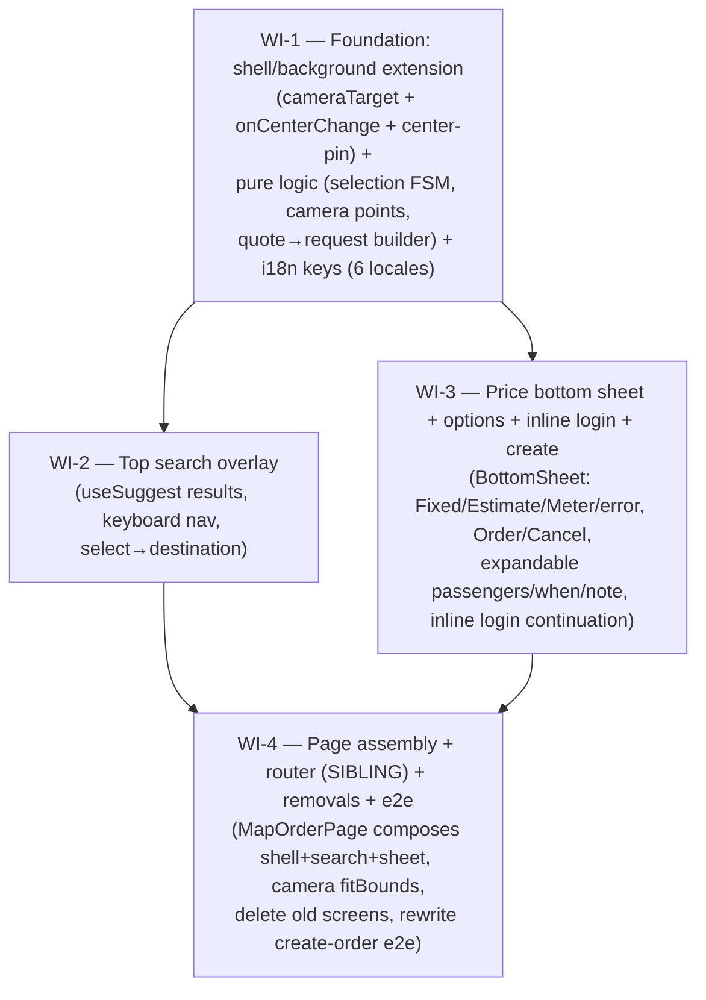

# UC-015 — Destination → price → place order (map-first customer order flow) — Work Items

Lane: **web** (frontend-only). Depends on UC-014 (map-first shell primitives, already on `main`).
Branch: `uc-015-customer-order-flow`.

## Assumptions

1. **UC-014 landed the shell primitives but did NOT wire them into the router.** `/customer` still renders the old `CustomerHomePage` nested under `CustomerLayout`. `CustomerMapShell` exists (`features/customer/shell/CustomerMapShell.tsx`) and is a self-contained SIBLING surface: it runs its own `ensureFleetSlug` (useState initializer), branded `ThemeProvider` (`useFleetBranding`), `enableSilentRefresh('/customer/login')` + `scheduleProactiveRefresh` on mount, and renders `LanguageSelector` + `CallButton` chrome in its top overlay. **It must NOT be nested under `CustomerLayout`** — nesting double-runs those one-shot initializers (the file's own doc comment + the exactly-once tests guard this). UC-015 mounts the new page (which renders `CustomerMapShell`) as a router sibling of `CustomerLayout`, exactly like `/customer/login` is today.

2. **The center-pin *reverse* channel and camera plumbing are unwired — UC-015 owns wiring them (sanctioned extension, not a rebuild).** `CustomerMapBackground` accepts a `cameraTarget` prop but `CustomerMapShell` never threads one down, and there is **no** `moveend`/`useMapEvents` listener or center-pin overlay anywhere under the shell. The pure `centerPin.ts` (`createMoveendDebouncer`, `resolveCenterSource`) and `useReverseGeocode` exist with **no consumer** — `centerPin.ts`'s own comment says the Leaflet `moveend` wiring "live[s] in … its UC-015 consumers." WI-1 therefore *extends* `CustomerMapBackground` (add a moveend controller + center-pin marker; read `useMap().getZoom()` in-map so the page never invents a zoom) and threads `cameraTarget` + `onCenterChange` through `CustomerMapShell`. Both edits stay inside the existing lazy chunk, so leaflet stays lazy. This is extension of files UC-014 explicitly left "filled by UC-015/016", not a forbidden rebuild.

3. **Unified flow must produce Fixed AND Estimate.** The old `CustomOrderPage` hardcoded `priceType: 'Estimate'`. `POST /pricing/quote` returns **Fixed** (route/zone match, even on pickup alone) or **Estimate** (range) or **Meter**. The new pure request-builder maps `PriceQuoteView` → `priceType` + `fixedPriceCzk`/`routeId` (Fixed) or `estimatedPriceCzk` (Estimate). Do **not** reuse the hardcoded-Estimate path.

4. **Connection gating uses `useOnlineStatus`, not `isServerActionBlocked`.** The customer PWA holds **no** SignalR fleet-hub connection while ordering (the hub connects only on the tracking screen, post-order). The existing `CustomOrderPage` gates Order on `useOnlineStatus()` (`navigator.onLine`), which is the correct customer-side realization of `web-realtime.md#offline-ux` ("block server-mutating actions with a visible reason; never queue a create — a stale order is worse than a failed one"). We keep `useOnlineStatus`. This deviates from the task's literal `isServerActionBlocked` wording — surfaced here + in WI-3 notes with the `web-realtime.md#offline-ux` citation so the reviewer does not flag it.

5. **client.ts is untouched.** `GeoSuggestItem` carries **non-optional** `lat`/`lng`, so selecting a suggestion needs no geocode call. `postCreateOrder`, `getPriceQuote`, `getGeoReverse` (reverse-geocode), `getGeoSuggest` all already exist with the required shapes; `CreateOrderResponse.order.publicCode` is always present. No client.ts change → it is not in any `files_touched`.

6. **Tracking route is unchanged in UC-015.** Order success navigates to the existing `/customer/t/:code` (`TrackingPage`) via `created.publicCode`. UC-016 replaces `TrackingPage` later; UC-015 must not touch it.

7. **`useMyActiveOrder` is kept (not deleted).** It is not on the removal list; the active-order concept is needed by UC-016. Only its sole consumer `CustomerHomePage` is deleted. Removing the dead import is automatic (the file is deleted). `useSuggest` is likewise **kept** (the new search overlay reuses it directly); only its old wrapper `AddressAutocomplete` is removed.

8. **Reused as-is (imported from `features/customer/order/`, not rebuilt):** `usePriceQuote`, `PriceRangeBadge`, `priceQuote.ts` (`interpretQuote`, `PriceQuoteView`, `isFormSubmittable`), `useCreateOrder`, `orderForm.ts` (`clampPassengers`, `CreateOrderRequest` type), `PassengerStepper`, `WhenPicker`, `whenRules.ts`, `useSuggest`, `useCustomerLogin`/`CustomerLoginStep` (inline login `onAuthenticated` continuation), `useOnlineStatus`. UC-014 primitives reused: `CustomerMapShell`/`CustomerMapBackground`, `mapCamera.ts` (`cameraIntent`, `CameraInput`), `centerPin.ts`, `useReverseGeocode`, `BottomSheet`, `SearchingLoader`.

## Dependency Graph

Sequential by construction: WI-1 lands the shared pure logic + shell wiring + all i18n keys; WI-2 and WI-3 both build on WI-1 (they touch the same i18n set, so run them in order to keep parity trivially green); WI-4 assembles, wires the router, deletes old code, and rewrites the e2e.

---

## WI-1: Foundation — shell/background camera+moveend wiring, pure order-state logic, i18n

**Complexity:** L

### Required Reads
- `web/src/features/customer/shell/CustomerMapShell.tsx` — thread `cameraTarget` + `onCenterChange` to background; keep exactly-once mount tests green.
- `web/src/features/customer/shell/CustomerMapBackground.tsx` — extend: accept `onCenterChange`; add `MoveendController` (`useMapEvents` moveend → `createMoveendDebouncer` → `onCenterChange`) + center-pin overlay; read `useMap().getZoom()` for `CameraInput.currentZoom`.
- `web/src/features/customer/shell/mapCamera.ts` — `cameraIntent(CameraInput)`, `CameraInput { points, currentZoom }`, `MIN_CAMERA_ZOOM`.
- `web/src/features/customer/shell/centerPin.ts` — `createMoveendDebouncer`, `resolveCenterSource`, `LatLng`, `GeoPermissionState`.
- `web/src/features/customer/shell/useReverseGeocode.ts` — `useReverseGeocode(coords)`, `REVERSE_DEBOUNCE_MS`.
- `web/src/shared/map/MapyMap.tsx` — children render inside MapContainer (react-leaflet context); mock in jsdom.
- `web/src/features/customer/order/priceQuote.ts` — `PriceQuoteView` union (`fixed`/`estimate`/`meter`/`unknown`), `isFormSubmittable`.
- `web/src/features/customer/order/orderForm.ts` — `CreateOrderRequest`, `clampPassengers`, `MIN/MAX_PASSENGERS`.
- `web/src/features/customer/order/whenRules.ts` — `validateScheduledAt`, `minScheduledAt`, `maxScheduledAt`.
- `web/src/shared/api/client.ts` — `CreateOrderRequest`, `PriceType`, `GeoSuggestItem` (non-optional coords) — read-only, do not edit.
- 6 locale JSONs under `web/src/shared/i18n/`.

### Deliverables
- **Pure logic (new, colocated `.ts` + tests):**
  - `orderFlowState.ts` — the destination-first selection state machine: `type OrderFlowState = { phase: 'search' | 'destinationSet'; destination: SelectedPlace | null; pickup: SelectedPlace | null }` (or equivalent discriminated union); pure reducers/transitions for `selectDestination`, `clearDestination`, `setPickup`. `SelectedPlace = { label: string; lat: number; lng: number }`.
  - `orderCamera.ts` — pure: given pickup + optional destination, return the `points: LatLng[]` for `CameraInput` (0/1/≥2 points → shell derives setView vs fitBounds). No leaflet import (stays eager-safe like `mapCamera.ts`).
  - `buildOrderRequest.ts` — pure: `(input) => CreateOrderRequest` mapping `PriceQuoteView` → `priceType` (`'Fixed'`/`'Estimate'`/`'Meter'`) + `fixedPriceCzk`/`routeId` (Fixed) or `estimatedPriceCzk` (Estimate); pickup/dropoff coords+addresses, passengers (clamped), scheduledAt (ISO or null), note (trimmed→null). Supersedes the hardcoded-`Estimate` path.
- **Shell wiring (extend existing):**
  - `CustomerMapBackground.tsx` — add `onCenterChange?: (coords: LatLng) => void` prop; add an in-map `MoveendController` child that on `moveend` reads `map.getCenter()`, pushes through a `createMoveendDebouncer`, and calls `onCenterChange`; render a center-pin marker/overlay. Keep `cameraTarget` handling. Everything stays inside this lazy chunk.
  - `CustomerMapShell.tsx` — add `cameraTarget?: CameraInput | null` and `onCenterChange?` to `CustomerMapShellProps`; thread both to `CustomerMapBackground`. Preserve the exactly-once `ensureFleetSlug`/`enableSilentRefresh` behavior and its tests.
- **i18n:** add ALL new UC-015 keys to all 6 locale JSONs (`cs-CZ`, `en-US`, `ru-RU`, `uk-UA`, `fil-PH`, `de-DE`), customer formal "vy". Keys (namespaced `customer.order.*` / `customer.mapOrder.*`): search placeholder "Kam to bude?", search-empty, "from"/pickup-adjust affordance label, price-sheet title, order button, cancel/clear button, options toggle ("Možnosti jízdy"), passengers/when/note labels (reuse existing where present), offline-blocked, create-failed, meter/unavailable message, sheet aria-labels. Money stays `cs-CZ`/`Kč`, dates `Europe/Prague` in every UI language.

### Error Paths
- Reverse-geocode failure on pickup adjust → keep last known pickup label (do not blank the address); `useReverseGeocode` already returns `found:false` gracefully.
- `buildOrderRequest` with a `meter`/`unknown` view → still buildable (priceType `Meter`, no price fields), but WI-3 blocks Order in the meter/unavailable UI state.

### Tests
- `orderFlowState.test.ts` — select/clear destination, set pickup transitions; phase flips.
- `orderCamera.test.ts` — 0 points (no destination, no pickup) → empty; 1 point → single; 2 points → both (pickup+destination) for fitBounds.
- `buildOrderRequest.test.ts` — Fixed view → `priceType:'Fixed'` + `fixedPriceCzk`/`routeId`; Estimate view → `priceType:'Estimate'` + `estimatedPriceCzk`; passengers clamped; scheduledAt ISO/null; note trimmed→null.
- `CustomerMapBackground.test.tsx` — mock `react-leaflet` (MapContainer stub renders children; expose a `useMapEvents` moveend trigger + `useMap().getZoom()`), mock `useGeoConfig`/`leafletSetup`: firing `moveend` calls `onCenterChange` (after debounce, fake timers); center-pin renders; `cameraTarget` still drives the controller. Never mount a real MapContainer.
- `CustomerMapShell.test.tsx` — extend: `cameraTarget`/`onCenterChange` thread through; exactly-once `ensureFleetSlug`/`enableSilentRefresh` unchanged.
- i18n parity green across 6 locales; `formatStaysCs` green.

### Verification
`{ "tool": "vitest", "filter": "features/customer" }`

---

## WI-2: Top search overlay ("Kam to bude?")

**Complexity:** M

### Required Reads
- `web/src/features/customer/order/useSuggest.ts` — anonymous-by-slug (`X-Fleet-Slug`), 300 ms debounce, ≥3 chars, `GeoSuggestItem[]` (`label`, `street?`, `municipality?`, `lat`, `lng` — coords non-optional).
- `web/src/features/customer/order/AddressAutocomplete.tsx` — reference for suggest presentation + keyboard nav patterns (to be removed in WI-4; this overlay supersedes it).
- `web/src/shared/ui/SearchingLoader.tsx` — `SearchingLoader` (role=status) for the pending state.
- `web/src/features/customer/order/orderFlowState.ts` (WI-1) — `selectDestination`, `SelectedPlace`.
- `web/src/features/customer/shell/CustomerMapShell.tsx` — the `topSlot` this overlay renders into.
- `web/src/shared/theme/theme.ts` — tokens (no hardcoded colors/px).

### Deliverables
- `DestinationSearch.tsx` (component) rendered in the shell `topSlot`: a "Kam to bude?" input; on focus/type expands a suggestions overlay backed by `useSuggest`; each suggestion shows `label` + `municipality`. Selecting a suggestion calls back with a `SelectedPlace` (label+coords, no geocode needed). Keyboard nav: ArrowUp/Down move active option, Enter selects, Escape collapses; ARIA combobox/listbox semantics (`role`, `aria-expanded`, `aria-activedescendant`). Empty-results and pending (`SearchingLoader`) states. Works logged-out (AC#1).
- Callback prop `onSelectDestination(place: SelectedPlace): void` — the page (WI-4) owns state; this component is presentational.

### Error Paths
- Suggest returns empty (200 empty) → "no results" message, not an error (`useSuggest.isEmpty`).
- Suggest network error → `useSuggest` treats non-200 as no-results/keeps last; overlay shows the empty message, never a raw code.

### Tests
- `DestinationSearch.test.tsx` — mock `@/shared/api/client`: typing ≥3 chars shows suggestions (Czech default); ArrowDown+Enter selects and fires `onSelectDestination` with coords; Escape collapses; empty-state renders; pending shows the loader.
- Axe assertion on `DestinationSearch` (interactive) via `@/shared/test/axe`.
- i18n parity stays green (keys added in WI-1).

### Verification
`{ "tool": "vitest", "filter": "DestinationSearch" }`

---

## WI-3: Price bottom sheet + options + inline login + create

**Complexity:** L

### Required Reads
- `web/src/shared/ui/BottomSheet.tsx` — `BottomSheetProps { open, expanded, ariaLabelKey, onClose, children }`; Escape closes; non-modal; z-index below Mapy attribution.
- `web/src/features/customer/order/usePriceQuote.ts` — `usePriceQuote({ pickupLat, pickupLng, dropoffLat, dropoffLng, allowAnonymous })` → `{ view, isLoading, errorKey }`; pass `allowAnonymous: true` (logged-out Fixed prices).
- `web/src/features/customer/order/PriceRangeBadge.tsx` — Fixed / Estimate RANGE / Meter / error rendering (reuse; never a single exact estimate — AC#3).
- `web/src/features/customer/order/priceQuote.ts` — `PriceQuoteView`, `isFormSubmittable`.
- `web/src/features/customer/order/PassengerStepper.tsx`, `WhenPicker.tsx`, `whenRules.ts` — options (reuse).
- `web/src/features/customer/order/buildOrderRequest.ts` (WI-1) — request builder.
- `web/src/features/customer/order/useCreateOrder.ts` — `useCreateOrder()` mutation → `{ id, publicCode, ... }`; never queued offline.
- `web/src/features/customer/login/useCustomerLogin.ts` + `CustomerLoginStep.tsx` — `onAuthenticated` continuation; mirror `CustomOrderPage`'s inline-login-in-place pattern exactly (state preserved across login).
- `web/src/features/customer/shell/useOnlineStatus.ts` — `useOnlineStatus()` (`navigator.onLine`); connection gate for Order.
- `web/src/features/customer/order/CustomOrderPage.tsx` — reference for the `handleSubmitClick` → showLogin → `submit` (onAuthenticated) continuation (this page is removed in WI-4).

### Deliverables
- `PriceSheet.tsx` rendered in the shell `bottomSlot`, hosting a `BottomSheet`:
  - Header: `PriceRangeBadge` (Fixed exact / Estimate range / Meter / error via `errorKey`).
  - Primary **Order** ("Objednat") + **Cancel/clear** ("Zrušit") — Cancel resets destination (calls back to the page to return to search phase).
  - Expandable "ride options" area (collapsed by default; drives `BottomSheet.expanded`): `PassengerStepper`, `WhenPicker` (min/max via `whenRules`), note input. Reuse existing components.
  - **Order** click: offline → show blocked reason (`useOnlineStatus`), do not submit. Logged-out → render `CustomerLoginStep` **inside the sheet** with all order state preserved (destination, pickup, passengers, when, note); on `onAuthenticated`, auto-resume the create call. Logged-in → build request via `buildOrderRequest` and `useCreateOrder.mutateAsync`. On success, call back with `publicCode` (WI-4 navigates). Never queue offline.
  - Meter/unavailable view → Order disabled with the fallback message ("Cenu nelze spočítat, zavolejte nám").
- Props: `{ pickup, destination, quote (from usePriceQuote), onCancel, onOrdered(publicCode) }` — page owns the source-of-truth state; sheet is a controlled surface.

### Error Paths
- `createOrder` throws → `customer.order.errorCreateFailed` (role=alert), stay on the sheet.
- Scheduled `tooSoon`/`tooLate`/`invalid` → the matching i18n error (reuse `validateScheduledAt`).
- Offline at Order → `customer.order.offlineBlocked`, no request (`web-realtime.md#offline-ux`).

### Tests
- `PriceSheet.test.tsx` — mock `@/shared/api/client`: Fixed view shows exact price; Estimate shows a range (low–high, never single); Meter/error disables Order with the fallback; Cancel fires `onCancel`; Order logged-out → inline `CustomerLoginStep` appears without losing state → on auth, create fires and `onOrdered(publicCode)` called; offline blocks Order with a visible reason; Escape closes sheet.
- Axe assertion on `PriceSheet` (interactive) via `@/shared/test/axe`; primary button ≥48px (theme `touchTargets.primary`); focus/Escape behavior.
- i18n parity stays green.

### Verification
`{ "tool": "vitest", "filter": "PriceSheet" }`

---

## WI-4: Page assembly + router (SIBLING) + remove old screens + e2e

**Complexity:** L

### Required Reads
- `web/src/app/router.tsx` — customer route group; `/customer/login` is a SIBLING of the `/customer` (`CustomerLayout`) group. Add the new map-first page as a sibling; keep `/customer/history`, `/customer/login`, `/customer/t/:code`.
- `web/src/features/customer/shell/CustomerMapShell.tsx` + `CustomerMapBackground.tsx` (WI-1 wiring) — compose `topSlot`/`bottomSlot`, `cameraTarget`, `onCenterChange`.
- WI-1 pure modules: `orderFlowState.ts`, `orderCamera.ts`, `buildOrderRequest.ts`.
- WI-2 `DestinationSearch.tsx`; WI-3 `PriceSheet.tsx`.
- `web/src/features/customer/shell/useReverseGeocode.ts` — resolve pickup label from the map center.
- `web/e2e/customer.spec.ts` — the `Customer_ThreeTapCommonRoute_ToTracking` test to rewrite; reuse `helpers/apiCustomer.ts` (`injectForPhone`, `DEV_SMS_CODE`, `freshPhone`).
- Removal targets (delete file + colocated tests): `home/CustomerHomePage.tsx`, `home/RouteCard.tsx`, `home/ActiveOrderBanner.tsx`, `home/useCommonRoutes.ts`, `home/homeContent.ts`; `order/CustomOrderPage.tsx`, `order/RouteOrderPage.tsx`, `order/useRouteOrder.ts`, `order/AddressAutocomplete.tsx`, `order/PickupMap.tsx`, `order/PickupMapInner.tsx`.

### Deliverables
- `MapOrderPage.tsx` (new; e.g. `features/customer/order/MapOrderPage.tsx`) — the map-first `/customer` screen: owns `orderFlowState`; renders `CustomerMapShell` with `topSlot={<DestinationSearch onSelectDestination=… />}` and `bottomSlot={<PriceSheet … />}` (sheet shown once a destination is set). Drives pickup from the map center via `onCenterChange` → debounced `useReverseGeocode` (default GPS/center-pin per UC-014); computes `cameraTarget` points via `orderCamera` (setView pickup only → fitBounds pickup+destination once destination set). Calls `usePriceQuote({ allowAnonymous:true })`. On `PriceSheet.onOrdered(publicCode)` → `navigate('/customer/t/'+publicCode)`.
- **Router:** add `MapOrderPage` as a lazy customer chunk and mount `{ path: '/customer', element: lazyCustomer(<MapOrderPage />) }` as a **SIBLING** of the `CustomerLayout` group (mirroring `/customer/login`). Move `history`/`t/:code` handling appropriately: keep `/customer/history` and `/customer/t/:code` reachable (they remain under `CustomerLayout` for the shell chrome + slug persistence). Remove the `/customer/order/route/:routeId` and `/customer/order/new` routes and the old `CustomerHomePage` index route. **Do not** touch `TrackingPage`.
- **Removals:** delete the listed files + their `.test.*`. Verify no dangling imports (tsc + grep). Keep `useMyActiveOrder`, `useSuggest`, `usePriceQuote`, `PriceRangeBadge`, `PassengerStepper`, `WhenPicker`, `whenRules`, `orderForm`, `priceQuote`, `useCreateOrder`.
- **e2e:** rewrite `Customer_ThreeTapCommonRoute_ToTracking` (rename to the map-first path) in `web/e2e/customer.spec.ts`: `goto('/customer')` → type a destination in "Kam to bude?" → pick a suggestion → price sheet appears with Order → Order (logged out) → inline phone+code login (inject SMS hash via `injectForPhone` + `DEV_SMS_CODE`) → order created → lands on `/customer/t/…` "Hledáme řidiče…". Keep `cs-CZ`. Playwright is justified (critical create-order flow).

### Error Paths
- Direct hit to `/customer` logged-out must still resolve slug + suggest (CustomerMapShell runs `ensureFleetSlug` itself — verified in WI-1).
- No dangling references after removals (tsc gate).

### Tests
- `MapOrderPage.test.tsx` — mock `@/shared/api/client` + `react-leaflet`/`useGeoConfig`/`leafletSetup`: selecting a destination shows the price sheet; camera points reflect pickup+destination; `onOrdered` navigates to `/customer/t/:code` (mock `useNavigate`). Axe on the assembled interactive page.
- Full customer vitest suite green (removals leave no broken imports).
- Rewritten e2e green.

### Verification
`{ "tool": "npm-tsc" }`

(Manual gate before commit, per AC#7: `lint`, full `vitest`, `build`, `size`, and the updated `e2e` — the conductor runs these; the per-WI verification above is the fast automated check. WI-4's tsc catches dangling imports from removals.)

---

## Cross-cutting verification (conductor, pre-commit)
`tsc` · `lint` (0 warnings) · full `vitest` · `build` · `size` · updated `e2e` · i18n parity across 6 locales. Leaflet stays lazy (only `CustomerMapBackground`/`*Inner` chunks import it). Axe on every new interactive component. Money `cs-CZ`/`Kč`, dates `Europe/Prague`.
