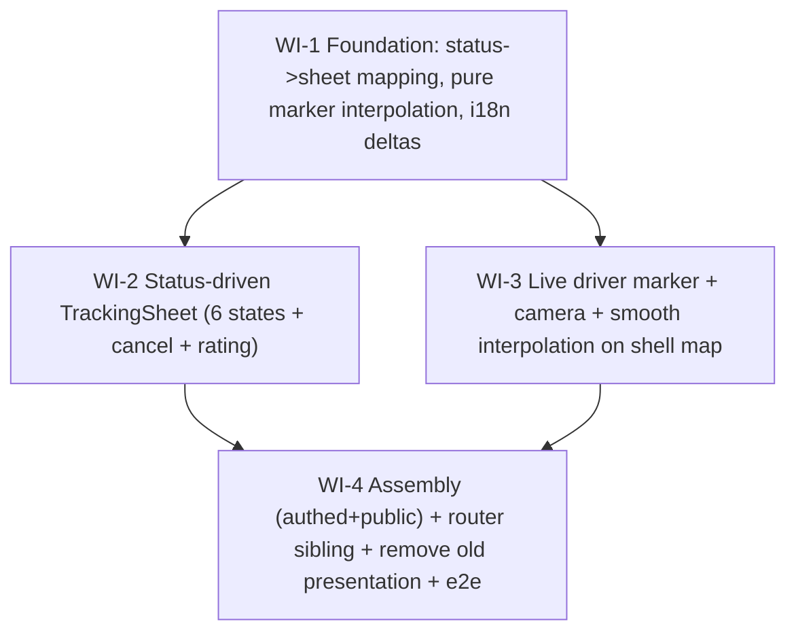

# UC-016 — Customer live ride tracking (Uber/Bolt redesign 3/3) — Work Items

Web-only. Replaces the old text-headline + collapsible-mini-map `TrackingPage` with a
full-bleed, status-driven, map-first tracking screen on the UC-014 shell. Reuses all existing
tracking hooks/logic; adds smooth driver-marker interpolation. Four WIs, topo-sorted, mirroring
the UC-015 foundation → components → assembly shape.

## Assumptions

- **UC-014 primitives exist and are reused:** `shared/ui/BottomSheet` (role=dialog, Escape, focus
  restore, insets to keep the Mapy logo reachable) and `shared/ui/SearchingLoader` (role=status,
  already honors `prefers-reduced-motion`, already ships the `customer.loader.searching` key).
- **UC-015 shell data-prop pattern is the template.** `CustomerMapShell`/`CustomerMapBackground`
  already take `cameraTarget: LatLng[]` and `onCenterChange` as plain-data props and render all
  leaflet inside the lazy `CustomerMapBackground` chunk. UC-016 adds `carMarker`/`pickupMarker`
  the same way — coordinates only, markers built inside the lazy chunk. **No `<Marker>`-children
  prop** (would leak leaflet into the eager page chunk and fail AC#7 + the size budget at build
  time).
- **Marker interpolation math is pure and separate from the rAF tick.** The lerp + reduced-motion
  decision is a pure, fake-timer-tested module (`markerInterpolation.ts`); the per-frame
  `requestAnimationFrame` tick lives in a small component **inside the lazy map chunk** holding the
  interpolated position in local state — never threaded back up through the shell (would re-render
  the shell at 60 fps; `web-performance.md#high-frequency-events`).
- **Public token-poll mode renders the identical UI.** The sheet + shell are mode-agnostic; the page
  builds one normalized `TrackVm` + marker coords from either `useTrackingAuthed` (SignalR live
  position) or `useTrackingPublic` (DTO last-known position). ETA is `null` in public mode today —
  the ETA line is omitted gracefully (spec §Scope "Out").
- **Existing i18n keys are reused, not re-declared.** `customer.tracking.headline.*`,
  `customer.loader.searching`, `customer.tracking.vehicleLabel/dropoffLabel/cancel/ratingSeam/
  pushPrompt*/carLabel/pickupLabel/expired*` already exist. Only deltas (Cancelled re-order CTA,
  any new sheet section labels, a sheet aria-label) are added — to **all six** culture-coded JSONs
  (`cs-CZ, en-US, ru-RU, uk-UA, fil-PH, de-DE`); the parity test iterates all six.
- **`.tracking-car-icon` className is a load-bearing e2e contract** (`web/e2e/customer.spec.ts`
  locates it). It moves from `TrackingMapInner` into `CustomerMapBackground` unchanged.
- **Route becomes a sibling leaf.** Like `MapOrderPage`, the rewritten `/customer/t/:code` becomes a
  SIBLING of the `CustomerLayout` group (it owns the full-viewport shell and re-runs the one-shot
  slug/silent-refresh initializers itself). The old nested `t/:code` child is removed to avoid an
  ambiguous double match. `public/track` is AllowAnonymous (410/404, never 401) so the shell's
  `enableSilentRefresh('/customer/login')` never redirects a logged-out viewer — pinned by a test.
- **Backend is untouched** — all realtime/tracking endpoints (`Subscribe`, `OrderChanged`,
  `DriverPositionChanged`, `PickupEtaUpdated`, `public/track`) already exist (spec §Scope "Out").

## Dependency Graph

WI-2 and WI-3 are independent and run in parallel after WI-1.

---

## WI-1: Foundation — status→sheet mapping, pure smooth-marker interpolation, i18n deltas

**Required Reads:** `tracking/headlineRules.ts` (+ test), `tracking/trackingMarker.ts`,
`tracking/trackingMode.ts`, `board/markerThrottle.ts` (reference), `i18n/cs-CZ.json`, `en-US.json`.

**Deliverables**
- Extend `headlineRules.ts`: keep the per-status headline key + flags, add a stable `phase`
  discriminant (`searching | assigned | arrived | inProgress | completed | cancelled`) so the sheet
  renders the right block without duplicating the status switch. **Both New and Assigned → searching
  phase, both using `headline.new` ("Hledáme řidiče…")** per spec §2 — this changes Assigned's
  heading from the current `assignedNoEta` so the searching loader is never paired with a "Řidič je
  na cestě" heading. Accepted → assigned; unknown → safe searching (cancel blocked).
- New pure `markerInterpolation.ts` (+ test): `(prev, next, elapsedMs, durationMs) → coord`; lerp,
  clamps to `next` at/after duration and to `prev` at/before 0; null prev → `next` (first fix snaps);
  a reduced-motion path returns `next` immediately. Imports nothing from leaflet/react (eager-safe).
- i18n deltas in all 6 locales (formal "vy"); only additions (e.g. `customer.tracking.reorder`,
  any new sheet-section labels, sheet aria-label). Money cs-CZ/Kč, dates Europe/Prague everywhere.

**Error Paths:** unknown order status → safe searching phase, cancel blocked (no crash).

**Tests (test-first):** extended `headlineRules.test.ts` per-status phase+flags; `markerInterpolation.test.ts`
midpoint/at-duration/at-zero/null-prev/reduced-motion; i18n parity + formatStaysCs stay green.

**Verification:** `vitest --filter features/customer/tracking`

---

## WI-2: Status-driven tracking bottom sheet

**Required Reads:** `shared/ui/BottomSheet.tsx`, `shared/ui/SearchingLoader.tsx`, `headlineRules.ts`,
`StatusHeadline.tsx` (reference — removed in WI-4), `CancelDialog.tsx`, `RatingForm.tsx`,
`useCancelOrder.ts`, `order/PriceSheet.tsx` (sheet-composition reference), `shared/format/money.ts`,
`theme.ts`, `shared/test/axe.ts`.

**Deliverables**
- `TrackingSheet.tsx` (+ test): presentational sheet inside `BottomSheet`, switching content on the
  WI-1 phase. **Every phase renders the descriptor headline as a `heading`-role element** (preserve
  `StatusHeadline`'s `<h2>` + aria-live polite) — a load-bearing e2e contract: `customer.spec.ts`
  locates status via `getByRole('heading', { name })` ("Hledáme řidiče…", /Řidič.*je na cestě/,
  "Objednávka byla zrušena", /Hotovo/). The `SearchingLoader` (role=status, "Hledám řidiče...") is
  the animated **adornment beside** the searching heading, not a replacement. States: searching
  (heading + loader + Cancel) / assigned (heading + driver+vehicle+ETA + Cancel) / arrived ("Řidič
  je na místě" + vehicle) / inProgress ("Jedete" + destination) / completed (heading price via
  `money.ts` + ride summary + rating slot) / cancelled (heading + re-order CTA to `/customer`).
- Cancel offered only when `showCancel` **and** an orderId is present (none in public mode). Reuse
  `CancelDialog`/`useCancelOrder` via props — no cancel mutation duplicated here.
- Rating authed-only: render injected `ratingSlot` (`RatingForm`) on completed, else the ratingSeam
  default. Reuse `RatingForm`/`StarPicker`/`useRateOrder` unchanged.

**Error Paths:** cancel failure keeps `CancelDialog` open with its in-dialog error (branch on the
returned outcome, not the captured `errorKey`); null ETA omits the "~min" line.

**Tests:** each phase renders its block (Czech default), asserting the headline via
`getByRole('heading', { name })` with the **same strings the e2e uses** ("Hledáme řidiče…",
/Řidič.*je na cestě/, "Objednávka byla zrušena", /Hotovo/) so WI-4's e2e cannot RED on a missing
heading; searching also shows the `SearchingLoader` role=status; cancel button visibility rules;
CancelDialog open/confirm/dismiss; completed with/without ratingSlot; Escape closes; ≥48px targets;
axe clean.

**Verification:** `vitest --filter TrackingSheet`

---

## WI-3: Live driver marker + camera follow + smooth interpolation on the shell map

**Required Reads:** `shell/CustomerMapShell.tsx`, `shell/CustomerMapBackground.tsx` (+ test),
`shell/mapCamera.ts`, `tracking/TrackingMapInner.tsx` (icons to migrate — file removed in WI-4),
`tracking/trackingMarker.ts`, `tracking/markerInterpolation.ts`, `shared/map/MapyMap.tsx`,
`shared/test/axe.ts`.

**Deliverables**
- Add optional data props `carMarker: LatLng | null`, `pickupMarker: LatLng | null` to
  `CustomerMapShell` + `CustomerMapBackground`; construct the `<Marker>` + divIcons **inside**
  `CustomerMapBackground` (sole leaflet importer). Migrate `PICKUP_ICON`/`CAR_ICON` here and keep
  `.tracking-car-icon` (+ pickup className) verbatim. `cameraTarget`/`onCenterChange`/center-pin
  behavior unchanged.
- Animated-marker component inside the lazy chunk: consumes the raw `carMarker` target, animates via
  `markerInterpolation` + `requestAnimationFrame` in **local** state; first fix snaps; honors
  `prefers-reduced-motion` (matchMedia → jump directly, no rAF).
- Camera: page passes `[car, pickup]` → existing `cameraIntent` does fitBounds (2 pts) / setView
  (1 pt). No new camera math.

**Error Paths:** null carMarker → no car marker (pickup pin only); config error → MapyMap degrades
(existing), markers still place by coordinate.

**Tests:** carMarker/pickupMarker render Markers (mock react-leaflet); null → none; existing
camera/moveend/center-pin tests stay green; fake-timer/rAF test shows intermediate frames converging
to target; matchMedia-reduce jumps immediately; shell threads props; axe clean.

**Verification:** `vitest --filter features/customer/shell`

---

## WI-4: Map-first TrackingPage assembly + router sibling + remove old presentation + e2e

**Required Reads:** `tracking/TrackingPage.tsx` (+ test), `useTrackingAuthed.ts`,
`useTrackingPublic.ts`, `trackingMode.ts`, `trackingMarker.ts`, `TrackingSheet.tsx`,
`shell/CustomerMapShell.tsx`, `shell/CustomerMapBackground.tsx`, `shell/mapCamera.ts`,
`order/MapOrderPage.tsx` (sibling-leaf reference), `app/router.tsx`, `e2e/customer.spec.ts`,
`e2e/helpers/apiCustomer.ts`, `shared/test/axe.ts`.

**Deliverables**
- Rewrite `TrackingPage.tsx` map-first: compose `CustomerMapShell` (full-bleed map) with
  `bottomSlot=TrackingSheet`, threading `carMarker`/`pickupMarker` (via `selectCarMarker` + pickup)
  and `cameraTarget` (fitBounds `[car, pickup]` / setView). Keep `/customer/t/:code` (authed +
  `?k=token`); reuse `trackingMode`/`useTrackingAuthed`/`useTrackingPublic` unchanged.
- One normalized `TrackVm` + orderId + marker coords from either mode → same `TrackingSheet` + shell
  (AC#5 parity). Public 410 → expired state + call; "none" → login prompt.
- Wire cancel (`useCancelOrder` + `CancelDialog` state) and rating (authed-only `RatingForm` in the
  completed slot) through the page. Reuse the stale-close-avoidance pattern.
- Router: move `t/:code` to a SIBLING leaf (mirroring `MapOrderPage`); remove the old nested child.
  `/customer/history` stays under `CustomerLayout`.
- Remove old presentation + colocated tests: `StatusHeadline`, `TrackingMap`, `TrackingMapInner`.
  Keep all reused logic/hooks.

**Error Paths:** public 410 → "Odkaz vypršel" + call fallback; logged-out no token → login prompt;
SignalR down → last-known cache renders (never blank). No dangling imports (tsc green).

**Tests:** authed New→searching / Accepted→assigned (live) / live position→car marker /
Cancelled→cancelled+re-order; public mode same sheet from DTO, ETA null omitted, no cancel/rating,
410→expired; cancel flow with failure keeping dialog open; axe on assembled screen; full customer
suite green after removals; e2e `customer.spec.ts` AC#2/#3/#5/#7 on the map-first UI (`.tracking-car-icon`
locator + headline assertions + CancelDialog flow), cs-CZ.

**Verification:** `npm-tsc` (primary — catches dangling imports from removals; conductor runs the
full lint/vitest/build/size/e2e gate pre-commit).
