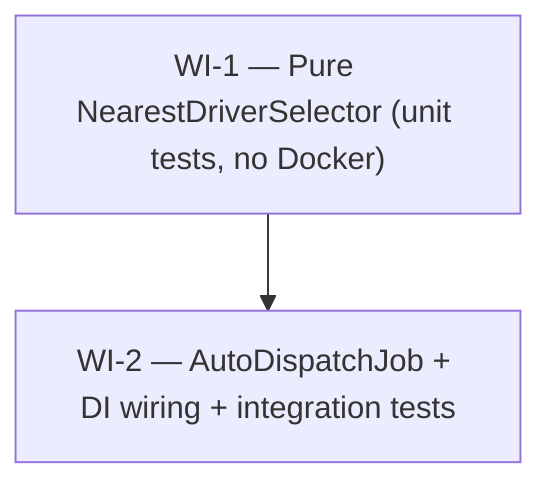

# UC-017 — Automatic driver dispatch — Work Items

Backend-only (`api/`, .NET 10 / FastEndpoints). Adds an `AutoDispatchJob` that auto-assigns `New` orders to the nearest eligible online driver for fleets with `AutoDispatchEnabled = true`, going through `OrderService`/`OrderStateMachine` (New → Assigned). Two WIs: a pure, unit-tested nearest-driver selector, then the job that composes it.

## Assumptions

1. **No global kill-switch.** Auto-dispatch is gated purely by per-fleet `FleetSettings.AutoDispatchEnabled` (matching how `OfferTimeoutJob` needs no global flag). `AutoDispatchJob` is registered unconditionally as a hosted service; a fleet with the flag off (or no settings row) is never dispatched. If a global flag is later required, gate registration in `AddJobs` behind config — documented, not built now.
2. **Future-scheduled orders are excluded from the scan.** CONFIRMED by reading `CreateOrderEndpoint`: an order with a future `ScheduledAt` is persisted as `Status = New` immediately with no hold mechanism. Without a guard, a ride scheduled for tomorrow would be auto-assigned 60 s after creation. The scan therefore adds `(o.ScheduledAt == null || o.ScheduledAt <= now)`. Pre-dispatch of scheduled rides remains out of scope per the spec.
3. **`Free` is the sole eligible status.** `DriverStatus` is `{ Offline, Free, EnRoute, Busy }`. Only `Free` is offerable — `EnRoute`/`Busy` are active-ride states, `Offline` is off-shift. The spec phrase "online/available, not on an active ride" maps to `Status == Free`.
4. **Position freshness is re-checked in the job even though `StalePositionJob` exists.** `AutoDispatchJob` ticks every 5 s; `StalePositionJob` every 60 s. A driver can be `Free` with a stale position for up to ~1 min before `StalePositionJob` offlines them, so the selector enforces `LastPositionAt >= now - 5min` (threshold passed as a parameter, mirroring `StalePositionJob.StaleThreshold`).
5. **Exclusion set is derived from `Declined` + `Timeout` `order_event` payloads only.** CONFIRMED from `OrderStateMachine`: `Assigned` events carry a **null** payload; only `Declined` (`{declinedDriverId}`) and `Timeout` (`{timedOutDriverId}`) carry the driver id. Since the only `Assigned → New` paths are Decline and Timeout, these two payloads are a complete record of every driver already tried for an order.
6. **Pending-offer / within-tick double-assignment guard.** `ApplyAssign` leaves the offered driver `Free` until they Accept (→ `EnRoute`). So a driver with an outstanding `Assigned` offer for order A is still `Free`. **Decision:** exclude drivers who are currently the `DriverId` of another order in `Assigned` status within the fleet. This does two jobs: (a) cross-tick, it avoids offering a driver a second order while a prior offer is pending; **(b) within a single tick**, because orders are processed sequentially in fresh scopes that each commit before the next, this exclusion is the *sole* guard preventing the same `Free` driver from being assigned to two competing `New` orders in one tick — order A commits `Assigned` (driver stays `Free`), and when order B's scope re-queries drivers, the exclusion (A's commit now visible) is what stops B from picking the same driver. Dropping this exclusion therefore does **not** merely add noise — it lets one driver receive two simultaneous offers, which contradicts the spec's "one offer at a time." Pinned by the `RunTick_TwoNewOrdersOneEligibleDriver_AssignsExactlyOne` test.
7. **Nearest-first sequencing needs no new timeout/retry state.** Each tick is independent. When an offer times out, `OfferTimeoutJob` reverts the order to `New` and writes the `Timeout` event; the next `AutoDispatch` tick sees `New` again with the timed-out driver now in the exclusion set, so the next-nearest driver is offered. No new timeout logic in this job.

## Dependency Graph

WI-1 has no dependencies and must land first so its fast unit tests precede WI-2's Testcontainers integration tests. WI-2 depends on WI-1.

---

## WI-1: Pure nearest-eligible-driver selector

**Lane:** api · **Complexity:** S · **Depends on:** —
**Verification:** `dotnet test --filter "FullyQualifiedName~NearestDriverSelectorTests"`

### Required Reads
- `Common/Geo/HaversineDistance.cs` (the `Meters` helper it composes)
- `Common/Orders/OrderStateMachine.cs` (precedent: a pure domain class in `Common/`)
- `Infrastructure/Entities/DriverStatus.cs`
- `Infrastructure/Jobs/StalePositionJob.cs` (the 5-min stale threshold this mirrors as a parameter)

### Deliverables
- `Common/Dispatch/DriverCandidate.cs` — `public record` with `DriverId (Guid)`, `CurrentVehicleId (Guid?)`, `Status (DriverStatus)`, `LastLat (double?)`, `LastLng (double?)`, `LastPositionAt (DateTimeOffset?)`. No entity leaks in.
- `Common/Dispatch/NearestDriverSelector.cs` — pure static `SelectNearest(IReadOnlyCollection<DriverCandidate> candidates, double pickupLat, double pickupLng, int maxRadiusKm, DateTimeOffset now, TimeSpan staleThreshold, IReadOnlySet<Guid> excludedDriverIds)` returning the nearest eligible non-excluded candidate or `null`. No I/O, no DI (like `OrderStateMachine`/`HaversineDistance`).

### Eligibility predicate (all must hold)
- `Status == DriverStatus.Free` (Free only)
- `LastLat`, `LastLng`, `LastPositionAt` all non-null
- `LastPositionAt >= now - staleThreshold`
- `DriverId` not in `excludedDriverIds`
- `HaversineDistance.Meters(pickup, driver) <= maxRadiusKm * 1000`

Among those, smallest distance wins; equal distances resolve deterministically (e.g. by `DriverId`) — documented in an XML remark.

### Error Paths
None — pure function. Empty collection or no-eligible → `null` (no exception).

### Tests (write RED first, per `naming.md#test-naming`)
- Single eligible in-radius → returned
- Two eligible → closer returned (nearest-first)
- Outside radius → excluded; only-candidate → `null`
- Offline / EnRoute / Busy → excluded
- Stale position → excluded; null position → excluded
- Excluded driver skipped → next-nearest returned
- No eligible → `null`
- Equal distance → deterministic tiebreak

### Verification
`dotnet test --filter "FullyQualifiedName~NearestDriverSelectorTests"` — pure, no Testcontainers/Docker.

---

## WI-2: AutoDispatchJob — scan, offer via OrderService, DI, integration tests

**Lane:** api · **Complexity:** L · **Depends on:** WI-1
**Verification:** `dotnet test --filter "FullyQualifiedName~AutoDispatchJobTests"`

### Required Reads
- `Infrastructure/Jobs/OfferTimeoutJob.cs` (the pattern to mirror line-for-line), `StalePositionJob.cs`, `JobsServiceExtensions.cs`
- `Common/Orders/OrderService.cs`, `OrderStateMachine.cs`, `Actor.cs`, `AssignPayload.cs`, `OrderTransition.cs`, `TransitionFailureKind.cs`
- `Common/Dispatch/NearestDriverSelector.cs`, `DriverCandidate.cs` (from WI-1)
- Entities: `Order.cs`, `Driver.cs`, `FleetSettings.cs`, `OrderEvent.cs`, `OrderEventType.cs`
- `api/tests/Taxi.Api.Tests/Jobs/BackgroundJobTests.cs` (seed helpers + `FakeTime` pin to reuse)

### Deliverables
- `Infrastructure/Jobs/AutoDispatchJob.cs` — `internal sealed ... : BackgroundService`, ctor `(IServiceScopeFactory, TimeProvider, ILogger<AutoDispatchJob>)`. Thin `ExecuteAsync` PeriodicTimer(5 s) shell + all logic in `public Task RunTickAsync(CancellationToken)`.
- `Infrastructure/Jobs/JobsServiceExtensions.cs` — add `services.AddHostedService<AutoDispatchJob>();`.
- `api/tests/Taxi.Api.Tests/Jobs/AutoDispatchJobTests.cs` — integration tests via `RunTickAsync` directly.

### Behaviour
1. **Scan** (one scope, `IgnoreQueryFilters`, `AsNoTracking`): orders with `Status == New`, `CreatedAt + AutoDispatchAfterSeconds <= now` (computed in memory), and `(ScheduledAt == null || ScheduledAt <= now)`. Read per-fleet `AutoDispatchEnabled`/`AutoDispatchAfterSeconds`/`MaxOfferRadiusKm` via the `(int?)`-cast projection guard exactly like `OfferTimeoutJob`. Project `(OrderId, FleetId, PickupLat, PickupLng)` + settings.
2. **Gating (asymmetric):** missing settings row → **skip** (no safe default, unlike `OfferTimeoutJob`); `AutoDispatchEnabled != true` → skip; not-yet-elapsed → skip.
3. **Per order, fresh scope:** resolve concrete `CurrentTenant`, `tenant.FleetId = order.FleetId` (mirror `OfferTimeoutJob.TimeoutOrderAsync`), resolve `TaxiDbContext` + `OrderService`.
4. **Exclusion set:** load `Declined` + `Timeout` `OrderEvents` for the order via `ToListAsync`, parse the jsonb payloads **in memory** (`declinedDriverId` / `timedOutDriverId`) into a `HashSet<Guid>`.
5. **Candidates:** query fleet `Drivers` (`AsNoTracking`, tenant filter gives isolation) → `DriverCandidate`s. Optionally exclude drivers already `DriverId` of an `Assigned` order (Assumption 6).
6. **Select** via `NearestDriverSelector.SelectNearest(..., staleThreshold: TimeSpan.FromMinutes(5), exclusionSet)`. Null → leave `New`, `LogDebug` no-driver with `Reason`.
7. **Offer:** `new AssignPayload(driverId, currentVehicleId)` → `orderService.TransitionAsync(orderId, OrderTransition.Assign, Actor.System, payload, ct)`. Success → `LogInformation` with `OrderId`, `DriverId`, `FleetId`. `OrderService` writes the `Assigned` event, bumps `Version`, commits, then publishes `OrderChanged`/`NewOrderOffered` after commit — the job never sets `order.Status` and never publishes.

### Error Paths
- No eligible driver → order stays `New`; `LogDebug` `{Reason}` (e.g. `NoEligibleDriver`). Never error, never spam.
- Concurrency loss (manual assign won first, order already `Assigned`) → `TransitionAsync` returns `IsSuccess == false` with `StaleVersion` or `IllegalTransition`; caught via the result check (no exception), `LogDebug` benign skip with `Reason = FailureKind`. Order ends `Assigned` to the manual driver.
- Per-order unexpected exception → caught in the per-order loop and `LogWarning` (mirror `OfferTimeoutJob`), next order continues (fresh scope prevents change-tracker poisoning).
- Infrastructure failures propagate to the `ExecuteAsync` tick catch → `LogError` (mirror `OfferTimeoutJob`).

### Tests (Testcontainers via `RunTickAsync`, reuse `BackgroundJobTests` seed helpers)
Maps to the spec's 8 test cases + 6 ACs:
- New order + one eligible in-radius driver → `Assigned` + one `Assigned` event (spec 1 / AC1)
- Two eligible → nearest assigned (spec 2)
- Driver outside radius → stays `New` (spec 3)
- Timed-out driver excluded → next-nearest assigned; exhausted pool → stays `New` (spec 4 / AC2)
- `AutoDispatchEnabled=false` and no-settings-row → untouched; not-yet-elapsed → untouched (spec 5 / AC3)
- Future `ScheduledAt` → not dispatched (Assumption 2)
- Offline + stale-position drivers excluded (spec 6 / AC3)
- Two `New` orders, one eligible driver → exactly one assigned in a single tick, the other stays `New` (Assumption 6 within-tick guard)
- Tenant isolation: fleet A dispatch never touches fleet B; assign runs in correct tenant (spec 7 / AC5)
- Manual assign wins race → job no-op, no exception, order `Assigned` to manual driver (spec 8 / AC4)

### Verification
`dotnet test --filter "FullyQualifiedName~AutoDispatchJobTests"` (Docker up). Full gate: `dotnet build -warnaserror` + `dotnet test`.
