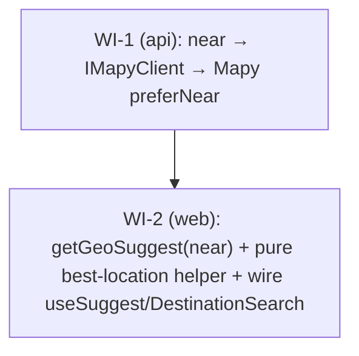

# UC-018 — Location-relevant address autocomplete — Work Items

Mixed-lane UC. Thread a `near` location hint end-to-end so Mapy address suggest is biased toward
the user's location. Two WIs, one per lane; the backend ships and verifies independently.

## Assumptions

- **Mapy suggest location param is `preferNear` + `preferNearPrecision`, BEST-EFFORT.** Verified
  against developer.mapy.com's search-area doc: `preferNear` is a point in `{lon},{lat}` order
  (longitude FIRST — same as the existing `RouteAsync` start/end formatting) and
  `preferNearPrecision` is a circle radius in metres. We use `preferNearPrecision=5000` (5 km). The
  exact name/precision is provisional and the implementer must re-check the live
  `https://api.mapy.com/v1/docs/` suggest reference — but the URL-capture test (present-when-supplied
  / absent-when-null + coord order + InvariantCulture) is what gates WI-1, so a provisional-but-
  documented name is acceptable, exactly like the `MapyConstants` tile URL (CLAUDE.md UC-010 WI-09).
- **Coordinate-order trap is real and asymmetric.** Frontend sends `near={lat},{lng}` (the endpoint
  already parses `parts[0]=lat`). The backend then emits Mapy `preferNear={lng},{lat}`. Two distinct
  order contracts — do not copy the internal `(Lat, Lng)` tuple order blindly onto the Mapy URL.
- **Coordinate formatting uses `CultureInfo.InvariantCulture`** on the backend (cs-CZ comma-decimal
  trap). On the frontend `URLSearchParams` / `String(number)` are always dot-decimal (JS has no
  cs-CZ trap), mirroring `getGeoReverse`.
- **Cache-thrash rounding.** The frontend rounds the chosen `near` to **2 decimals (~1.1 km)** inside
  the pure helper — deliberately coarser than `client.ts` `roundCoord`'s 4 decimals (~11 m), which
  would re-query on every tiny map nudge. The two-tier server cache keys on `near` already
  (`GeoCacheKey.Suggest(q, near)`), so per-location caching is preserved unchanged.
- **GPS tier is designed-in but supplied as `null` today.** The best-location precedence is
  map-center → GPS → fleet-config-center. No geolocation hook exists in the customer shell yet, so
  `MapOrderPage` passes `gpsLocation: null`; the pure helper accepts it so a future GPS wire is a
  one-line change. Reviewers should not flag the missing GPS wire — it is a deliberate placeholder.
- **No new user-facing string** → no i18n change, no `cs-CZ.json` / `en-US.json` edit, no parity
  impact. Confirmed by reading `DestinationSearch` (reuses existing `customer.mapOrder.*` keys).
- **AC#5 requires BOTH lane gates but NOT e2e.** This UC changes ranking, not the user flow / DOM, so
  no Playwright spec (e2e covers only the 3 critical flows). Backend: `dotnet build -warnaserror` +
  `dotnet test`. Web: `tsc` + `lint` (0 warnings) + `vitest` + `build` + `size`.
- **Dependency choice:** `WI-2 depends_on ["WI-1"]` for the end-to-end contract (AC#1 ranking needs
  the backend to honour `near`). The frontend is otherwise independently testable with a mocked
  client, so the two can be developed in parallel; the edge is acyclic either way.

## Dependency Graph

## WI-1 (lane: api): Thread `near` through `IMapyClient.SuggestAsync` → Mapy `preferNear`

**Required Reads:** `IMapyClient.cs`, `MapyClient.cs`, `GeoService.cs`, `IGeoService.cs`,
`Features/Geo/Suggest/SuggestEndpoint.cs`, `GeoServiceTests.cs`, `MapyClientHandlerTests.cs`,
`Common/Geo/MapyConstants.cs`.

**Deliverables:**
- `IMapyClient.SuggestAsync` gains a nullable `(double Lat, double Lng)? near` parameter (keep
  `serverKey`); XML doc documents that `null` omits the bias. `MapyClient` is the only production
  implementer (grep-confirmed).
- `MapyClient.SuggestAsync` appends `&preferNear={lng},{lat}&preferNearPrecision=5000` when `near`
  is non-null (**lng first**), both coords via `CultureInfo.InvariantCulture`; omits both params
  when `null`.
- `GeoService.SuggestAsync` forwards its existing `near` on **both** paths — the `Guid.Empty`
  fleetless bypass and the cached-factory path. Cache key unchanged (already includes `near`).
- Update all call sites / test doubles: `GeoService` (2), `FakeMapyClient` (add `LastSuggestNear`
  capture mirroring `LastServerKey`), `CountingMapyClient` (signature only), `MapyClientHandlerTests`
  (`near: null` where the hint is not exercised).

**Error Paths:** none new. Key-missing short-circuit and `GeoResult.Unavailable` degradation are
untouched; the endpoint's lenient `near` parse (malformed → ignored, never 400) is unchanged.

**Tests (test-first):**
- `SuggestAsync_NearSupplied_RequestUrlContainsPreferNear` — URL contains `preferNear=14.43,50.08`
  (lng,lat) + `preferNearPrecision=`, dot-decimal (InvariantCulture).
- `SuggestAsync_NearNull_RequestUrlOmitsPreferNear` — URL has no `preferNear`.
- `Suggest_FleetlessBypass_ForwardsNearToClient` — `Guid.Empty` path → `LastSuggestNear` set.
- `Suggest_CachedFactoryPath_ForwardsNearToClient` — seeded-fleet cache-miss path → `LastSuggestNear`
  set.
- Existing suggest tests keep passing with `near: null` threaded through.

**Verification:** `dotnet test --filter "FullyQualifiedName~Taxi.Api.Tests.Geo"` (covers both
`MapyClientHandlerTests` and `GeoServiceTests`); `dotnet build -warnaserror` per AC#5.

## WI-2 (lane: web): send `near`, pure best-location helper, wire `useSuggest` → `DestinationSearch`

**Required Reads:** `shared/api/client.ts` (+ `client.test.ts`), `useSuggest.ts` (+ test),
`DestinationSearch.tsx` (+ test), `MapOrderPage.tsx` (+ test), `shared/map/useGeoConfig.ts`,
`features/customer/shell/mapCamera.ts` (for the `LatLng` type).

**Deliverables:**
- `getGeoSuggest(q, near?)` appends `near={lat},{lng}` (lat,lng — the endpoint's contract) via
  `URLSearchParams`; no `near` param when omitted.
- New pure `features/customer/order/suggestLocation.ts` — `pickSuggestLocation({ mapCenter, gpsLocation,
  configCenter })` returns the best `LatLng` (map-center → GPS → config-center), rounded to **2
  decimals** inside the helper, or `null`.
- `useSuggest(query, near?)` threads `near` into `getGeoSuggest` and the query key
  `['geo','suggest', debounced, near]`; debounce / min-chars / staleTime unchanged.
- `DestinationSearch` gains a `near?` prop passed to `useSuggest`; stays presentational.
- `MapOrderPage` computes `near` from `pendingCenter` (map center) + `useGeoConfig` (config center),
  `gpsLocation: null`, and passes it to `DestinationSearch`.

**Error Paths:** none new. Suggest already returns 200-empty on upstream failure (the "Žádné návrhy"
case); malformed `near` is ignored server-side.

**Tests (test-first, bottom-of-ladder first):**
- `suggestLocation.test.ts` — precedence (map > GPS > config > null); coarse-rounding pinned
  (2 decimals; sub-~1 km moves round equal → stable key; >~1.1 km move → different value).
- `client.test.ts` — `getGeoSuggest` sends `near=50.09,14.43` when given a location, omits it
  otherwise.
- `useSuggest.test.ts` — existing tests updated to the `(query, near)` signature; re-query on
  changed coarse `near`, no extra call on equal-rounded `near`.
- `DestinationSearch.test.tsx` — `near` prop threads into the suggest call; existing combobox
  ARIA/keyboard/empty-state + vitest-axe keep passing.
- `MapOrderPage.test.tsx` — wires config-center fallback + map-center; existing pickup/price/camera
  behaviours keep passing.

**Verification:** `npm run --prefix web test -- "customer/order"`; plus `tsc` + `lint` + `build` +
`size` per AC#5. No e2e.
