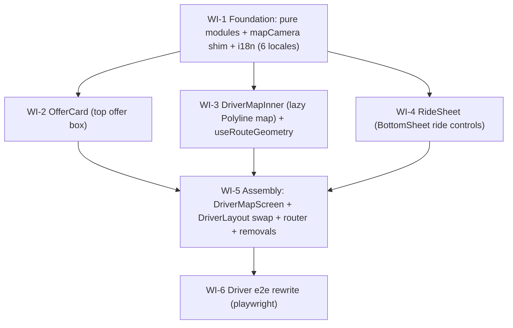

# UC-019 — Driver PWA map-first redesign — Work Items

Web-only UC (`/web`). Replaces `DriverHomePage` + `DriverRidePage` + full-screen `OfferTakeover` +
collapsible `RideMapStrip` with a single map-first `/driver` screen: a full-bleed Mapy map, a
session-wide **top offer box** (Accept/Decline), an on-accept **route Polyline** (driver→pickup,
then pickup→destination) drawn on the map from `POST /geo/route` geometry, ride controls in a
`BottomSheet`, and an external-app **Navigate** handoff. All existing driver hooks
(offer/ride/position/online/queue) are reused unchanged; only the presentation changes.

Six WIs, topo order: **WI-1 → (WI-2 ‖ WI-3 ‖ WI-4) → WI-5 → WI-6**. WI-2/3/4 are parallel-safe
(disjoint files, all depend only on WI-1). WI-5 assembles; WI-6 (playwright) is split off so WI-5
goes green on the fast gates first.

## Assumptions

Two design decisions were surfaced to the user via `AskUserQuestion`, but that tool is unavailable
inside this designer subagent. Both defaults below were independently endorsed by the reviewer; they
are recorded here as explicit assumptions for the implementing agents / design-reviewer to confirm.

1. **Offer box stays session-wide in `DriverLayout`.** The redesigned Accept/Decline box (`OfferCard`)
   is hosted in `DriverLayout` exactly where `OfferTakeover` is today — restyled from a full-screen
   `dialog` into a top-anchored `region` card. This preserves current behavior: an offer arriving
   while the driver is on `/driver/history` or `/driver/settings` still shows Accept/Decline.
   Mounting it only inside the map screen would make off-`/driver` offers invisible (a regression).

2. **`DriverMapScreen` nests *under* `DriverLayout` (child route), not a sibling.** Unlike the
   customer shell (`MapOrderPage`/`TrackingPage` are siblings of `CustomerLayout` because they
   re-run their own one-shot initializers), the driver session mounts — `useFleetHub`,
   `useOfferListener`, `DriverPositionReporter`, `DriverQueueBar`, silent-refresh boot — live in
   `DriverLayout` and must stay alive across `/driver/*`. So the map screen is the `/driver` index
   child of `DriverLayout`.

   **Layout consequence (advisor-caught):** because the screen nests under `DriverLayout` (whose
   `BottomNav` is a normal-flow flex child), the map must **not** be `position:fixed; inset:0` like
   `CustomerMapShell` — that would paint over the `BottomNav` and make History/Settings unreachable.
   The map instead fills the `DriverLayout` `<Content>` flex region (`position:absolute; inset:0`
   inside a `position:relative` content area), full-bleed *within* the content region, so `BottomNav`
   stays in flow below it. **Bottom-edge contract:** the ride `BottomSheet` (`position:fixed;
   bottom:0`) and the `BottomNav` both anchor the bottom; resolution = **`BottomNav` hides while an
   active ride is in progress** (mirrors the customer app — the sheet owns the bottom; keeps the
   shared `BottomSheet` unchanged, no WI-4 ripple). `DriverLayout` reads `useActiveOrderStore(s =>
   s.order)` (atomic selector) and renders `BottomNav` only when `order == null`.

3. **`mapCamera` is promoted to `src/shared/map/` via a re-export shim** (not cross-feature-imported).
   `cameraIntent`/`LatLng` live in `features/customer/shell/mapCamera.ts` and are needed by the
   driver map. Per `rules/web-architecture.md#feature-folders` (no cross-feature imports) and
   CLAUDE.md's promote-when-2+-consumers guidance, WI-1 moves the module to `src/shared/map/mapCamera.ts`
   and leaves the old path as a one-line `export * from '../../../shared/map/mapCamera'` shim — the
   sanctioned pattern already used by `features/customer/order/priceQuote.ts → shared/pricing`. This
   is **3 files changed, 0 customer import statements churned** (all ~11 consumers resolve through the
   shim); `tsc` proves nothing dangled.

4. **All new i18n keys land in WI-1 only.** Every string WI-2/3/4/5 consumes is enumerated and added
   to all six locale JSONs in WI-1, so the parallel component WIs cite keys but never edit locale
   files (avoids a `locales.parity.test.ts` race across concurrent WIs). Driver tone is informal
   **"ty"** for ru/uk/de (German `du`/imperative, not `Sie`).

5. **On Accept there is no navigation.** `OfferTakeover` today does `navigate('/driver/ride')`; that
   route is removed. Accept updates the active-order store and the *same* `/driver` screen reactively
   renders the ride view (state-driven by `useDriverMe` + `useActiveOrderStore`). **Complete** still
   navigates to `/driver/ride/complete` — that route is **kept**.

6. **Driver own-position marker snaps per fix** (no `markerInterpolation` reuse). Smooth interpolation
   matters for a *tracked* car (customer view), not for the driver watching their own dot; pulling
   `markerInterpolation` cross-feature for symmetry would add coupling for no UX gain.

7. **Leaflet stays lazy.** `DriverMapInner` is the only driver-side importer of `MapyMap`/react-leaflet
   and is loaded via `React.lazy` from `DriverMapScreen` (WI-5). Verified in `dist` by WI-5's
   `npm run build` — leaflet must appear only in the `DriverMapInner` chunk, never the eager `/driver`
   entry (CLAUDE.md laneB3c + UC-010 WI-15 discipline).

8. The `POST /geo/route` contract already carries `geometry?: number[][] | null` (max 200 points) —
   `client.ts` `GeoRouteResponse`. No backend change; this UC is the first consumer that *draws* it
   (the codebase's first react-leaflet `<Polyline>`).

## Dependency Graph

## WI-1: Foundation — pure modules, `mapCamera` shim, all new i18n keys

**Required Reads:** `features/customer/shell/mapCamera.ts` + `.test.ts`,
`features/customer/order/priceQuote.ts` (the shim precedent), `features/driver/ride/rideButtonState.ts`,
`features/driver/home/homeState.ts`, `features/customer/tracking/trackingMarker.ts`,
`shared/api/client.ts`, all six `shared/i18n/*.json`, `shared/i18n/locales.parity.test.ts`.

**Deliverables:**
- Promote `mapCamera` → `src/shared/map/mapCamera.ts` (+ moved test); reduce the old customer path to
  a one-line re-export shim (priceQuote pattern). Zero customer imports change.
- `features/driver/ride/routeLeg.ts` — pure `selectRouteLeg({status, hasDropoff}) → 'toPickup' |
  'toDropoff' | null` (Accepted/Arrived → toPickup; InProgress → toDropoff if hasDropoff else null;
  else null) + `legEndpoint(leg, order)`.
- `features/driver/offer/offerCardState.ts` — pure `offerActionOutcome(kind, currentPhase)` mapping
  accept/decline outcomes to UI-transition decisions (lifts OfferTakeover's branch logic out).
- `features/driver/map/driverMapView.ts` — pure `selectDriverMapCamera({own, legStart, legEnd})`
  returning the non-null points to frame (feeds `cameraIntent`).
- Add every new driver key to all 6 locales (informal "ty" for ru/uk/de): `driver.map.*`,
  `driver.offer.boxLabel`, `driver.offer.distanceEta`, `driver.ride.sheetLabel`,
  `driver.ride.etaToPickup`, `driver.ride.etaToDropoff`. Reuse existing `driver.offer.*` /
  `driver.ride.*` / `driver.home.status.*` / `map.*` keys — do not duplicate.

**Error Paths:** none (pure logic + JSON). `legEndpoint('toDropoff', orderNoDropoff) → null` is the
skip-leg case; unknown status → `null`.

**Tests:** `routeLeg.test.ts`, `offerCardState.test.ts`, `driverMapView.test.ts`, moved
`mapCamera.test.ts`, `locales.parity.test.ts` — all green.

**Verification:** `npm-tsc` (proves the shim left nothing dangling; pure modules type-check) + the new
vitest specs + parity test.

## WI-2: OfferCard — top offer box (redesign OfferTakeover)

**Required Reads:** `features/driver/offer/OfferTakeover.tsx`, `offerCardState.ts` (WI-1),
`useOfferAccept.ts`, `useOfferDecline.ts`, `useOfferSound.ts`, `useOfferRoute.ts`, `CountdownRing.tsx`,
`PriceBadge.tsx`, `DeclineReasons.tsx`, `useOfferStore.ts`, `features/customer/tracking/TrackingSheet.tsx`,
`shared/theme/theme.d.ts`.

**Deliverables:** `OfferCard.tsx` (+ test). A top-anchored `region` card (not full-screen `dialog`)
composing `CountdownRing` + `PriceBadge` + `useOfferRoute` distance/ETA + `DeclineReasons`. Accept via
`useOfferAccept`, Decline via `useOfferDecline` + reason step. Branch decisions routed through
`offerActionOutcome`. Sound/vibration via `useOfferSound(phase === 'offer')` unchanged.

**Error Paths:** `stale` (404/409) → `role="alert"` stale banner + dismiss after 2000ms; `offline`
→ offline hint, stay open; `noReason` → reason error. Expiry → expired message → dismiss after 2000ms.
Double-tap guarded by the hooks' `isPending` (buttons disabled).

**Behavior change:** on Accept success call `onDismiss()` **only** — do **not** `navigate`. Encoded as a
dedicated "navigate spy has 0 calls" test.

**Tests:** render/region-role, accept-no-nav, accept-stale, accept-offline, decline-reason-required,
double-tap, expiry, axe. `vitest`, api client + hooks mocked.

**Verification:** `vitest` filter `features/driver/offer/OfferCard`.

## WI-3: DriverMapInner — lazy Polyline map + `useRouteGeometry`

**Required Reads:** `features/driver/ride/RideMapInner.tsx` (icon svgs to reuse),
`features/customer/shell/CustomerMapBackground.tsx` (the presentational + CameraController precedent),
`shared/map/MapyMap.tsx`, `shared/map/mapCamera.ts` (WI-1), `features/driver/map/driverMapView.ts` (WI-1),
`features/customer/shell/CustomerMapBackground.test.tsx` (mock pattern), `shared/api/client.ts`.

**Deliverables:**
- `DriverMapInner.tsx` — presentational default export (props only). Renders `<MapyMap>` with a
  `<Polyline>` (when `routeGeometry` ≥2 points — the codebase's first), own/pickup/dropoff `<Marker>`s
  (reuse RideMapInner icon svgs), and a headless `CameraController` (copied from CustomerMapBackground:
  `useMap()` + `cameraIntent` from `shared/map/mapCamera` + prev-key ref). **Only** driver-side leaflet
  importer; loaded lazily by WI-5.
- `useRouteGeometry.ts` — eager hook (no leaflet) fetching `getGeoRoute` for the active leg's endpoint;
  returns `{ geometry, durationSeconds, isLoading }`; refetch on leg (status) change.

**Error Paths:** `getGeoRoute` throws (502 `Geo.RouteUnavailable`) → `geometry: null`, `isLoading:
false`, no throw to caller (map still shows markers). `leg === null` or missing endpoint → no fetch.

**Tests:** Polyline present-when-≥2 / absent-when-null, marker count by props, axe (MapContainer mock
carries `role="application"` per CLAUDE.md UC-014 WI-2 trap), `useRouteGeometry` fetch/skip/degrade/refetch.
react-leaflet + `useGeoConfig` + `leafletSetup` mocked — never mount a real MapContainer in jsdom.

**Verification:** `vitest` filter `features/driver/map`. (Leaflet-in-dist is verified by WI-5.)

## WI-4: RideSheet — BottomSheet ride controls

**Required Reads:** `features/driver/ride/DriverRidePage.tsx` (the body being lifted),
`rideButtonState.ts`, `RideButton.tsx`, `useRideTransition.ts`, `useActiveOrder.ts`, `NavHandoff.tsx`,
`navLinks.ts`, `queue/PendingBadge.tsx`, `queue/useTransitionQueue.ts`, `shared/ui/BottomSheet.tsx`,
`features/customer/tracking/TrackingSheet.tsx` (BottomSheet composition precedent).

**Deliverables:** `RideSheet.tsx` (+ test). Wraps `shared/ui/BottomSheet`; renders addresses,
tap-to-call phone, ETA line (`etaToPickup`/`etaToDropoff`), `PendingBadge`, the reassigned banner,
and `RideButton` (Arrive/Start/Complete/No-show via `deriveRideButtons`) + a `NavHandoff` toward the
current target. **Presentational for transitions** — it takes handlers + flags as props; WI-5 owns
`useRideTransition`/`useQueuePendingCount`.

**Error Paths:** `reconciledNote` prop true → `role="alert"` "Objednávka byla přeřazena". No-show
disabled with countdown label until enabled. `hasDropoff` false → no Navigate on InProgress.

**Tests:** per-status buttons + nav target, ETA line, reassigned banner, pendingCount badge, Escape →
onClose, axe. `vitest`, api client mocked, fake timers for countdown display.

**Verification:** `vitest` filter `features/driver/ride/RideSheet`.

## WI-5: Assembly — DriverMapScreen, DriverLayout swap, router, removals

**Required Reads:** `app/router.tsx`, `app/DriverLayout.tsx`, `features/customer/shell/CustomerMapShell.tsx`
+ `tracking/TrackingPage.tsx` (composition precedent), `DriverHomePage.tsx`, `DriverRidePage.tsx`,
`homeState.ts`, `useDriverMe.ts`, `useGoOnline.ts`, `useGoOffline.ts`, `useOwnStatusSync.ts`,
`useRouteToast.ts`, `VehicleSelector.tsx`, `useRideRestore.test.ts`, `useLiveClear.ts`,
`useActiveOrder.ts`, `useRideTransition.ts`, `queue/useTransitionQueue.ts`, `useOwnPositionStore.ts`,
`useWakeLock.ts`, plus the WI-2/3/4 outputs (`OfferCard`, `DriverMapInner`, `useRouteGeometry`,
`driverMapView`, `RideSheet`, `routeLeg`).

**Deliverables:**
- `DriverMapScreen.tsx` (+ test) — map fills the `DriverLayout` `<Content>` region (**not**
  `fixed inset:0` — see Assumption 2), lazy `DriverMapInner`, atomic `useOwnPositionStore` selector,
  state-driven overlay (Offline: VehicleSelector + "Začít směnu"; Free: "Čekám na objednávku"
  [reuse `driver.home.status.waitingForOrder`] + "Ukončit směnu"; Busy/EnRoute: `RideSheet`).
  **Re-homes** the DriverRidePage session hooks: `useRideRestore`, `useLiveClear`, `useWakeLock`,
  `useActiveOrder`, `useQueuePendingCount`, and the `runTransition` → `reconciledNote` logic. Owns
  `useRideTransition`. Active-ride map wired via `selectRouteLeg` + `useRouteGeometry` +
  `selectDriverMapCamera`.
- `DriverLayout.tsx` edit — swap `<OfferTakeover>` → `<OfferCard>`; **keep** `useFleetHub`,
  `useOfferListener`, `DriverPositionReporter`, `DriverQueueBar`, silent-refresh boot. Render
  `BottomNav` **only when `useActiveOrderStore(s => s.order) == null`** (hidden during an active ride
  so it doesn't collide with the ride `BottomSheet`; visible otherwise so History/Settings stay
  reachable).
- `router.tsx` edit — `/driver` index → `DriverMapScreen`; delete the `ride` child + its imports; keep
  `ride/complete`, `history`, `settings`, `/driver/login`.
- **Remove** (list in `files_touched`, tsc gates no-dangle): `DriverHomePage.tsx`, `DriverRidePage.tsx`
  + `.test.tsx`, `OfferTakeover.tsx`, `RideMapStrip.tsx` + `.test.tsx`, `RideMapInner.tsx` (grep-confirm
  no other importer). Optionally clean now-unused DriverHomePage-only helpers (grep first).

**Error Paths:** definitive-conflict transition (`{type:'stale'}`) → reassigned banner. Degraded map
(config/tiles down) is handled by `MapyMap`. Complete → `navigate('/driver/ride/complete')`.

**Tests:** Offline/Free/EnRoute overlay states, complete-navigates, stale→reassigned banner,
atomic-selector no-loop smoke, DriverLayout renders OfferCard + keeps position/queue/nav mounts,
removal import smoke test, axe on each state (map mocked).

**Verification:** `npm-build` (tsc + build; proves no-dangle + **leaflet-lazy-in-dist** + `size` budget —
the fast gate, no Docker). Also run `npm run lint` (0 warnings) + full driver `vitest` per the ACs.

## WI-6: Driver e2e rewrite (playwright)

**Required Reads:** `web/e2e/driver.spec.ts`, `web/e2e/helpers/apiDriver.ts`, and the WI-2/4/5 outputs
(`OfferCard`, `RideSheet`, `DriverMapScreen`).

**Deliverables:** retarget `driver.spec.ts` selectors: offer `dialog`→`region` "Nová objednávka";
drop `waitForURL('/driver/ride')` — after Accept the ride view (RideSheet "Jsem na místě") appears on
`/driver`; Arrive/Start/Complete move into the sheet (same Czech labels). Preserve all three tests'
intent (FullFlow, Decline→New, OfflineArrive exactly-once) and preconditions/cleanup (driver2 online).

**Error Paths:** accept/arrive/start stay **bodyless** — the `apiDriver` helper omits `Content-Type`
on those (CLAUDE.md UC-010 WI-19); complete/assign/cancel keep JSON bodies. e2e stays `cs-CZ`.

**Tests:** the three `describe.serial('Driver PWA')` specs, selectors retargeted.

**Verification:** `playwright` (`npm run --prefix web e2e` — Docker + API harness up). Split from WI-5
so the assembly greenlights on fast gates before the heavy e2e run.
