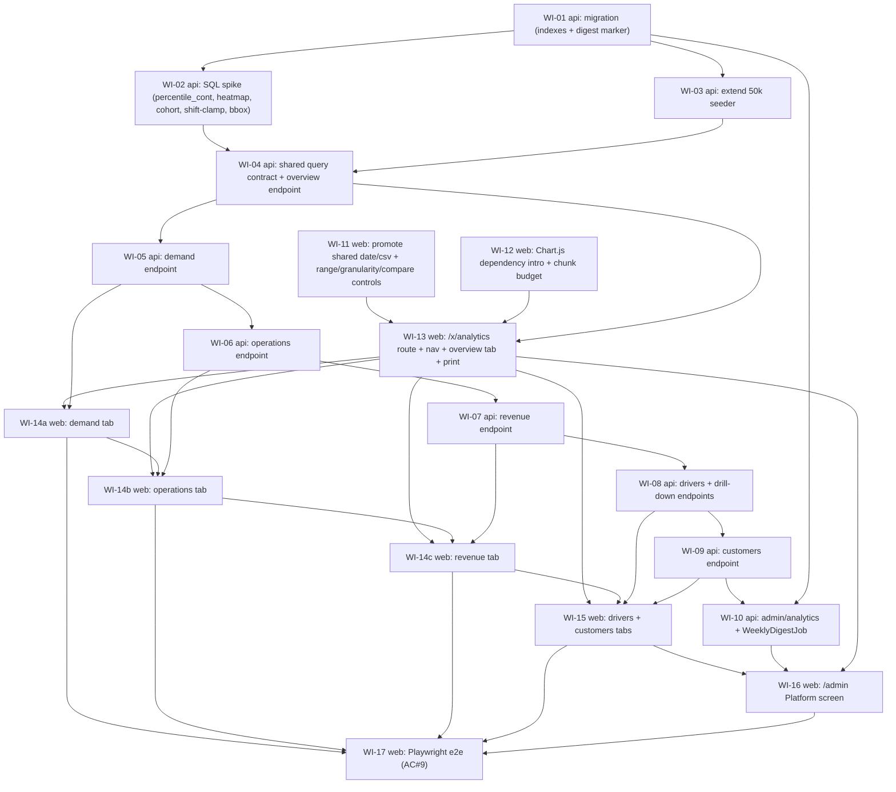

# UC-009 — Business analytics & decision-grade reports — Work Items

Spec: `docs/specs/in-progress/009_UC_009_admin-analytics.md`
Authoritative assignment: `.claude/state/09-admin-analytics.md`
Branch: `uc-009-admin-analytics` off `main @ 5d01133`.

## Assumptions

Two design decisions could not be surfaced via `AskUserQuestion` (unavailable in this run). Defaults chosen below; the developer/reviewer should treat them as the binding design unless the user overrides.

1. **Zone attribution = bounding-box SQL approximation** (WI-02 spike, WI-05 demand, WI-07 revenue). UC-006 point-in-polygon (`Common/Geo/ZoneService.cs`) is pure C# ray-casting with no NetTopologySuite/PostGIS. The analytics mandate ("SQL aggregation only, no in-memory grouping of raw orders") forbids loading 50k pickup points to run `ZoneService.Contains` in memory. Decision: precompute each zone's min/max lat/lng bounding box (in C#, from the already-loaded zone set — a handful of rows per fleet), pass them as parameters, and attribute pickups via SQL `SUM(...) FILTER (WHERE pickup_lat BETWEEN ... AND pickup_lng BETWEEN ...)` per zone. **Approximate**: overlapping/irregular zones may double-count or misattribute near edges; documented as a known limitation in WI-05. This avoids a new dependency + migration. If the user wants exact attribution, escalate to PostGIS/NTS (own UC).
2. **Top-customer masking = NONE (board-consistent, revised default)** (WI-15 customers tab). The assignment says "masked to the same format the dispatcher board already uses" but the board (`features/board/OrderCard.tsx`) shows name/phone **unmasked** — no masking util exists. The plain reading of "same format as the board" is therefore *unmasked*, and analytics is FleetAdmin-only (same trust level as the board). A client-side mask over raw API identity fields would not help GDPR (PII already crosses the wire), so masking, if wanted, belongs API-side in WI-09 — not as a display cosmetic. Decision: no masking; show identity as the board does. **Escalate to the user if data-minimization is actually required** (then WI-09 returns pre-masked fields).
3. **CSV for analytics tables = client-side pure builder.** `features/reports/csvDownload.ts` only triggers download of *server-produced* CSV; but `features/orders/csvExport.ts` is a client-side builder (BOM + `;` + CRLF, RFC-4180 escaping). Heatmap/cohort/top-N are client-rendered JSON matrices — server `?format=csv` does not fit uniformly. Decision: promote a generic CSV builder to `src/shared/csv/` and reuse it (AC#7 byte-test).
4. **Cross-feature-import reconciliation (web).** `reportDateRange.ts` + `csvExport.ts`/`csvDownload.ts` live under `features/`. `rules/web-architecture.md#feature-folders` bans cross-feature imports ("promote to `src/shared/`"). WI-11 promotes `reportDateRange` → `src/shared/date/analyticsRange.ts` (extended with today/7d/last-month/kvartál/rok) and a generic CSV builder → `src/shared/csv/`. This is additive/mechanical and touches import lines in `ReportsPage.tsx` only (no behavior change); it does **not** modify reports screens or `/reports/*` endpoints, honoring the out-of-scope rule.
5. **50k seeder extension is required.** `Infrastructure/Seed/ReportSeedScript.cs` seeds completed orders only: `driver_id` NULL, no `driver_shifts`, no `order_events`, no rating comments, no cancellations. Demand/operations/drivers perf ACs are untestable against it → WI-03 extends it (deterministic driver spread, shifts, offer events, cancellations at multiple stages, ratings). Kept separate from the spike (spike uses tiny hand-computed fixtures; seeder is perf infra).
6. **Digest recipients** = `Users` with `Role == FleetAdmin` and a `PushSubscription`, per fleet (pattern from `Common/Notifications/NotificationService.AddStaffOutboxAsync`). `IPushSender.SendAsync(subscription, message, ct)` per subscription.
7. **Shared query contract** (`from`, `to`, `granularity=day|week|month`, `compare=bool`) is a single request base + validator reused by all 6 fleet endpoints. `compare=true` recomputes the same aggregates for the immediately preceding period of equal length.

## Dependency Graph

**API endpoint WIs are chained (WI-05→06→07→08→09→10), not fanned out.** Each edits the same two shared files — `docs/api.md` (auto-regenerated) and the `SeedAndEndToEndTests` allowlist HashSet — so parallel execution would collide. WI-11/WI-12 start immediately in parallel with lane api; the web tab WIs depend on both the WI-13 shell and their api endpoint counterpart.

**Web tab WIs are likewise chained (WI-14a→14b→14c→15→16), not fanned out** — matching the api-lane serialization contract. Each web tab WI edits the same three shared files — `web/src/shared/api/client.ts`, `web/src/shared/i18n/cs.json`, `web/src/shared/i18n/en.json` — so parallel execution would collide on those files (merge conflicts + `locales.parity` race). Each tab WI therefore keeps its api-endpoint dependency AND chains after the previous tab WI. Each web tab WI also re-runs `npm run size` (the analytics chunk grows as tabs land — see WI-13 size-budget re-validation).

---

## WI-01: Analytics migration — composite indexes + digest marker table

**Lane:** api · **Complexity:** S · **depends_on:** none

**Required Reads:** `rules/ef-core.md#indexes`, `rules/ef-core.md#dbset-registration`, `rules/ef-core.md#migrations`, `rules/naming.md#migrations`, CLAUDE.md → SpotDbContext facts (UUIDv7 generator, snake_case, `--output-dir Infrastructure/Migrations`), `Infrastructure/Configurations/OrderConfiguration.cs`, `Infrastructure/Configurations/OrderEventConfiguration.cs`, `Infrastructure/Configurations/DriverShiftConfiguration.cs`.

**Deliverables (single coherent snapshot, serialized FIRST in lane api):**
- New entity `WeeklyDigestMarker` (`Id` Guid, `FleetId` Guid, `IsoYear` int, `IsoWeek` int, `SentAt` DateTimeOffset) + `WeeklyDigestMarkerConfiguration` with unique index `(FleetId, IsoYear, IsoWeek)`. Register `DbSet<WeeklyDigestMarker> WeeklyDigestMarkers` on `TaxiDbContext`. Tenant entity (`ITenantEntity`) — but the digest job writes it via `IgnoreQueryFilters`/explicit FleetId (null-tenant scope), mirroring existing jobs.
- Composite indexes the analytics queries need (review generated SQL): `orders (fleet_id, driver_id, completed_at)`, `orders (fleet_id, completed_at)`, `orders (fleet_id, customer_user_id, completed_at)`, `orders (fleet_id, source, created_at)`, `orders (fleet_id, payment_type, completed_at)`; `order_events (fleet_id, type, at)`; `driver_shifts (fleet_id, started_at)`. Only add indexes not already present (OrderConfiguration already has `(fleet_id, status, created_at)` and `(fleet_id, driver_id, created_at)`).
- One migration `AddAnalyticsIndexesAndDigestMarker` via `dotnet ef migrations add ... --output-dir Infrastructure/Migrations`.

**Error Paths:** none (schema only).

**Tests:** integration test that the migration applies cleanly on a fresh Testcontainers Postgres and the marker unique index rejects a duplicate `(fleet_id, iso_year, iso_week)` insert. Test name: `Migration_AnalyticsIndexesAndDigestMarker_AppliesAndEnforcesUniqueMarker`.

**Verification:** `dotnet-build`.

---

## WI-02: SQL translation spike — percentile_cont, heatmap, cohort, shift-clamp, bounding-box

**Lane:** api · **Complexity:** M · **depends_on:** WI-01

**Required Reads:** `api/tests/Taxi.Api.Tests/Reports/TranslationSpikeTests.cs` (precedent), CLAUDE.md → UC-007 A2 facts (SqlQuery snake_case aliases; `(created_at AT TIME ZONE 'Europe/Prague')::date`; `EF.Functions.AtTimeZone` does NOT exist — raw `AT TIME ZONE` inside `SqlQuery`/`FromSql`; `.Concat()` → UNION-ALL translates), `Common/Geo/ZoneService.cs` (why bbox instead of in-SQL polygon).

**Deliverables — pin every risky SQL shape as a `TranslationSpikeTests`-style test BEFORE the endpoint WIs build on them:**
- `percentile_cont(0.5)` / `percentile_cont(0.9) WITHIN GROUP (ORDER BY EXTRACT(EPOCH FROM (assigned_at - created_at)))` per Prague bucket → keyless record with snake_case aliases (`p50_seconds`, `p90_seconds`, `bucket`). **Contract: every SLA percentile metric filters to rows where BOTH interval endpoints are non-null before aggregation** (e.g. `WHERE assigned_at IS NOT NULL AND created_at IS NOT NULL`) — unassigned/incomplete orders have a NULL endpoint and must be excluded, else NULL epochs skew or break the percentile. The spike fixture includes rows with a NULL later-endpoint to pin the exclusion.
- Demand heatmap: `GROUP BY EXTRACT(HOUR FROM created_at AT TIME ZONE 'Europe/Prague'), EXTRACT(DOW FROM created_at AT TIME ZONE 'Europe/Prague')` → `(hour, dow, count)` snake_case row.
- Cohort triangle: acquisition-month × activity-month counts (self-join or two CTEs on first-completed-month per customer identity) → verify translation of the `date_trunc('month', ... AT TIME ZONE 'Europe/Prague')` grouping.
- `driver_shifts` per-hour-bucket online-seconds clamping in SQL (`generate_series` of hour buckets × `GREATEST/LEAST(started_at, ended_at)` overlap) — the riskiest translation; the existing driver report clamps in memory, but "supply vs demand per hour bucket" needs SQL-side. If it will not translate, document an in-memory-over-aggregates fallback in the spike file.
- Bounding-box zone attribution: `SUM(1) FILTER (WHERE pickup_lat BETWEEN {minLat} AND {maxLat} AND pickup_lng BETWEEN {minLng} AND {maxLng})` per zone bbox parameter set. The bbox derivation (done in C# from the loaded zone set, passed as params) MUST cover **both zone shapes** `ZoneService` supports: **Polygon** → min/max lat/lng over the vertices; **Circle** → center ± radius converted to degrees, where the latitude delta is `radiusMeters / 111_320` and the longitude delta is `radiusMeters / (111_320 * cos(centerLat))` (lng scaled by cos(lat)). The spike fixture includes one Circle zone and one Polygon zone to pin both derivations.
- `week`/`month` bucket variants of the Prague-day expression (`date_trunc('week' | 'month', created_at AT TIME ZONE 'Europe/Prague')`).

**Error Paths:** none (spike is translation-only; tests assert `.Should().NotBeNull()` / hand-computed values on a tiny fixture).

**Tests (test-first, one per shape):** `Spike_PercentileCont_TranslatesAndMatchesHandComputed` (odd + even counts per AC#2), `Spike_DemandHeatmapBuckets_TranslatesToSql`, `Spike_CohortTriangle_TranslatesToSql`, `Spike_ShiftHourClamp_TranslatesToSql`, `Spike_ZoneBoundingBox_TranslatesToSql`, `Spike_WeekMonthBuckets_TranslatesToSql`. All in `api/tests/Taxi.Api.Tests/Analytics/AnalyticsTranslationSpikeTests.cs`.

**Verification:** `{ "tool": "dotnet-test", "filter": "AnalyticsTranslationSpikeTests" }`.

---

## WI-03: Extend the 50k seeder with ratings / shifts / events / cancellations spread

**Lane:** api · **Complexity:** S · **depends_on:** WI-01

**Required Reads:** `Infrastructure/Seed/ReportSeedScript.cs` (current shape — completed-only, driver_id NULL), `Infrastructure/Entities/DriverShift.cs`, `Infrastructure/Entities/OrderEvent.cs` (event types), CLAUDE.md → UC-007 A2 (raw INSERT … SELECT FROM generate_series pattern, idempotency by "fleet already has orders").

**Deliverables — extend the perf seeder so demand/operations/drivers ACs are exercisable at 50k:**
- Assign a deterministic driver spread (`driver_id` from a small pool, e.g. `(gs % N_DRIVERS)`), and seed matching `driver_shifts` rows spanning the 180-day window (online hours per driver-day).
- Seed `order_events` for a deterministic share: `Assigned`/`Accepted`/`Completed` for completed orders; `Declined` + `Reassigned` + `Timeout` for an offer-funnel share.
- Spread cancellations across stages (cancelled while `New`, `Assigned`, and after `Arrived` for no-shows) with `cancelled_by_role`.
- Populate `rating_comment` + `rated_at` for the rated share; spread ratings 1–5.
- Seed a customer-identity mix (`customer_user_id` set for a returning share; distinct phones for one-timers; some `+420000000000` anonymized rows) so new/returning + cohort + top-customer queries have signal.
- Keep the single-statement / bounded-insert idempotent pattern (skip if fleet already seeded).

**Error Paths:** none.

**Tests:** integration test asserting post-seed row counts and that at least one order exists in each of the shapes the endpoint tests rely on (completed w/ driver, cancelled-while-New, no-show, rated-with-comment, anonymized, returning-customer). Test name: `ReportSeed_Extended_PopulatesAllAnalyticsShapes`.

**Verification:** `{ "tool": "dotnet-test", "filter": "ReportSeed_Extended" }`.

---

## WI-04: Shared analytics query contract + overview endpoint

**Lane:** api · **Complexity:** M · **depends_on:** WI-02, WI-03

**Required Reads:** `rules/architecture.md#vertical-slice-layout`, `rules/architecture.md#feature-configuration`, `rules/api-design.md#configure-structure`, `rules/api-design.md#send-pattern`, `rules/api-design.md#endpoint-pattern`, `rules/validation.md#when-to-add-a-validator`, `rules/ef-core.md#asnotracking`, `rules/csharp-style.md#records-for-dtos`, `rules/csharp-style.md#xml-documentation`, `rules/naming.md#files-and-types`, CLAUDE.md → `WithTag(_featureConfiguration)` needs `using Taxi.Api.Common.Features;`; UC-007 A2 SqlQuery facts; OpenAPI allowlist test + docs/api.md regen fact; FastEndpoints double query-param binding is locale-sensitive (A1) — parse `from`/`to`/`granularity` defensively. `Features/Reports/GetFleetReport/*` (mirror), `Authorization/AuthorizationPolicies.cs` (`FleetAdminOnly`), `api/tests/Taxi.Api.Tests/Seed/SeedAndEndToEndTests.cs` (allowlist).

**Deliverables:**
- New slice `Features/Analytics/` with `AnalyticsFeatureConfiguration : IFeatureConfiguration`.
- Shared request base `AnalyticsRangeRequest` (`from`, `to` ISO strings default this Prague month; `granularity` day|week|month default day; `compare` bool) + `AnalyticsRangeValidator` (`.WithErrorCode(...)`, granularity enum guard, `to >= from`, ISO parse guard). Prague window→UTC conversion helper (mirror `Features/Audit/GetAudit` `TimeZoneInfo` pattern) shared across analytics endpoints (place in `Features/Analytics/Shared/`).
- `GET /api/v1/analytics/overview` (`FleetAdminOnly`): KPI cards (rides completed, gross revenue, AOV, fulfillment rate, cancellation rate, active customers, new customers, active drivers, online driver-hours, revenue per online hour, avg rating) each with `compare` delta, plus a compact rides+revenue trend series. SQL-aggregated (no in-memory grouping of raw orders).
- Response records under `Features/Analytics/GetOverview/`.
- Add `GET /api/v1/analytics/overview` to the `SeedAndEndToEndTests` allowlist HashSet; regenerate `docs/api.md`.

**Error Paths:** invalid granularity / unparseable date → validator 400 (`AddError` + FastEndpoints validation → 400 via `ValidationFailureExceptionHandler`). Non-FleetAdmin → 403 via policy.

**Tests:** `HandleAsync_HandComputedFixture_ReturnsCorrectKpis` (AC#1 fixture: cancellations at stages, declined+reassigned, price override, anonymized customer, two drivers, week-boundary order); `HandleAsync_CompareTrue_ReturnsPriorPeriodDeltas`; `HandleAsync_FleetAScopedFromFleetB_ReturnsOnlyOwnData` (AC#4 tenant isolation); `HandleAsync_50kSeed_RespondsUnder500ms` (AC#3 — **must run with `compare=true`**, the shipped doubled-cost path that recomputes the prior equal-length period; record measured ms); validator tests. In `api/tests/Taxi.Api.Tests/Analytics/`.

**Verification:** `{ "tool": "dotnet-test", "filter": "Analytics.GetOverview" }`.

---

## WI-05: Demand & capacity endpoint

**Lane:** api · **Complexity:** L→ split? kept M (SQL reuses spike) · **depends_on:** WI-04

**Required Reads:** WI-04's reads + this WI cites: `rules/ef-core.md#n-plus-one`, `Common/Geo/ZoneService.cs` (bounding-box derivation from loaded zones), assumption #1 above.

**Deliverables — `GET /api/v1/analytics/demand` (`FleetAdminOnly`):**
- Demand heatmap (hour × day-of-week, Prague local) — reuse WI-02 shape.
- Supply vs demand per hour bucket (orders created vs distinct online driver-hours from `driver_shifts` clamped to bucket) + fulfillment rate per bucket — reuse WI-02 shift-clamp shape.
- Unmet demand: cancellations where no driver ever accepted (cancelled while `New`/`Assigned`, incl. `Timeout` from `order_events`) by hour bucket.
- Utilization: busy time (accept→complete from order timestamps) as share of online time, fleet-wide + per driver.
- Zone & route demand: pickups per zone via **bounding-box SQL** (assumption #1 — document the approximation in the endpoint XML doc + WI notes), top routes by count. The bbox for each zone MUST be derived for **both** shapes `ZoneService` supports: **Polygon** → min/max lat/lng of its vertices; **Circle** → center ± radius-in-degrees (lat delta `radiusMeters / 111_320`; lng delta `radiusMeters / (111_320 * cos(centerLat))`, scaled by cos(lat)). Circle zones must not be dropped or mis-bounded.
- Add route to allowlist; regenerate `docs/api.md`.

**Error Paths:** validator 400; 403 non-FleetAdmin.

**Tests:** `HandleAsync_HandComputedFixture_ReturnsHeatmapAndSupplyDemand`; `HandleAsync_UnmetDemand_CountsNeverAcceptedCancellations`; `HandleAsync_ZoneBoundingBox_AttributesPickups` (documents approximation); tenant-isolation test; `HandleAsync_50kSeed_RespondsUnder500ms` (**must run with `compare=true`** — the shipped doubled-cost path; record measured ms).

**Verification:** `{ "tool": "dotnet-test", "filter": "Analytics.GetDemand" }`.

---

## WI-06: Operations & SLA endpoint

**Lane:** api · **Complexity:** M · **depends_on:** WI-05 *(chained: shares `docs/api.md` + allowlist HashSet with sibling endpoint WIs — serialized to avoid merge conflicts)*

**Required Reads:** WI-04's reads + `Infrastructure/Entities/OrderEvent.cs` (event types for funnel), WI-02 percentile spike, `rules/error-handling.md#send-for-expected-errors`.

**Deliverables — `GET /api/v1/analytics/operations` (`FleetAdminOnly`):**
- SLA trends p50/p90 per bucket via `percentile_cont`: time-to-assign, time-to-accept, time-to-pickup, ride duration (from `orders` denormalized timestamps). **Each metric filters to rows where BOTH endpoints of its interval are non-null before `percentile_cont`** (e.g. time-to-assign only over rows with non-null `created_at` AND `assigned_at`; ride duration only over rows with both start and end timestamps). Rows with a NULL interval endpoint are excluded from that metric's percentile — never fed as NULL epochs.
- Offer funnel from `order_events`: offers made (`Assigned` + `Reassigned`), accepted, declined, timed out; average offers per completed ride.
- Lifecycle funnel: created→assigned→accepted→arrived→in-progress→completed conversion counts.
- Cancellation breakdown: by `CancelledByRole`, by status-at-cancellation, by hour of day; no-show share (cancelled after `Arrived`).
- Add route to allowlist; regenerate `docs/api.md`.

**Error Paths:** validator 400; 403 non-FleetAdmin.

**Tests:** `HandleAsync_HandComputedFixture_MatchesP50P90` (AC#2, odd + even counts); `HandleAsync_OfferFunnel_CountsReassignAndTimeout`; `HandleAsync_CancellationBreakdown_SplitsByRoleAndStage`; tenant-isolation test; `HandleAsync_50kSeed_RespondsUnder500ms` (**must run with `compare=true`** — the shipped doubled-cost path; record measured ms).

**Verification:** `{ "tool": "dotnet-test", "filter": "Analytics.GetOperations" }`.

---

## WI-07: Revenue endpoint

**Lane:** api · **Complexity:** M · **depends_on:** WI-06 *(chained — shared api.md/allowlist)*

**Required Reads:** WI-04's reads + `Infrastructure/Entities/FleetSettings.cs` (`SmsUnitCostCzk`) + `Infrastructure/Entities/NotificationLog.cs` (count Sent SMS), `Common/Notifications/NotificationService.cs` (SMS cost computed = count × unit cost), assumption #1 (zone bbox for zone economics).

**Deliverables — `GET /api/v1/analytics/revenue` (`FleetAdminOnly`):**
- Revenue series per bucket, stacked by payment type (cash/card/invoice), split by `OrderSource` and `PriceType`.
- AOV trend; price-override impact: count, total CZK delta (`FinalPriceCzk` vs `FixedPriceCzk`/`EstimatedPriceCzk`), top override reasons.
- Route & zone economics: top N routes and pickup zones (bbox) by revenue, rides, avg value.
- SMS cost line: `COUNT(notification_log Sent SMS) × SmsUnitCostCzk` per bucket (money integer CZK).
- Add route to allowlist; regenerate `docs/api.md`.

**Error Paths:** validator 400; 403 non-FleetAdmin.

**Tests:** `HandleAsync_HandComputedFixture_StacksRevenueByPaymentType`; `HandleAsync_PriceOverride_ComputesCzkDelta`; `HandleAsync_SmsCostLine_MatchesUnitCostTimesSent`; tenant-isolation test; `HandleAsync_50kSeed_RespondsUnder500ms` (**must run with `compare=true`** — the shipped doubled-cost path; record measured ms).

**Verification:** `{ "tool": "dotnet-test", "filter": "Analytics.GetRevenue" }`.

---

## WI-08: Drivers league table + drill-down endpoints

**Lane:** api · **Complexity:** M · **depends_on:** WI-07 *(chained — shared api.md/allowlist)*

**Required Reads:** WI-04's reads + `Features/Reports/GetDriverReport/*` (shift-hours clamp, avg rating, driver-name join precedent), WI-02 percentile spike, `rules/ef-core.md#n-plus-one`.

**Deliverables:**
- `GET /api/v1/analytics/drivers` (`FleetAdminOnly`): league table over range — rides completed, revenue, online hours, utilization %, revenue/online-hour, acceptance rate, avg time-to-accept, declines + timeouts, cancellations, no-shows, avg rating. One SQL aggregation + one driver-name join (no N+1).
- `GET /api/v1/analytics/drivers/{id:guid}` (`FleetAdminOnly`): weekly trend of rides/revenue/rating for one driver + recent low-rated (≤3) orders. 404 when driver not in fleet (tenant-scoped).
- Driver retention per week: active (≥1 completed ride), newly activated (first ride ever that week), churned (previously active, no completed ride in last 14 days as of that week).
- Add both routes to allowlist; regenerate `docs/api.md`.

**Error Paths:** unknown/cross-fleet driver id → 404 (`Send.NotFoundAsync`); validator 400; 403 non-FleetAdmin.

**Tests:** `HandleAsync_HandComputedFixture_RanksTwoDrivers`; `HandleAsync_DrillDown_ReturnsWeeklyTrendAndLowRated`; `HandleAsync_DriverFromOtherFleet_Returns404`; `HandleAsync_Retention_ClassifiesActivatedAndChurned`; tenant-isolation test; `HandleAsync_50kSeed_RespondsUnder500ms` (**must run with `compare=true`** — the shipped doubled-cost path; record measured ms).

**Verification:** `{ "tool": "dotnet-test", "filter": "Analytics.GetDrivers" }`.

---

## WI-09: Customers endpoint (new/returning, cohorts, top, ratings, GDPR exclusion)

**Lane:** api · **Complexity:** M · **depends_on:** WI-08 *(chained — shared api.md/allowlist)*

**Required Reads:** WI-04's reads + WI-02 cohort spike, assignment §6 (identity = `CustomerUserId` else normalized `CustomerPhone`; anonymized `+420000000000` excluded from identity metrics), `rules/ef-core.md#n-plus-one`.

**Deliverables — `GET /api/v1/analytics/customers` (`FleetAdminOnly`):**
- New vs returning rides per bucket (returning = identity with a prior completed ride).
- Repeat rate & frequency distribution (1 / 2–5 / 6+ rides in range).
- Monthly cohort retention triangle (≤6 columns) — reuse WI-02 cohort shape.
- Top customers by rides and revenue (masking done client-side per assumption #2; endpoint returns raw identity fields for FleetAdmin — masking is a display concern).
- Ratings analysis: distribution 1–5, avg trend per bucket, worst-rated orders list (order code, driver, comment).
- GDPR: anonymized `+420000000000` orders count toward volume/revenue but are excluded from new/returning, cohort, top-customer outputs (explicit test — AC#5).
- Add route to allowlist; regenerate `docs/api.md`.

**Error Paths:** validator 400; 403 non-FleetAdmin.

**Tests:** `HandleAsync_HandComputedFixture_SplitsNewVsReturning`; `HandleAsync_CohortTriangle_MatchesHandComputed`; `HandleAsync_AnonymizedCustomer_ExcludedFromIdentityMetricsOnly` (AC#5); `HandleAsync_TopCustomers_RanksByRidesAndRevenue`; tenant-isolation test; `HandleAsync_50kSeed_RespondsUnder500ms` (**must run with `compare=true`** — the shipped doubled-cost path; record measured ms).

**Verification:** `{ "tool": "dotnet-test", "filter": "Analytics.GetCustomers" }`.

---

## WI-10: SuperAdmin platform endpoint + WeeklyDigestJob

**Lane:** api · **Complexity:** L (kept together — endpoint + job share the per-fleet aggregation) · **depends_on:** WI-09 *(chained — shared api.md/allowlist)*, WI-01 *(marker table)*

**Required Reads:** `rules/architecture.md#vertical-slice-layout`, `rules/api-design.md#*`, `Features/Admin/ListFleets/ListFleetsEndpoint.cs` (SuperAdminOnly + IgnoreQueryFilters precedent), `Infrastructure/Jobs/OfferTimeoutJob.cs` (RunTickAsync shell, per-fleet scope + CurrentTenant, IgnoreQueryFilters scan), `Infrastructure/Jobs/JobsServiceExtensions.cs` (registration), `Infrastructure/Notifications/IPushSender.cs` + `Common/Notifications/NotificationService.AddStaffOutboxAsync` (find FleetAdmin users + subscriptions), CLAUDE.md → WI-14 job facts (RunTickAsync testability, per-order scope, `(int?)` cast on FleetSettings subquery), `rules/logging.md` (no PII — fleet id + counts only).

**Deliverables:**
- `GET /api/v1/admin/analytics` in `Features/Admin/` (`SuperAdminOnly`, `IgnoreQueryFilters()` documented at the query site): per-fleet rides+revenue this month & last (MoM delta), active drivers, active customers, SMS messages + est. cost, last order timestamp, 12-week rides sparkline, health flag (`growing` MoM ≥ +10%, `stable`, `declining` ≤ −10%, `inactive` no order in 14 days). Platform totals row.
- `WeeklyDigestJob` (BackgroundService + `internal RunTickAsync` shell, `PeriodicTimer` via injected `TimeProvider`): Monday 06:00 Europe/Prague; per active fleet compute last ISO week vs prior (rides, revenue, delta %, avg rating, top driver by rides); send Web Push via `IPushSender.SendAsync(subscription, message, ct)` (returns `Task<PushSendResult>`) to fleet's FleetAdmin users. **Idempotent per (fleet, ISO week)** via `WeeklyDigestMarker` (WI-01): insert marker in same unit as send; skip if marker exists. Skip fleets with zero rides in both weeks. Czech text, no PII beyond top driver's first name. Register in `JobsServiceExtensions.AddJobs()`.
- **Per-recipient push outcome handling:** the job iterates recipients and inspects each `PushSendResult`. A `PushSendOutcome.Gone` (410 — subscription auto-deleted by the sender) or any other send failure is **logged (no PII — fleet id + outcome + counts only, per `rules/logging.md`) and does NOT abort the remaining recipients** of that fleet, nor block the `WeeklyDigestMarker` insert. The marker is written **once per (fleet, ISO week) regardless of partial send failures** — the digest is considered "processed" for that week even if some subscriptions were dead. One dead subscription must never cause a re-send storm on the next tick.

**Error Paths:** 403 for FleetAdmin on `/admin/analytics` (AC#4); job swallows per-fleet failures (log warning, continue) — restart/overlap must not double-send.

**Tests:** `GetAdminAnalytics_SuperAdmin_ReturnsCrossTenantHealth`; `GetAdminAnalytics_FleetAdmin_Returns403` (AC#4); `RunTickAsync_SameIsoWeekTwice_SendsExactlyOncePerFleet` (AC#8 idempotency); `RunTickAsync_DigestNumbers_MatchOverviewEndpoint` (AC#8); `RunTickAsync_ZeroActivityFleet_Skipped`; `RunTickAsync_RecipientPushGone_ContinuesAndWritesMarkerOnce` (a `PushSendOutcome.Gone`/failure for one recipient is logged, the fleet's remaining recipients still receive the push, and the `WeeklyDigestMarker` is written exactly once for the (fleet, ISO week)). In `api/tests/Taxi.Api.Tests/Analytics/` + `.../Admin/`.

**Verification:** `{ "tool": "dotnet-test", "filter": "Analytics.Admin" }` (test class `AdminAnalyticsAndDigestTests`).

---

## WI-11: Promote shared date-range + CSV builder; range/granularity/compare controls

**Lane:** web · **Complexity:** M · **depends_on:** none

**Required Reads:** `rules/web-architecture.md#feature-folders` (promote to shared — cross-feature ban), `rules/web-architecture.md#pure-logic-modules`, `rules/web-react-style.md#styled-components`, `rules/web-react-style.md#i18n-czech-first`, `rules/web-testing.md#red-green-refactor`, `rules/web-testing.md#a11y-assertion`, `rules/web-accessibility.md#semantics`, `web/src/features/reports/reportDateRange.ts` (extend), `web/src/features/orders/csvExport.ts` (generalize), `web/src/shared/i18n/cs.json` + `en.json` (parity).

**Deliverables:**
- Promote `reportDateRange` → `src/shared/date/analyticsRange.ts` with presets: dnes / 7 dní / tento měsíc / minulý měsíc / kvartál / rok / vlastní (pure, `now`-injected, Prague-local ISO) + `previousPeriodOf(range)` for compare. Keep `defaultThisMonthRange` export for reports back-compat (re-export or leave `reports/reportDateRange.ts` importing from shared — additive only).
- Promote a generic CSV builder → `src/shared/csv/toCsv.ts` (BOM + `;` + CRLF + RFC-4180 escape, from `csvExport.ts`) + `downloadCsv`. Byte-tested (AC#7). Update `reports/csvDownload.ts`/`orders/csvExport.ts` to re-use it (additive; no behavior change).
- Shared analytics controls component `src/features/analytics/controls/AnalyticsControls.tsx` (date-range preset select, granularity switch, compare toggle) — pure state up via props/callbacks; a11y (labels, `aria-pressed` on toggle).
- New i18n keys in both `cs.json` + `en.json`.

**Error Paths:** invalid custom range (from>to) disables apply / shows inline message.

**Tests (test-first):** `analyticsRange.test.ts` (each preset, previousPeriodOf, Prague DST edge), `toCsv.test.ts` (byte-exact BOM+`;`, escaping, AC#7), `AnalyticsControls.test.tsx` (preset switch, compare toggle, granularity), axe assertion, `locales.parity.test.ts` passes.

**Verification:** `dotnet-build` N/A — web lane: run `web` unit suite (developer runs `npm test`; conductor gate). *(No dotnet verification; web WIs verified via web quality gate.)*

---

## WI-12: Chart.js 4 dependency intro + analytics-chunk budget

**Lane:** web · **Complexity:** S · **depends_on:** none · **needs_library_research: true**

**Required Reads:** `rules/web-performance.md#code-splitting`, `rules/web-performance.md#bundle-budget`, `rules/web-architecture.md#banned-patterns` (component libs banned — Chart.js is a charting lib, sanctioned by decision 2026-09-13; document), `rules/web-testing.md#network-mocking` (jsdom canvas mock), `web/package.json` (size-limit), `docs/decisions.md` (entry format).

**Deliverables:**
- `npm install chart.js@^4 react-chartjs-2@^5` (confined to analytics chunk).
- `src/features/analytics/charts/registerCharts.ts` — per-controller registration (tree-shaken: only controllers the analytics tabs use: Line, Bar, Doughnut, and matrix for heatmap or a Bar fallback). Imported only inside the lazy analytics chunk.
- jsdom mock pattern: `src/features/analytics/charts/__mocks__` or a `vi.mock('react-chartjs-2')` helper (canvas doesn't render in jsdom) — documented once for tab WIs to reuse.
- New `size-limit` budget entry in `web/package.json` for the analytics chunk (`dist/assets/analytics-*.js`); confirm `/d`, `/c`, eager `/x` budgets unchanged (AC#6).
- `docs/decisions.md` entry: `## 2026-09-13 — Charts: Chart.js 4 + react-chartjs-2 (analytics only)` with rationale, chunk confinement, budget number.

**Error Paths:** n/a.

**Tests:** `registerCharts.test.ts` (registers expected controllers, idempotent); a smoke test that the mock renders without touching canvas. `npm run size` passes after build (recorded in handoff notes).

**Verification:** web quality gate (`npm run build` + `npm run size`).

---

## WI-13: /x/analytics route + nav + Overview tab + print stylesheet

**Lane:** web · **Complexity:** L (route + shell + first full tab + print — split candidate; overview is the anchor tab) · **depends_on:** WI-11, WI-12, WI-04

**Required Reads:** `rules/web-architecture.md#route-groups`, `rules/web-architecture.md#feature-folders`, `rules/web-performance.md#code-splitting`, `rules/web-react-style.md#*`, `rules/web-realtime.md#last-known-state` (offline banner N/A for on-demand analytics, but last-known render), `rules/web-testing.md#*`, `rules/web-accessibility.md#*`, `web/src/app/router.tsx` (lazy `lazyDispatch` pattern), `web/src/app/AppLayout.tsx` (nav + `canAccessSettings` gating), `web/src/features/settings/roleGating.ts`, `web/src/shared/api/client.ts` (named-envelope unwrap; add analytics DTOs + fns), `web/src/features/reports/FleetKpiCards.tsx` (KPI card precedent), `web/src/shared/theme/theme.ts`.

**Deliverables:**
- Lazy `/x/analytics` route group in `router.tsx` (own chunk, `React.lazy`), nav item **Analytika** in `AppLayout` gated by `canAccessSettings` (FleetAdmin). Tab layout (Přehled/Poptávka/Provoz/Tržby/Řidiči/Zákazníci) with shared `AnalyticsControls`.
- `src/shared/api/client.ts`: typed `getAnalyticsOverview(filters)` (+ DTOs mirroring backend envelope), `AnalyticsRangeParams` builder.
- **Overview tab (Přehled):** KPI cards with delta badges (compare), rides+revenue sparkline (Chart.js Line via WI-12 registration + pure config builder `overviewChart.ts` with unit test), data-table/aria fallback for the chart.
- Print stylesheet (A4): `@media print` hides nav/controls, lays out KPI cards + charts for print/save-as-PDF.
- **Size-budget re-validation:** WI-12 set the `dist/assets/analytics-*.js` budget against a near-empty chunk. WI-13 is the first WI to give the chunk real content (Chart.js Line + Overview tab), so re-run `npm run size` after build and, if the real chunk exceeds the WI-12 budget, adjust the budget number with a `docs/decisions.md` note (per `rules/web-performance.md#bundle-budget`). Confirm `/d`, `/c`, and eager `/x` budgets are unchanged (AC#6). Each later tab WI (WI-14a→14b→14c→15→16) also re-runs `npm run size` as the chunk grows.
- i18n keys both locales.

**Error Paths:** query error → last-known + inline error; empty range → empty-state message (not blank).

**Tests (test-first):** `overviewChart.test.ts` (pure config builder); `useAnalyticsOverview.test.ts` (mocked client); `OverviewTab.test.tsx` (KPI cards, delta badges, chart mocked, data-table fallback present); axe assertion; router test that `/x/analytics` lazy-loads and nav item is FleetAdmin-gated; `locales.parity.test.ts`.

**Verification:** web quality gate.

---

## WI-14a: Demand tab (Poptávka)

**Lane:** web · **Complexity:** M · **depends_on:** WI-13, WI-05

**Required Reads:** WI-13's reads + assignment §2, `rules/web-architecture.md#pure-logic-modules`, `rules/web-performance.md#virtualization`, `rules/web-accessibility.md#semantics`, `web/src/shared/csv/toCsv.ts`.

**Deliverables:** heatmap (matrix/Bar), supply-vs-demand per-hour chart, unmet-demand chart, utilization, zone/route demand tables + CSV (shared `toCsv`). Pure chart-config builders + tests. Heatmap CSV opens in Czech Excel (AC#7). Typed `getAnalyticsDemand` + DTOs. Every chart has data-table/aria fallback (AC#10). i18n both locales.

**Error Paths:** query error → last-known + inline error.

**Tests (test-first):** `demandCharts.test.ts` per chart; `demandCsv.test.ts` (heatmap byte-exact); `useAnalyticsDemand` (mocked); `DemandTab.test.tsx` (charts mocked, tables + CSV); axe; parity.

**Verification:** web quality gate (eslint + tsc + vitest + build + size).

---

## WI-14b: Operations tab (Provoz)

**Lane:** web · **Complexity:** M · **depends_on:** WI-13, WI-06, WI-14a *(chained on shared client.ts + locales)*

**Required Reads:** WI-13's reads + assignment §3, `rules/web-architecture.md#pure-logic-modules`, `rules/web-accessibility.md#semantics`.

**Deliverables:** SLA p50/p90 line charts, offer funnel (horizontal bars), lifecycle funnel, cancellation breakdown (doughnut + table). Pure chart-config builders + tests. Typed `getAnalyticsOperations` + DTOs. Chart data-table/aria fallbacks (AC#10). i18n both locales.

**Error Paths:** query error → last-known + inline error.

**Tests (test-first):** `operationsCharts.test.ts` per chart; `useAnalyticsOperations` (mocked); `OperationsTab.test.tsx` (charts mocked, funnel table); axe; parity.

**Verification:** web quality gate.

---

## WI-14c: Revenue tab (Tržby)

**Lane:** web · **Complexity:** M · **depends_on:** WI-13, WI-07, WI-14b *(chained on shared client.ts + locales)*

**Required Reads:** WI-13's reads + assignment §4, `rules/web-react-style.md#dates-and-money` (integer CZK, format at render), `rules/web-accessibility.md#semantics`, `web/src/shared/csv/toCsv.ts`.

**Deliverables:** stacked bar by payment type, source/price-type splits, AOV trend line, price-override table, route/zone economics tables + CSV, SMS cost line. Pure chart-config builders + tests. Typed `getAnalyticsRevenue` + DTOs. CSV on economics tables (AC#7); chart data-table/aria fallbacks (AC#10). i18n both locales.

**Error Paths:** query error → last-known + inline error.

**Tests (test-first):** `revenueCharts.test.ts` per chart; `revenueCsv.test.ts` (economics byte-exact); `useAnalyticsRevenue` (mocked); `RevenueTab.test.tsx` (charts mocked, tables + CSV); axe; parity.

**Verification:** web quality gate.

---

## WI-15: Drivers + Customers tabs

**Lane:** web · **Complexity:** M · **depends_on:** WI-13, WI-08, WI-09, WI-14c *(chained on shared client.ts + locales)*

**Required Reads:** WI-13's reads + assignment §§5–6, `rules/web-performance.md#virtualization` (league table can exceed ~100 rows → `@tanstack/react-virtual`), `rules/web-react-style.md#i18n-czech-first`.

**Deliverables:**
- **Řidiči (drivers):** sortable league table (virtualized if >100 rows) + CSV via `toCsv` (byte-tested, AC#7), driver drill-down view (weekly trend chart + recent low-rated orders), retention chart.
- **Zákazníci (customers):** new-vs-returning chart, repeat/frequency distribution, cohort retention triangle (table + CSV; opens in Czech Excel, AC#7), **top customers shown unmasked (board-consistent — see revised assumption #2)**, ratings distribution + worst-rated list.
- Typed client fns `getAnalyticsDrivers`, `getAnalyticsDriverDrilldown(id)`, `getAnalyticsCustomers` + DTOs.
- i18n keys both locales.

**Masking note:** default is NO client-side masking — "same format the board uses" plainly means unmasked (the board shows name/phone unmasked; analytics is FleetAdmin-only). Client-side masking over raw API fields would not aid GDPR (PII already crosses the wire). If real data-minimization is wanted, it belongs API-side in WI-09 — escalate before building a mask util.

**Error Paths:** drill-down 404 → not-found state; query error → last-known + inline.

**Tests (test-first):** league-table CSV byte test (AC#7); cohort CSV byte test; sort logic pure-module test; chart-config builder tests; tab component tests (charts mocked); axe assertions; parity test.

**Verification:** web quality gate.

---

## WI-16: /admin Platform analytics screen

**Lane:** web · **Complexity:** M · **depends_on:** WI-10, WI-13, WI-15 *(chained on shared client.ts + locales)*

**Required Reads:** `rules/web-architecture.md#feature-folders`, `rules/web-react-style.md#*`, `rules/web-testing.md#*`, `rules/web-accessibility.md#*`, `web/src/features/admin/AdminFleetsPage.tsx` + `AdminGuard.tsx` (SuperAdmin gating precedent), `web/src/shared/api/client.ts` (add `getAdminAnalytics`).

**Deliverables:**
- `/admin` Platform screen next to the fleet list: per-fleet health table (rides/revenue MoM, active drivers/customers, SMS cost, last order, health flag) + 12-week rides sparklines (small Chart.js Line or SVG sparkline — reuse WI-12 registration or a lightweight sparkline; keep in the analytics chunk or an admin chunk, NOT eager). Platform totals row. CSV export via `toCsv`.
- Typed `getAdminAnalytics()` + DTOs (envelope unwrap).
- Nav/route wiring within `/admin` (SuperAdmin), i18n both locales.

**Error Paths:** non-SuperAdmin blocked by `AdminGuard`; query error → last-known + inline.

**Tests (test-first):** `useAdminAnalytics.test.ts` (mocked client); `PlatformScreen.test.tsx` (health-flag rendering per band, totals row, sparkline mocked); health-flag classification pure-module test; axe assertion; parity test.

**Verification:** web quality gate.

---

## WI-17: Playwright e2e — fleet-admin tabs + superadmin platform (AC#9)

**Lane:** web · **Complexity:** M · **depends_on:** WI-14a, WI-14b, WI-14c, WI-15, WI-16

**Required Reads:** `rules/web-testing.md#e2e-conventions`, `web/e2e/*` (existing serial spec conventions, seeded harness), CLAUDE.md → Playwright chromium pin + vitest excludes e2e facts, WI-03 extended seeder (analytics needs seeded data).

**Deliverables:**
- New serial Playwright spec `web/e2e/analytics.spec.ts`: FleetAdmin logs in, opens `/x/analytics`, switches tab + date range, sees populated KPI cards + a chart + a table from seeded data; SuperAdmin logs in, opens `/admin` Platform, sees the per-fleet table. (AC#9.)
- Note Lighthouse a11y ≥ 90 check (AC#10) recorded in DEMO notes (manual, per rules/web-accessibility).

**Error Paths:** n/a (happy-path e2e).

**Tests:** the spec is the test. Runs under the existing `webServer` harness (real API + seeded data).

**Verification:** web quality gate (Playwright, 1 worker, chromium).
