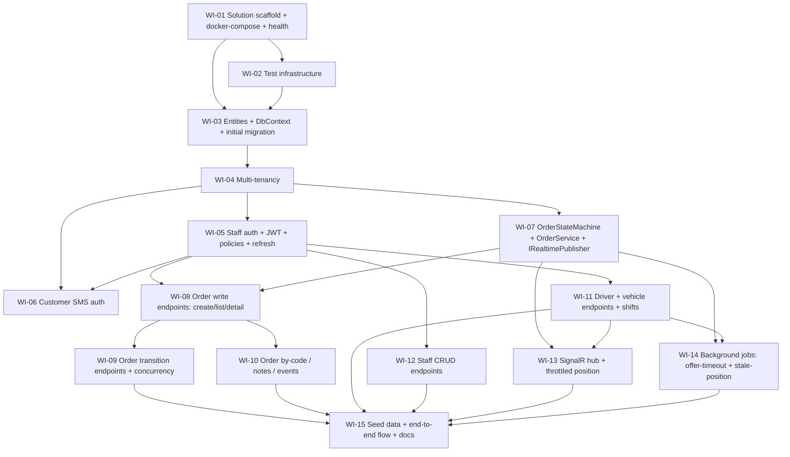

# UC-001 — Backend Core — Work Items

Spec: `docs/specs/in-progress/001_UC_001_backend-core.md`
Sources of truth: `.claude/state/00-PROJECT-CONTEXT.md`, `.claude/state/01-data-model-and-backend-core.md`, `docs/decisions.md`, and the extracted state-machine skill at `.claude/skills/taxi-order-state-machine/extracted/taxi-order-state-machine/SKILL.md`.

15 vertical-slice work items, dependency-ordered. Tests are red-green **inside** each WI, never a trailing WI. Every WI touching a tenant-owned table carries a tenant-isolation acceptance criterion (fleet A cannot read fleet B; cross-tenant read of a specific resource returns **404**, not 403 — no existence leak).

## Assumptions

Decisions taken where the spec was silent or self-contradictory. Each is documented here and must be echoed into `docs/decisions.md` during implementation (AC #6).

1. **No outbox table.** The skill (SKILL.md step 4) and UC line 32 say "order + event + outbox in one transaction," but the exhaustive 15-entity list has no outbox entity, and the assignment §5 says only "order + event in one transaction, then publish `OrderChanged`." v1 persists **order + OrderEvent** in one transaction and publishes via `IRealtimePublisher` **after commit**. No outbox table is invented. Notifications (SMS/push fan-out) are assignment 05, out of scope here.
2. **`Common/Orders/`, not `Domain/Orders/`; no `InvalidTransitionException`; failure result carries an error kind.** The skill archive predates the stack decision. Per `docs/decisions.md`, the state machine lives in `Common/Orders/` and failures return a **failure result carrying an error kind** — no control-flow exceptions. `OrderStateMachine.Apply` emits `NotEntitled` (wrong/non-assigned actor or role not permitted) or `IllegalTransition` (legal actor, illegal from-status or business-rule violation); `OrderService` adds `StaleVersion` on a `DbUpdateConcurrencyException`. Endpoints map a single pinned status per kind across all 8 transition endpoints: **`NotEntitled` → no-leak 404** (`Send.NotFoundAsync`, consistent with WI-08), **`IllegalTransition` → 409**, **`StaleVersion` → 409** (both via `AddError(...)` + `Send.ErrorsAsync(409, ct)`). `Apply` never detects concurrency.
3. **`by-code` tracking is customer-JWT-only in v1.** UC §6 mentions a "signed tracking token (see 05)"; assignment 05 is out of scope. v1 authorizes `GET /orders/by-code/{code}` by a customer JWT that owns the order; the signed-token path is deferred to 05.
4. **`ITenantEntity` membership is explicit.** `User` and `PushSubscription` have **nullable** `FleetId` (customers/superadmin have none), so a blanket `FleetId == tenant.FleetId` filter is wrong for them. The tenancy WI enumerates exactly which entities get a global query filter and how the two nullable-FleetId entities are treated (filtered only when `FleetId` is non-null; customer/superadmin rows are tenant-agnostic). `RefreshToken` and `SmsCode` are **not** tenant entities (keyed by user/phone, cross-tenant by nature).
5. **Seed orders go through the state machine.** AC-relevant invariant: `order.Status` is never set directly. Seed data drives sample orders into their target states via `OrderStateMachine`/`OrderService`, not by assigning `Status`.
6. **`fleet_id` claim name is a shared constant defined in the tenancy WI.** This lets the auth WIs (which mint JWTs) and the tenancy middleware (which reads them) share one constant, breaking the apparent auth↔tenancy cycle: tenancy tests forge claims directly and do not depend on auth endpoints.
7. **Complexity scale is XS/S/M/L** (no XL, per the conductor handoff shape). The entities+migration WI is `L` and indivisible (one initial migration).
8. **Password hashing: BCrypt** (`BCrypt.Net-Next`) rather than Argon2id — assignment §4 allows either; BCrypt has the lighter dependency footprint consistent with "cheap to run / no exotic deps." Documented as a decision.
9. **`AuditLog` is provisioned-but-unwritten in v1.** The `AuditLog` table is modeled in WI-03 (schema completeness), but no WI writes to it this UC — audit wiring is assignment 07. No behaviour depends on it here. (design-review F-12.)
10. **`by-code` tracking is unavailable to phone-order customers in v1.** Phone-created orders have `CustomerUserId = null` and no customer JWT, so their customers cannot track by code until the signed-token path lands in assignment 05 (ties to assumption 3). Accepted consequence, not a bug. (design-review F-12.)
11. **`OrderService` in `Common/Orders/` is a sanctioned exception to "no service classes."** `architecture.md#banned-patterns` forbids Service/Manager classes for *feature* logic, but the order transition logic is reused by 2+ consumers (WI-09 endpoints, WI-14 jobs, WI-15 seeder), so it belongs in `Common/` per `architecture.md#common-infrastructure`. Endpoints still own their `HandleAsync` and only delegate the transactional transition to `OrderService`. Recorded so the impl-reviewer does not relitigate it. (design-review F-10.)

### Shared-file coordination note (design-review F-04)

Several WIs register into the shared composition root `api/src/Taxi.Api/Program.cs`: WI-01 creates it; WI-04 (tenancy middleware), WI-05 (policies + JWT issuance), WI-06 (`ISmsSender` DI), WI-13 (`MapHub` + publisher swap), WI-14 (`AddHostedService`), and WI-15 (seeder invocation) each edit it. WI-13 ∥ WI-14 share deps `{WI-07, WI-11}` and are schedulable in parallel, so both editing `Program.cs` is a merge-conflict hazard. **Defuse:** each feature exposes a per-feature registration extension method (`AddOrders`, `AddRealtime`, `AddJobs`, …) that `Program.cs` calls once, so parallel WIs edit disjoint extension files rather than `Program.cs` itself. If that convention is not adopted, the conductor must serialize WI-13 and WI-14.

## Dependency Graph

---

## WI-01: Solution scaffold, Program.cs wiring, docker-compose, health checks

**Goal.** Stand up an empty-but-running .NET 10 FastEndpoints API with all middleware wired, dockerized Postgres for dev, and passing health endpoints.

**Depends on:** none.
**Complexity:** M. **needs_library_research:** true (FastEndpoints registration + Swagger/OpenAPI grouping, health-check endpoint conventions).

**Required reads:** `.claude/state/00-PROJECT-CONTEXT.md` (§4 stack, §5 layout), `.claude/state/01-data-model-and-backend-core.md` (§1), `docs/decisions.md`.

**Deliverables.**
- `/api/Taxi.sln`, `/api/src/Taxi.Api/Taxi.Api.csproj`, `/api/tests/Taxi.Api.Tests/Taxi.Api.Tests.csproj`. `Nullable`/`ImplicitUsings`/`LangVersion=latest` enabled (csharp-style.md#language-version).
- `Program.cs` wires: Serilog (console JSON), EF Core + Npgsql (connection string from `ConnectionStrings__Db`), FastEndpoints + its validators, Problem Details / global exception handler, SignalR, health checks (`/health/live`, `/health/ready`), OpenAPI (Swagger UI **Development only**), CORS for the web origin, and **full JWT bearer validation** — signing key from `Jwt__Key`, issuer/audience from `Jwt__Issuer`/`Jwt__Audience` config — so that WI-04's tenancy tests can authenticate **forged** tokens before WI-05 exists. Only token **issuance** is deferred to WI-05; validation is complete here.
- `appsettings.json` with env-var secret bindings: `ConnectionStrings__Db`, `Jwt__Key`, `Sms__ApiKey`, `Push__VapidPublic`, `Push__VapidPrivate`. `Jwt__Issuer` and `Jwt__Audience` are non-secret config values (appsettings, overridable by env), not env-only secrets.
- `infra/docker-compose.dev.yml` — `api` + `db` (Postgres 16), `/health/ready` reachable.
- A no-op welcome/health feature slice with its `FeatureConfiguration` so Swagger renders.

**Error paths.** `/health/ready` returns 503 while DB unreachable (health-check contract). Global exception handler returns RFC 7807 for unhandled errors.

**Tests (red → green).**
- `HealthCheck_ReadyEndpoint_Returns200WhenDbUp` (needs WI-02 fixture — this WI ships a build-only smoke; the 200 assertion is exercised once WI-02's fixture exists, so WI-01 verification is `dotnet-build`).

**Verification:** `dotnet-build` (`dotnet build -warnaserror`).

**Rule citations:** `rules/architecture.md#vertical-slice-layout`, `rules/architecture.md#feature-configuration`, `rules/csharp-style.md#language-version`, `rules/csharp-style.md#file-scoped-namespaces`, `rules/error-handling.md#global-exception-handler`, `rules/logging.md#output-template`, `CLAUDE.md#stack-decision`.

---

## WI-02: Test infrastructure — Testcontainers Postgres fixture + WebApplicationFactory

**Goal.** Provide the shared integration-test harness every later WI's red-green depends on: a real Postgres via Testcontainers and a `WebApplicationFactory` wired to it.

**Depends on:** WI-01.
**Complexity:** M. **needs_library_research:** true (Testcontainers `PostgreSqlContainer` fixture lifecycle, xUnit collection fixtures, `WebApplicationFactory` DB-override wiring).

**Required reads:** `.claude/state/01-data-model-and-backend-core.md` (§11), `.claude/state/00-PROJECT-CONTEXT.md` (§4 tests).

**Deliverables.**
- xUnit collection fixture spinning a `PostgreSqlContainer` (Postgres 16), applying EF migrations on start (migrations arrive in WI-03; until then the fixture creates from a placeholder/`EnsureCreated` and is switched to migrate in WI-03).
- `WebApplicationFactory<Program>` subclass overriding the connection string to the container.
- `FakeTimeProvider` registration hook (csharp-style.md#timeprovider) — pinned per-test.
- Placeholder auth helpers `AsDispatcher`, `AsDriver`, `AsCustomer` **stubs** (real token minting lands in WI-05; the signatures exist so later WIs compile).
- `HealthCheck_ReadyEndpoint_Returns200` integration test proving the harness works.

**Error paths.** n/a (test scaffold).

**Tests (red → green).**
- `HealthCheck_ReadyEndpoint_Returns200` — go red (no harness) → green.

**Verification:** `dotnet-test` filter `FullyQualifiedName~Taxi.Api.Tests.Infrastructure`.

**Rule citations:** `rules/csharp-style.md#timeprovider`, `rules/naming.md#test-naming`, `CLAUDE.md#stack-decision`.

---

## WI-03: Entities, DbContext, data conventions, initial migration + indexes

**Goal.** Model all 15 v1 entities (Customer = `User` with `Role=Customer`, not a 16th entity) with UUIDv7 PKs, `snake_case`/`timestamptz`/enum-as-string conventions, register DbSets, and produce the single initial migration with all required indexes.

**Depends on:** WI-01, WI-02.
**Complexity:** L (one initial migration is indivisible). **needs_library_research:** false.

**Required reads:** `.claude/state/01-data-model-and-backend-core.md` (§2 — exhaustive entity list + index list), `.claude/state/00-PROJECT-CONTEXT.md` (§6 data conventions).

**Deliverables.**
- All 15 entities in `Infrastructure/Entities/` (one per file, PascalCase → snake_case tables): `Fleet, User, Driver, Vehicle, DriverShift, Order, OrderEvent, Route, Zone, Tariff, FleetSettings, PushSubscription, RefreshToken, SmsCode, AuditLog`. (Customer = `User` with `Role=Customer`, **not** a 16th entity — the exhaustive list is 15.) Add **no** fields beyond the list.
- Enums: `UserRole, DriverStatus, OrderStatus, OrderSource, PriceType, PaymentType, OrderEventType, RouteType, ZoneShape, CancelledByRole`.
- `SpotDbContext`→ **`TaxiDbContext`** with `DbSet<T>` per entity (ef-core.md#dbset-registration); `ConfigureConventions` maps all enums to strings and UUIDv7 default value generation; `timestamptz` for all timestamps; money `int` `_czk`.
- Entity configs with indexes: `orders(fleet_id,status)`, `orders(fleet_id,scheduled_at)`, `orders(fleet_id,created_at desc)`, `orders(fleet_id,public_code) unique`, `order_events(order_id,at)`, `drivers(fleet_id,status)`, `users(phone) unique WHERE role='Customer'` (filtered unique index), `users(fleet_id,email) unique WHERE email IS NOT NULL` (staff email unique per fleet — assignment §2), `fleets(slug) unique` (fleet slug is globally unique — feeds WI-05 fleet-slug login), `refresh_tokens(token_hash)` (lookup on refresh/rotate), `sms_codes(phone)` (lookup on verify), `Order.Version` concurrency token, all FK columns indexed (ef-core.md#indexes).
- Initial migration `InitialSchema`; generated SQL reviewed for destructive ops (ef-core.md#migrations).

**Error paths.** n/a (schema).

**Tests (red → green).**
- `Schema_AllEntities_MaterializeAndRoundTrip` — insert+read one row per entity against Testcontainers Postgres.
- `Schema_CustomerPhone_UniqueOnlyForCustomers` — two non-customer users may share a phone; two customers may not.
- `Schema_OrderPublicCode_UniquePerFleet` — same code in two fleets OK; duplicate within a fleet rejected.
- `Schema_StaffEmail_UniquePerFleet` — same email in two fleets OK; duplicate staff email within a fleet rejected; null emails (customers) do not collide.
- `Schema_FleetSlug_Unique` — two fleets cannot share a slug.

**Verification:** `dotnet-test` filter `FullyQualifiedName~Taxi.Api.Tests.Schema`.

**Rule citations:** `rules/ef-core.md#entity-naming`, `rules/ef-core.md#primary-keys`, `rules/ef-core.md#dbset-registration`, `rules/ef-core.md#indexes`, `rules/ef-core.md#enums-as-strings`, `rules/ef-core.md#date-types`, `rules/ef-core.md#migrations`, `rules/csharp-style.md#guid-primary-keys`, `rules/naming.md#files-and-types`, `rules/naming.md#migrations`.

---

## WI-04: Multi-tenancy — ICurrentTenant, middleware, query filters, SaveChanges guard

**Goal.** Enforce tenant isolation at the data layer: resolve the current fleet per request, apply global query filters, and guard writes.

**Depends on:** WI-03.
**Complexity:** M. **needs_library_research:** false.

**Required reads:** `.claude/state/00-PROJECT-CONTEXT.md` (§7 multi-tenancy), `.claude/state/01-data-model-and-backend-core.md` (§3).

**Deliverables.**
- `Common/Tenancy/ICurrentTenant.cs` (`Guid? FleetId; string? Slug;`) scoped service + implementation.
- Resolution middleware: JWT claim `fleet_id` → `X-Fleet-Slug` header → subdomain (in that order).
- `Common/Tenancy/TenantClaims.cs` — **shared constant** for the `fleet_id` claim name, consumed by WI-05/WI-06 issuance.
- `ITenantEntity` marker; global query filters on: `Driver, Vehicle, DriverShift, Order, OrderEvent, Route, Zone, Tariff, FleetSettings, PushSubscription (when FleetId non-null), User (when FleetId non-null), AuditLog`. **Not** filtered: `Fleet` (the tenant root), `RefreshToken`, `SmsCode` (keyed by user/phone). Nullable-FleetId entities (`User`, `PushSubscription`) filter only rows with a non-null `FleetId`; customer/superadmin rows are tenant-agnostic (assumption 4).
- `SaveChanges`/`SaveChangesAsync` override: set `FleetId` when null on added tenant entities; **throw** when an entity's `FleetId` mismatches the current tenant.

**Error paths.** Write with mismatched `FleetId` → exception (programmer bug, not expected). Cross-tenant read → filtered out (empty/404 at the endpoint layer, surfaced in WIs 08–12).

**Tests (red → green).**
- `Tenancy_QueryFilter_FleetASeesOnlyFleetARows` — a **`[Theory]`** iterating **every** filtered tenant entity (`Driver, Vehicle, DriverShift, Order, OrderEvent, Route, Zone, Tariff, FleetSettings, PushSubscription, User, AuditLog`) so isolation is proven per tenant table — including tables that ship no endpoint this UC (`Route, Zone, Tariff, FleetSettings, DriverShift, AuditLog`), satisfying the per-tenant-table DoD (NFR line 56, context §12 DoD #4).
- `Tenancy_SaveChanges_SetsFleetIdWhenNull`
- `Tenancy_SaveChanges_ThrowsOnFleetIdMismatch`
- `Tenancy_NullableFleetIdEntity_CustomerRowsVisibleAcrossTenants` (User with `FleetId=null`).
- `Tenancy_Resolution_PrefersJwtClaimThenHeaderThenSubdomain`.

**Verification:** `dotnet-test` filter `FullyQualifiedName~Taxi.Api.Tests.Tenancy`.

**Rule citations:** `rules/architecture.md#common-infrastructure`, `rules/ef-core.md#dbcontext-injection`, `rules/error-handling.md#exceptions-for-infrastructure`, `rules/csharp-style.md#sealed-internal`, `CLAUDE.md#cross-cutting-invariants`.

---

## WI-05: Staff auth — JWT issuance, policies, staff login, refresh rotation, logout

**Goal.** Issue and validate JWTs for Driver/Dispatcher/FleetAdmin, define authorization policies, and implement staff login + refresh-token rotation + logout.

**Depends on:** WI-04 (consumes the `fleet_id` claim constant).
**Complexity:** L. **needs_library_research:** false.

**Required reads:** `.claude/state/01-data-model-and-backend-core.md` (§4), `.claude/state/00-PROJECT-CONTEXT.md` (§9 policies).

**Deliverables.**
- `Authorization/AuthorizationPolicies.cs` — `CustomerOnly, DriverOnly, DispatcherOnly` (incl. FleetAdmin), `FleetAdminOnly, SuperAdminOnly`. Registered in `Program.cs`.
- JWT issuance service (access 15 min, refresh 30 days) with claims `sub, role, fleet_id, fleet_slug, name` (fleet_id via `TenantClaims`).
- `Features/Auth/StaffLogin/` — `POST /api/v1/auth/staff/login { fleetSlug, email, password }`, BCrypt verify (assumption 8), returns `{ accessToken, refreshToken, user }`; sets `LastLoginAt`.
- `Features/Auth/Refresh/` — `POST /api/v1/auth/refresh { refreshToken }` — validate `TokenHash` + expiry, **rotate** (revoke old, issue new). Reuse of a revoked token → 401.
- `Features/Auth/Logout/` — `POST /api/v1/auth/logout` — revoke current refresh token.
- Replace WI-02's stub auth helpers with real `AsDispatcher/AsDriver` token minting.

**Error paths.** Bad credentials → `Send.UnauthorizedAsync` (401). Unknown fleet slug → 401 (no existence leak). Expired/revoked refresh → 401. Validation (missing fields, malformed email) → 400 via validator.

**Tests (red → green).**
- `StaffLogin_ValidCredentials_ReturnsTokens`
- `StaffLogin_WrongPassword_Returns401`
- `Refresh_ValidToken_RotatesAndRevokesOld`
- `Refresh_ReusedRevokedToken_Returns401`
- `Logout_RevokesRefreshToken`
- `StaffLoginValidator_MissingEmail_FailsWithCode`

**Verification:** `dotnet-test` filter `FullyQualifiedName~Taxi.Api.Tests.Auth.Staff`.

**Rule citations:** `rules/api-design.md#endpoint-pattern`, `rules/api-design.md#configure-structure`, `rules/api-design.md#send-pattern`, `rules/api-design.md#authorization`, `rules/validation.md#validator-class`, `rules/validation.md#error-codes`, `rules/error-handling.md#send-for-expected-errors`, `rules/csharp-style.md#records-for-dtos`, `rules/csharp-style.md#primary-constructors`, `rules/naming.md#endpoints-requests-responses-validators-feature-configs`, `CLAUDE.md#stack-decision`.

---

## WI-06: Customer SMS-code auth + ISmsSender

**Goal.** Phone + SMS-code login for customers with rate limiting, provisioning a customer `User` on first verify.

**Depends on:** WI-04, WI-05 (reuses JWT issuance + policies).
**Complexity:** M. **needs_library_research:** false.

**Required reads:** `.claude/state/01-data-model-and-backend-core.md` (§4), `.claude/state/00-PROJECT-CONTEXT.md` (§3 roles, external services).

**Deliverables.**
- `Infrastructure/Sms/ISmsSender.cs` + `ConsoleSmsSender` (dev — logs the code via Serilog, never the raw code in prod-shaped logs; logging.md#what-must-not-appear — treat the code as a secret, log a masked marker).
- `Features/Auth/RequestCode/` — `POST /api/v1/auth/customer/request-code { phone }`. Normalize to E.164; create `SmsCode` (hashed); rate limit **3 per phone / 10 min** and **1 per phone / 60 s** → 429 when exceeded.
- `Features/Auth/VerifyCode/` — `POST /api/v1/auth/customer/verify-code { phone, code }`. Verify hash + expiry + attempts; create `User(Role=Customer)` if new; return `{ accessToken, refreshToken, user }`. **5 wrong attempts invalidates** the code.

**Error paths.** Rate limit hit → **429** via `Send.ErrorsAsync(429, ct)` (pinned — not 400). Wrong/expired/invalidated code → **401** with no body (uniform — no oracle distinguishing wrong-vs-expired). Malformed phone → 400 via validator.

**Tests (red → green).**
- `RequestCode_ValidPhone_SendsCodeAndPersistsHashed`
- `RequestCode_FourthWithin10Min_Returns429`
- `RequestCode_SecondWithin60s_Returns429`
- `VerifyCode_CorrectCode_CreatesCustomerAndReturnsTokens`
- `VerifyCode_FiveWrongAttempts_InvalidatesCode`
- `VerifyCodeValidator_MalformedPhone_FailsWithCode`

**Verification:** `dotnet-test` filter `FullyQualifiedName~Taxi.Api.Tests.Auth.Customer`.

**Rule citations:** `rules/api-design.md#endpoint-pattern`, `rules/api-design.md#authorization`, `rules/validation.md#validator-class`, `rules/validation.md#common-rules`, `rules/error-handling.md#send-for-expected-errors`, `rules/logging.md#what-must-not-appear-in-logs`, `rules/csharp-style.md#records-for-dtos`, `rules/naming.md#error-codes`.

---

## WI-07: OrderStateMachine + OrderService + IRealtimePublisher abstraction

**Goal.** Implement the single order state machine and the transactional service that applies transitions, writes exactly one `OrderEvent`, updates `Driver.Status`, and publishes after commit — with an `IRealtimePublisher` abstraction (no-op/recording fake for tests).

**Depends on:** WI-04.
**Complexity:** L. **needs_library_research:** false.

**Required reads:** `.claude/skills/taxi-order-state-machine/extracted/taxi-order-state-machine/SKILL.md` (authoritative transition table + side effects), `.claude/state/00-PROJECT-CONTEXT.md` (§8), `.claude/state/01-data-model-and-backend-core.md` (§5), `docs/decisions.md`.

**Deliverables.**
- `Common/Orders/OrderStateMachine.cs` — `Apply(Order, OrderTransition, Actor, object? payload)` returns a **result** (success → `OrderEvent` to persist; failure → an **error kind** + code + message; **no exceptions** for illegal transitions). The failure kind is `NotEntitled` (wrong/non-assigned actor or role not permitted) or `IllegalTransition` (legal actor, illegal from-status, or business-rule violation). Enforces: assigned-driver check (`actor.DriverId == order.DriverId`) → `NotEntitled` when it fails, reassign releases old driver, complete requires `paymentType` and `overrideReason` when `FinalPriceCzk != FixedPriceCzk` (≥5 chars), driver `no-show` cancel only Arrived and ≥5 min after `ArrivedAt`. `Apply` does **not** detect concurrency. Plus `AllowedFor(status, role, isAssignedDriver)` for DTO `allowedActions`.
- `Common/Orders/OrderTransition.cs`, `Actor.cs`, result type with the failure-kind enum (`NotEntitled | IllegalTransition | StaleVersion`).
- `Realtime/IRealtimePublisher.cs` (`OrderChanged`, `DriverStatusChanged`, `DriverPositionChanged`, `NewOrderOffered`) — abstraction only; recording fake in tests. Concrete SignalR impl is WI-13.
- `Common/Orders/OrderService.cs` — load order with `Version`, apply, update `Driver.Status`, save **order + event in one transaction**, publish `OrderChanged` **after commit** (assumption 1: no outbox table); on a `DbUpdateConcurrencyException` return a `StaleVersion` failure result. Never `order.Status =` outside the state machine.

**Error paths.** `NotEntitled` failure (wrong/non-assigned actor) → endpoints map to no-leak **404**. `IllegalTransition` failure (illegal from-status / business rule) → endpoints map to **409**. `StaleVersion` (concurrency, added by `OrderService`) → endpoints map to **409**. Publish never precedes commit.

**Tests (red → green).**
- `Apply_EveryAllowedTransition_MutatesAndReturnsEvent` (one per allowed transition).
- `Apply_DisallowedTransitions_ReturnFailure` (≥10 disallowed, asserting the failure **kind**: `Customer tries Arrive` → `NotEntitled`, `other driver tries Accept` → `NotEntitled`, `Accept from wrong from-status` → `IllegalTransition`, `Driver cancels at 3 min` → `IllegalTransition`).
- `Apply_ReassignFromAccepted_ReleasesOldDriver`
- `Apply_CompleteFixedPriceDifferentPriceNoReason_Fails` (kind = `IllegalTransition`) / `_WithReason_WritesPriceOverriddenEvent`
- `OrderService_Transition_WritesExactlyOneEventInTransaction`
- `OrderService_ConcurrencyConflict_ReturnsStaleVersion` (a `DbUpdateConcurrencyException` maps to the `StaleVersion` failure kind).
- `OrderService_FailingSave_NoPublish` (publish only after commit).

**Verification:** `dotnet-test` filter `FullyQualifiedName~Taxi.Api.Tests.Orders.StateMachine`.

**Rule citations:** `rules/architecture.md#no-horizontal-layers`, `rules/architecture.md#common-infrastructure`, `rules/architecture.md#banned-patterns`, `rules/error-handling.md#send-for-expected-errors`, `rules/error-handling.md#no-exceptions-for-control-flow`, `rules/ef-core.md#dbcontext-injection`, `rules/csharp-style.md#pattern-matching`, `rules/csharp-style.md#timeprovider`, `CLAUDE.md#cross-cutting-invariants`.

---

## WI-08: Order write endpoints — create, list, detail

**Goal.** Create an order (Dispatcher/Customer), list with filters (Dispatcher), and fetch detail with role-scoped access.

**Depends on:** WI-05, WI-07.
**Complexity:** L. **needs_library_research:** false.

**Required reads:** `.claude/state/01-data-model-and-backend-core.md` (§6), `.claude/state/00-PROJECT-CONTEXT.md` (§8, §9).

**Deliverables.**
- `Features/Orders/CreateOrder/` — `POST /api/v1/orders`. Validator: addresses have coordinates, phone E.164, `scheduledAt` future if present. Generates `PublicCode` (6-char, unique per fleet), sets price fields at creation, writes a `Created` **OrderEvent** (event type, not a transition — the order is created directly in `New`; `Created` is not in the transition table). Dispatcher or Customer.
- `Features/Orders/ListOrders/` — `GET /api/v1/orders` filters `status[], driverId, from, to, search` (public code / phone / name), paged `{ items, total, page, pageSize }`. Dispatcher only. `AsNoTracking` + projection (ef-core.md#projections, #n-plus-one).
- `Features/Orders/GetOrder/` — `GET /api/v1/orders/{id:guid}`. Dispatcher; Driver if assigned; Customer if owner. Response DTO includes `allowedActions` from `OrderStateMachine.AllowedFor`.

**Error paths.** Not found / cross-tenant → `Send.NotFoundAsync` (**404**, no existence leak). Driver/Customer not entitled to the order → 404 (not 403 — same no-leak rule as cross-tenant). Validation → 400.

**Tests (red → green).**
- `CreateOrder_ValidDispatcherRequest_Returns201WithPublicCode`
- `CreateOrder_ValidCustomerRequest_Returns201` — a customer JWT carries **no** `fleet_id` claim, so the tenant is resolved via the `X-Fleet-Slug` header; this uniquely exercises header-based tenant resolution on the create path.
- `CreateOrderValidator_AddressWithoutCoordinates_FailsWithCode`
- `CreateOrderValidator_ScheduledInPast_FailsWithCode`
- `ListOrders_FilterByStatus_ReturnsMatching` + `ListOrders_Paged_ReturnsEnvelope`
- `GetOrder_DispatcherOfFleetB_Returns404` (**tenant isolation**, 404 not 403)
- `GetOrder_DriverNotAssigned_Returns404`
- `GetOrder_CustomerOwner_Returns200`

**Verification:** `dotnet-test` filter `FullyQualifiedName~Taxi.Api.Tests.Orders.Write`.

**Rule citations:** `rules/api-design.md#endpoint-pattern`, `rules/api-design.md#configure-structure`, `rules/api-design.md#send-pattern`, `rules/api-design.md#routes`, `rules/validation.md#validator-class`, `rules/validation.md#common-rules`, `rules/error-handling.md#send-for-expected-errors`, `rules/ef-core.md#asnotracking`, `rules/ef-core.md#projections`, `rules/ef-core.md#n-plus-one`, `rules/csharp-style.md#records-for-dtos`, `rules/naming.md#endpoints-requests-responses-validators-feature-configs`, `CLAUDE.md#cross-cutting-invariants`.

---

## WI-09: Order transition endpoints + concurrency

**Goal.** Expose every state-machine transition as a POST action endpoint, mapping each `OrderService` failure kind to a single pinned status across all 8 transition endpoints (`NotEntitled` → no-leak **404**, `IllegalTransition` → **409**, `StaleVersion` → **409**), and enforcing optimistic concurrency (two dispatchers assigning the same order → one gets 409).

**Depends on:** WI-08.
**Complexity:** L. **needs_library_research:** false.

**Required reads:** `.claude/skills/taxi-order-state-machine/extracted/taxi-order-state-machine/SKILL.md`, `.claude/state/01-data-model-and-backend-core.md` (§6), `.claude/state/00-PROJECT-CONTEXT.md` (§8).

**Deliverables.**
- `Features/Orders/*` endpoints, all `POST /api/v1/orders/{id:guid}/...`: `assign {driverId}`, `reassign {driverId}`, `accept`, `decline {reason}`, `arrive`, `start`, `complete {finalPriceCzk, paymentType, overrideReason?}`, `cancel {reason}`. Each calls `OrderService` and maps the returned failure **kind** to a single pinned status (identical across all 8 endpoints):
  - `NotEntitled` (wrong/non-assigned actor, role not permitted, **or the order is not visible to this tenant/actor**) → `Send.NotFoundAsync(ct)` — **no-leak 404**, matching WI-08's precedent. Never 403.
  - `IllegalTransition` (legal actor, illegal from-status, or business-rule violation e.g. fixed-price override without reason) → `AddError(...)` + `Send.ErrorsAsync(409, ct)`.
  - `StaleVersion` (optimistic-concurrency conflict surfaced by `OrderService`) → `AddError(...)` + `Send.ErrorsAsync(409, ct)`.
  Role/actor gating per the transition table. Input-shape failures (e.g. `complete` without `paymentType`) are caught by the validator → 400 before `OrderService` runs.

**Error paths.** `IllegalTransition` → 409. Concurrent assign (`StaleVersion`) → 409 for the loser. Wrong actor (non-assigned driver / wrong role) → `NotEntitled` → **404** (no-leak, never 403). Not found / cross-tenant → `NotEntitled` → 404. Complete without `paymentType` → 400 (validator); fixed-price override without reason → `IllegalTransition` → 409.

**Tests (red → green).**
Happy-path per action (one green test per transition endpoint):
- `Assign_ByDispatcher_Returns200AndWritesAssignedEvent`
- `Reassign_ByDispatcher_Returns200`
- `Accept_ByAssignedDriver_Returns200`
- `Decline_ByAssignedDriver_Returns200`
- `Arrive_ByAssignedDriver_Returns200`
- `Start_ByAssignedDriver_Returns200`
- `Complete_ByAssignedDriver_Returns200`
- `Cancel_ByDispatcher_Returns200`

Status-contract and error paths:
- `Accept_ByOtherDriver_Returns404` (**`NotEntitled` → no-leak 404**, single pinned status — no 404-or-403 ambiguity)
- `Complete_FixedPriceOverrideNoReason_Returns409` (`IllegalTransition`)
- `Transition_IllegalFromStatus_Returns409` (`IllegalTransition`)
- `Assign_TwoDispatchersSameOrder_OneGets409` (**concurrency**, `StaleVersion` via `Version` token)
- `Cancel_CrossTenantOrder_Returns404` (**tenant isolation**, `NotEntitled`)

**Verification:** `dotnet-test` filter `FullyQualifiedName~Taxi.Api.Tests.Orders.Transitions`.

**Rule citations:** `rules/api-design.md#endpoint-pattern`, `rules/api-design.md#send-pattern`, `rules/error-handling.md#send-for-expected-errors`, `rules/error-handling.md#no-exceptions-for-control-flow`, `rules/validation.md#validator-class`, `rules/ef-core.md#dbcontext-injection`, `rules/csharp-style.md#guard-clauses`, `CLAUDE.md#cross-cutting-invariants`.

---

## WI-10: Order by-code tracking, notes, events

**Goal.** Public-ish tracking by code (reduced DTO), dispatcher notes, and the events feed.

**Depends on:** WI-08.
**Complexity:** M. **needs_library_research:** false.

**Required reads:** `.claude/state/01-data-model-and-backend-core.md` (§6), `docs/decisions.md`.

**Deliverables.**
- `Features/Orders/GetOrderByCode/` — `GET /api/v1/orders/by-code/{publicCode}`. **Reduced DTO**: status, driver first name, vehicle plate/color, ETA, position. Authorized by a customer JWT owning the order (assumption 3; signed-token path deferred to 05).
- `Features/Orders/AddNote/` — `POST /api/v1/orders/{id:guid}/notes { text }`. Writes a `NoteAdded` **OrderEvent** (event type, not a transition — no status change). Dispatcher.
- `Features/Orders/GetOrderEvents/` — `GET /api/v1/orders/{id:guid}/events`. Dispatcher. `AsNoTracking` ordered by `at`.

**Error paths.** Unknown/cross-tenant code → 404. Non-owner customer → 404 (no-leak). Empty note → 400 (validator).

**Tests (red → green).**
- `GetByCode_OwnerCustomer_ReturnsReducedDto`
- `GetByCode_NonOwner_Returns404`
- `GetByCode_CrossTenantCode_Returns404` (**tenant isolation**)
- `AddNote_Dispatcher_WritesNoteAddedEvent`
- `AddNoteValidator_EmptyText_FailsWithCode`
- `GetEvents_Dispatcher_ReturnsChronological`

**Verification:** `dotnet-test` filter `FullyQualifiedName~Taxi.Api.Tests.Orders.Tracking`.

**Rule citations:** `rules/api-design.md#endpoint-pattern`, `rules/api-design.md#send-pattern`, `rules/validation.md#when-to-add-a-validator`, `rules/error-handling.md#send-for-expected-errors`, `rules/ef-core.md#asnotracking`, `rules/ef-core.md#projections`, `rules/csharp-style.md#records-for-dtos`, `CLAUDE.md#cross-cutting-invariants`.

---

## WI-11: Driver + vehicle endpoints + shifts

**Goal.** Driver list + go-online/offline (opening/closing `DriverShift`), driver self-view, and vehicle CRUD.

**Depends on:** WI-05.
**Complexity:** M. **needs_library_research:** false.

**Required reads:** `.claude/state/01-data-model-and-backend-core.md` (§7, §2 Driver/Vehicle/DriverShift), `.claude/state/00-PROJECT-CONTEXT.md` (§7).

**Deliverables.**
- `Features/Drivers/ListDrivers/` — `GET /api/v1/drivers` (Dispatcher).
- `Features/Drivers/GoOnline/` — `POST /api/v1/drivers/me/online { vehicleId }` — set `Status=Free`, `CurrentVehicleId`, **open** a `DriverShift`. Driver.
- `Features/Drivers/GoOffline/` — `POST /api/v1/drivers/me/offline` — set `Status=Offline`, **close** the open `DriverShift` (`EndedAt`). Driver.
- `Features/Drivers/GetMe/` — `GET /api/v1/drivers/me`. Driver.
- `Features/Vehicles/*` — CRUD (`GET list`, `GET {id}`, `POST`, `PUT {id}`, `DELETE {id}`), FleetAdmin. Validators on create/update.

**Error paths.** Online with a vehicle from another fleet / non-existent → 404 (no-leak). Vehicle not found / cross-tenant → 404. Validation → 400.

**Tests (red → green).**
- `GoOnline_ValidVehicle_OpensShiftAndSetsFree`
- `GoOffline_ClosesOpenShift`
- `GetMe_Driver_Returns200`
- `ListVehicles_FleetAdmin_Returns200`
- `GetVehicle_FleetAdmin_Returns200`
- `CreateVehicle_FleetAdmin_Returns201`
- `UpdateVehicle_FleetAdmin_Returns200`
- `DeleteVehicle_FleetAdmin_Returns204`
- `ListDrivers_DispatcherOfFleetB_CannotSeeFleetADrivers` (**tenant isolation**)
- `GetVehicle_CrossTenant_Returns404` (**tenant isolation**)
- `CreateVehicleValidator_MissingPlate_FailsWithCode`

**Verification:** `dotnet-test` filter `FullyQualifiedName~Taxi.Api.Tests.Drivers`.

**Rule citations:** `rules/api-design.md#endpoint-pattern`, `rules/api-design.md#configure-structure`, `rules/api-design.md#send-pattern`, `rules/api-design.md#routes`, `rules/validation.md#validator-class`, `rules/error-handling.md#send-for-expected-errors`, `rules/ef-core.md#asnotracking`, `rules/csharp-style.md#records-for-dtos`, `rules/naming.md#endpoints-requests-responses-validators-feature-configs`, `CLAUDE.md#cross-cutting-invariants`.

---

## WI-12: Staff CRUD endpoints

**Goal.** FleetAdmin manages Driver/Dispatcher users; invite = create with a temporary password returned once.

**Depends on:** WI-05.
**Complexity:** M. **needs_library_research:** false.

**Required reads:** `.claude/state/01-data-model-and-backend-core.md` (§7), `.claude/state/00-PROJECT-CONTEXT.md` (§3, §7).

**Deliverables.**
- `Features/Staff/*` — `GET /api/v1/staff` (list Driver/Dispatcher users of the fleet), `GET /{id}`, `POST` (invite: create with generated temp password, `passwordHash` stored, **plaintext temp password returned once**), `PUT /{id}` (update role/displayName/isActive), `DELETE /{id}` (deactivate). FleetAdmin only. When creating a Driver-role user, create the linked `Driver` row (1:1).

**Error paths.** Duplicate email per fleet → 409. Cross-tenant staff id → 404. Non-FleetAdmin → 403 (policy). Validation → 400.

**Tests (red → green).**
- `CreateStaff_FleetAdmin_ReturnsTempPasswordOnce`
- `ListStaff_FleetAdmin_Returns200`
- `GetStaff_FleetAdmin_Returns200`
- `UpdateStaff_FleetAdmin_Returns200`
- `DeleteStaff_FleetAdmin_Returns204`
- `CreateStaff_DuplicateEmailInFleet_Returns409`
- `ListStaff_FleetAdminOfFleetB_CannotSeeFleetAStaff` (**tenant isolation**)
- `GetStaff_CrossTenant_Returns404` (**tenant isolation**)
- `UpdateStaff_NonFleetAdmin_Returns403`
- `CreateStaffValidator_InvalidEmail_FailsWithCode`

**Verification:** `dotnet-test` filter `FullyQualifiedName~Taxi.Api.Tests.Staff`.

**Rule citations:** `rules/api-design.md#endpoint-pattern`, `rules/api-design.md#authorization`, `rules/api-design.md#send-pattern`, `rules/validation.md#validator-class`, `rules/error-handling.md#send-for-expected-errors`, `rules/logging.md#what-must-not-appear-in-logs`, `rules/csharp-style.md#records-for-dtos`, `rules/naming.md#endpoints-requests-responses-validators-feature-configs`, `CLAUDE.md#cross-cutting-invariants`.

---

## WI-13: SignalR hub + throttled position updates

**Goal.** Concrete `/hubs/fleet` implementation with groups, JWT-via-query-string, throttled `UpdatePosition`, and the real `IRealtimePublisher` backed by the hub.

**Depends on:** WI-07, WI-11.
**Complexity:** L. **needs_library_research:** true (SignalR JWT-in-query-string wiring, in-test SignalR client to prove throttle + delivery — AC #4).

**Required reads:** `.claude/state/00-PROJECT-CONTEXT.md` (§10 SignalR contract), `.claude/state/01-data-model-and-backend-core.md` (§8).

**Deliverables.**
- `Realtime/FleetHub.cs` at `/hubs/fleet`. JWT from `access_token` query string. On connect: dispatchers → `fleet:{fleetId}:dispatch`; drivers → `driver:{driverId}`. `Subscribe(orderId)` joins `order:{id}` when the caller owns it.
- `UpdatePosition(lat,lng,heading,speed)` — drivers only; server-side throttle to **≤ 1 per 3 s** per driver; update in-memory `ConcurrentDictionary` store + `Driver.LastLat/Lng/PositionAt`; **flush to DB every 30 s** per driver; broadcast `DriverPositionChanged` immediately to dispatch group and the driver's active order group.
- Concrete `IRealtimePublisher` (SignalR-backed) replacing the WI-07 fake in the composition root. Server→client events per §10: `OrderChanged, DriverPositionChanged, DriverStatusChanged, NewOrderOffered`.

**Error paths.** Non-driver calls `UpdatePosition` → rejected. `Subscribe` to a non-owned order → rejected (no join). Unauthenticated connection → refused.

**Tests (red → green).**
- `Hub_DispatcherConnects_JoinsDispatchGroup`
- `UpdatePosition_At10Hz_ThrottledToOnePer3s_ReachesDispatcherClient` (**AC #4** — test SignalR client)
- `UpdatePosition_NonDriver_Rejected`
- `Subscribe_NonOwnedOrder_NotJoined`
- `UpdatePosition_DriverOfFleetA_NotReceivedByFleetBDispatcher` (**tenant isolation** — fleet B's connected dispatcher receives no position for fleet A's driver; groups are fleet-scoped)

**Verification:** `dotnet-test` filter `FullyQualifiedName~Taxi.Api.Tests.Realtime`.

**Rule citations:** `rules/architecture.md#common-infrastructure`, `rules/api-design.md#authorization`, `rules/error-handling.md#send-for-expected-errors`, `rules/logging.md#style-message-templates`, `rules/csharp-style.md#timeprovider`, `CLAUDE.md#stack-decision`.

---

## WI-14: Background jobs — offer-timeout + stale-position (restart-safe)

**Goal.** Two `IHostedService` jobs whose scheduling survives restarts because state lives in the DB (AC #5).

**Depends on:** WI-07, WI-11.
**Complexity:** M. **needs_library_research:** false.

**Required reads:** `.claude/skills/taxi-order-state-machine/extracted/taxi-order-state-machine/SKILL.md` (Timeouts), `.claude/state/01-data-model-and-backend-core.md` (§9).

**Deliverables.**
- `Infrastructure/Jobs/OfferTimeoutJob.cs` — every 5 s, find `Assigned` orders with `AssignedAt + FleetSettings.OfferTimeoutSeconds < now` without acceptance → apply `Timeout` (back to `New`) via `OrderService`; notify dispatch group. Idempotent even if two runs overlap (times out exactly once).
- `Infrastructure/Jobs/StalePositionJob.cs` — every 60 s, drivers with `LastPositionAt` older than 5 min and `Status != Offline` → mark `Offline`, close the open `DriverShift`, notify.
- Both use scoped `TaxiDbContext` per tick, `TimeProvider`, and cross-tenant scans via `IgnoreQueryFilters()` (system actor, all fleets).

**Error paths.** Job exceptions logged (logging.md Error with exception) and swallowed per tick so the loop survives. Concurrent double-timeout → second is a no-op (order already `New`).

**Tests (red → green).**
- `OfferTimeoutJob_AssignedPastTimeout_TransitionsToNew`
- `OfferTimeoutJob_RunsTwiceConcurrently_TimesOutExactlyOnce`
- `OfferTimeoutJob_SurvivesRestart_StillTimesOutFromDbState` (**AC #5** — simulate restart, timing preserved)
- `StalePositionJob_StaleDriver_MarkedOfflineAndShiftClosed`

**Verification:** `dotnet-test` filter `FullyQualifiedName~Taxi.Api.Tests.Jobs`.

**Rule citations:** `rules/architecture.md#common-infrastructure`, `rules/ef-core.md#dbcontext-injection`, `rules/ef-core.md#n-plus-one`, `rules/error-handling.md#exceptions-for-infrastructure`, `rules/logging.md#levels`, `rules/csharp-style.md#timeprovider`, `CLAUDE.md#cross-cutting-invariants`.

---

## WI-15: Seed data, end-to-end flow, generated docs

**Goal.** Development seed data, the full dispatcher→driver end-to-end acceptance test (AC #2), and generated API docs (AC #6).

**Depends on:** WI-09, WI-10, WI-11, WI-12, WI-13, WI-14.
**Complexity:** M. **needs_library_research:** false.

**Required reads:** `.claude/state/01-data-model-and-backend-core.md` (§10 seed spec), `.claude/state/00-PROJECT-CONTEXT.md` (§12 DoD).

**Deliverables.**
- `Infrastructure/Seed/DevelopmentSeeder.cs` (Development env only): fleet `demo` ("Taxi Demo Kolín"), 1 FleetAdmin (`admin@demo.local` / `Demo1234!`), 1 Dispatcher (`dispatcher@demo.local` / `Demo1234!` — **credentials pinned** so the E2E test can log in), 3 Drivers, 3 Vehicles, 1 default Tariff (base 40, per-km 28, waiting 5/min, min 100), 2 Zones (Kutná Hora + Kolín circles r=4 km), 3 Routes (station→center 100, anywhere-KH 110, KH→Kolín 300), 5 sample Orders in various states **driven through `OrderService`/state machine** (assumption 5 — never set `Status` directly).
- Generate `/docs/api.md` from OpenAPI; append implementation decisions to `/docs/decisions.md` (assumptions 1–11).
- `DEMO.md` — documents `docker compose -f infra/docker-compose.dev.yml up` as a **manual smoke check** (AC #1 compose-up path, which no automated test covers) with `curl` examples for the seeded staff login and the end-to-end order flow.

**Error paths.** Seeder idempotent (no duplicate `demo` fleet on re-run).

**Tests (red → green).**
- `Seed_Development_CreatesDemoFleetGraph` (idempotent on second run).
- `OpenApi_Document_ListsAllExpectedEndpoints` (**AC #1** — Swagger lists all endpoints) — fetches the generated OpenAPI document and asserts every expected route is present by matching an **explicit expected-route list** (verb + path), not a hardcoded integer count, so a dropped `FeatureConfiguration` (which silently removes a slice from Swagger) is caught.
- `EndToEnd_DispatcherCreatesAssign_DriverAcceptArriveStartComplete_EventsRecorded` (**AC #2** — full flow) — **begins with a real `POST /api/v1/auth/staff/login`** using the seeded dispatcher credentials (not a factory-minted `AuthHelpers` token, so the login path is exercised end-to-end), then creates + assigns, driver accepts/arrives/starts/completes, and asserts one event per transition in order.

**Verification:** `dotnet-test` filter `FullyQualifiedName~Taxi.Api.Tests.Seed`.

**Rule citations:** `rules/architecture.md#no-horizontal-layers`, `rules/ef-core.md#dbcontext-injection`, `rules/csharp-style.md#timeprovider`, `CLAUDE.md#cross-cutting-invariants`, `CLAUDE.md#commands`.

---

## Acceptance-criteria coverage map

| AC (spec) | Owning WI(s) |
|---|---|
| #1 docker-compose up, `/health/ready` 200, Swagger lists endpoints | WI-01 (compose + Swagger wiring), WI-02 asserts `/health/ready` 200, WI-15 `OpenApi_Document_ListsAllExpectedEndpoints` asserts every expected route is in the generated OpenAPI document; compose-up itself is a manual smoke documented in `DEMO.md` |
| #2 full dispatcher→driver flow, events recorded | WI-15 end-to-end test |
| #3 fleet A → 404 for fleet B's order | WI-08 (`GetOrder_DispatcherOfFleetB_Returns404`), reinforced WI-09/10 |
| #4 UpdatePosition throttled ≤1/3 s, reaches dispatcher | WI-13 |
| #5 restart does not lose Assigned timeout | WI-14 |
| #6 `/docs/api.md` generated, `/docs/decisions.md` updated | WI-15 |
| Concurrency: two dispatchers assign → one 409 | WI-09 |
| Tenant isolation per tenant table | WI-04 (`[Theory]` over every filtered tenant entity, covering endpoint-less tables Route/Zone/Tariff/FleetSettings/DriverShift/AuditLog) + WIs 08–12 (per-feature endpoint isolation) |
