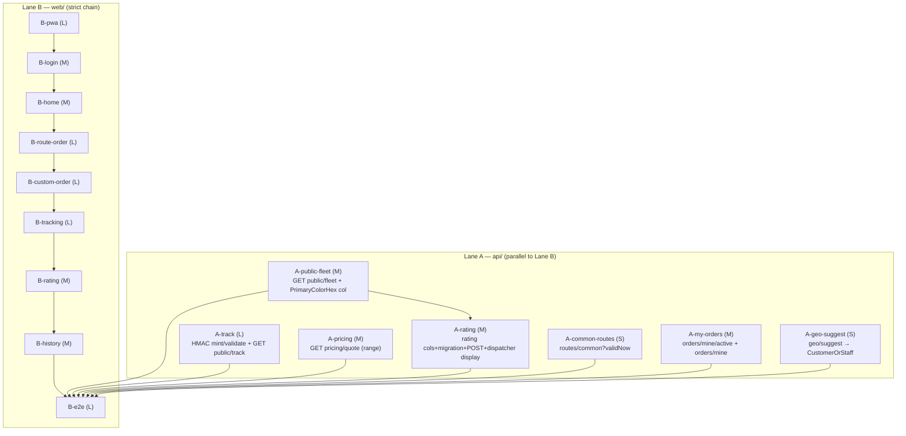

# UC-004 — Customer PWA — Work Items

Two lanes. **Lane A (api/)** — 7 backend WIs. **Lane B (web/)** — 9 frontend WIs. 16 total.
Autonomous run: this document is the sole contract. Every open question is resolved in `## Assumptions`.

Sources of truth: `docs/specs/in-progress/004_UC_004_customer-pwa.md`, `.claude/state/04-customer-pwa.md` (authoritative screens/behavior/ACs — do not restate), `.claude/state/00-PROJECT-CONTEXT.md` (§4 stack, §6 conventions, §7 tenancy, §8 state machine, §10 SignalR, §11 UX), `docs/decisions.md`, `docs/api.md`, CLAUDE.md project facts.

---

## Assumptions

Every judgment the spec left open, decided and recorded here (autonomous mode overrides the interview step). Each was verified against source, not assumed.

### Public-endpoint / tenant approach (the novel backend risk — resolved)

1. **Anonymous public endpoints are fleet-safe by construction (A-public-fleet, A-track).** `TenantResolutionMiddleware` (verified `Common/Tenancy/TenantResolutionMiddleware.cs`) resolves the fleet per request in strict precedence: (1) JWT `fleet_id` claim, (2) `X-Fleet-Slug` header, (3) first subdomain label → DB slug lookup. It is gated on `IsAuthenticated` for branch (1) only; branches (2)/(3) run for **anonymous** requests too, and it runs before authorization on every request (WI-04 middleware-order fact). So an `AllowAnonymous()` endpoint with `X-Fleet-Slug` (or a subdomain) gets a correctly-populated `CurrentTenant.FleetId`, and the EF Core global query filter (`e.FleetId == currentTenant.FleetId`) auto-scopes every read — **no cross-fleet leak, no manual fleet-id plumbing**. A slug matching no fleet leaves `FleetId` null; the endpoint then returns the no-tenant 400/404 rather than an unscoped query. This is the exact pattern `GetOrderByCodeEndpoint` already relies on (verified). Every public WI ships an isolation test: fleet A's slug + fleet B's code/token → 404/no-leak.
2. **`public/fleet` branding shape + the missing primaryColor (A-public-fleet).** `Fleet` (verified `Infrastructure/Entities/Fleet.cs`) has `Name`, `Phone`, `Currency`, `TimeZone`, `IsActive` but **no** primary-color or feature-flag columns. Decision: **add a nullable `PrimaryColorHex` (string, `#RRGGBB`) column to `Fleet` + migration** in A-public-fleet (additive, no tenant-filter concern — `Fleet` has no query filter) rather than silently dropping the branding field the spec's entry-point section requires. "Flags" (spec §1 "flags") are out of scope pre-06; the response carries only `{ name, phone, primaryColorHex, currency, timeZone }`. A null color → the client falls back to the theme default token.
3. **Tracking token = validation-time HMAC check, with a mint home now (A-track).** `GET /api/v1/public/track/{code}?k=` is `AllowAnonymous()`, resolves the fleet from the slug/subdomain (Assumption 1), and validates `k` = `Base64Url(HMACSHA256(key, $"{orderId}:{expiryUnixSeconds}"))` plus `exp`. "Valid until 2 h after completion" **cannot** be a mint-time expiry (completion is unknown at mint), so it is a two-part validation-time rule: (a) the HMAC signature over `orderId:exp` verifies against the server key AND (b) `now < exp` AND (c) if the order is `Completed`, `now < CompletedAt + 2h`. The HMAC secret is a new config key (`Tracking:HmacKey`), dev default seeded. **Mint must live somewhere now** even though SMS delivery is deferred to 05 — so A-track adds a `Common/Tracking/TrackingTokenService` (`internal`, `InternalsVisibleTo` the test project) with `Mint(orderId, expiry)` + `Validate(...)`, and the customer **create-order response is extended with `trackingCode` + `trackingToken` + `trackingUrlPath`** so the E2E (AC #3) can construct a valid and an expired link without SMS. The public/track response is the existing reduced `TrackOrderResponse` shape extended with `priceType`/`price` for the headline (no phone, no customer id).
4. **`pricing/quote` returns a RANGE, distinct from geo/route (A-pricing).** `GET /api/v1/pricing/quote` is `CustomerOnly`, wraps `IGeoProvider.RouteAsync` + the fleet default `Tariff` **server-side** (so no customer-facing `geo/route` widening is needed — only `geo/suggest`, Assumption 6). Shape lets the client render both cases: `{ priceType: "Fixed"|"Estimate", fixedPriceCzk?: int, estimateLowCzk?: int, estimateHighCzk?: int }`. For an estimate, low/high = tariff price ±10 % rounded to 10 CZK (assignment §3 rule). **Never a single exact estimate** (AC #4). When a route matches (pre-06: a `RouteType.PointToPoint` whose from/to coords are within a small radius of the request), `priceType = Fixed` with that route's `PriceCzk`. No dropoff → `Estimate` with a wide band from the tariff minimum. This is the documented pre-06 contract; full route/zone matching is assignment 06.
5. **Rating is columns + migration + endpoint + a dispatcher-detail sub-task (A-rating).** New `Order` columns `RatingStars` (int?), `RatingComment` (string?), `RatedAt` (DateTimeOffset?) + migration (`AddOrderRating`). `POST /api/v1/orders/{id}/rating` is `CustomerOnly`, owner-only (`CustomerUserId == sub`, no-leak 404), once (`RatedAt != null` → 409 `Order.AlreadyRated`), and only for `Completed` orders (else 409). Validator: stars 1–5, comment ≤ 500. The dispatcher order-detail (`OrderDetailDto`/`GetOrderEndpoint`, UC-002) gains `ratingStars`/`ratingComment`/`ratedAt` as an **additive sub-task of this WI** (AC #7), not a separate WI.
6. **Only `geo/suggest` needs widening; reverse-geocode is a client stub (A-geo-suggest).** Verified: `SuggestEndpoint` is `DispatcherOnly` → a customer calling it for pickup autocomplete gets 403. A-geo-suggest adds a `CustomerOrStaff` policy (Customer + Dispatcher + FleetAdmin) and switches `SuggestEndpoint` to it (mirror of UC-003's A-geo; this WI is the sole toucher of `AuthorizationPolicies.cs`). `geo/route` is **not** widened (pricing/quote wraps it server-side). `IGeoProvider` (verified) has `SuggestAsync` + `RouteAsync` only — **no reverse-geocode**. Decision: "Použít moji polohu" is a **client-side stub** — it drops a map pin at the device `geolocation` coords and labels it "Moje poloha (GPS)" without a street name; the customer confirms the pin. No backend reverse-geocode is built (it would be a new OSRM/Photon surface better owned by 06). Documented in `docs/decisions.md`.
7. **Customer reads, split into two WIs for filter integrity (A-common-routes, A-my-orders).** Verified: no such endpoints exist. The `Route` entity (verified) already carries everything needed: `Name`, `Type`, `PriceCzk`, `ValidFromTime`/`ValidToTime`/`ValidDays` (Mon=1 bitmask), `IsEnabled`, `DeletedAt`. So **this is a real listing, not a stub.** Originally one WI; **split** because a single-token `dotnet-test` filter cannot cover tests in two namespaces (`Taxi.Api.Tests.Routes` vs `Taxi.Api.Tests.Orders.*`) and each WI must stay in one feature/test area. (a) **A-common-routes**: `GET /api/v1/routes/common?validNow=true` (`CustomerOnly`) returns enabled, non-deleted routes whose `ValidDays` bit matches and whose `ValidFromTime..ValidToTime` contains the **Europe/Prague** current time, as `{ id, name, type, priceCzk }` — tests under `Taxi.Api.Tests.Routes`. (b) **A-my-orders**: `GET /api/v1/orders/mine/active` (the caller's single non-terminal order `{ id, publicCode, status }` or 204 — the Home sticky banner needs it; `GetOrderByCode` needs a code Home doesn't have) **and** `GET /api/v1/orders/mine?page=&pageSize=` (the paged history listing for B-history, standard `{ items, total, page, pageSize }`), both with tests + cross-tenant isolation under the single `Taxi.Api.Tests.Orders.Mine` namespace so the filter covers every named test. Full route/zone management stays in 06.

### Reused backend (verified present — no new work)

8. **Customer phone-code login already exists (reuse in B-login).** `POST auth/customer/request-code` + `POST auth/customer/verify-code` (both `AllowAnonymous`, verified) mint customer JWT + refresh with no `fleet_id` claim. B-login reuses them verbatim; the dev code is read from the `ConsoleSmsSender` output for the E2E (AC #1). No customer-login backend WI.
9. **Customer order create already works (reuse in B-route-order / B-custom-order).** `CreateOrderEndpoint` is `DispatcherOrCustomer` (verified); a customer caller sets `Source=App`, `CustomerUserId=sub`, requires a resolved tenant (the `X-Fleet-Slug` header the client always sends). The response envelope is `{ order: OrderDetailDto }` — the client **must unwrap `data.order.id`** (the carried UC-003 `client.ts` lesson) to feed `Subscribe(orderId)`. No create-order backend WI.
10. **Customer cancel already works and records the role (reuse in B-tracking).** The state machine (verified `Common/Orders/OrderStateMachine.cs` `ApplyCancel`) allows `Customer` cancel in `New/Assigned/Accepted`, enforces owner-only, and sets `order.CancelledByRole = actor.Role`. `CancelReason` is a **free-form string** (no enum — verified `CancelOrderRequest.Reason`). So AC #5's "reason `customer`" maps to **`CancelledByRole == UserRole.Customer`**, not a literal reason string; the E2E asserts the role column. The client just POSTs `{ reason: <czech text> }` with its JWT. No cancel backend WI.
11. **SignalR `Subscribe(orderId)` customer path already exists (reuse in B-tracking).** `FleetHub.Subscribe` (verified) joins `order:{orderId}` using `IgnoreQueryFilters()` + `o.CustomerUserId == sub` (tenant-safe by construction). `OrderChanged` + `DriverPositionChanged` already broadcast to the order group. No hub backend WI.
12. **Idempotency infra already landed (A-idem shipped in UC-003).** `IdempotencyHelper` + `IdempotencyRecord` + the `X-Idempotency-Key` header are present (verified `CancelOrderEndpoint` already wraps its transition). Customer cancel inherits exactly-once automatically. The rating POST is **not** retry-queued (a customer taps once, online) so it needs no idempotency key.

### Frontend

13. **FleetHub is `[Authorize]` → tracking has two modes (B-tracking).** Verified `FleetHub` class carries `[Authorize]`. The **logged-out** SMS tracking link (AC #3) cannot open a SignalR connection, so the tracking screen is explicitly two-mode: (a) **authed customer** (has a JWT) → single `/hubs/fleet` connection + `Subscribe(orderId)` → live headline + moving car marker (AC #2), cache-patch-not-refetch on `OrderChanged`; (b) **logged-out link** (`/c/t/:code?k=`) → `GET public/track` **poll every 10 s** (AC #3), no SignalR. The mode is chosen by presence of a stored customer token; both render the same status-headline component.
14. **One hub connection, reuse the singleton (B-tracking).** Reuse the existing `/hubs/fleet` module-level singleton in `useFleetHub.ts` + `invokeHub`/`Subscribe`; never build a second connection (rules/web-realtime.md#single-hub-singleton). The customer screen calls `Subscribe(orderId)` after connect.
15. **Home must not wait for the map (B-pwa / B-home, AC #6).** Leaflet is lazy-loaded (`React.lazy`) only inside the tracking/custom-order chunks; the Home and route-confirm screens never import it. First paint shows cached routes + Zavolat within the slow-3G budget. `npm run size` must stay green.
16. **PWA plugin pin + icons without sharp (B-pwa).** `vite-plugin-pwa@0.20.5` (Node ≥16, vite ^5 — verified against `vite@^5.4.8` + Node 20.0.0); `@vite-pwa/assets-generator` is BANNED (wraps `sharp`, engines ≥20.9.0 fails the Node 20.0.0 exact pin under `engine-strict`); icons generated by a one-off `pngjs@7.0.0` script and committed. `registerType:'prompt'`; `devOptions.enabled:false` so the SW never registers under `npm run dev` (what Playwright boots) — `/x` and `/d` E2E untouched; Workbox precache app-shell only, no runtime cache for `^/api`/`^/hubs`. (Identical mechanism to UC-003 B-pwa; the `/d` PWA plumbing already exists — B-pwa here only adds the `/c` manifest/shell/route-group.)
17. **"Použít moji polohu" = GPS pin, no reverse geocode (B-custom-order).** Per Assumption 6; also the map-pin drag fallback. Works without location permission (optional enhancement).
18. **Offline home (B-pwa / B-home, spec §6).** Offline shows cached routes + Zavolat; ordering disabled with "Jste offline – zavolejte nám" + the phone number, gated on connection/online state. Reads keep working from the TanStack cache.
19. **Push subscription prompt is client-only (B-tracking).** Per the spec amendment, push **sending** is deferred to assignment 05. The client subscription prompt + permission request (after first order) are in scope; no server push WI. Recorded in `docs/decisions.md` by B-e2e.
20. **cs/en parity + formal "vy" (all /c screen WIs).** Every screen WI adds keys under a new `customer` i18n namespace and keeps `locales.parity.test.ts` green. Czech **formal "vy"** for customers (context §11) — distinct from the driver namespace's informal "ty".
21. **Touch targets ≥ 48 px, primary ≥ 64 px; vitest-axe on every new interactive component (all /c screen WIs).** AC #6 a11y ≥ 90 is a manual Lighthouse step in `DEMO.md`; the mechanized gate is the per-component axe assertion (rules/web-testing.md#a11y-assertion) via the configured helper.
22. **`docs/api.md` regeneration + AC #6 Lighthouse are B-e2e (manual/measured).** `docs/api.md` regenerates from the full `dotnet test` (the OpenAPI test). Lighthouse mobile (Perf ≥ 85, PWA installable, A11y ≥ 90) is manual against a production build, documented in `DEMO.md` (SW/manifest only activate on a production build — `devOptions.enabled:false`).
23. **Complexity scale** XS/S/M/L/XL. A-geo-suggest/A-common-routes are S; A-public-fleet/A-my-orders/A-pricing/A-rating are M; A-track is L (HMAC service + public endpoint + create-response extension + token validity window). B-pwa/B-route-order/B-custom-order/B-tracking/B-e2e are L; B-login/B-home/B-rating/B-history are M.

---

## Dependency Graph

Lane A WIs are independent **except one edge**: `A-rating` depends on `A-public-fleet` because both regenerate `TaxiDbContextModelSnapshot.cs` (two migrations cannot be generated in parallel — the second clobbers the first's snapshot; the conductor serializes only via `depends_on`). All other A WIs touch disjoint files (see the shared-file table) and run in parallel with each other and with Lane B. Lane B is a strict chain. `B-e2e` additionally depends on **every** Lane A WI (build-integrity — it boots the API from the shared working tree via `dotnet run`).

---

## Parallel execution plan

**Lane concurrency.** Lane A stages only `api/**`; Lane B stages only `web/**` (plus `docs/**` from B-e2e). Neither lane commits (the conductor gates commit/PR).

**Lane A parallelism.** Seven A WIs; the only forced ordering is the migration edge (expressed via `depends_on`, because the conductor serializes **only** via `depends_on`):

| Shared file | Writer(s) | Discipline |
|---|---|---|
| `api/.../Infrastructure/Migrations/` + `TaxiDbContextModelSnapshot.cs` | A-public-fleet (`AddFleetPrimaryColor`), A-rating (`AddOrderRating`) | **A-rating `depends_on` A-public-fleet** — `dotnet ef migrations add` rewrites the snapshot against the current model, so two parallel migrations clobber (the second omits the first's column). Sequenced: A-public-fleet's migration lands, A-rating's rebases. The one hard Lane-A edge. |
| `api/.../Common/ErrorCodes.cs` | A-track (`Tracking.*`), A-rating (`Order.AlreadyRated`/`Order.NotCompleted`), A-pricing (`Pricing.*` if any) | **append-only, distinct nested blocks** — no overlap, merge cleanly. A-rating's append is already serialized behind A-public-fleet via the migration edge. A-track/A-pricing append disjoint blocks; if the conductor cannot guarantee append-safety on the same file it serializes A-track → A-pricing on `ErrorCodes.cs` only (no forced `depends_on` because the blocks are disjoint and the WIs are otherwise independent). A-common-routes and A-my-orders add **no** error codes. |
| `api/.../Authorization/AuthorizationPolicies.cs` | A-geo-suggest | single writer (`CustomerOrStaff`) |
| `api/.../Features/Orders/CreateOrder/CreateOrderResponse.cs` + `CreateOrderEndpoint.cs` | A-track (adds tracking fields) | single writer |

All other A WIs add new feature folders only and are snapshot-neutral. **Test areas are disjoint and single-filter-covered:** A-public-fleet/A-track → `Public`; A-pricing → `Pricing`; A-rating → `Orders.Rating`; A-common-routes → `Routes`; A-my-orders → `Orders.Mine` (both its endpoints' tests under one namespace); A-geo-suggest → `Geo`.

**Lane B serialization.** Strict chain B-pwa → … → B-e2e. Each screen WI edits shared `cs.json`/`en.json` and `client.ts` (add typed functions); the chain serializes those shared-file edits. `useFleetHub.ts` is touched only by B-tracking (customer `Subscribe`); `router.tsx` `/c` group + `CustomerLayout` land in B-pwa.

**Staging discipline.** `api/` and `web/` never cross-stage. `docs/api.md` regenerates only during B-e2e's full `dotnet test`.

---

## Lane A — backend (api/)

### A-public-fleet — `GET /api/v1/public/fleet` (anonymous, fleet from slug) + `Fleet.PrimaryColorHex`

- **LANE:** api
- **Goal:** An `AllowAnonymous` branding endpoint returning the current fleet's public fields, fleet resolved by `X-Fleet-Slug`/subdomain via the existing middleware; the EF query filter keeps it fleet-safe. Adds a nullable `PrimaryColorHex` column to `Fleet` + migration.
- **Depends on:** — (parallel; owns the first of the two sequenced migrations — A-rating depends on this WI)
- **Files touched:**
  - `api/src/Taxi.Api/Features/Public/GetFleet/` (Endpoint + Response + `PublicFeatureConfiguration`)
  - `api/src/Taxi.Api/Infrastructure/Entities/Fleet.cs` (+ `PrimaryColorHex`)
  - `api/src/Taxi.Api/Infrastructure/Configurations/FleetConfiguration.cs` (column, if a length/constraint is needed)
  - `api/src/Taxi.Api/Infrastructure/Migrations/*_AddFleetPrimaryColor.cs` (+ Designer + snapshot)
  - `api/tests/Taxi.Api.Tests/Public/PublicFleetTests.cs` (new)
- **Required reads:** `.claude/state/04-customer-pwa.md` (entry points, screen 1), `.claude/state/00-PROJECT-CONTEXT.md` (§6, §7), CLAUDE.md facts (migration `--output-dir`).
- **Deliverables / behaviour:** `GET public/fleet` is `AllowAnonymous()`; guard: `currentTenant.FleetId is null` → 404 (`Send.NotFoundAsync`). Otherwise project the resolved fleet (query filter scoped, `AsNoTracking`) to `{ name, phone, primaryColorHex, currency, timeZone }`. `Fleet` gains nullable `PrimaryColorHex` (`#RRGGBB`).
- **Error paths:** unknown/missing slug → `CurrentTenant.FleetId` null → 404 no-leak.
- **Red→green tests (dotnet-test):** `PublicFleet_KnownSlug_ReturnsBranding`, `PublicFleet_UnknownSlug_Returns404`, `PublicFleet_NoSlug_Returns404`, `PublicFleet_FleetASlug_NeverReturnsFleetBData` (tenant isolation).
- **Citations:** `rules/api-design.md#endpoint-pattern`, `#configure-structure`, `#send-pattern`, `#authorization`, `#dont-catch-exceptions`, `rules/architecture.md#vertical-slice-layout`, `#feature-configuration`, `rules/ef-core.md#asnotracking`, `#projections`, `#dbset-registration`, `#migrations`, `rules/csharp-style.md#records-for-dtos`, `#xml-documentation`, `rules/naming.md#migrations`, `rules/error-handling.md#send-for-expected-errors`, `CLAUDE.md#cross-cutting-invariants`, `CLAUDE.md#project-specific-facts`.
- **Verification:** `dotnet-test`, filter `Taxi.Api.Tests.Public`.

### A-track — Tracking-token HMAC service + `GET /api/v1/public/track/{code}?k=` + create-response extension

- **LANE:** api
- **Goal:** A logged-out tracking link. `Common/Tracking/TrackingTokenService` mints/validates `HMACSHA256(orderId:exp)`; `GET public/track/{code}?k=` is `AllowAnonymous`, fleet from slug, validates the token + the "2 h after completion" window, returns the reduced tracking DTO. The customer create-order response is extended with `trackingCode`/`trackingToken`/`trackingUrlPath` so a valid/expired link can be built without SMS.
- **Depends on:** — (parallel)
- **Files touched:**
  - `api/src/Taxi.Api/Common/Tracking/TrackingTokenService.cs` (new; `internal`, `InternalsVisibleTo` test)
  - `api/src/Taxi.Api/Common/Tracking/TrackingOptions.cs` (HMAC key binding `Tracking:HmacKey`)
  - `api/src/Taxi.Api/Features/Public/TrackByCode/` (Endpoint + Request + Response + Validator)
  - `api/src/Taxi.Api/Features/Orders/CreateOrder/CreateOrderResponse.cs` (add tracking fields)
  - `api/src/Taxi.Api/Features/Orders/CreateOrder/CreateOrderEndpoint.cs` (mint + populate on customer create)
  - `api/src/Taxi.Api/Common/ErrorCodes.cs` (append `Tracking.*`)
  - `api/src/Taxi.Api/Program.cs` (bind `TrackingOptions`, register service)
  - `api/tests/Taxi.Api.Tests/Public/PublicTrackTests.cs` (new)
- **Required reads:** `.claude/state/04-customer-pwa.md` (entry points, screen 5), `.claude/state/00-PROJECT-CONTEXT.md` (§7, §10), `docs/decisions.md`, CLAUDE.md facts (FastEndpoints `required` + enum STJ traps, jsonb not needed here).
- **Deliverables / behaviour:** token `= Base64Url(HMACSHA256(key, "{orderId}:{expUnix}"))`; validate: signature verifies AND `now < exp` AND (if `Completed`) `now < CompletedAt + 2h`. `public/track/{code}?k=` resolves the order by `PublicCode` within the fleet scope, confirms the token's embedded orderId matches, returns `TrackOrderResponse` extended with `priceType`/`displayPriceCzk`. Create-order (customer only) mints a token with a generous `exp` (e.g. now + 24 h) and returns `trackingCode`, `trackingToken`, `trackingUrlPath` (`/c/t/{code}?k={token}`).
- **Error paths:** bad/missing/expired token or mismatched orderId → 410 `Tracking.LinkExpired` (designer pick per error-handling.md: 410 Gone with `AddError` + `Send.ErrorsAsync(410)`); unknown code within fleet → 404 no-leak; no slug → 404.
- **Red→green tests (dotnet-test):** `Track_ValidToken_ReturnsReducedDto`, `Track_ExpiredToken_Returns410`, `Track_TamperedToken_Returns410`, `Track_CompletedOver2h_Returns410`, `Track_CompletedUnder2h_ReturnsDto`, `Track_FleetASlug_WithFleetBCode_Returns404` (isolation), `CreateOrder_Customer_ReturnsTrackingCodeAndToken`, `TrackingTokenService_RoundTrips_MintThenValidate`.
- **Citations:** `rules/api-design.md#endpoint-pattern`, `#configure-structure`, `#send-pattern`, `#authorization`, `#dont-catch-exceptions`, `rules/architecture.md#vertical-slice-layout`, `#common-infrastructure`, `#feature-configuration`, `rules/ef-core.md#asnotracking`, `#projections`, `rules/validation.md#validator-class`, `rules/error-handling.md#send-for-expected-errors`, `#no-exceptions-for-control-flow`, `rules/csharp-style.md#records-for-dtos`, `#timeprovider`, `#xml-documentation`, `rules/naming.md#error-codes`, `rules/logging.md#what-must-not-appear-in-logs` (never log the token), `CLAUDE.md#cross-cutting-invariants`, `CLAUDE.md#project-specific-facts`.
- **Verification:** `dotnet-test`, filter `Taxi.Api.Tests.Public`.

### A-pricing — `GET /api/v1/pricing/quote` (range, CustomerOnly)

- **LANE:** api
- **Goal:** A CustomerOnly quote endpoint that returns a fixed price (route match) or an estimate **range** (±10 %, rounded to 10) from the fleet tariff, wrapping `IGeoProvider` + `Tariff` server-side. Never a single exact estimate (AC #4).
- **Depends on:** — (parallel)
- **Files touched:**
  - `api/src/Taxi.Api/Features/Pricing/Quote/` (Endpoint + Request + Response + Validator + `PricingFeatureConfiguration`)
  - `api/src/Taxi.Api/Common/ErrorCodes.cs` (append `Pricing.*` if needed)
  - `api/tests/Taxi.Api.Tests/Pricing/PricingQuoteTests.cs` (new; `FakeGeoProvider` precedent)
- **Required reads:** `.claude/state/04-customer-pwa.md` (screen 3, AC #4), `.claude/state/00-PROJECT-CONTEXT.md` (§6 money), CLAUDE.md facts (FastEndpoints double query-binding locale trap — coords as `string?` + `double.Parse` InvariantCulture, exactly as `RouteEndpoint` does).
- **Deliverables / behaviour:** inputs pickup/dropoff coords (optional dropoff); `CustomerOnly`, tenant-scoped. If a `PointToPoint` route (enabled, non-deleted, valid-now) is within a small radius → `{ priceType: "Fixed", fixedPriceCzk }`. Else call `RouteAsync`, price from the default `Tariff` (`Max(minimum, base + perKm*km)`), return `{ priceType: "Estimate", estimateLowCzk, estimateHighCzk }` where low/high = price∓10 % rounded to 10. Missing dropoff → `Estimate` with a tariff-minimum-based wide band. Upstream failure → 502 `Geo.RouteUnavailable` (reuse the code).
- **Error paths:** invalid coords → 400 (validator `double.TryParse` rule); no tenant → 400; OSRM down → 502.
- **Red→green tests (dotnet-test):** `Quote_RouteMatch_ReturnsFixed`, `Quote_NoRoute_ReturnsEstimateRange_NeverExact` (asserts low < high), `Quote_EstimateBand_IsTariffPricePlusMinus10RoundedTo10`, `Quote_NoDropoff_ReturnsWideEstimate`, `Quote_InvalidCoords_Returns400`, `Quote_CrossTenant_UsesCallerFleetTariffOnly` (isolation), `Quote_OsrmDown_Returns502`.
- **Citations:** `rules/api-design.md#endpoint-pattern`, `#configure-structure`, `#send-pattern`, `#authorization`, `#dont-catch-exceptions`, `rules/architecture.md#vertical-slice-layout`, `#feature-configuration`, `#banned-patterns`, `rules/ef-core.md#asnotracking`, `#projections`, `rules/validation.md#validator-class`, `#common-rules`, `rules/error-handling.md#send-for-expected-errors`, `#exceptions-for-infrastructure`, `rules/csharp-style.md#records-for-dtos`, `#expression-bodied`, `#xml-documentation`, `rules/naming.md#error-codes`, `CLAUDE.md#cross-cutting-invariants`, `CLAUDE.md#project-specific-facts`.
- **Verification:** `dotnet-test`, filter `Taxi.Api.Tests.Pricing`.

### A-rating — `Order` rating columns + migration + `POST /api/v1/orders/{id}/rating` + dispatcher-detail display

- **LANE:** api
- **Goal:** Customer rates a completed order once; rating stored on `Order` + migration; dispatcher order-detail shows it (AC #7).
- **Depends on:** A-public-fleet (migration-snapshot serialization — both regenerate `TaxiDbContextModelSnapshot.cs`; this also serializes the `ErrorCodes.cs` append)
- **Files touched:**
  - `api/src/Taxi.Api/Infrastructure/Entities/Order.cs` (+ `RatingStars`, `RatingComment`, `RatedAt`)
  - `api/src/Taxi.Api/Infrastructure/Configurations/OrderConfiguration.cs` (comment length)
  - `api/src/Taxi.Api/Infrastructure/Migrations/*_AddOrderRating.cs` (+ Designer + snapshot)
  - `api/src/Taxi.Api/Features/Orders/RateOrder/` (Endpoint + Request + Validator)
  - `api/src/Taxi.Api/Features/Orders/Shared/OrderDetailDto.cs` + `GetOrder/GetOrderEndpoint.cs` (additive `ratingStars`/`ratingComment`/`ratedAt` — dispatcher display sub-task)
  - `api/src/Taxi.Api/Common/ErrorCodes.cs` (append `Order.AlreadyRated`, `Order.NotCompleted`)
  - `api/tests/Taxi.Api.Tests/Orders/Rating/OrderRatingTests.cs` (new)
- **Required reads:** `.claude/state/04-customer-pwa.md` (screen 6, AC #7), `.claude/state/00-PROJECT-CONTEXT.md` (§7, §8), CLAUDE.md facts (FastEndpoints `required` STJ trap — use plain props + validator; migration `--output-dir`).
- **Deliverables / behaviour:** `POST orders/{id}/rating` `CustomerOnly`, owner-only (`CustomerUserId == sub`, no-leak 404), order must be `Completed` (else 409 `Order.NotCompleted`), not already rated (`RatedAt == null`, else 409 `Order.AlreadyRated`). Sets `RatingStars` (1–5), `RatingComment?`, `RatedAt = now`. Validator: stars 1–5, comment ≤ 500 chars. Dispatcher `GetOrderEndpoint`/`OrderDetailDto` gain the three additive fields.
- **Error paths:** not owner → 404; not completed → 409; already rated → 409; stars out of range → 400.
- **Red→green tests (dotnet-test):** `Rate_CompletedOwnOrder_StoresRating`, `Rate_Twice_Returns409AlreadyRated`, `Rate_NotCompleted_Returns409`, `Rate_NotOwner_Returns404`, `Rate_StarsOutOfRange_Returns400`, `Rate_CrossTenant_Returns404` (isolation), `DispatcherOrderDetail_AfterRating_IncludesStars` (AC #7).
- **Citations:** `rules/api-design.md#endpoint-pattern`, `#configure-structure`, `#send-pattern`, `#authorization`, `#dont-catch-exceptions`, `rules/architecture.md#vertical-slice-layout`, `rules/ef-core.md#dbset-registration`, `#migrations`, `#date-types`, `rules/validation.md#validator-class`, `#common-rules`, `rules/error-handling.md#send-for-expected-errors`, `#no-exceptions-for-control-flow`, `rules/csharp-style.md#records-for-dtos`, `#timeprovider`, `#guard-clauses`, `#xml-documentation`, `rules/naming.md#error-codes`, `#migrations`, `CLAUDE.md#cross-cutting-invariants`, `CLAUDE.md#project-specific-facts`.
- **Verification:** `dotnet-test`, filter `Taxi.Api.Tests.Orders.Rating`.

### A-common-routes — `GET /routes/common?validNow=` (CustomerOnly, valid-now listing)

- **LANE:** api
- **Goal:** The Home common-route cards. A CustomerOnly, tenant-safe read filtering the existing `Route` entity by valid-now (Europe/Prague time/day). Not a stub. Owns the `Routes` test area; no `ErrorCodes.cs` edit → fully parallel-safe.
- **Depends on:** — (parallel)
- **Files touched:**
  - `api/src/Taxi.Api/Features/Routes/ListCommonRoutes/` (Endpoint + Request + Response + `RoutesFeatureConfiguration`)
  - `api/tests/Taxi.Api.Tests/Routes/CommonRoutesTests.cs` (new)
- **Required reads:** `.claude/state/04-customer-pwa.md` (screen 1), `.claude/state/00-PROJECT-CONTEXT.md` (§6 time/tz, §7), CLAUDE.md facts (compute valid-now in UTC→Prague).
- **Deliverables / behaviour:** `GET routes/common?validNow=true` `CustomerOnly`, tenant-scoped, `AsNoTracking`: enabled + non-deleted routes whose `ValidDays` bit matches the current Europe/Prague weekday AND `ValidFromTime..ValidToTime` (null = all-day) contains the current Prague time, projected to `{ id, name, type, priceCzk }`, ordered by `Priority` desc.
- **Error paths:** no tenant → empty list; out-of-window/disabled/deleted → excluded.
- **Red→green tests (dotnet-test):** `CommonRoutes_ReturnsOnlyValidNowEnabled`, `CommonRoutes_OutOfWindow_Excluded`, `CommonRoutes_Deleted_Excluded`, `CommonRoutes_CrossTenant_ReturnsOwnFleetOnly` (isolation).
- **Citations:** `rules/api-design.md#endpoint-pattern`, `#configure-structure`, `#send-pattern`, `#authorization`, `#dont-catch-exceptions`, `#routes`, `rules/architecture.md#vertical-slice-layout`, `#feature-configuration`, `rules/ef-core.md#asnotracking`, `#projections`, `#n-plus-one`, `#date-types`, `rules/validation.md#when-to-add-a-validator`, `rules/error-handling.md#send-for-expected-errors`, `rules/csharp-style.md#records-for-dtos`, `#timeprovider`, `#xml-documentation`, `rules/naming.md#endpoints-requests-responses-validators-feature-configs`, `CLAUDE.md#cross-cutting-invariants`, `CLAUDE.md#project-specific-facts`.
- **Verification:** `dotnet-test`, filter `Taxi.Api.Tests.Routes`.

### A-my-orders — `GET /orders/mine/active` + `GET /orders/mine` (CustomerOnly, own-rows) under `Orders.Mine`

- **LANE:** api
- **Goal:** Two CustomerOnly, own-rows, tenant-safe reads: the caller's single active order (Home sticky banner) and a paged order-history listing (B-history). Both endpoints + all tests live under the single `Taxi.Api.Tests.Orders.Mine` namespace so the single-token filter covers every named test.
- **Depends on:** — (parallel)
- **Files touched:**
  - `api/src/Taxi.Api/Features/Orders/GetMyActiveOrder/` (Endpoint + Response)
  - `api/src/Taxi.Api/Features/Orders/ListMyOrders/` (Endpoint + Request + Response + Validator)
  - `api/tests/Taxi.Api.Tests/Orders/Mine/MyOrdersTests.cs` (new — both endpoints, both isolation tests)
- **Required reads:** `.claude/state/04-customer-pwa.md` (screens 1, 7), `.claude/state/00-PROJECT-CONTEXT.md` (§6, §7, §9 list shape), CLAUDE.md facts.
- **Deliverables / behaviour:** `GET orders/mine/active` `CustomerOnly`: the caller's single non-terminal order (`New/Assigned/Accepted/Arrived/InProgress`, `CustomerUserId == sub`) as `{ id, publicCode, status }` or 204 when none. `GET orders/mine?page=&pageSize=` `CustomerOnly`, `AsNoTracking`: the caller's own orders as `{ items, total, page, pageSize }` (§9), projected to a read DTO with date, addresses/route, price, status; validator bounds page/pageSize. Feeds B-history.
- **Error paths:** no active order → 204; invalid page/pageSize → 400 (validator).
- **Red→green tests (dotnet-test):** `MyActiveOrder_ReturnsNonTerminal`, `MyActiveOrder_NoneActive_Returns204`, `MyActiveOrder_OtherCustomer_NotReturned`, `MyOrders_ListsOwnOrdersPaged`, `MyOrders_OtherCustomer_NotReturned`, `MyOrders_CrossTenant_ReturnsOwnFleetOnly` (isolation — both endpoints).
- **Citations:** `rules/api-design.md#endpoint-pattern`, `#configure-structure`, `#send-pattern`, `#authorization`, `#dont-catch-exceptions`, `#routes`, `rules/architecture.md#vertical-slice-layout`, `rules/ef-core.md#asnotracking`, `#projections`, `#n-plus-one`, `#date-types`, `rules/validation.md#when-to-add-a-validator`, `#common-rules`, `rules/error-handling.md#send-for-expected-errors`, `rules/csharp-style.md#records-for-dtos`, `#timeprovider`, `#xml-documentation`, `rules/naming.md#endpoints-requests-responses-validators-feature-configs`, `CLAUDE.md#cross-cutting-invariants`, `CLAUDE.md#project-specific-facts`.
- **Verification:** `dotnet-test`, filter `Taxi.Api.Tests.Orders.Mine`.

### A-geo-suggest — Widen `GET /geo/suggest` to `CustomerOrStaff`

- **LANE:** api
- **Goal:** Customers can call `geo/suggest` for pickup autocomplete. New `CustomerOrStaff` policy (Customer + Dispatcher + FleetAdmin); `SuggestEndpoint` switches to it. `geo/route` unchanged. Sole toucher of `AuthorizationPolicies.cs`.
- **Depends on:** — (parallel)
- **Files touched:**
  - `api/src/Taxi.Api/Authorization/AuthorizationPolicies.cs` (add `CustomerOrStaff`)
  - `api/src/Taxi.Api/Features/Geo/Suggest/SuggestEndpoint.cs` (`Policies(nameof(...CustomerOrStaff))`)
  - `api/tests/Taxi.Api.Tests/Geo/SuggestAccessTests.cs` (new; or extend `RouteAccessTests`)
- **Required reads:** `.claude/state/04-customer-pwa.md` (screen 3), `.claude/state/00-PROJECT-CONTEXT.md` (§9 policies), the existing `AuthorizationPolicies.cs` `DispatcherOrDriver`/`DispatcherOrCustomer` precedent.
- **Deliverables / behaviour:** `AddPolicy(CustomerOrStaff, p => p.RequireAuthenticatedUser().RequireRole(nameof(UserRole.Customer), nameof(UserRole.Dispatcher), nameof(UserRole.FleetAdmin)))`; `SuggestEndpoint` uses it. `geo/route` stays `DispatcherOrDriver`.
- **Error paths:** Driver/SuperAdmin on suggest → 403; unauthenticated → 401.
- **Red→green tests (dotnet-test):** `Suggest_Customer_Returns200`, `Suggest_Dispatcher_StillReturns200` (regression), `Suggest_Driver_Returns403`, `Route_Customer_Returns403` (route not widened).
- **Citations:** `rules/api-design.md#authorization`, `#configure-structure`, `#dont-catch-exceptions`, `rules/architecture.md#vertical-slice-layout`, `rules/csharp-style.md#xml-documentation`, `CLAUDE.md#cross-cutting-invariants`.
- **Verification:** `dotnet-test`, filter `Taxi.Api.Tests.Geo`.

---

## Lane B — frontend (web/, `/c/*`) — strict chain

All B WIs: reuse `client.ts` (add typed customer functions; unwrap `{ order }` envelopes), the `/hubs/fleet` realtime singleton, `theme.ts`, i18n (add a `customer` namespace, **formal "vy"**), the styled-components page pattern, and the existing `/d` PWA plumbing — extend, don't fork. Every screen WI keeps `locales.parity.test.ts` green and ships a vitest-axe assertion per new interactive component. `/c` is mobile-first portrait; touch targets ≥ 48 px, primary ≥ 64 px. Leaflet is lazy; Home never waits for the map. Playwright coverage is concentrated in B-e2e; per-WI logic lands in vitest.

### B-pwa — `/c` PWA shell + route group + fleet branding + Zavolat + offline gate

- **LANE:** web
- **Goal:** `/c/*` lazy route group + `CustomerLayout`; fleet branding from `GET public/fleet`; the always-present "Zavolat" (`tel:`) button; offline gate (cached routes + Zavolat, ordering disabled with the Czech message). Extends the existing `vite-plugin-pwa` config with the `/c` manifest/shell — must not break `/x` or `/d`.
- **Depends on:** — (first B WI)
- **Files touched:** `web/vite.config.ts` (extend manifest/precache for `/c` if needed), `web/src/app/router.tsx` (`/c` group + `CustomerLayout`, lazy), `web/src/features/customer/shell/CustomerLayout.tsx`, `CallButton.tsx` (+ `.test.tsx`), `OfflineGate.tsx`, `web/src/features/customer/shell/useFleetBranding.ts` (+ `.test.ts`), `web/src/shared/api/client.ts` (add `getPublicFleet`), `web/src/shared/i18n/{cs,en}.json`.
- **Required reads:** `.claude/state/04-customer-pwa.md` (entry points, screen 1, behavior rules), spec `## Non-functional requirements`, `00-PROJECT-CONTEXT.md` §11, `docs/specs/done/driver-pwa-work-items.md` (B-pwa PWA mechanics).
- **Deliverables:** `/c` lazy group + layout that applies `primaryColorHex` (fallback to theme token when null); `CallButton` (`tel:` to fleet phone, ≥ 48 px, i18n `aria-label`); `OfflineGate` disables ordering with "Jste offline – zavolejte nám" + the number; `getPublicFleet` sends `X-Fleet-Slug`. Home must paint without Leaflet.
- **Error paths:** `public/fleet` 404 (unknown slug) → a neutral "Neznámý dopravce" screen with no Zavolat (no phone known); offline → gate.
- **Red→green tests:** vitest — `useFleetBranding.test.ts` (maps response → theme override; null color → fallback), `CallButton.test.tsx` (renders `tel:` href + axe), parity green.
- **`needs_library_research`: true** (vite-plugin-pwa `/c` manifest scope + shared SW with `/d`).
- **Citations:** spec `#non-functional-requirements`, `00-PROJECT-CONTEXT.md#5`, `#11`, `.claude/state/04-customer-pwa.md#entry-points`, `rules/web-architecture.md#route-groups`, `#feature-folders`, `#api-client`, `rules/web-react-style.md#styled-components`, `#i18n-czech-first`, `rules/web-accessibility.md#semantics`, `#touch-targets`, `rules/web-performance.md#code-splitting`, `#bundle-budget`, `rules/web-testing.md#a11y-assertion`.
- **Verification:** `vitest`.

### B-login — `/c/login` inline phone + 6-digit code (reuse customer SMS login)

- **LANE:** web
- **Goal:** Inline phone (+420) → `request-code` → 6-digit auto-submit `verify-code`, resend after 60 s, plain-Czech errors, token storage; never re-ask on the device unless refresh fails. Reuses the existing silent-refresh client infra.
- **Depends on:** B-pwa
- **Files touched:** `web/src/features/customer/login/CustomerLoginStep.tsx`, `PhoneInput.tsx`, `CodeInput.tsx`, `useCustomerLogin.ts` (+ `.test.ts`), `resendTimer.ts` (+ `.test.ts`), `web/src/shared/api/client.ts` (`requestCustomerCode`, `verifyCustomerCode`), `web/src/shared/i18n/{cs,en}.json`.
- **Required reads:** `.claude/state/04-customer-pwa.md` (screen 4), the existing `auth-storage.ts`/`refresh.ts`/`idbAuthStore.ts`, `00-PROJECT-CONTEXT.md` §11.
- **Deliverables:** phone normalized to +420; 6-digit auto-submit; resend disabled for 60 s (fake-timer tested); Czech errors ("Kód nesouhlasí, zkuste to znovu") — never JSON/stack trace; store customer tokens (reuse `authStorage` + IndexedDB refresh). Inline (embeddable in the order flow without losing form state — the caller passes a continuation).
- **Error paths:** 429 rate limit → "Počkejte chvíli…"; 401 wrong code → plain message, allow retry; refresh fail → re-login.
- **Red→green tests:** vitest — `resendTimer.test.ts` (fake timers: enabled after 60 s), `useCustomerLogin.test.ts` (request→verify→token stored; 401→Czech error), component axe.
- **Citations:** spec `#non-functional-requirements`, `00-PROJECT-CONTEXT.md#5`, `#11`, `.claude/state/04-customer-pwa.md#4-login-step-inline-clogin-when-standalone`, `rules/web-architecture.md#api-client`, `#state-tiers`, `rules/web-react-style.md#i18n-czech-first`, `rules/web-testing.md#timers-and-async`, `#a11y-assertion`, `#network-mocking`.
- **Verification:** `vitest`.

### B-home — Home `/c`: common-route cards + Vlastní adresa + active-order banner

- **LANE:** web
- **Goal:** Home renders common-route cards from `GET routes/common?validNow=true` (one tap → Confirm preselected), a "Vlastní adresa" button → Custom, and a sticky active-order banner (from `GET orders/mine/active`) that replaces the routes block when an order is active. Routes block hidden if none.
- **Depends on:** B-login
- **Files touched:** `web/src/features/customer/home/CustomerHomePage.tsx`, `RouteCard.tsx`, `ActiveOrderBanner.tsx`, `useCommonRoutes.ts`, `useMyActiveOrder.ts`, `homeContent.ts` (+ `.test.ts`), `web/src/shared/api/client.ts` (`getCommonRoutes`, `getMyActiveOrder`), `web/src/shared/i18n/{cs,en}.json`.
- **Required reads:** `.claude/state/04-customer-pwa.md` (screen 1), `00-PROJECT-CONTEXT.md` §6 (money format), §11.
- **Deliverables:** route cards (name, price formatted `Intl.NumberFormat('cs-CZ')`, ≥ 48 px tap) → navigate to `/c/order/route/:routeId`; "Vlastní adresa" → `/c/order/new`; active banner "Máte aktivní objednávku {code} – sledovat" → `/c/t/{code}` (with the customer's live SignalR mode); `homeContent.ts` pure module decides banner-vs-routes. No Leaflet import.
- **Error paths:** empty routes → block hidden; offline → cached routes + gate (B-pwa); no active order (204) → show routes.
- **Red→green tests:** vitest — `homeContent.test.ts` (active order → banner replaces routes; no routes → block hidden), `RouteCard` render + axe, parity green.
- **Citations:** spec `#non-functional-requirements`, `00-PROJECT-CONTEXT.md#5`, `#11`, `.claude/state/04-customer-pwa.md#1-home-c`, `rules/web-architecture.md#pure-logic-modules`, `#state-tiers`, `rules/web-react-style.md#dates-and-money`, `#i18n-czech-first`, `rules/web-performance.md#query-keys`, `rules/web-testing.md#a11y-assertion`.
- **Verification:** `vitest`.

### B-route-order — Confirm route order `/c/order/route/:routeId`

- **LANE:** web
- **Goal:** Route-type-driven confirm (PointToPoint locked pickup/dropoff + optional note; Zone pickup restricted; ZoneToZone from/to), When Hned/Na čas (+20 min…+7 days), passengers 1–4, big fixed price, Objednat → inline login if needed (form state preserved) → create → Tracking.
- **Depends on:** B-home
- **Files touched:** `web/src/features/customer/order/RouteOrderPage.tsx`, `WhenPicker.tsx`, `PassengerStepper.tsx`, `FixedPriceBadge.tsx`, `useRouteOrder.ts`, `useCreateOrder.ts`, `orderForm.ts` (+ `.test.ts`), `whenPicker.ts` (+ `.test.ts`), `web/src/shared/api/client.ts` (`createOrder` — unwrap `{ order }`), `web/src/shared/i18n/{cs,en}.json`.
- **Required reads:** `.claude/state/04-customer-pwa.md` (screen 2), `00-PROJECT-CONTEXT.md` §6/§8/§11, CLAUDE.md fact (`CreateOrderResponse` is `{ order: OrderDetailDto }` → use `data.order.id`).
- **Deliverables:** `CreateOrderRequest` built from the route (`routeId`, `priceType=Fixed`, `fixedPriceCzk`, locked addresses for PointToPoint); When validated (+20 min…+7 days) via pure `whenPicker.ts`; passengers 1–4 stepper; on Objednat, if no token → inline `CustomerLoginStep` (B-login) preserving the form via local state/continuation, then create; navigate to `/c/t/{code}` using the returned `order.id`/`trackingCode`. Zone/ZoneToZone pickup input is a placeholder pre-06 (server validation deferred) — the WI notes the out-of-zone → estimate-with-consent path is a thin client check against the returned `priceType`.
- **Error paths:** create 400 (no tenant/past scheduledAt) → Czech message; offline → Objednat blocked with message (never queued — creating an order is not retry-safe per §11).
- **Red→green tests:** vitest — `orderForm.test.ts` (PointToPoint locked; passengers clamp 1–4), `whenPicker.test.ts` (min +20 min, max +7 days boundaries), component render + axe (login-inline keeps form state), parity green.
- **Citations:** spec `#non-functional-requirements`, `00-PROJECT-CONTEXT.md#5`, `#8`, `#11`, `.claude/state/04-customer-pwa.md#2-confirm-route-order-corderrouterouteid`, `rules/web-architecture.md#pure-logic-modules`, `#api-client`, `rules/web-realtime.md#offline-ux`, `rules/web-react-style.md#dates-and-money`, `#i18n-czech-first`, `rules/web-testing.md#timers-and-async`, `#a11y-assertion`.
- **Verification:** `vitest`.

### B-custom-order — Custom order `/c/order/new` (autocomplete + GPS pin + price range preview)

- **LANE:** web
- **Goal:** Pickup autocomplete (`geo/suggest`) + "Použít moji polohu" (GPS pin, no reverse geocode) + map-pin drag fallback; optional dropoff; price preview from `pricing/quote` rendered as a **range** for estimates (never exact); When/passengers/note; Objednat as in B-route-order. Leaflet lazy.
- **Depends on:** B-route-order
- **Files touched:** `web/src/features/customer/order/CustomOrderPage.tsx`, `AddressAutocomplete.tsx`, `PickupMap.tsx` (lazy Leaflet), `PriceRangeBadge.tsx`, `useSuggest.ts`, `usePriceQuote.ts`, `priceQuote.ts` (+ `.test.ts`), `web/src/shared/api/client.ts` (`geoSuggest`, `pricingQuote`), `web/src/shared/i18n/{cs,en}.json`.
- **Required reads:** `.claude/state/04-customer-pwa.md` (screen 3, AC #4), `00-PROJECT-CONTEXT.md` §6/§11, `rules/web-performance.md#code-splitting`.
- **Deliverables:** debounced autocomplete (≥ 3 chars) → suggestions; "Použít moji polohu" drops a GPS pin labeled "Moje poloha (GPS)"; drag fallback sets coords; `pricingQuote` → `PriceRangeBadge` renders "Cena 300 Kč – pevná" (Fixed) or "Odhad 180–220 Kč" (Estimate, from low/high — `priceQuote.ts` pure formatter asserts it never prints a single estimate); Objednat → create (same inline-login path). Leaflet `React.lazy`.
- **Error paths:** suggest upstream empty (200 empty) → "Žádné návrhy"; quote 502 → "Cenu nelze spočítat, zavolejte nám"; no location permission → autocomplete + drag still work.
- **Red→green tests:** vitest — `priceQuote.test.ts` (Fixed → "pevná"; Estimate → "low–high", never a single number), `AddressAutocomplete` debounce + axe, parity green.
- **Citations:** spec `#non-functional-requirements`, `00-PROJECT-CONTEXT.md#5`, `#6`, `#11`, `.claude/state/04-customer-pwa.md#3-custom-order-cordernew`, `rules/web-architecture.md#pure-logic-modules`, `#api-client`, `rules/web-performance.md#code-splitting`, `rules/web-react-style.md#dates-and-money`, `#i18n-czech-first`, `rules/web-testing.md#a11y-assertion`, `#network-mocking`.
- **Verification:** `vitest`.

### B-tracking — Tracking `/c/t/:code` (two modes: SignalR authed / public/track poll logged-out) + cancel

- **LANE:** web
- **Goal:** Large human status headline per state; car marker + pickup pin; **authed mode** via the single `/hubs/fleet` `Subscribe(orderId)` (live headline + marker, cache-patch); **logged-out mode** via `GET public/track` poll every 10 s; collapsed details; "Zrušit objednávku" (New/Assigned/Accepted, confirm dialog, post-Accepted hint); push-subscription prompt after first order.
- **Depends on:** B-custom-order
- **Files touched:** `web/src/features/customer/tracking/TrackingPage.tsx`, `StatusHeadline.tsx`, `TrackingMap.tsx` (lazy Leaflet), `CancelDialog.tsx`, `PushPrompt.tsx`, `useTrackingAuthed.ts`, `useTrackingPublic.ts`, `useCancelOrder.ts`, `statusHeadline.ts` (+ `.test.ts`), `trackingMode.ts` (+ `.test.ts`), `web/src/shared/api/client.ts` (`getPublicTrack`, `cancelOrder`), `web/src/shared/realtime/useFleetHub.ts` (customer `Subscribe(orderId)` wiring — extend, single connection), `web/src/shared/i18n/{cs,en}.json`.
- **Required reads:** `.claude/state/04-customer-pwa.md` (screen 5, AC #2/#3/#5), `00-PROJECT-CONTEXT.md` §8/§10/§11, `rules/web-realtime.md` (single hub, cache-patch, stale-event guard).
- **Deliverables:** `trackingMode.ts` pure module picks authed-vs-public from stored token presence; `statusHeadline.ts` maps status → Czech headline (New "Hledáme řidiče…", Assigned/Accepted "Řidič {name} přijede za ~{eta} min", Arrived "Řidič je na místě" + plate/color, InProgress "Jedete", Completed "Hotovo – {price} Kč" + rating prompt, Cancelled reason + Zavolat). Authed: reuse the `/hubs/fleet` singleton, call `Subscribe(orderId)`, patch the `['orders','track',id]`/detail cache on `OrderChanged` (stale-event guard by `version`), move the marker on `DriverPositionChanged`. Public: poll `getPublicTrack` every 10 s (fake-timer tested). ETA refresh every 15 s (authed) from `geo/route` is deferred — ETA comes from the track DTO (`EtaMinutes`, null pre-06) so the headline omits "~min" when null. Cancel: allowed in New/Assigned/Accepted, confirm dialog (two buttons max), post-Accepted hint "Řidič už jede, prosíme zrušte jen v nutném případě"; POST `/orders/{id}/cancel` with reason text + JWT. Push prompt after first order (permission only; no server push).
- **Error paths:** public token expired (410) → "Odkaz vypršel" + Zavolat (AC #3); cancel 409 (too late) → "Objednávku už nelze zrušit"; SignalR down (authed) → fall back to last cache + offline banner (never blank).
- **Red→green tests:** vitest — `statusHeadline.test.ts` (each status → headline; Cancelled shows reason+call; Completed shows price+rating trigger), `trackingMode.test.ts` (token present → authed/SignalR; absent → public/poll), `useTrackingPublic.test.ts` (fake timers: 10 s poll; 410 → expired state), component axe, parity green.
- **Citations:** spec `#non-functional-requirements`, `00-PROJECT-CONTEXT.md#5`, `#8`, `#10`, `#11`, `.claude/state/04-customer-pwa.md#5-tracking-ctcode`, `rules/web-realtime.md#single-hub-singleton`, `#cache-patch-not-refetch`, `#stale-event-guard`, `#last-known-state`, `rules/web-architecture.md#pure-logic-modules`, `#state-tiers`, `rules/web-performance.md#code-splitting`, `rules/web-react-style.md#i18n-czech-first`, `#dates-and-money`, `rules/web-accessibility.md#keyboard-focus` (dialog focus trap), `rules/web-testing.md#timers-and-async`, `#a11y-assertion`.
- **Verification:** `vitest`.

### B-rating — Rating on Tracking after Completed

- **LANE:** web
- **Goal:** 1–5 stars + optional comment → `POST orders/{id}/rating`, once; shown on the Completed tracking view.
- **Depends on:** B-tracking
- **Files touched:** `web/src/features/customer/tracking/RatingForm.tsx`, `StarPicker.tsx`, `useRateOrder.ts`, `ratingForm.ts` (+ `.test.ts`), `web/src/shared/api/client.ts` (`rateOrder`), `web/src/shared/i18n/{cs,en}.json`.
- **Required reads:** `.claude/state/04-customer-pwa.md` (screen 6, AC #7), `00-PROJECT-CONTEXT.md` §11, `rules/web-accessibility.md` (star control needs keyboard + labels).
- **Deliverables:** keyboard-accessible star control (1–5, `aria`-labelled, ≥ 48 px), optional comment (≤ 500); submit → `rateOrder`; on success hide the form / show "Děkujeme za hodnocení"; once-only (409 AlreadyRated → show the stored rating read-only).
- **Error paths:** 409 already rated → read-only; 409 not completed → hide (shouldn't happen on Completed view); offline → disabled with message.
- **Red→green tests:** vitest — `ratingForm.test.ts` (stars required ≥ 1; comment optional ≤ 500), `StarPicker` keyboard + axe, parity green.
- **Citations:** spec `#non-functional-requirements`, `00-PROJECT-CONTEXT.md#5`, `#11`, `.claude/state/04-customer-pwa.md#6-rating-on-tracking-after-completed`, `rules/web-architecture.md#api-client`, `rules/web-accessibility.md#semantics`, `#keyboard-focus`, `#touch-targets`, `rules/web-react-style.md#i18n-czech-first`, `rules/web-testing.md#a11y-assertion`.
- **Verification:** `vitest`.

### B-history — History `/c/history` (read-only tracking + Objednat znovu)

- **LANE:** web
- **Goal:** Past orders (date, addresses/route, price, status); tap → read-only Tracking; "Objednat znovu" copies addresses into Custom order.
- **Depends on:** B-rating
- **Files touched:** `web/src/features/customer/history/CustomerHistoryPage.tsx`, `HistoryRow.tsx`, `useMyOrderHistory.ts`, `reorder.ts` (+ `.test.ts`), `web/src/shared/api/client.ts` (reuse `getMyActiveOrder` pattern; add `getMyOrderHistory` — see note), `web/src/shared/i18n/{cs,en}.json`.
- **Required reads:** `.claude/state/04-customer-pwa.md` (screen 7), `00-PROJECT-CONTEXT.md` §6/§11.
- **Deliverables:** history list (date Europe/Prague, route/addresses, price CZK, status pill); tap → `/c/t/{code}` read-only; "Objednat znovu" pre-fills `/c/order/new` from the row's addresses via `reorder.ts`.
- **NOTE / scope flag:** there was **no customer order-history endpoint** (verified). The `GET orders/mine?page=&pageSize=` CustomerOnly listing this screen needs is built in **A-my-orders** (alongside `orders/mine/active`, both under the `Orders.Mine` test namespace). Recorded in `docs/decisions.md`. The client `getMyOrderHistory` targets `GET orders/mine`.
- **Error paths:** offline → last known + banner; empty → "Zatím žádné jízdy".
- **Red→green tests:** vitest — `reorder.test.ts` (copies pickup/dropoff into the custom-order draft), `HistoryRow` render + axe, parity green.
- **Citations:** spec `#non-functional-requirements`, `00-PROJECT-CONTEXT.md#5`, `#6`, `#11`, `.claude/state/04-customer-pwa.md#7-history-chistory`, `rules/web-architecture.md#api-client`, `#pure-logic-modules`, `rules/web-react-style.md#dates-and-money`, `#i18n-czech-first`, `rules/web-testing.md#a11y-assertion`.
- **Verification:** `vitest`.

### B-e2e — Playwright customer specs (mobile viewport) + decisions/docs

- **LANE:** web
- **Goal:** Mobile-viewport Playwright specs proving AC #1 (3-tap common-route order → phone+code → Tracking "Hledáme řidiče…"), AC #2 (dispatcher assign + driver accept via API → headline updates + marker moves, no reload), AC #3 (valid vs expired tracking link), AC #5 (cancel in Accepted → Cancelled `CancelledByRole=Customer`, driver returns Home). Records the push-sending deferral + pre-06 stubs in `docs/decisions.md`; `docs/api.md` regenerated by the full `dotnet test`.
- **Depends on:** B-history, A-public-fleet, A-track, A-pricing, A-rating, A-common-routes, A-my-orders, A-geo-suggest (build-integrity — boots the shared-tree API).
- **Files touched:** `web/playwright.config.ts` (add a customer mobile project, `testMatch` scoped to `customer.spec.ts`; leave Desktop Chrome + driver project intact), `web/e2e/customer.spec.ts` (new), `web/e2e/helpers/apiCustomer.ts` (new — dispatcher assign + driver accept via API; mint/expire a tracking link via the create response), `DEMO.md`, `docs/decisions.md`, `docs/api.md` (regenerated).
- **Required reads:** `.claude/state/04-customer-pwa.md` (AC #1–#7), `docs/specs/done/driver-pwa-work-items.md` (B-e2e harness + mobile-project pattern), `00-PROJECT-CONTEXT.md` §12 (DoD), CLAUDE.md facts (Playwright chromium pin, vitest e2e exclude, test-results gitignore, E2E clock-trap / `E2ETaxiApiFactory`).
- **Deliverables:**
  - AC #1: fresh visitor → tap a common route → Objednat → phone + dev code (from `ConsoleSmsSender` output) → Tracking "Hledáme řidiče…"; assert **exactly 3 taps** before the phone step.
  - AC #2: dispatcher assigns + driver accepts via API → Tracking headline updates to the Accepted state + the car marker moves on `DriverPositionChanged`, no reload.
  - AC #3: open `/c/t/{code}?k={validToken}` logged-out → works; `{expiredToken}` → "Odkaz vypršel" + call button.
  - AC #4: custom order shows an estimate **range** (covered in vitest `priceQuote.test.ts`; E2E asserts the UI shows two numbers, never one).
  - AC #5: cancel in Accepted → hint shown → confirm → order Cancelled with `CancelledByRole=Customer` (assert via API) and the driver app returns Home (verify via the driver/03 state or the order status).
  - AC #7: rating stored and visible in dispatcher order detail (assert via API).
  - AC #6: Lighthouse mobile (Perf ≥ 85, PWA installable, A11y ≥ 90) — manual against a production build, documented in `DEMO.md` (SW/manifest only activate on a production build).
  - `docs/decisions.md`: push-**sending** deferred to 05 (client prompt in scope); `pricing/quote` tariff-estimate-until-06; reverse-geocode client-stub; `PrimaryColorHex` added; common-routes-valid-now built from existing `Route`; `orders/mine` history listing.
- **Error paths:** harness boot failure surfaces from the API script; flaky realtime → bounded timeouts on the ≤2 s headline/marker assertions.
- **Red→green tests:** playwright — `Customer_ThreeTapCommonRoute_ToTracking` (AC #1), `Customer_LiveHeadlineAndMarker_OnAssignAccept` (AC #2), `Customer_PublicTrackingLink_ValidVsExpired` (AC #3), `Customer_CancelInAccepted_ReasonCustomer_DriverReturnsHome` (AC #5).
- **`needs_library_research`: false** (harness + mobile-project pattern established in UC-003).
- **Citations:** spec `#non-functional-requirements`, `00-PROJECT-CONTEXT.md#11`, `#12`, `.claude/state/04-customer-pwa.md#acceptance-criteria`, `rules/web-testing.md#e2e-conventions`, `#red-green-refactor`, `docs/specs/done/driver-pwa-work-items.md`.
- **Verification:** `playwright`.
