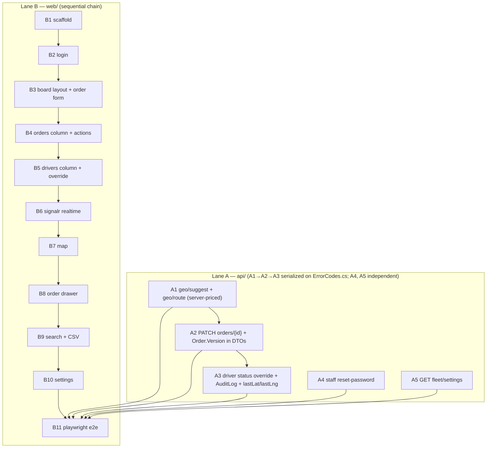

# UC-002 — Dispatcher web app — Work Items

Two parallel lanes. **Lane A (`api/`)** adds 5 small backend endpoints; three of them (A1→A2→A3) are **serialized** because they all append to the shared `ErrorCodes.cs` (F-04), while A4 and A5 stay independent.
**Lane B (`web/`)** is the first frontend code in the repo: a scaffold followed by a strict dependency chain.
Autonomous run — no user gates. This document is the contract parallel developer agents build from.

> **Round-2 revision.** This document was amended to resolve reviewer findings F-01..F-05. Changed areas are tagged inline with the finding id. The 16-WI two-lane structure and all WI ids (A1–A5, B1–B11) are unchanged.

- Source spec: `docs/specs/in-progress/002_UC_002_dispatcher-web.md`
- Authoritative screen/behavior/AC detail: `.claude/state/02-dispatcher-web.md`
- Project context: `.claude/state/00-PROJECT-CONTEXT.md`; decisions: `docs/decisions.md`
- Handoff JSON: `.claude/state/handoff-designer.json`

---

## Assumptions

Resolved where the spec was silent or self-contradictory. These are echoed into `docs/decisions.md` by the doc-gate WI (per DoD #6).

1. **Lane A touches zero shared `Program.cs`.** `Program.cs` (line 155) already calls `AddFeatureConfigurations`, which reflects over every `IFeatureConfiguration` and invokes `AddFeatureDependencies(services, configuration)` on each (verified in `Common/Features/FeatureConfigurationExtensions.cs`). Therefore the geo WI registers its typed `HttpClient` inside `GeoFeatureConfiguration.AddFeatureDependencies` — no composition-root edit. **No Lane A WI edits `Program.cs`.** **(F-04)** Lane A is **not** fully parallel: A1, A2, A3 all append to the shared `Common/ErrorCodes.cs`, so they are serialized `A1 → A2 → A3` via `depends_on` to eliminate the silent lost-update risk of concurrent edits to one file. **A4 and A5 keep `depends_on: []`** — verified neither touches `ErrorCodes.cs` (A4 = `Staff/ResetPassword` + test; A5 = `Fleet` feature + test) — so they run in parallel with the A1→A2→A3 chain.

2. **`geo/suggest` fails soft; `geo/route` fails hard-but-typed.** Per §11 "never block the order form": an upstream outage on suggest must not error per keystroke. `GET /geo/suggest` returns **`200` + empty list** on any upstream failure/timeout (logged `Warning`, `Reason="GeoUpstreamUnavailable"`). `GET /geo/route` returns **`502` with error code `Geo.RouteUnavailable`** on upstream failure (the client renders no price estimate and order creation still proceeds — price is optional). HttpClient timeout 4 s, no retries.

3. **Suggest provider = Photon; route provider = OSRM public.** Nominatim's usage policy caps at 1 req/s absolute — hostile to autocomplete even debounced. Photon (`photon.komoot.io`) is used for suggest. OSRM public (`router.project-osrm.org`) for route (matches context §4). Both base URLs are config keys (`Geo:SuggestBaseUrl`, `Geo:RouteBaseUrl`) so self-hosting later is a config change, not a code change.

4. **Geo suggest has no tenant-isolation test; geo route does (amended for F-03).** `GET /geo/suggest` proxies an external service and touches zero tenant data, so the per-tenant-table DoD does not apply to it. **(F-03)** `GET /geo/route` now loads the caller's fleet default `Tariff` (tenant-filtered) to compute a server-side price estimate, so it **does** read tenant data and therefore carries a tenant-isolation test (`Route_UsesCallersFleetDefaultTariff`). See A1.

5. **`OrderEventType.Updated` is added as a new enum member** (string-stored — no migration, per the `UserRole.System` precedent in CLAUDE.md project facts). PATCH writes one `Updated` event.

6. **PATCH concurrency is client-version-aware, not just EF-token-aware.** The client sends the `version` it loaded in the PATCH body. The endpoint compares it to the tracked `order.Version`; a mismatch returns `409 Order.StaleVersion` **before** attempting the write, and the EF concurrency token is the in-flight backstop. DB-token-only would miss a drawer that has been open for a minute against a since-changed order — which is exactly what "optimistic-concurrency aware" buys. Editing a non-editable status (not New/Assigned) returns `409` with new code `Order.NotEditable`.

6a. **(F-01) `Order.Version` is exposed in the frontend-visible payloads.** `Order.Version` is a real `int` concurrency token but was projected into **no** DTO the frontend sees, so A2's client-version PATCH and B8's "send the loaded version" had no source. A2 adds `Version` to `OrderDetailDto` (`GET /orders/{id}`) — populated in **both** construction sites: `OrderDetailMapper.ToDto` (feeds the 8 transition endpoints) and the inline `new OrderDetailDto(...)` in `GetOrderEndpoint` — and to `OrderChangedDto` (realtime). `OrderSummaryDto` stays lean (list rows carry no version).

6b. **(F-02) `GET /drivers` exposes `lastLat`/`lastLng`.** `Driver.LastLat`/`LastLng` exist on the entity but `DriverSummaryDto` omitted them, leaving B4 distance-sort and B7 initial markers with no REST source. A3 adds `lastLat`/`lastLng` to `DriverSummaryDto` + the `ListDriversEndpoint` projection (additive). `lastPositionAt` was **already** on the DTO (verified). Markers with a null position are simply not placed until the first `DriverPositionChanged` event.

7. **Driver status override supersedes decisions.md assumption #9** ("AuditLog provisioned-but-unwritten until assignment 07"). This UC writes the **first** AuditLog row (`Entity="Driver"`, `Action="StatusOverride"`, `Diff={old,new}`, `ActorUserId`=caller). Stated explicitly here and in the decisions.md update to avoid a contradiction finding.

8. **Override semantics — truthful fallback (principle 7).** The dispatcher may force Free/Busy/Offline regardless of the driver's active order. The override writes only the `Driver` row (+ AuditLog + shift close on Offline) and **never** touches any `Order`. Forcing **Offline** mirrors the sanctioned system path (`StalePositionJob` / `GoOfflineEndpoint`): `Status=Offline`, `CurrentVehicleId=null`, close the open `DriverShift`. A test asserts a Busy driver's active order row is untouched after a forced-Offline. This reconciles with the state-machine invariant ("never set `order.Status` directly") because the override changes `Driver.Status`, not `Order.Status`.

9. **A minimal fleet-settings read endpoint IS added (A5).** Without it the Settings → Fleet tab renders nothing. `GET /fleet/settings` (FleetAdminOnly) returns a combined read-only DTO from `Fleet` + `FleetSettings`. No write endpoint (auto-dispatch/offer-timeout editing is v1.1, toggle rendered disabled). Quick chips remain hardcoded frontend constants (`web/src/features/board/quickChips.ts`).

10. **Pinned frontend versions for Node 20.0.0 (exact).** Verified via `npm view … engines` against the installed `node v20.0.0`:
    - `vite@5.4.x` — engines `^18.0.0 || >=20.0.0` ✓ (Vite 6 also satisfies via `^20.0.0`; 5.4 chosen for lowest risk).
    - `@vitejs/plugin-react@4.3.4` — `>=16.0.0` ✓.
    - `vitest@2.1.9` + `@vitest/coverage-v8@2.1.9` — `>=20.0.0` ✓ (pairs with Vite 5).
    - **`eslint@8.57.1`** (`>=16.0.0` ✓) — **NOT eslint 9**, whose engines `^20.9.0` **fails Node 20.0.0**.
    - **`typescript-eslint@7.18.0`** (`^18.18.0 || >=20.0.0` ✓, flat config supported) — **NOT v8**, whose engines `^20.9.0` **fails Node 20.0.0**.
    - `@testing-library/react@16.x` + `@testing-library/dom@10.x` (peer) + `@testing-library/user-event@14.x` + `@testing-library/jest-dom@6.x`.
    - `styled-components@6.1.x` + `@types/react@18` + `typescript@5.x`.
    - `@microsoft/signalr@8.x`, `@tanstack/react-query@5.x`, `react-router-dom@6.x`, `zustand@4.x`, `i18next@23.x` + `react-i18next@14.x`, `leaflet@1.9.x` + `@types/leaflet`, `react-leaflet@4.x`.
    - `@playwright/test@1.48.x` — **pin to the version the conductor's Chromium prefetch targets**; a mismatch re-downloads browsers mid-run. The scaffold WI adds a root `"engines": { "node": ">=20.0.0" }` and an `.npmrc` with `engine-strict=true` so a wrong pin fails fast rather than silently under `--max-warnings 0`.

11. **AC#7 (cs/en completeness) is mechanized, not hand-audited.** The scaffold WI ships a `locales.parity.test.ts` vitest that asserts `cs.json` and `en.json` have identical key sets; every screen WI keeps it green. AC#7 is a per-screen-WI acceptance line.

12. **AC#8 (Lighthouse a11y ≥ 90) is measured best-effort** in a CI-less env: documented in the E2E WI as a manual `npx lighthouse` run against the board recorded in `DEMO.md`, not a blocking gate (the blocking frontend gates are tsc/eslint/vitest/playwright per decisions.md 2026-09-11).

13. **`docs/api.md` regenerates via the existing full-suite test** (`OpenApi_Document_GeneratesApiMarkdown`), not per-WI. Regeneration is owned by the E2E/gate phase (A5 is the last Lane A WI to add an endpoint; running the full `dotnet test` after A1–A5 land regenerates the doc).

14. **(F-05a) Customer name auto-fill from past orders is DEFERRED to UC-006.** The spec hints a dispatcher could see a name pre-filled from a phone number's prior orders. **No backend lookup exists** (there is no "orders by phone" query endpoint), and this UC does **not** add one — building it would be a new read endpoint + slice out of scope for the dispatcher-web UC. The New order form's Name field stays a plain manual input. Recorded in `docs/decisions.md` by B11.

> **(F-05, override supersession flag retained.)** Assumption 7's override-semantics decision still **supersedes** `docs/decisions.md` assumption #9 (AuditLog provisioned-but-unwritten until UC-07). B11 re-documents this in `decisions.md`. The flag is intentionally kept.

---

## Dependency Graph

---

## Parallel execution plan

**Concurrency.** Lane A (A1–A5) and Lane B (B1–B11) run concurrently. **(F-04)** Within Lane A the WIs are **no longer all parallel**: **A1 → A2 → A3 is a serial chain** (they all append to the shared `Common/ErrorCodes.cs`, so only one edits it at a time — the `depends_on` edge, not a developer "only-append" convention, is what prevents a silent lost update). **A4 and A5 are independent** (`depends_on: []`, touch no shared file) and run in parallel with the A1→A2→A3 chain and with each other. Concretely, the maximum Lane A parallelism is **three tracks**: `{A1 then A2 then A3}`, `{A4}`, `{A5}`. Lane B is a strict chain: each WI depends on the previous one. The two lanes touch **disjoint directory trees** (`api/**` vs `web/**`), so no file conflicts across lanes until B11.

**Why Lane B stays sequential.** Every screen WI edits the same three shared files:
- `web/src/shared/i18n/cs.json` and `web/src/shared/i18n/en.json` — each screen appends its keys; concurrent edits collide and break the parity test.
- `web/src/shared/api/client.ts` (+ typed endpoint modules) — each screen adds its request/response types and calls; concurrent edits collide.

Because these three files are append-touched by nearly every Lane B WI, parallelizing the chain would produce constant merge conflicts and a non-deterministic key set. Sequential is the correct discipline here even though B7/B8/B9/B10 are UI-independent in principle.

**Shared / conflict-prone files.**
- Lane A: `Program.cs` is **NOT** shared — the `AddFeatureDependencies` auto-discovery pattern lets each feature register its own deps. **(F-04)** The genuinely shared file is `Common/ErrorCodes.cs`: **A1** appends `Geo.RouteUnavailable` / `Geo.SuggestQueryTooShort`, **A2** appends `Order.NotEditable` / `Order.StaleVersion`, **A3** appends `Driver.InvalidOverrideStatus`. Because three WIs edit this one file, they are serialized `A1 → A2 → A3` (each appends its block after the previous landed) rather than trusting a parallel append discipline that fails silently. **A2** additionally edits `OrderEventType.cs` (`Updated`), `OrderDetailDto.cs` + `OrderDetailMapper.cs` + `GetOrder/GetOrderEndpoint.cs` + `Realtime/OrderChangedDto.cs` (F-01 `Version` exposure). **A3** additionally edits `ListDrivers/DriverSummaryDto.cs` + `ListDriversEndpoint.cs` (F-02 `lastLat`/`lastLng`). Those DTO/mapper files are owned solely by A2 or A3 respectively (no cross-WI overlap), so the serial chain fully removes Lane A file contention. **A4** (`Staff/ResetPassword/`) and **A5** (`Fleet/`) touch only their own feature folders + test files — zero shared-file edits — hence they stay parallel.
- Lane B: `cs.json` / `en.json` / `api/client.ts` — reason for sequential chain (above).

**Git-staging discipline (autonomous run, no shared index).**
- **Lane A developer stages `api/**` paths ONLY** (`git add api/`). Never stages `web/`.
- **Lane B developer stages `web/**` paths ONLY** (`git add web/`). Never stages `api/`.
- Neither lane commits (developers stage; the conductor commits per DoD #7). The disjoint-path staging rule guarantees a Lane A developer never accidentally stages half-finished Lane B files and vice-versa, which is what makes the two lanes safe to run against one working tree.
- `docs/api.md` is regenerated by the full `dotnet test` run after A1–A5 land; it is staged with the `api/` lane.

---

## Lane A — backend support endpoints (`api/`)

Rule citations apply to every Lane A WI (they are C# FastEndpoints slices):
`rules/api-design.md#endpoint-pattern`, `#configure-structure`, `#send-pattern`, `#routes`, `#authorization`, `#dont-catch-exceptions`;
`rules/architecture.md#vertical-slice-layout`, `#feature-configuration`, `#banned-patterns`;
`rules/error-handling.md#send-for-expected-errors`, `#exceptions-for-infrastructure`;
`rules/csharp-style.md#records-for-dtos`, `#primary-constructors`, `#sealed-internal`, `#timeprovider`, `#xml-documentation`;
`rules/naming.md#endpoints-requests-responses-validators-feature-configs`, `#error-codes`;
`CLAUDE.md#cross-cutting-invariants`, `#project-specific-facts`.

### A1 — Geo proxy: `GET /geo/suggest` + `GET /geo/route`  (lane: api, M)

**Goal.** Two DispatcherOnly server-side proxies: address autocomplete (Photon) and route distance/duration + **server-side price estimate** (OSRM + fleet tariff). Both resilient to upstream failure per Assumption 2. Registered via a new `GeoFeatureConfiguration` that adds a typed `HttpClient` in `AddFeatureDependencies` — no `Program.cs` edit.

**Dependencies.** None. (Root of the F-04 `A1 → A2 → A3` `ErrorCodes.cs` serial chain — A1 lands its `Geo.*` codes first.)

**Files touched.**
- `api/src/Taxi.Api/Features/Geo/GeoFeatureConfiguration.cs` (registers typed `HttpClient`, base URLs from `Geo:SuggestBaseUrl`/`Geo:RouteBaseUrl`).
- `api/src/Taxi.Api/Features/Geo/Suggest/` — `SuggestEndpoint.cs`, `SuggestRequest.cs`, `SuggestResponse.cs` (`record SuggestItem(string Label, double Lat, double Lng)`), `SuggestValidator.cs` (`q` NotEmpty, min length 3).
- `api/src/Taxi.Api/Features/Geo/Route/` — `RouteEndpoint.cs` (**injects `TaxiDbContext`** for the tariff read), `RouteRequest.cs` (`fromLat,fromLng,toLat,toLng`), `RouteResponse.cs` (**F-03**: `record RouteResponse(int DistanceMeters, int DurationSeconds, int? EstimatedPriceCzk)`), `RouteValidator.cs` (coords in range).
- `api/src/Taxi.Api/Common/ErrorCodes.cs` — add `Geo.RouteUnavailable`, `Geo.SuggestQueryTooShort` (additive; A1 edits `ErrorCodes.cs` first in the serial chain).
- `api/src/Taxi.Api/Infrastructure/Geo/` — `IGeoProvider.cs` + `PhotonOsrmGeoProvider.cs` (typed HttpClient client; parses Photon GeoJSON + OSRM route JSON; a fake is injected in tests so no network call).
- `api/tests/Taxi.Api.Tests/Geo/GeoProxyTests.cs`.

**F-03 price estimate.** `RouteEndpoint` loads the caller's fleet **default enabled** `Tariff` via `AsNoTracking()` (the global tenant query filter resolves the fleet automatically — the dispatcher never picks a fleet). `estimatedPriceCzk = max(MinimumFareCzk, BaseFareCzk + PerKmCzk × distanceKm)`, rounded to an integer CZK. When no enabled default tariff exists, `estimatedPriceCzk` is `null` (route still returns distance/duration). This keeps tariff math server-side and Dispatcher-accessible without exposing the FleetAdminOnly tariff data. Chosen over adding a Dispatcher-readable tariff endpoint (see final-message decision note).

**Error paths.** suggest upstream failure/timeout → `200` empty list (log `Warning Reason=GeoUpstreamUnavailable`); route upstream failure/timeout → `AddError(Geo.RouteUnavailable)` + `Send.ErrorsAsync(502, ct)`; no default tariff → `200` with `estimatedPriceCzk = null` (NOT an error); `q` < 3 chars → `400`; non-dispatcher → `403`.

**Tests (red → green).**
- `Suggest_ValidQuery_ReturnsLabelledCoords` (fake provider returns 2 hits).
- `Suggest_UpstreamThrows_Returns200EmptyList` (fake provider throws → empty list, not 5xx).
- `Suggest_NonDispatcher_Returns403`.
- `SuggestValidator_QueryTooShort_FailsWithCode`.
- `Route_ValidCoords_ReturnsDistanceDurationAndServerPrice` (F-03 — asserts `estimatedPriceCzk` matches `max(min, base + perKm×km)`).
- `Route_NoDefaultTariff_ReturnsNullPrice` (F-03 — distance/duration present, price null, still `200`).
- `Route_UsesCallersFleetDefaultTariff` (**tenant isolation, F-03** — fleet B's tariff never prices fleet A's route).
- `Route_UpstreamThrows_Returns502WithCode` (asserts `Geo.RouteUnavailable`).
- Suggest has no tenant-isolation test (Assumption 4 — no tenant data); route does (above).
- **Lands in Playwright spec:** nothing — the AC#1 flow uses quick chips (hardcoded coords) and no dropoff, so it triggers zero geo calls.

**Verification.** `dotnet-test` filter `Taxi.Api.Tests.Geo`.

### A2 — `PATCH /orders/{id}` partial edit + expose `Order.Version` in DTOs  (lane: api, M)

**Goal.** Dispatcher-only partial edit of an order (pickup/dropoff address+coords, scheduledAt, note, passengers), allowed only when status ∈ {New, Assigned}, writing one `Updated` OrderEvent, optimistic-concurrency aware (Assumption 6), publishing `OrderChanged` after commit. **(F-01)** Also exposes `Order.Version` in the detail + realtime payloads so the client can load and echo a version.

**Dependencies.** **A1** (F-04 — A2 appends its `Order.*` codes to `ErrorCodes.cs` after A1's `Geo.*` block; it is the middle of the serial chain).

**Files touched.**
- `api/src/Taxi.Api/Infrastructure/Entities/OrderEventType.cs` — add `Updated` member (string-stored, no migration).
- `api/src/Taxi.Api/Features/Orders/UpdateOrder/` — `UpdateOrderEndpoint.cs`, `UpdateOrderRequest.cs` (nullable partial fields + required `Version int`), `UpdateOrderValidator.cs`.
- **(F-01)** `api/src/Taxi.Api/Features/Orders/Shared/OrderDetailDto.cs` — add `Version` (int) as the **last positional param**, XML-documented.
- **(F-01)** `api/src/Taxi.Api/Features/Orders/Shared/OrderDetailMapper.cs` — pass `order.Version` (this feeds the 8 transition endpoints' `TransitionOrderResponse`).
- **(F-01)** `api/src/Taxi.Api/Features/Orders/GetOrder/GetOrderEndpoint.cs` — the **inline** `new OrderDetailDto(...)` (does not use the mapper) must also pass `order.Version`, or it will not compile.
- **(F-01)** `api/src/Taxi.Api/Realtime/OrderChangedDto.cs` — add `Version` to the record and to `From(order)`.
- `api/src/Taxi.Api/Common/ErrorCodes.cs` — add `Order.NotEditable`, `Order.StaleVersion` (if not already present; reuse existing if so), `Validation.*` as needed (additive).
- `api/tests/Taxi.Api.Tests/Orders/Update/OrderUpdateTests.cs`.

> **`OrderSummaryDto` intentionally stays lean** — list rows do not carry `Version`; only the detail (`GET /orders/{id}`) and realtime (`OrderChanged`) payloads do. The 8 transition endpoints (`Accept/Assign/Arrive/Complete/Start/Decline/Cancel/Reassign`) route through `OrderDetailMapper.ToDto`, so editing the mapper fixes all 8 in one place; `GetOrderEndpoint` is the one extra inline site.

**Concurrency detail.** On a successful edit the endpoint increments `order.Version` before `SaveChangesAsync` — EF does NOT auto-increment the concurrency token (CLAUDE.md project fact); without the increment a second stale drawer would still pass the `req.Version == order.Version` check.

**Error paths.** order not found / cross-tenant → no-leak `404`; status not New/Assigned → `AddError(Order.NotEditable)` + `409`; `req.Version != order.Version` → `AddError(Order.StaleVersion)` + `409` before writing; concurrent EF token conflict on save → `409` (backstop); non-dispatcher → `403`; validation (e.g. dropoff coords required when dropoff address set) → `400`.

**Tests (red → green).**
- `GetOrder_ReturnsCurrentVersion` (**F-01** — asserts `OrderDetailDto.Version` equals the order's `Version`).
- `Update_NewOrder_ChangesFieldsAndWritesUpdatedEvent` (asserts one `Updated` OrderEvent + `OrderChanged` published).
- `Update_StaleClientVersion_Returns409` (client sends old `Version`).
- `Update_InProgressOrder_Returns409NotEditable`.
- `Update_CrossTenantOrder_Returns404` (tenant isolation).
- `Update_NonDispatcher_Returns403`.
- `UpdateOrderValidator_DropoffAddressWithoutCoords_FailsWithCode`.
- **Lands in Playwright spec:** exercised by B8 drawer edit; the drawer edit path is asserted in the E2E spec as an optional secondary assertion (not part of the ≤6-interaction AC#1 flow).

**Verification.** `dotnet-test` filter `Taxi.Api.Tests.Orders.Update` (`GetOrder_ReturnsCurrentVersion` lives in `OrderUpdateTests.cs`, namespace `Taxi.Api.Tests.Orders.Update`, so the filter catches it).

### A3 — Driver status override + first AuditLog write + expose `lastLat`/`lastLng`  (lane: api, S)

**Goal.** `POST /drivers/{id}/status` DispatcherOnly manual override (Free/Busy/Offline) for phone-only drivers. Writes the first AuditLog row, publishes `DriverStatusChanged`, never touches any Order (Assumptions 7, 8). Forced Offline mirrors `StalePositionJob` (Status=Offline, CurrentVehicleId=null, close open DriverShift). **(F-02)** Also extends `GET /drivers` with `lastLat`/`lastLng`.

**Dependencies.** **A2** (F-04 — A3 appends its `Driver.InvalidOverrideStatus` code to `ErrorCodes.cs` last in the serial chain).

**Files touched.**
- `api/src/Taxi.Api/Features/Drivers/OverrideStatus/` — `OverrideStatusEndpoint.cs`, `OverrideStatusRequest.cs` (`DriverStatus Status`), `OverrideStatusValidator.cs` (status must be Free/Busy/Offline — reject EnRoute).
- **(F-02)** `api/src/Taxi.Api/Features/Drivers/ListDrivers/DriverSummaryDto.cs` — add `LastLat` (double?) + `LastLng` (double?), XML-documented; `LastPositionAt` is already present (verified — unchanged).
- **(F-02)** `api/src/Taxi.Api/Features/Drivers/ListDrivers/ListDriversEndpoint.cs` — carry `d.LastLat`/`d.LastLng` through the existing join projection into the new DTO params.
- `api/src/Taxi.Api/Common/ErrorCodes.cs` — add `Driver.InvalidOverrideStatus` (additive).
- `api/tests/Taxi.Api.Tests/Drivers/OverrideStatusTests.cs`.

**Semantics.** Resolve driver in tenant (query filter) → no-leak `404` if absent. Map spec's "Busy" → `DriverStatus.Busy`, "Volný/Free" → `Free`, "Offline" → `Offline`. On Offline: `Status=Offline`, `CurrentVehicleId=null`, close open `DriverShift.EndedAt=now`. Write `AuditLog { Entity="Driver", Action="StatusOverride", EntityId=driverId, ActorUserId=caller.sub, Diff=jsonb{old,new}, At=now, FleetId }`. Save in one transaction. Publish `DriverStatusChangedAsync(driverId, fleetId, newStatus, ct)`. Never load or mutate an Order.

**Error paths.** driver not found / cross-tenant → `404`; status EnRoute or invalid → `400 Driver.InvalidOverrideStatus`; non-dispatcher → `403`.

**Tests (red → green).**
- `ListDrivers_ProjectsLastLatLng` (**F-02** — a driver with a known `LastLat`/`LastLng` surfaces them in `DriverSummaryDto`).
- `Override_ToBusy_SetsStatusAndWritesAuditLog` (AC#5 — asserts exactly one AuditLog row with `Action="StatusOverride"` + actor).
- `Override_BusyDriverToOffline_ClosesShiftAndLeavesActiveOrderUntouched` (loads the driver's active order before + after; asserts order row unchanged; asserts shift closed + CurrentVehicleId null).
- `Override_PublishesDriverStatusChanged` (recording publisher fake).
- `Override_CrossTenantDriver_Returns404` (tenant isolation).
- `Override_InvalidStatus_Returns400`.
- **Lands in Playwright spec:** B5 drivers-column override interaction is asserted in the E2E spec (override → status pill changes) as a secondary assertion; AC#5's AuditLog row is proven here in C#.

**Verification.** `dotnet-test` filter `Taxi.Api.Tests.Drivers` (broadened from `.OverrideStatus` so the F-02 `ListDrivers_ProjectsLastLatLng` test is covered by the single filter).

### A4 — `POST /staff/{id}/reset-password`  (lane: api, S)

**Goal.** FleetAdminOnly password reset that returns a new temporary plaintext password exactly once, mirroring the `CreateStaffEndpoint` invite pattern (never logs the plaintext).

**Dependencies.** None.

**Files touched.**
- `api/src/Taxi.Api/Features/Staff/ResetPassword/` — `ResetPasswordEndpoint.cs`, `ResetPasswordResponse.cs` (`record ResetPasswordResponse(string TemporaryPassword)`). No request body (id from route). No validator needed (pure id lookup, per `rules/validation.md#when-to-add-a-validator`).
- `api/tests/Taxi.Api.Tests/Staff/ResetPasswordTests.cs`.

**Semantics.** Resolve target staff user in tenant → no-leak `404`. Generate temp password with the same charset/length as `CreateStaffEndpoint` (`RandomNumberGenerator.GetString`, 16 chars, unambiguous charset), `BCrypt.HashPassword(workFactor:11)`, set `user.PasswordHash`, save, return `201`/`200` with plaintext once. Log at most a masked marker per `rules/logging.md#what-must-not-appear-in-logs`.

**Error paths.** user not found / cross-tenant → `404`; non-FleetAdmin → `403`.

**Tests (red → green).**
- `ResetPassword_ReturnsNewTempPasswordOnce_AndUpdatesHash` (asserts response carries plaintext; asserts new hash verifies against it; asserts plaintext absent from captured logs).
- `ResetPassword_CrossTenantUser_Returns404` (tenant isolation).
- `ResetPassword_NonFleetAdmin_Returns403`.
- **Lands in Playwright spec:** B10 settings → Lidé → reset password interaction asserted as a secondary E2E assertion.

**Verification.** `dotnet-test` filter `Taxi.Api.Tests.Staff.ResetPassword`.

### A5 — `GET /fleet/settings`  (lane: api, S)

**Goal.** FleetAdminOnly read-only combined DTO of `Fleet` + `FleetSettings` so the Settings → Fleet tab can render (name, phone, offer timeout, auto-dispatch flag). No write endpoint (v1.1).

**Dependencies.** None.

**Files touched.**
- `api/src/Taxi.Api/Features/Fleet/FleetFeatureConfiguration.cs` (new feature slice).
- `api/src/Taxi.Api/Features/Fleet/GetFleetSettings/` — `GetFleetSettingsEndpoint.cs`, `GetFleetSettingsResponse.cs` (`record` with fleet name/phone + `OfferTimeoutSeconds`, `AutoDispatchEnabled`).
- `api/tests/Taxi.Api.Tests/Fleet/FleetSettingsTests.cs`.

**Semantics.** `AsNoTracking()` projection joining `Fleet` (by current tenant) + `FleetSettings` (PK = FleetId). Returns `404` only if no fleet resolved (shouldn't happen for an authenticated FleetAdmin). This is the last Lane A WI to add an endpoint; run the full suite after it lands to regenerate `docs/api.md`.

**Error paths.** non-FleetAdmin → `403`.

**Tests (red → green).**
- `GetFleetSettings_FleetAdmin_ReturnsCombinedDto`.
- `GetFleetSettings_FleetAdminOfFleetB_SeesOnlyFleetBSettings` (tenant isolation).
- `GetFleetSettings_NonFleetAdmin_Returns403`.

**Verification.** `dotnet-test` filter `Taxi.Api.Tests.Fleet`.

---

## Lane B — dispatcher web app (`web/`)

No `.claude/rules` exist for TS. Every Lane B WI cites: the spec NFR conventions (§Non-functional requirements — TS strict, functional components + hooks, one component per file, colocated `web/src/features/<feature>`, shared in `web/src/shared`, styled-components typed theme, no `any`, named exports); `00-PROJECT-CONTEXT.md#5` (repo layout) and `#11` (UX rules); `docs/decisions.md` (2026-09-11 styled-components + quality gate); and the authoritative screen detail in `.claude/state/02-dispatcher-web.md`.

**UI test convention (all Lane B WIs):** vitest for **logic** (validation, price calc, section bucketing, CSV export, reconnect backoff, locale parity) and `@testing-library/react` **interaction** tests where valuable. **No UI snapshot tests.** The final Playwright spec (B11) owns the AC#1 create+assign flow and the AC#2 realtime assertion.

### B1 — Scaffold  (lane: web, L, needs_library_research: true)

**Goal.** Stand up `web/` — Vite + TS strict + eslint flat config (`--max-warnings 0`) + vitest + styled-components typed theme + router `/x/*` group + TanStack Query + api client (fetch wrapper, JWT storage, `X-Fleet-Slug` header, 401→login redirect) + i18next cs/en skeleton + npm scripts. Pins exact Node-20.0.0-safe versions (Assumption 10).

**Dependencies.** None (first Lane B WI).

**Files touched.**
- `web/package.json` (pinned versions + `engines.node >=20.0.0`), `web/.npmrc` (`engine-strict=true`), `web/tsconfig.json` (strict), `web/vite.config.ts`, `web/eslint.config.js` (flat, typescript-eslint 7.18), `web/vitest.config.ts`, `web/index.html`, `web/src/main.tsx`.
- `web/src/app/` — `router.tsx` (`/x/*` group), `providers.tsx` (QueryClientProvider + ThemeProvider + I18nextProvider), `AppLayout.tsx`.
- `web/src/shared/api/client.ts` (fetch wrapper: base URL from `import.meta.env`, `Authorization: Bearer`, `X-Fleet-Slug`, 401→redirect), `web/src/shared/api/auth-storage.ts` (localStorage JWT + fleet slug), `web/src/shared/theme/theme.ts` + `theme.d.ts` (typed styled-components `DefaultTheme`), `web/src/shared/i18n/index.ts`, `web/src/shared/i18n/cs.json`, `web/src/shared/i18n/en.json`.
- Tests: `web/src/shared/i18n/locales.parity.test.ts`, `web/src/shared/api/client.test.ts` (401→redirect logic).

**Acceptance criteria.**
- `npm install` succeeds on Node 20.0.0 with **no EBADENGINE**; `npm run tsc` (`tsc --noEmit`), `npm run lint` (`eslint --max-warnings 0`), `npm run test` (`vitest run`) all pass on the empty scaffold.
- Scripts exist: `dev`, `build`, `lint`, `tsc`, `test`, `e2e` (placeholder failing until B11).
- `client.test.ts` red→green: a `401` response clears storage and triggers redirect to `/x/login`.
- `locales.parity.test.ts` red→green: cs.json and en.json key sets are identical (seeded with a handful of shared keys).
- styled-components `ThemeProvider` wraps the app; `theme.d.ts` types `DefaultTheme` (no `any`).

**Verification.** `vitest` (runs `client.test.ts` + `locales.parity.test.ts`, the WI's named red-green tests; `tsc --noEmit` and `eslint --max-warnings 0` also run at the blocking phase-5 gate per decisions.md).

### B2 — Login `/x/login`  (lane: web, S)

**Goal.** Login screen: fleet slug (prefilled from subdomain, remembered in localStorage), email, password; Czech errors; on success stores tokens and redirects to `/x`.

**Dependencies.** B1.

**Files touched.** `web/src/features/auth/LoginPage.tsx`, `web/src/features/auth/useLogin.ts` (TanStack mutation → `POST /auth/staff/login`), `web/src/features/auth/loginSchema.ts`; append keys to `cs.json`/`en.json`; append auth types/calls to `api/client.ts`.

**Acceptance criteria.**
- Successful login stores accessToken/refreshToken + fleet slug, redirects to `/x`.
- Wrong credentials render a Czech error sentence (no JSON/stack) — §11.
- Fleet slug prefilled from subdomain, falls back to remembered localStorage value.
- **AC#7:** all new strings in cs.json + en.json (parity test green).

**Tests.** vitest: `loginSchema` validation (empty email/password → Czech messages); `@testing-library` interaction: submit with bad creds shows the Czech error. **Playwright (B11):** the fresh-login step of AC#1.

**Verification.** `vitest` (runs this WI's named red-green tests incl. the locale-parity test; tsc/eslint run at the blocking phase-5 gate).

### B3 — Board layout + order form  (lane: web, L)

**Goal.** `/x` three-column shell + the left-column New order form: fields in tab order (Phone → Name → Pickup → Dropoff → When → Passengers → Note), F2 focus, Enter submits from any field, quick chips (hardcoded coords), Photon autocomplete via `GET /geo/suggest`, **live price preview from the server-priced `GET /geo/route`** (F-03 — renders `estimatedPriceCzk` directly; **no client-side tariff math**), clears + refocuses Phone on submit.

**Dependencies.** B2.

**Files touched.** `web/src/features/board/BoardPage.tsx` (3-col grid, desktop ≥1280, no h-scroll), `web/src/features/board/OrderForm.tsx`, `web/src/features/board/useCreateOrder.ts` (`POST /orders`), `web/src/features/board/quickChips.ts` (hardcoded station/hospital coords), `web/src/features/board/useAddressSuggest.ts` (debounced `GET /geo/suggest`), `web/src/features/board/useRouteEstimate.ts` (**F-03** — calls `GET /geo/route`, exposes `estimatedPriceCzk`; the former pure `priceEstimate.ts` client-side calc is **removed** — the server owns pricing now), `web/src/features/board/useRouteEstimate.test.ts`; append cs/en keys; append order + geo types to api client.

**Acceptance criteria.**
- Form field order and tab-stops exactly per §Board; F2 focuses Phone from anywhere; Enter submits from any field.
- Quick chip click fills pickup with coordinates (no geo call).
- **(F-03)** Price preview shows the server's `estimatedPriceCzk` when a route is computable; it is absent (not an error) when `geo/route` returns 502 **or** when `estimatedPriceCzk` is null (no fleet default tariff).
- On submit: form clears, focus returns to Phone.
- Board renders at 1280×720 with no horizontal scroll (AC#6).
- **AC#7** parity green.

**Tests.** vitest: `useRouteEstimate.test.ts` (renders `estimatedPriceCzk` when present; renders nothing on a 502 and on a null price); `quickChips` fill logic; debounce logic for suggest. `@testing-library`: Enter-submits, F2-focus, clear-and-refocus. **Playwright (B11):** create order via quick chip + ASAP in ≤6 interactions (AC#1).

**Verification.** `vitest` (runs this WI's named red-green tests incl. the locale-parity test; tsc/eslint run at the blocking phase-5 gate).

### B4 — Orders column + card actions  (lane: web, L)

**Goal.** Middle column: sections (Nové / Přiřazené / Probíhající / Naplánované / Dokončené dnes collapsed), order cards with all fields per §Board, 2-min red elapsed timer for New orders, card actions Assign (inline driver picker sorted by distance, free first) / Reassign / Cancel (reason from list + optional text) / Detail. Optimistic update on own actions.

**Dependencies.** B3.

**Files touched.** `web/src/features/board/OrdersColumn.tsx`, `OrderCard.tsx`, `sectionBucketing.ts` (pure: order → section), `elapsedTimer.ts` (pure: created→now, red after 120 s), `useNewOrderHighlight.ts` + `useNewOrderHighlight.test.ts` (**F-05b** — pure/hook: a card new since the last render highlights for ~3 s then clears), `driverDistanceSort.ts` + `driverDistanceSort.test.ts` (**F-02** — pure comparator: haversine from driver `lastLat`/`lastLng` to pickup, free-first, null-position last), `useAssignOrder.ts` / `useReassignOrder.ts` / `useCancelOrder.ts`, `cancelReasons.ts`, `DriverPicker.tsx` (distance sort via `GET /drivers`, consuming `lastLat`/`lastLng` from A3/F-02); append cs/en keys; append transition calls to api client.

**Acceptance criteria.**
- Cards bucket into the correct sections; Dokončené dnes collapsed by default.
- New-order elapsed timer turns red after 2 min.
- **(F-05b)** A newly-arrived order card (new since the last render, e.g. an App-source `OrderChanged`) shows a brief highlight for ~3 s, then settles to normal styling.
- Assign opens inline picker (never a modal that blocks the form — §11); free drivers first, sorted by distance to pickup — the comparator uses each driver's `lastLat`/`lastLng` from `GET /drivers` (A3, F-02) vs the order pickup coords; **drivers with a null position sort last**.
- Cancel requires a reason from the list (AC#4 — reason later shown in timeline via B8).
- 409 on an action shows "Objednávku mezitím změnil někdo jiný" and refreshes the card (behavior rules).
- **AC#7** parity green.

**Tests.** vitest: `sectionBucketing` (every status → right section), `elapsedTimer` (boundary at 120 s), `driverDistanceSort` comparator (free-first, distance order, **null-position last**), `useNewOrderHighlight` (highlight present then cleared after ~3 s via fake timers), cancel-requires-reason guard. `@testing-library`: assign flow opens inline picker; cancel without reason is blocked. **Playwright (B11):** assign to a free driver (AC#1 second half).

**Verification.** `vitest` (runs this WI's named red-green tests incl. the locale-parity test; tsc/eslint run at the blocking phase-5 gate).

### B5 — Drivers column + manual override  (lane: web, M)

**Goal.** Right column: one row per driver (name, plate, status pill Volný/Na cestě/Obsazen/Offline, position age "před 12 s", current order code), "Nastavit stav" override (Free/Busy/Offline) via `POST /drivers/{id}/status` (A3), click driver → map centers (wired in B7).

**Dependencies.** B4 (Lane A A3 provides the override endpoint; the E2E dependency is captured at B11).

**Files touched.** `web/src/features/board/DriversColumn.tsx`, `DriverRow.tsx`, `positionAge.ts` (pure: lastPositionAt→"před N s/min"), `statusPill.ts` (status→Czech label + color), `useOverrideStatus.ts`; append cs/en keys; append driver-status call to api client.

**Acceptance criteria.**
- Driver rows render status pill in Czech with correct color; position age formatted in Czech.
- "Nastavit stav" sets Free/Busy/Offline via A3; pill updates optimistically.
- **AC#7** parity green.

**Tests.** vitest: `positionAge` formatting (seconds/minutes boundaries, Czech), `statusPill` mapping (DriverStatus→label+color). `@testing-library`: override click issues the request with the chosen status. **Playwright (B11):** override interaction asserted as secondary (status pill changes).

**Verification.** `vitest` (runs this WI's named red-green tests incl. the locale-parity test; tsc/eslint run at the blocking phase-5 gate).

### B6 — SignalR realtime  (lane: web, L, needs_library_research: true)

**Goal.** `@microsoft/signalr` client on `/hubs/fleet` (JWT via `access_token` query string), subscribe OrderChanged / DriverStatusChanged / DriverPositionChanged; optimistic + 409 reconcile; disconnect yellow banner "Offline – zobrazuji poslední známý stav" + backoff reconnect + refetch on reconnect; notification sound on new App order / driver decline+timeout + persisted mute toggle.

**Dependencies.** B5.

**Files touched.** `web/src/shared/realtime/hubClient.ts` (connection + JWT query string + reconnect policy), `web/src/shared/realtime/useFleetHub.ts` (wires events to TanStack Query cache), `web/src/shared/realtime/reconnectBackoff.ts` (pure), `web/src/features/board/DisconnectBanner.tsx`, `web/src/shared/sound/useNotificationSound.ts` (+ mute toggle in header, persisted); append cs/en keys.

**Acceptance criteria.**
- OrderChanged moves a card between sections without reload (AC#2 mechanism); DriverStatusChanged updates pills; DriverPositionChanged feeds the map (B7).
- Disconnect shows the yellow Czech banner and disables server-requiring actions; reconnect refetches lists.
- Notification sound on new App order + on driver decline/timeout; mute toggle persists across reloads.
- **AC#7** parity green.

**Tests.** vitest: `reconnectBackoff` (exponential schedule, capped); event→cache reducer (OrderChanged updates the cached order; 409 reconcile refetches); mute-toggle persistence. **Playwright (B11):** AC#2 — seeded driver accepts via API → card moves to Probíhající within 1 s.

**Verification.** `vitest` (runs this WI's named red-green tests incl. the locale-parity test; tsc/eslint run at the blocking phase-5 gate).

### B7 — Map  (lane: web, M)

**Goal.** Leaflet + OSM. Driver markers (heading arrow, status colors, 1 s redraw throttle), pickup pins for New/Assigned orders, pin↔card highlight, toggle to replace middle column or 4th panel ≥1600.

**Dependencies.** B6 (consumes DriverPositionChanged).

**Files touched.** `web/src/features/board/MapPanel.tsx`, `driverMarker.ts` (heading/status→icon; tolerates a null heading), `markerThrottle.ts` (pure: 1 s coalesce), `useMapHighlight.ts` (pin↔card), `web/src/shared/map/leafletSetup.ts`; append cs/en keys.

**Acceptance criteria.**
- **(F-02)** Initial driver markers render from the `GET /drivers` `lastLat`/`lastLng` (A3); a driver with a null position is **not placed** until its first `DriverPositionChanged` event, and a marker with a **null heading renders a neutral (non-directional) icon** until a position event supplies one. Live updates thereafter come from `DriverPositionChanged` (B6). Markers render with status color; redraw throttled to 1 s.
- Pickup pins for New/Assigned; clicking a pin highlights the card and vice-versa.
- Panel toggles (replace middle col) and becomes a 4th panel at ≥1600.
- **AC#7** parity green.

**Tests.** vitest: `markerThrottle` (≥1 update/s coalesced), `driverMarker` icon selection by status/heading **incl. the null-heading neutral icon** (F-02), highlight mapping. **Playwright (B11):** AC#3 (driver position update moves the marker) — best-effort assertion via API-driven position push.

**Verification.** `vitest` (runs this WI's named red-green tests incl. the locale-parity test; tsc/eslint run at the blocking phase-5 gate).

### B8 — Order drawer `/x/orders/:id`  (lane: web, M)

**Goal.** Right-side drawer (not a page). Editable fields in New/Assigned via `PATCH /orders/{id}` (A2, sends the `version` loaded from `GET /orders/{id}` — exposed by A2 per F-01). Czech event timeline (all 13 `OrderEventType` values including `Updated`) with actor. Transition buttons from `allowedActions`.

**Dependencies.** B7 (Lane A A2 provides PATCH **and** the `Version` field on `OrderDetailDto`; E2E dependency at B11).

**Files touched.** `web/src/features/orders/OrderDrawer.tsx`, `useUpdateOrder.ts` (PATCH with the loaded `version`), `eventTimeline.ts` (OrderEventType→Czech label — **all 13 members**), `EventTimeline.tsx`, `transitionButtons.ts` (allowedActions→buttons); append cs/en keys; append events call to api client.

**Acceptance criteria.**
- Fields editable only in New/Assigned; PATCH sends the `version` read from the order detail (**F-01** — `OrderDetailDto.Version`); a 409 shows the concurrency message and refetches.
- Timeline renders every `OrderEventType` (incl. `Updated`) in Czech with actor — **all 13 event-type keys present in cs/en** (an easy AC#7 miss).
- Transition buttons reflect `allowedActions`.
- **AC#7** parity green.

**Tests.** vitest: `eventTimeline` maps all 13 event types (a test iterating the enum values catches a missing key), `transitionButtons` from allowedActions, edit-disabled outside New/Assigned. **Playwright (B11):** drawer edit asserted as secondary.

**Verification.** `vitest` (runs this WI's named red-green tests incl. the locale-parity test; tsc/eslint run at the blocking phase-5 gate).

### B9 — Search `/x/orders` + CSV export  (lane: web, M)

**Goal.** Filterable table (date range, status, driver, free text code/phone/name), today default, row→drawer, client-side CSV export of the current filter.

**Dependencies.** B8.

**Files touched.** `web/src/features/orders/SearchPage.tsx`, `useOrderSearch.ts` (`GET /orders` with filters), `orderFilters.ts` (pure: state→query params), `csvExport.ts` (pure: rows→CSV string), `SearchFilters.tsx`; append cs/en keys.

**Acceptance criteria.**
- Default filter = today; filters compose into the `GET /orders` query.
- Row click opens the drawer (B8).
- CSV export produces a correct client-side file of the current filtered rows.
- **AC#7** parity green.

**Tests.** vitest: `csvExport` (escaping, header row, empty set), `orderFilters` (state→params incl. status[] and date range). **Playwright (B11):** not required (out of the AC#1/AC#2 core flow).

**Verification.** `vitest` (runs this WI's named red-green tests incl. the locale-parity test; tsc/eslint run at the blocking phase-5 gate).

### B10 — Settings `/x/settings`  (lane: web, M)

**Goal.** FleetAdmin-only tabs: Vozidla (CRUD via existing vehicles endpoints), Lidé (staff CRUD + reset password via A4), Fleet (read-only display via A5; auto-dispatch toggle rendered disabled with "v1.1" hint).

**Dependencies.** B9 (Lane A A4 + A5; E2E dependency at B11).

**Files touched.** `web/src/features/settings/SettingsPage.tsx`, `VehiclesTab.tsx`, `PeopleTab.tsx` (incl. reset-password action + one-time-password display), `FleetTab.tsx` (read-only, disabled toggle), `useVehicles*.ts`, `useStaff*.ts`, `useResetPassword.ts`, `useFleetSettings.ts`; append cs/en keys; append vehicles/staff/fleet calls to api client.

**Acceptance criteria.**
- Vozidla CRUD works against existing vehicle endpoints; Lidé CRUD + reset-password (A4) shows the one-time temp password once.
- Fleet tab renders name/phone/offer-timeout/auto-dispatch from A5 read-only; auto-dispatch toggle disabled with a "v1.1" hint.
- Route guard: non-FleetAdmin cannot reach `/x/settings`.
- **AC#7** parity green.

**Tests.** vitest: reset-password one-time-display logic, route-guard logic, fleet-settings read mapping. `@testing-library`: reset-password reveals plaintext once. **Playwright (B11):** reset-password + fleet-read asserted as secondary.

**Verification.** `vitest` (runs this WI's named red-green tests incl. the locale-parity test; tsc/eslint run at the blocking phase-5 gate).

### B11 — Playwright E2E + harness  (lane: web, L, needs_library_research: true)

**Goal.** The AC#1 create+assign flow + AC#2 realtime assertion against the **real API + Postgres + seed**. Defines the harness concretely.

**Dependencies.** B10 **and all of A1–A5** (see rationale below).

**Files touched.** `web/playwright.config.ts` (webServer array + globalSetup), `web/e2e/global-setup.ts` (compose up db → `dotnet run --environment Development` with `Seed:Enabled=true` → wait `/health/ready`), `web/e2e/create-assign.spec.ts` (AC#1), `web/e2e/realtime.spec.ts` (AC#2), `web/e2e/helpers/apiDriver.ts` (log in as `driver1@demo.local` via API, go online, accept order); `DEMO.md` (Lighthouse manual method for AC#8).

**Why depend on all 5 Lane A WIs (not just functionally-needed ones).** The AC#1 scripted flow makes **zero geo calls** (quick chip fills coords, dropoff empty → no `geo/route`), so functionally it needs none of A1–A5. **But the harness boots the API from the shared working tree** via `dotnet run`. If any Lane A WI is mid-implementation, the tree does not compile and `dotnet run` fails. So B11 must wait for A1–A5 to land — a build-integrity dependency, not a functional one. This is stated so the conductor topo-sorts B11 after both lanes complete.

**Harness (concrete).** Playwright `webServer` (array): (1) `docker compose -f infra/docker-compose.dev.yml up db` then `dotnet run --project api/src/Taxi.Api --environment Development` with env `Seed__Enabled=true` and `ConnectionStrings__Db` pointing at the compose Postgres; wait on `http://localhost:xxxx/health/ready`. (2) Vite `preview`/`dev` at `http://localhost:5173` (matches the API CORS default `Cors:WebOrigin`). Pin `@playwright/test` to the conductor's prefetched Chromium version to avoid a mid-run browser download.

**AC#2 driver-accept.** The helper logs in as `driver1@demo.local` / `Demo1234!` via API. Seeded drivers start **Offline** — the helper first `POST /drivers/me/online { vehicleId }`, then (after the dispatcher assigns) `POST /orders/{id}/accept`. The board must move the card to "Probíhající" within 1 s via the SignalR OrderChanged event (B6).

**Acceptance criteria.**
- `npm run e2e` (Playwright) boots the harness and passes.
- `create-assign.spec.ts`: fresh login → create order via quick chip + ASAP in ≤6 UI interactions → assign to a free driver; scripted time (excl. network) < 20 s (AC#1).
- `realtime.spec.ts`: after the API-driven driver accept, the card moves to Probíhající without reload within 1 s (AC#2).
- Secondary assertions where cheap: override pill change (A3), drawer edit via PATCH with loaded version (A2/F-01), reset-password reveal (A4), fleet-read render (A5), map marker move (AC#3).
- `docs/decisions.md` gains the UC-002 assumptions 1–14 (DoD #6), explicitly including: **the assumption-9 supersession** (AuditLog is now written by A3's driver-status override — the override-semantics-vs-assumption-#9 flag is intentionally retained), and **assumption 14 (F-05a)** — customer name auto-fill from past orders is **deferred to UC-006** (no backend lookup exists; none added here). `docs/api.md` is regenerated by the full `dotnet test` after A1–A5 land.
- `DEMO.md` documents the manual `npx lighthouse` a11y run on the board (AC#8, best-effort, non-blocking).

**Tests.** This WI *is* the Playwright suite. It also runs `dotnet test` for `docs/api.md` regeneration after A1–A5.

**Verification.** `playwright`.
