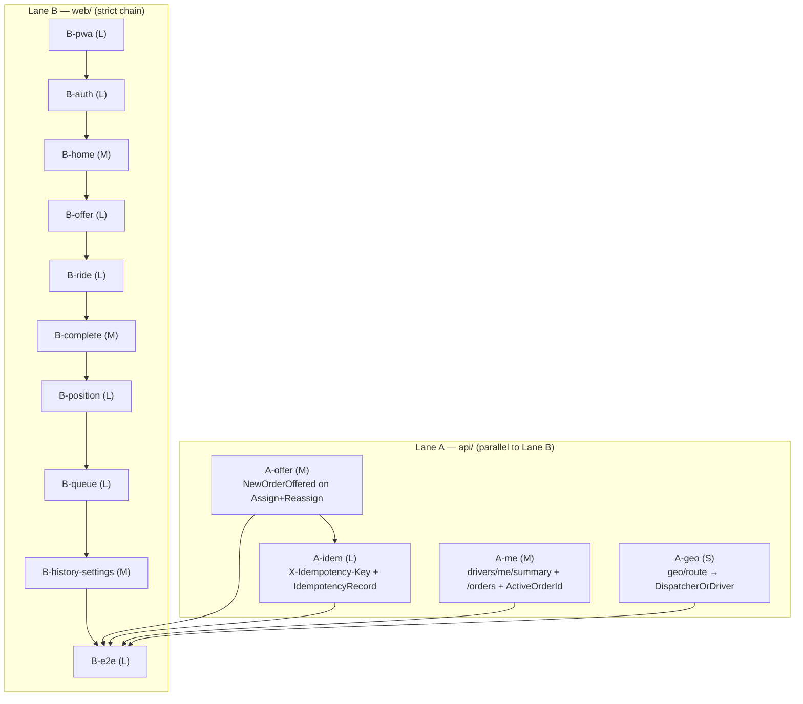

# UC-003 — Driver PWA — Work Items

Two lanes. **Lane A (api/)** — 4 backend WIs. **Lane B (web/)** — 10 frontend WIs.
Autonomous run: this document is the sole contract. Every open question is resolved in `## Assumptions`.

Sources of truth: `docs/specs/in-progress/003_UC_003_driver-pwa.md`, `.claude/state/03-driver-pwa.md` (authoritative screens/behavior/ACs — do not restate), `.claude/state/00-PROJECT-CONTEXT.md` (§8 state machine, §10 SignalR, §11 UX), `docs/decisions.md`, `docs/api.md`, CLAUDE.md project facts.

---

## Assumptions

Every judgment the spec left open, decided and recorded here (autonomous mode overrides the interview step).

1. **Offer expiry consistency (A-offer).** Both `OrderStateMachine.ApplyAssign` and `ApplyReassign` set `order.AssignedAt = now` (verified: `OrderStateMachine.cs` lines 130 and 226). `OfferTimeoutJob` expires an order from `AssignedAt + OfferTimeoutSeconds`. Therefore A-offer computes `expiresAt = order.AssignedAt.Value.AddSeconds(timeout)` — the identical value the job reads — so the countdown ring the driver sees and the server-side timeout are exactly the same instant, on both Assign and Reassign (reassign refreshes the window; no early-timeout bug). Do **not** use a fresh `GetUtcNow()` for `expiresAt`.
2. **Offer timeout source (A-offer).** Per-fleet `OfferTimeoutSeconds` loaded with the exact `(int?)`-cast + `?? 45` fallback pattern from `OfferTimeoutJob` (CLAUDE.md documents why the `(int?)` cast is mandatory — without it a fleet with no `FleetSettings` row silently gets a 0-second timeout). Default 45 when no settings row.
3. **Publish gate (A-offer).** `TransitionAsync` publishes `NewOrderOffered` only when `transition is Assign or Reassign` **and** `order.DriverId is not null`, after commit, after `OrderChangedAsync`. The stale `IRealtimePublisher.NewOrderOfferedAsync` XML comment ("OrderService does NOT call this…") is corrected in A-offer, or the developer will trust the comment over the WI.
4. **Idempotency hook = endpoint-level helper, not a FastEndpoints pre/post-processor (A-idem).** Zero processor precedent exists in the codebase (verified). A post-processor cannot cleanly capture the already-serialized response body; the endpoints hold the response DTO as an object, so a helper in `Common/Idempotency/` serializes it to jsonb before `Send`. Six call sites (accept/decline/arrive/start/complete/cancel) is acceptable and explicit.
5. **`IdempotencyRecord` is NOT `ITenantEntity` (A-idem).** It is UserId-scoped, mirroring the `RefreshToken`/`SmsCode` precedent (decisions.md assumption 4). This avoids the `SaveChanges` tenant guard and needs no global query filter.
6. **Idempotency claim-then-execute — all four branches (A-idem):**
   (a) Unique-index `INSERT` of the claim row committed **before** executing the transition = the lock.
   (b) Duplicate key with a stored response present → replay stored `ResponseStatus` + `ResponseBody` verbatim, no re-execution.
   (c) Duplicate key, response still NULL, claim younger than 60 s → in-flight → `409 Idempotency.InFlight` (retryable; the offline queue retries).
   (d) Duplicate key, response still NULL, claim **older than 60 s** (a crash between claim and store) → take over: re-execute and overwrite. Without branch (d) one crashed request permanently bricks a queued transition and AC #5 fails in the field.
7. **Idempotency request-hash mismatch (A-idem).** Same `(UserId, Key)` with a different `RequestHash` (SHA-256 of method+path+body) → `409 Idempotency.KeyReused` (distinct code). Store only 2xx and expected terminal 4xx/409 responses; **never** store 5xx (infra failure must be retryable).
8. **Idempotency purge (A-idem).** Opportunistic `DELETE WHERE CreatedAt < now − 24h` executed on the claim path (bounded, cheap, no new job). 24 h window per spec.
9. **`X-Idempotency-Key` is optional (A-idem).** Missing header → normal execution, no record written. Drivers always send it (B-queue generates it); dispatchers never do. Max key length 200 chars, validated.
10. **`drivers/me/summary` + `drivers/me/orders` date binding (A-me).** `date` bound as `string?` and parsed with `DateOnly.TryParseExact(..., "yyyy-MM-dd", InvariantCulture)` — raw `DateOnly` query binding risks the FastEndpoints locale landmine documented in CLAUDE.md. Absent/invalid `date` → today (Europe/Prague). The day is interpreted as a Europe/Prague calendar day converted to a UTC `[start,end)` window for filtering `CompletedAt`/`CreatedAt` and shift overlap.
11. **`GetMe` gains `ActiveOrderId` (A-me).** The current `GetMeResponse` has no active-order id, yet B-ride's AC #6 restore reconciles against `GET /drivers/me`. A-me adds `ActiveOrderId` (Guid?, additive) = the driver's non-terminal order (Assigned/Accepted/Arrived/InProgress), giving the restore flow an authoritative source after IndexedDB is wiped.
12. **Hours online (A-me).** Summed from `DriverShift` durations overlapping the day window: `(EndedAt ?? now) − StartedAt`, clamped to the window, including the currently-open shift (`EndedAt == null`).
13. **`geo/route` widening (A-geo).** New `DispatcherOrDriver` policy constant (Dispatcher OR FleetAdmin OR Driver), following the existing `DispatcherOrCustomer` triple-role precedent. `RouteEndpoint.Configure()` switches from `DispatcherOnly` to `DispatcherOrDriver`. Suggest stays `DispatcherOnly` (drivers don't need autocomplete). This is the only WI touching `AuthorizationPolicies.cs`, so it stays parallel-safe.
14. **PWA plugin pin (B-pwa).** `vite-plugin-pwa@0.20.5` — `engines.node >=16.0.0`, `peerDependencies.vite ^3||^4||^5` (verified via `npm view`). Pins cleanly against the existing `vite@^5.4.8` and Node 20.0.0. (0.21.x also fits vite 5; 1.x requires vite 6/7 — do not use.)
15. **Icon generation without `sharp` (B-pwa).** `@vite-pwa/assets-generator` wraps `sharp`, whose `engines.node = >=20.9.0` — this **FAILS** the Node 20.0.0 exact pin under the repo's `engine-strict=true` `.npmrc` (verified). Icons are generated by a one-off Node script using `pngjs@7.0.0` (`engines >=14.19.0`, pure JS, safe) rendering a flat-colour taxi glyph; the resulting `192`, `512`, and `512 maskable` PNGs + splash are committed under `web/public/`. No design assets exist; the glyph is a simple solid-fill mark documented in the WI. `pngjs` is a `devDependency` (build-time only).
16. **SW must not break `/x` or existing E2E (B-pwa).** Two mechanisms, stated as ACs: (a) `devOptions.enabled: false` so the service worker is **never** registered under `npm run dev` (which is exactly what Playwright boots) — the dispatcher E2E is untouched; (b) Workbox precache covers the built app shell only, with `navigateFallbackDenylist` and no runtime caching matching `^/api` or `^/hubs` — the SW never intercepts API or SignalR traffic. `registerType: 'prompt'` (custom install/update banner).
17. **Silent refresh single-flight (B-auth).** `/auth/refresh` rotates tokens, so two concurrent 401-triggered refreshes would invalidate each other and log the driver out mid-shift — the exact failure the spec forbids. A module-level single-flight mutex ensures one refresh in flight: proactive timer fires at `exp − 2 min`; a 401 triggers **one** shared refresh, then retries the original request once; only a failed refresh clears storage and routes to `/d/login`. This is **additive** to the shared `client.ts` — `/x` keeps its current clear+redirect behaviour (drivers opt in via a flag/wrapper; the refresh logic is guarded so dispatcher flows are unchanged).
18. **Refresh token in IndexedDB (B-auth).** When "Zůstat přihlášen" is checked the refresh token is persisted to IndexedDB (survives tab kill / phone restart); access token stays in memory/localStorage as today. Role-based landing after login: `Driver` → `/d`, else → `/x`.
19. **Offline queue key generated at ENQUEUE time (B-queue).** The idempotency key is minted when the action is queued, **not** when sent — this is the exactly-once linchpin. Replay is ordered (FIFO by enqueue timestamp). A replay 409 (`Idempotency.KeyReused` or a state 409) → drop that order's queued items and reconcile from `GET /orders/{id}`. App-level IndexedDB queue via `idb`; explicitly **NOT** `workbox-background-sync` (keeps it `fake-indexeddb`-testable and functional with the SW disabled in E2E).
20. **Queue libraries (B-queue).** `idb@8.0.3` (pure JS, no engine restriction) for the runtime wrapper; `fake-indexeddb@6.2.5` (`engines >=18`, satisfied by Node 20.0.0) as a `devDependency` for vitest. Chosen over the older 5.x line because 6.x is current and Node-20-safe; recorded here so the pin is deliberate.
21. **AC #3 push half deferred (B-e2e).** Per the spec's recorded amendment, the push-notification half of AC #3 is deferred to assignment 05; foreground ≤2 s offer display is fully in scope and E2E-tested. B-e2e records this in `docs/decisions.md` (mirrors UC-002 B11's decisions-write pattern), along with the UC-003 assumptions echo.
22. **cs/en parity (all /d screen WIs).** Every screen WI adds keys under a new `driver` i18n namespace and keeps `locales.parity.test.ts` green (identical key sets). Czech informal "ty" for drivers (context §11).
23. **Position throttle (B-position).** Client sends `UpdatePosition(lat,lng,heading,speed)` on the existing `/hubs/fleet` connection (single hub — the driver auto-joins `driver:{driverId}`; there is NO separate `/hubs/driver`) at most every 3 s OR when moved > 25 m, whichever first. The 60 s red banner fires when nothing was accepted-and-sent for 60 s. Wake Lock is feature-detected (no-op where absent).
24. **`docs/api.md` regeneration (B-e2e).** Regenerated by the full `dotnet test` run (the `OpenApi_Document_GeneratesApiMarkdown` test), not per-WI. B-e2e depends on all Lane A WIs for build-integrity (the harness boots the API from the shared working tree via `dotnet run`).
25. **Complexity scale** is XS/S/M/L/XL. A-offer/A-me are M, A-geo is S, A-idem is L (entity + migration + six endpoint hooks + concurrency semantics); B-pwa/B-auth/B-offer/B-ride/B-position/B-queue/B-e2e are L given novel surface.
26. **AC #1 installability verification (B-e2e).** Because `devOptions.enabled: false` means the service worker and manifest never activate under `npm run dev` — which is exactly what the Playwright harness boots — installability cannot be asserted in an automated E2E. Following the UC-002 precedent (Lighthouse a11y as a best-effort manual DEMO.md step), AC #1 is verified manually against a production build: `npm run build && npx vite preview`, checked via Chrome DevTools Application panel or Lighthouse PWA category, including the maskable-icon check. B-e2e records these steps in `DEMO.md`. This is the one binding AC with no automated home; the manual step is its assigned verification.

---

## Dependency Graph

Lane A order for the conductor: run **A-offer → A-idem** serialized (shared `OrderService` + transition endpoints + `ErrorCodes.cs`); **A-me** and **A-geo** run in parallel with the A-offer→A-idem chain and with each other (disjoint files). Lane B is a strict chain. `B-e2e` additionally depends on every Lane A WI (build-integrity — it boots the API from the shared tree).

---

## Parallel execution plan

**Lane concurrency.** Lane A and Lane B run concurrently — Lane A stages only `api/**` paths, Lane B stages only `web/**` paths (plus `docs/**` from B-e2e). Neither lane commits (the conductor gates commit/PR).

**Lane A serialization.**
- `A-offer → A-idem` are serialized because they share `Common/Orders/OrderService.cs`, the six transition endpoints, and `Common/ErrorCodes.cs`. A-offer edits `OrderService.TransitionAsync` (add the publish) and appends no error codes beyond none; A-idem then adds the idempotency helper call to the six endpoints and appends the `Idempotency.*` block to `ErrorCodes.cs`. Serializing removes the silent lost-update risk on the shared files.
- `A-me` (new feature slices under `Features/Drivers/GetMySummary/` + `GetMyOrders/`, plus an additive field on `GetMe`) touches neither `OrderService` nor `ErrorCodes.cs` → parallel-safe.
- `A-geo` is the only toucher of `Authorization/AuthorizationPolicies.cs` + `Features/Geo/Route/RouteEndpoint.cs` → parallel-safe.

**Lane B serialization.** Strict chain B-pwa → … → B-e2e. Each screen WI edits the shared `cs.json`/`en.json` and `client.ts`; the chain serializes those shared-file edits. `B-auth` additionally edits the shared `client.ts` refresh path — additive and guarded so `/x` is unaffected; it lands early (before any /d screen) so all later WIs build on the refreshed client.

**Shared-file serialization summary.**
| Shared file | Writers | Discipline |
|---|---|---|
| `api/.../Common/Orders/OrderService.cs` | A-offer | single writer |
| six transition endpoints | A-offer (none), A-idem | A-idem sole editor (adds helper call) |
| `api/.../Common/ErrorCodes.cs` | A-idem | single writer (appends `Idempotency.*`) |
| `api/.../Authorization/AuthorizationPolicies.cs` | A-geo | single writer |
| `api/.../Realtime/IRealtimePublisher.cs` (XML comment) | A-offer | single writer |
| `web/src/shared/api/client.ts` | B-auth, then screen WIs | serialized by the B chain |
| `web/src/shared/i18n/{cs,en}.json` | every B screen WI | serialized by the B chain; parity test enforces |
| `web/src/shared/realtime/*` | B-offer (NewOrderOffered), B-position (UpdatePosition) | serialized by the B chain |
| `web/playwright.config.ts` | B-e2e | adds a mobile project (leaves Desktop Chrome intact) |
| `docs/decisions.md`, `docs/api.md`, `DEMO.md` | B-e2e | single writer |

**Staging discipline.** Autonomous single working tree: `api/` and `web/` never cross-stage. `docs/api.md` regenerates only during B-e2e's full `dotnet test`.

---

## Lane A — backend (api/)

### A-offer — Publish `NewOrderOffered` on Assign + Reassign (after commit)

- **LANE:** api
- **Goal:** `OrderService.TransitionAsync` publishes `NewOrderOffered(orderDto, expiresAt)` to the offered driver on both Assign and Reassign, after commit, alongside `OrderChanged`. `expiresAt = order.AssignedAt + OfferTimeoutSeconds` (default 45), exactly matching `OfferTimeoutJob`.
- **Depends on:** —
- **Files touched:**
  - `api/src/Taxi.Api/Common/Orders/OrderService.cs` (add publish; inject nothing new — it already has `dbContext`, `timeProvider`, `publisher`)
  - `api/src/Taxi.Api/Realtime/IRealtimePublisher.cs` (correct the stale XML comment on `NewOrderOfferedAsync`)
  - `api/tests/Taxi.Api.Tests/Orders/Offer/OfferPublishTests.cs` (new)
- **Required reads:** `.claude/state/03-driver-pwa.md`, `.claude/state/00-PROJECT-CONTEXT.md` (§8, §10), `docs/decisions.md`, CLAUDE.md project facts (OfferTimeoutJob `(int?)` cast, publish-after-commit).
- **Deliverables / behaviour:**
  - After the post-commit `OrderChangedAsync`, if `transition is OrderTransition.Assign or OrderTransition.Reassign` and `order.DriverId is { } driverId`, load `OfferTimeoutSeconds` for `order.FleetId` via the `(int?)`-cast subquery with `?? 45` fallback, compute `expiresAt = order.AssignedAt!.Value.AddSeconds(timeout)`, and call `publisher.NewOrderOfferedAsync(order, driverId, expiresAt, ct)`.
  - No publish for any other transition, and no publish when `DriverId` is null.
- **Error paths:** none new (publish is post-commit best-effort like the other events; infra failure propagates per `error-handling.md#exceptions-for-infrastructure`).
- **Red→green tests (dotnet-test, `RecordingRealtimePublisher`):**
  - `Assign_PublishesNewOrderOffered_WithDriverAndExpiresAt`
  - `Reassign_PublishesNewOrderOffered_ToNewDriver_WithRefreshedExpiresAt`
  - `Assign_ExpiresAt_EqualsAssignedAtPlusFleetTimeout`
  - `Assign_NoFleetSettingsRow_UsesDefault45`
  - `Accept_DoesNotPublishNewOrderOffered` (gate check)
- **Citations:** `rules/error-handling.md#exceptions-for-infrastructure`, `rules/csharp-style.md#timeprovider`, `rules/csharp-style.md#pattern-matching`, `rules/csharp-style.md#xml-documentation`, `rules/logging.md#style-message-templates`, `CLAUDE.md#project-specific-facts`, `CLAUDE.md#cross-cutting-invariants`.
- **Verification:** `dotnet-test`, filter `Taxi.Api.Tests.Orders.Offer`.

### A-idem — `X-Idempotency-Key` on driver transitions + `IdempotencyRecord` entity + migration

- **LANE:** api
- **Goal:** Optional `X-Idempotency-Key` header on the six driver transitions (accept/decline/arrive/start/complete/cancel). Same key within 24 h replays the stored status+body without re-executing; concurrent duplicate → single execution via a unique-index claim.
- **Depends on:** A-offer (shares `OrderService`/transition endpoints/`ErrorCodes.cs`).
- **Files touched:**
  - `api/src/Taxi.Api/Infrastructure/Entities/IdempotencyRecord.cs` (new; NOT `ITenantEntity`)
  - `api/src/Taxi.Api/Infrastructure/Configurations/IdempotencyRecordConfiguration.cs` (new; unique `(UserId, Key)` index; `ResponseBody` jsonb)
  - `api/src/Taxi.Api/Infrastructure/TaxiDbContext.cs` (add `DbSet<IdempotencyRecord>`; NO query filter)
  - `api/src/Taxi.Api/Infrastructure/Migrations/*_AddIdempotencyRecords.cs` (+Designer + snapshot)
  - `api/src/Taxi.Api/Common/Idempotency/IdempotencyHelper.cs` (new; claim-then-execute helper)
  - `api/src/Taxi.Api/Common/ErrorCodes.cs` (append `Idempotency` block: `InFlight`, `KeyReused`, `KeyTooLong`)
  - the six endpoints under `api/src/Taxi.Api/Features/Orders/{AcceptOrder,DeclineOrder,ArriveOrder,StartOrder,CompleteOrder,CancelOrder}/…Endpoint.cs` (wrap the transition + response in the helper)
  - `api/tests/Taxi.Api.Tests/Orders/Idempotency/IdempotencyTests.cs` (new)
- **Required reads:** `.claude/state/03-driver-pwa.md`, `.claude/state/00-PROJECT-CONTEXT.md` (§7, §8), `docs/decisions.md` (assumption 4 — RefreshToken/SmsCode not tenant entities), CLAUDE.md project facts (jsonb `JsonDocument`, unique-index claim, migration `--output-dir`, `required` on STJ props).
- **Entity shape:** `Id` Guid PK, `UserId` Guid, `Key` string (≤200), `RequestHash` string (SHA-256 hex), `ResponseStatus` int?, `ResponseBody` `JsonDocument?` (jsonb), `CreatedAt` DateTimeOffset. Unique index `(UserId, Key)`.
- **Deliverables / behaviour (claim-then-execute):**
  1. No header → execute normally, write nothing.
  2. Header present → helper computes `RequestHash`, attempts to INSERT+SaveChanges a claim row (response NULL). On success it owns the lock: execute the transition, capture status+body, UPDATE the row, then `Send`.
  3. Unique-violation on INSERT (`23505`, per CLAUDE.md `PostgresException.SqlState` pattern) → load the existing row:
     - stored response present → replay it (`Send` stored status+body).
     - response NULL, `now − CreatedAt < 60 s` → `409 Idempotency.InFlight`.
     - response NULL, `now − CreatedAt ≥ 60 s` → take over, re-execute, store, `Send`.
     - `RequestHash` differs → `409 Idempotency.KeyReused`.
  4. Store only 2xx + expected terminal 4xx/409; never store 5xx.
  5. Opportunistic purge `DELETE WHERE CreatedAt < now − 24h` on the claim path.
- **Error paths:** `409 Idempotency.InFlight`, `409 Idempotency.KeyReused`, `400 Idempotency.KeyTooLong` (key > 200) — all via `AddError(...)` + `Send.ErrorsAsync(...)`; 5xx (infra) propagates and is never stored (retryable).
- **Red→green tests (dotnet-test, integration, real Postgres):**
  - `Replay_SameKeyWithinWindow_ReturnsStoredResponse_NoReExecution`
  - `Concurrent_DuplicateKey_ExecutesOnce_LoserGets409InFlight`
  - `OrphanedClaim_OlderThan60s_IsTakenOverAndReExecuted`
  - `SameKey_DifferentRequestHash_Returns409KeyReused`
  - `NoHeader_ExecutesNormally_WritesNoRecord`
  - `FiveHundred_IsNotStored_RetryReExecutes`
  - `IdempotencyRecords_TenantGuardBypassed_NoQueryFilter` (asserts driver A's key row is keyed by UserId, not fleet)
  - `KeyTooLong_Returns400`
- **Citations:** `rules/ef-core.md#dbset-registration`, `rules/ef-core.md#indexes`, `rules/ef-core.md#migrations`, `rules/ef-core.md#dbcontext-injection`, `rules/architecture.md#common-infrastructure`, `rules/error-handling.md#send-for-expected-errors`, `rules/error-handling.md#no-exceptions-for-control-flow`, `rules/csharp-style.md#guard-clauses`, `rules/csharp-style.md#timeprovider`, `rules/naming.md#error-codes`, `rules/naming.md#migrations`, `CLAUDE.md#project-specific-facts`, `CLAUDE.md#cross-cutting-invariants`.
- **Verification:** `dotnet-test`, filter `Taxi.Api.Tests.Orders.Idempotency`.

### A-me — `GET /drivers/me/summary` + `GET /drivers/me/orders` + `ActiveOrderId` on `/drivers/me`

- **LANE:** api
- **Goal:** Two DriverOnly, driver-scoped, tenant-safe, `AsNoTracking` projection endpoints for Home summary chips and the History list; plus an additive `ActiveOrderId` on `GET /drivers/me` for ride-state restore.
- **Depends on:** — (parallel to A-offer/A-idem chain and A-geo)
- **Files touched:**
  - `api/src/Taxi.Api/Features/Drivers/GetMySummary/` (Endpoint, Request, Response, Validator)
  - `api/src/Taxi.Api/Features/Drivers/GetMyOrders/` (Endpoint, Request, Response DTO, Validator)
  - `api/src/Taxi.Api/Features/Drivers/GetMe/GetMeEndpoint.cs` + `GetMeResponse.cs` (add `ActiveOrderId`)
  - `api/tests/Taxi.Api.Tests/Drivers/MeSummary/DriverMeSummaryTests.cs` (new)
- **Required reads:** `.claude/state/03-driver-pwa.md` (Home §2, History §6), `.claude/state/00-PROJECT-CONTEXT.md` (§6 money/time conventions, §7 tenancy), CLAUDE.md project facts (FastEndpoints double/DateOnly locale binding).
- **Deliverables / behaviour:**
  - `GET /drivers/me/summary?date=` → `{ ridesCount, cashTotalCzk, cardTotalCzk, invoiceTotalCzk, hoursOnline }`. Rides = own Completed orders in the day window; totals sum `FinalPriceCzk` grouped by `PaymentType` (integer CZK); `hoursOnline` from overlapping `DriverShift` durations incl. the open shift (Assumption 12).
  - `GET /drivers/me/orders?date=` → list DTO of the driver's own completed **and** active rides for the day: `{ id, publicCode, status, pickupAddress, dropoffAddress, priceType, finalPriceCzk, paymentType, completedAt }`.
  - Both resolve the driver via the `sub` claim (as `GetMeEndpoint` does), filter to own rows (`DriverId == myDriverId`), and the tenant query filter keeps them fleet-safe.
  - `GET /drivers/me` gains `ActiveOrderId` = own non-terminal order id or null.
  - `date` bound as `string?`, parsed InvariantCulture; invalid/absent → today (Europe/Prague) → UTC window.
- **Error paths:** driver row not found → `404`; invalid `date` format → `400` (validator). No cross-driver/cross-tenant leakage (returns own rows only).
- **Red→green tests (dotnet-test, integration):**
  - `Summary_CountsOwnCompletedRides_AndTotalsPerPaymentType`
  - `Summary_HoursOnline_IncludesOpenShift`
  - `Summary_DriverB_CannotSeeDriverAsRides` (driver isolation)
  - `Summary_CrossTenant_ReturnsOwnFleetOnly` (tenant isolation)
  - `Orders_ListsOwnCompletedAndActiveRidesForDate`
  - `GetMe_ReturnsActiveOrderId_WhenRideInProgress`
  - `Summary_InvalidDate_Returns400` (validator)
- **Citations:** `rules/api-design.md#endpoint-pattern`, `rules/api-design.md#configure-structure`, `rules/api-design.md#send-pattern`, `rules/api-design.md#authorization`, `rules/api-design.md#dont-catch-exceptions`, `rules/architecture.md#vertical-slice-layout`, `rules/ef-core.md#asnotracking`, `rules/ef-core.md#projections`, `rules/ef-core.md#n-plus-one`, `rules/ef-core.md#date-types`, `rules/validation.md#validator-class`, `rules/validation.md#common-rules`, `rules/csharp-style.md#records-for-dtos`, `rules/csharp-style.md#timeprovider`, `rules/naming.md#endpoints-requests-responses-validators-feature-configs`, `rules/error-handling.md#send-for-expected-errors`, `CLAUDE.md#cross-cutting-invariants`, `CLAUDE.md#project-specific-facts`.
- **Verification:** `dotnet-test`, filter `Taxi.Api.Tests.Drivers.MeSummary`.

### A-geo — Widen `GET /geo/route` to `DispatcherOrDriver`

- **LANE:** api
- **Goal:** Drivers can call `GET /geo/route` for distance/ETA to pickup. New `DispatcherOrDriver` policy (Dispatcher + FleetAdmin + Driver), following the `DispatcherOrCustomer` precedent.
- **Depends on:** — (parallel)
- **Files touched:**
  - `api/src/Taxi.Api/Authorization/AuthorizationPolicies.cs` (add `DispatcherOrDriver` constant + `RegisterPolicies` entry)
  - `api/src/Taxi.Api/Features/Geo/Route/RouteEndpoint.cs` (`Policies(nameof(AuthorizationPolicies.DispatcherOrDriver))`)
  - `api/tests/Taxi.Api.Tests/Geo/RouteAccessTests.cs` (new; or extend existing Geo tests)
- **Required reads:** `.claude/state/03-driver-pwa.md` (offer §3), `.claude/state/00-PROJECT-CONTEXT.md` (§9 auth policies), UC-002 handoff A1 (route endpoint shape).
- **Deliverables / behaviour:** `RegisterPolicies` gains `AddPolicy(DispatcherOrDriver, p => p.RequireAuthenticatedUser().RequireRole(nameof(UserRole.Dispatcher), nameof(UserRole.FleetAdmin), nameof(UserRole.Driver)))`. `RouteEndpoint` uses it. Suggest unchanged.
- **Error paths:** Customer/SuperAdmin → `403`; unauthenticated → `401` (unchanged).
- **Red→green tests (dotnet-test):**
  - `Route_Driver_Returns200`
  - `Route_Dispatcher_StillReturns200` (regression)
  - `Route_Customer_Returns403`
  - `Suggest_Driver_Returns403` (suggest not widened)
- **Citations:** `rules/api-design.md#authorization`, `rules/api-design.md#configure-structure`, `rules/api-design.md#dont-catch-exceptions`, `rules/architecture.md#vertical-slice-layout`, `rules/csharp-style.md#xml-documentation`, `CLAUDE.md#cross-cutting-invariants`.
- **Verification:** `dotnet-test`, filter `Taxi.Api.Tests.Geo`.

---

## Lane B — frontend (web/) — strict chain

All B WIs: reuse `client.ts`, `auth-storage.ts`, the `/hubs/fleet` realtime client, `theme.ts`, i18n (add `driver` namespace), styled-components page pattern from UC-002 — extend, don't fork. Every screen WI keeps `locales.parity.test.ts` green. `/d` is mobile-only portrait ≥360 px; touch targets ≥48 px; primary buttons ≥64 px. Playwright coverage is concentrated in B-e2e; per-WI logic lands in vitest.

### B-pwa — PWA foundation

- **LANE:** web
- **Goal:** Installable `/d` PWA: `vite-plugin-pwa` + manifest + icons, app-shell-only SW precache (never `/api`/`/hubs`), custom install banner, permission-priming screens. Must not break `/x` or the dispatcher E2E.
- **Depends on:** — (first B WI)
- **Files touched:** `web/package.json` (add `vite-plugin-pwa@0.20.5`, dev `pngjs@7.0.0`), `web/vite.config.ts` (VitePWA plugin), `web/public/manifest icons + splash` (committed PNGs), `web/scripts/gen-icons.mjs` (one-off pngjs generator), `web/src/features/driver/pwa/InstallBanner.tsx`, `web/src/features/driver/pwa/usePwaInstall.ts` (+ `.test.ts`), `web/src/features/driver/pwa/PermissionPriming.tsx`, `web/src/app/router.tsx` (`/d` group scaffold + `DriverLayout`), `web/src/shared/i18n/{cs,en}.json`.
- **Required reads:** `.claude/state/03-driver-pwa.md` (§1, AC #1), spec `## Non-functional requirements`, `00-PROJECT-CONTEXT.md` §11.
- **Deliverables:** manifest name "Taxi Řidič", theme colour, `192`/`512`/`512-maskable` icons + splash; `registerType:'prompt'`; `devOptions.enabled:false`; Workbox precache of the built shell with `navigateFallbackDenylist` + no runtime cache for `^/api`/`^/hubs`; `beforeinstallprompt`-driven custom banner; location + notification priming with one-sentence Czech explanations. `/d` route group + `DriverLayout` added without touching `/x` routes.
- **Error paths:** install prompt unavailable (iOS Safari) → show manual "Přidat na plochu" hint; permission denied → non-blocking, reflected in Diagnostika (B-history-settings).
- **Red→green tests:** vitest — `usePwaInstall.test.ts` (captures `beforeinstallprompt`, exposes install trigger, hides after `appinstalled`); parity test green. Playwright (B-e2e) verifies installability signals and that `/x` still loads.
- **`needs_library_research`: true** (vite-plugin-pwa version + workbox + sharp-avoidance).
- **Citations:** spec `#non-functional-requirements`, `00-PROJECT-CONTEXT.md#5`, `00-PROJECT-CONTEXT.md#11`, `.claude/state/03-driver-pwa.md#1-login-dlogin`, `docs/decisions.md#2026-09-11-frontend-styling-styled-components`.
- **Verification:** `vitest`.

### B-auth — Driver login + silent refresh + IndexedDB refresh token + role landing

- **LANE:** web
- **Goal:** `/d/login` reusing `/auth/staff/login`; role-based landing (`Driver`→`/d`, else `/x`); "Zůstat přihlášen" persists the refresh token to IndexedDB; silent refresh (proactive timer + single-flight 401-retry) added additively to the shared `client.ts` so a driver is never logged out mid-shift.
- **Depends on:** B-pwa
- **Files touched:** `web/src/features/driver/auth/DriverLoginPage.tsx`, `web/src/features/driver/auth/useDriverLogin.ts`, `web/src/shared/api/client.ts` (additive refresh path), `web/src/shared/api/refresh.ts` (single-flight mutex + `.test.ts`), `web/src/shared/api/idbAuthStore.ts` (+ `.test.ts`, fake-indexeddb), `web/src/shared/i18n/{cs,en}.json`.
- **Required reads:** `.claude/state/03-driver-pwa.md` (§1, "Session refresh is silent"), UC-002 `useLogin.ts`/`client.ts`, `00-PROJECT-CONTEXT.md` §11.
- **Deliverables:** proactive refresh at `exp−2min`; 401 → single shared refresh → retry once → else clear + `/d/login`; module-level single-flight mutex (Assumption 17); refresh token in IndexedDB when "stay signed in"; `/x` clear+redirect path unchanged (guarded).
- **Error paths:** refresh 401/expired → route to `/d/login` with a Czech message; network error during refresh → keep last state, retry on reconnect.
- **Red→green tests:** vitest — `refresh.test.ts` (two concurrent 401s trigger exactly one refresh — the single-flight assertion; proactive timer fires once), `idbAuthStore.test.ts` (persist/restore/clear via fake-indexeddb), a testing-library test (bad creds → Czech error; driver role → `/d`). Parity green.
- **Citations:** spec `#non-functional-requirements`, `00-PROJECT-CONTEXT.md#5`, `00-PROJECT-CONTEXT.md#11`, `.claude/state/03-driver-pwa.md#1-login-dlogin`.
- **Verification:** `vitest`.

### B-home — Home `/d`: status button state machine + vehicle selector + connection dot + summary chips

- **LANE:** web
- **Goal:** Giant status button (Offline→"Začít směnu" requires vehicle + location permission → `POST /drivers/me/online`; Free→"Ukončit směnu" + "Čekám na objednávku"), vehicle selector (offline only), SignalR connection dot, today summary chips from `GET /drivers/me/summary` (A-me).
- **Depends on:** B-auth
- **Files touched:** `web/src/features/driver/home/DriverHomePage.tsx`, `StatusButton.tsx`, `VehicleSelector.tsx`, `ConnectionDot.tsx`, `useDriverMe.ts`, `useGoOnline.ts`/`useGoOffline.ts`, `useMySummary.ts`, `homeState.ts` (+ `.test.ts`), `web/src/shared/i18n/{cs,en}.json`.
- **Required reads:** `.claude/state/03-driver-pwa.md` (§2), UC-002 realtime client, `00-PROJECT-CONTEXT.md` §11.
- **Deliverables:** state-machine mapping (driver status → button label/colour/action); go-online guard (vehicle selected + location permission granted); summary chips (rides, cash total, card total, hours online); connection dot green/yellow/red from hub state.
- **Error paths:** go-online 409 (already online) → reconcile; go-online 404 (vehicle invalid) → Czech message; offline → chips show last known + banner.
- **Red→green tests:** vitest — `homeState.test.ts` (status→button/label/action; go-online disabled without vehicle/permission), testing-library (chip render from summary; connection dot colour). Parity green.
- **Citations:** spec `#non-functional-requirements`, `00-PROJECT-CONTEXT.md#5`, `00-PROJECT-CONTEXT.md#11`, `.claude/state/03-driver-pwa.md#2-home-d`.
- **Verification:** `vitest`.

### B-offer — Full-screen offer takeover

- **LANE:** web
- **Goal:** On `NewOrderOffered` — full-screen takeover: repeating loud sound + vibration (respect per-driver "Tichý režim", default OFF), large pickup, distance/ETA via `geo/route` (A-geo), price badge (PEVNÁ green / Odhad grey / Taxametr), countdown ring to `expiresAt`, Přijmout (64 px) / Odmítnout with reason (Daleko / Mám pauzu / Jiný důvod), double-tap guard, expiry auto-dismiss. Accept/decline are live-only.
- **Depends on:** B-home
- **Files touched:** `web/src/features/driver/offer/OfferTakeover.tsx`, `CountdownRing.tsx`, `PriceBadge.tsx`, `DeclineReasons.tsx`, `useOfferSound.ts`, `useOfferAccept.ts`/`useOfferDecline.ts`, `offerCountdown.ts` (+ `.test.ts`), `priceBadge.ts` (+ `.test.ts`), `web/src/shared/realtime/useFleetHub.ts` (extend the existing `NewOrderOffered` no-op handler), `web/src/shared/i18n/{cs,en}.json`.
- **Required reads:** `.claude/state/03-driver-pwa.md` (§3, AC #3 foreground half, AC #4), `00-PROJECT-CONTEXT.md` §10 (positional `NewOrderOffered(dto, expiresAt)`), §11.
- **Deliverables:** handler on the existing single hub (`(dto, expiresAt)` positional); sound/vibration feature-detected (no-op in tests); double-tap guard = one accept request; expiry auto-dismiss; decline requires a reason → `POST /orders/{id}/decline`; accept → `POST /orders/{id}/accept`; offline → "Bez připojení, zkuste znovu" (no queue).
- **Error paths:** accept/decline 409 (offer gone/stale) → dismiss + toast; offline → block with message; expiry passes while open → auto-dismiss.
- **Red→green tests:** vitest — `offerCountdown.test.ts` (fake timers: ring from `expiresAt`, auto-dismiss at 0), `priceBadge.test.ts` (Fixed/Estimate/Meter → label+colour), testing-library (double-tap → one request; decline requires reason). B-e2e proves the foreground ≤2 s appearance + accept flow + AC #4 decline→New.
- **Citations:** spec `#non-functional-requirements`, `00-PROJECT-CONTEXT.md#5`, `00-PROJECT-CONTEXT.md#10`, `00-PROJECT-CONTEXT.md#11`, `.claude/state/03-driver-pwa.md#3-order-offer-full-screen-takeover`.
- **Verification:** `vitest`.

### B-ride — Active ride `/d/ride`

- **LANE:** web
- **Goal:** Status-driven big button (Accepted: "Navigovat" + "Jsem na místě"; Arrived: "Zahájit jízdu" + "Zákazník nepřišel" enabled only after a 5-min timer; InProgress: "Navigovat k cíli" + "Ukončit jízdu"), tap-to-call phone, collapsible Leaflet map strip, state restore from IndexedDB + reconcile with `GET /drivers/me` (`ActiveOrderId`, A-me) + `GET /orders/{id}` on load (AC #6).
- **Depends on:** B-offer
- **Files touched:** `web/src/features/driver/ride/DriverRidePage.tsx`, `RideButton.tsx`, `NoShowTimer.tsx`, `NavHandoff.tsx`, `RideMapStrip.tsx`, `useActiveOrder.ts`, `useRideTransition.ts`, `rideButtonState.ts` (+ `.test.ts`), `noShowTimer.ts` (+ `.test.ts`), `navLinks.ts` (+ `.test.ts`), `useRideRestore.ts` (+ `.test.ts`), `web/src/shared/i18n/{cs,en}.json`.
- **Required reads:** `.claude/state/03-driver-pwa.md` (§4, AC #6), `00-PROJECT-CONTEXT.md` §8 (transitions), §11.
- **Deliverables:** status→button mapping; nav handoff `geo:`/Google/Mapy.cz/Waze universal links per settings; 5-min no-show timer gating "Zákazník nepřišel"; map strip (Leaflet, collapsible); restore: read IndexedDB, then reconcile `GET /drivers/me` → if `ActiveOrderId` set, `GET /orders/{id}` for authoritative status. Transitions (arrive/start) route through the offline queue (B-queue).
- **Error paths:** IndexedDB empty but `ActiveOrderId` set → rebuild from server; server says terminal → clear ride, return Home; transition 409 → refetch order.
- **Red→green tests:** vitest — `rideButtonState.test.ts` (status→button set), `noShowTimer.test.ts` (fake timers: disabled <5 min, enabled ≥5 min), `navLinks.test.ts` (link per nav-app preference + platform), `useRideRestore.test.ts` (IndexedDB + `ActiveOrderId` reconcile precedence). B-e2e proves restore (AC #6) and the arrive/start legs.
- **Citations:** spec `#non-functional-requirements`, `00-PROJECT-CONTEXT.md#5`, `00-PROJECT-CONTEXT.md#8`, `00-PROJECT-CONTEXT.md#11`, `.claude/state/03-driver-pwa.md#4-active-ride-dride`.
- **Verification:** `vitest`.

### B-complete — Complete `/d/ride/complete`

- **LANE:** web
- **Goal:** Fixed → locked prefilled price + "Změnit cenu" reveal with ≥5-char reason (`overrideReason`); Estimate/Meter → big numeric keypad prefilled; payment toggles Hotově/Kartou/Faktura; "Dokončit" → `POST /orders/{id}/complete`; success → Home with 2 s "Hotovo ✓".
- **Depends on:** B-ride
- **Files touched:** `web/src/features/driver/complete/CompletePage.tsx`, `NumericKeypad.tsx`, `PaymentToggles.tsx`, `useCompleteRide.ts`, `completeForm.ts` (+ `.test.ts`), `overrideReason.ts` (+ `.test.ts`), `web/src/shared/i18n/{cs,en}.json`.
- **Required reads:** `.claude/state/03-driver-pwa.md` (§5), CompleteOrderRequest shape (`FinalPriceCzk`, `PaymentType`, `OverrideReason`), `00-PROJECT-CONTEXT.md` §6 (integer CZK), §11.
- **Deliverables:** Fixed lock + reveal-with-reason (≥5 chars); keypad for Estimate/Meter prefilled with estimate; payment toggle → `PaymentType`; complete routes through the offline queue (B-queue).
- **Error paths:** override without ≥5-char reason → block; complete 409 → refetch; missing payment → block.
- **Red→green tests:** vitest — `completeForm.test.ts` (Fixed locked vs keypad; payment required), `overrideReason.test.ts` (≥5-char rule; `overrideReason` set only when price changed). B-e2e proves complete-with-fixed-price → Home totals (AC #2 tail).
- **Citations:** spec `#non-functional-requirements`, `00-PROJECT-CONTEXT.md#5`, `00-PROJECT-CONTEXT.md#11`, `.claude/state/03-driver-pwa.md#5-complete-ride-dridecomplete`.
- **Verification:** `vitest`.

### B-position — Background position reporting

- **LANE:** web
- **Goal:** While online, `watchPosition` (high accuracy) → hub `UpdatePosition` every 3 s OR > 25 m moved (client throttle; server also throttles), heading + speed included; Wake Lock on ride screens; red "Poloha se neodesílá" banner + single vibration when nothing sent for 60 s; degradation notes → `docs/driver-pwa-limits.md`.
- **Depends on:** B-complete
- **Files touched:** `web/src/features/driver/position/usePositionReporting.ts` (+ `.test.ts`), `positionThrottle.ts` (+ `.test.ts`), `useWakeLock.ts`, `StalePositionBanner.tsx`, `web/src/shared/realtime/useFleetHub.ts` (invoke `UpdatePosition`), `web/src/shared/i18n/{cs,en}.json`, `docs/driver-pwa-limits.md`.
- **Required reads:** `.claude/state/03-driver-pwa.md` (Position reporting §), `00-PROJECT-CONTEXT.md` §10 (`UpdatePosition(lat,lng,heading,speed)`), §11.
- **Deliverables:** throttle (3 s OR 25 m, whichever first); heading+speed forwarded; Wake Lock feature-detected; 60 s stale banner + one vibration; `docs/driver-pwa-limits.md` records measured Android Chrome / iOS Safari background behaviour. **Vitest strategy:** fake timers + mocked `navigator.geolocation.watchPosition` (inject a fake position stream) + a spy on the hub `invoke`; Wake Lock feature-detected so it no-ops when `navigator.wakeLock` is undefined.
- **Error paths:** geolocation permission revoked mid-shift → stale banner; hub disconnected → positions dropped, banner after 60 s.
- **Red→green tests:** vitest — `positionThrottle.test.ts` (3 s tick; 25 m displacement triggers early; both boundaries), `usePositionReporting.test.ts` (mocked geolocation → throttled `invoke` calls; 60 s no-send → banner state + one vibrate).
- **Citations:** spec `#non-functional-requirements`, `00-PROJECT-CONTEXT.md#5`, `00-PROJECT-CONTEXT.md#10`, `00-PROJECT-CONTEXT.md#11`, `.claude/state/03-driver-pwa.md#position-reporting`.
- **Verification:** `vitest`.

### B-queue — Offline transition queue (IndexedDB, ordered replay, exactly-once)

- **LANE:** web
- **Goal:** IndexedDB queue for arrive/start/complete/no-show-cancel with idempotency keys (generated at **enqueue** time), ordered replay on reconnect, "čeká na odeslání" indicators, exactly-once via server idempotency (A-idem). Accept/decline are never queued.
- **Depends on:** B-position
- **Files touched:** `web/src/features/driver/queue/transitionQueue.ts` (+ `.test.ts`, idb + fake-indexeddb), `useTransitionQueue.ts`, `queueReplay.ts` (+ `.test.ts`), `PendingBadge.tsx`, `web/package.json` (add `idb@8.0.3`, dev `fake-indexeddb@6.2.5`), wires into `useRideTransition.ts` / `useCompleteRide.ts`, `web/src/shared/i18n/{cs,en}.json`.
- **Required reads:** `.claude/state/03-driver-pwa.md` (Offline & reliability §, AC #5), A-idem semantics (this doc), `00-PROJECT-CONTEXT.md` §11.
- **Deliverables:** enqueue with `X-Idempotency-Key` minted at enqueue (Assumption 19); FIFO ordered replay on reconnect; "čeká na odeslání" per queued item; replay 409 → drop that order's items + reconcile from `GET /orders/{id}`; app-level queue via `idb`, NOT `workbox-background-sync`. **Vitest strategy:** `fake-indexeddb` for the store; fake timers for replay; a stub `apiRequest` asserting the `X-Idempotency-Key` header is stable across retries (proves exactly-once).
- **Error paths:** replay network error → keep queued, retry on next reconnect; replay 409 → drop+reconcile; duplicate replay (same key) → server replays stored response, item dropped.
- **Red→green tests:** vitest — `transitionQueue.test.ts` (enqueue/persist/restore across reload via fake-indexeddb; key minted once at enqueue and preserved), `queueReplay.test.ts` (FIFO order; retry keeps same key; 409 drops+reconciles). B-e2e proves AC #5 (`context.setOffline` during "Jsem na místě" → queued → delivered exactly once).
- **`needs_library_research`: true** (idb + fake-indexeddb Node-20 compat, workbox-background-sync avoidance rationale).
- **Citations:** spec `#non-functional-requirements`, `00-PROJECT-CONTEXT.md#5`, `00-PROJECT-CONTEXT.md#11`, `.claude/state/03-driver-pwa.md#offline--reliability`.
- **Verification:** `vitest`.

### B-history-settings — History `/d/history` + Settings `/d/settings` (incl. Diagnostika)

- **LANE:** web
- **Goal:** History (read-only, today default, previous days selectable, list + per-payment totals) from `GET /drivers/me/orders` + `GET /drivers/me/summary` (A-me); Settings (nav-app preference, silent mode, logout, version, Diagnostika: location/push permission states, last position sent, SignalR state).
- **Depends on:** B-queue
- **Files touched:** `web/src/features/driver/history/HistoryPage.tsx`, `useMyOrders.ts`, `historyTotals.ts` (+ `.test.ts`), `web/src/features/driver/settings/DriverSettingsPage.tsx`, `NavAppPreference.tsx`, `SilentModeToggle.tsx`, `Diagnostika.tsx`, `useDriverSettings.ts` (+ `.test.ts`, persisted prefs), `web/src/shared/i18n/{cs,en}.json`.
- **Required reads:** `.claude/state/03-driver-pwa.md` (§6, §7), `00-PROJECT-CONTEXT.md` §11.
- **Deliverables:** history list + totals per payment type; date picker (today default); settings prefs persisted (nav app, silent mode — consumed by B-offer/B-ride); Diagnostika reads permission states, last position sent (from B-position), SignalR connection state; logout clears storage + IndexedDB → `/d/login`.
- **Error paths:** history offline → last known + banner; settings write is local (no endpoint) — no network error path.
- **Red→green tests:** vitest — `historyTotals.test.ts` (totals per payment type; empty day), `useDriverSettings.test.ts` (persist/restore nav-app + silent mode). Parity green.
- **Citations:** spec `#non-functional-requirements`, `00-PROJECT-CONTEXT.md#5`, `00-PROJECT-CONTEXT.md#11`, `.claude/state/03-driver-pwa.md#6-history-dhistory`, `.claude/state/03-driver-pwa.md#7-settings-dsettings`.
- **Verification:** `vitest`.

### B-e2e — Playwright driver specs (mobile viewport) + decisions/docs

- **LANE:** web
- **Goal:** Mobile-viewport Playwright specs proving AC #2 (full flow), AC #4 (decline→New), AC #5 (offline queue exactly-once), reusing the UC-002 harness (adds a mobile project, leaves Desktop Chrome/dispatcher.spec.ts intact). Records the AC #3 push deferral + UC-003 assumptions in `docs/decisions.md`; `docs/api.md` regenerated by the full `dotnet test`.
- **Depends on:** B-history-settings, A-offer, A-idem, A-me, A-geo (build-integrity — boots the shared-tree API).
- **Files touched:** `web/playwright.config.ts` (add a `driver` project, mobile device e.g. Pixel 5, `testMatch` scoped to driver specs), `web/e2e/driver.spec.ts` (new), `web/e2e/helpers/apiDriver.ts` (extend), `DEMO.md`, `docs/decisions.md`, `docs/api.md` (regenerated).
- **Required reads:** `.claude/state/03-driver-pwa.md` (AC #2/#4/#5, §14), UC-002 `playwright.config.ts` + `scripts/e2e-api.mjs` + `dispatcher.spec.ts`, `00-PROJECT-CONTEXT.md` §12 (DoD).
- **Deliverables:**
  - AC #2: mobile login (driver) → select vehicle → start shift → dispatcher assigns via API → offer appears (foreground ≤2 s) → accept → arrive → start → complete fixed → Home shows 1 ride + correct totals.
  - AC #1 (installability): `DEMO.md` documents the manual check against a production build — `npm run build && npx vite preview` → Chrome DevTools Application panel or Lighthouse PWA category, incl. the maskable-icon check. This is manual because the SW/manifest never activate under `npm run dev` (`devOptions.enabled:false`), so E2E cannot observe them (Assumption 26).
  - AC #4: decline with reason → order returns to New (assert dispatcher-visible state) within 1 s.
  - AC #5: `context.setOffline(true)` around "Jsem na místě" → queued ("čeká na odeslání") → `setOffline(false)` → delivered exactly once (assert single server-side transition).
  - Second Playwright project (mobile) with `testMatch: driver.spec.ts`; the existing Desktop Chrome project and dispatcher.spec.ts are untouched.
  - `docs/decisions.md`: AC #3 push-half deferral to 05, plus UC-003 assumptions echo (DoD #6).
- **Error paths:** harness boot failure surfaces from `scripts/e2e-api.mjs`; flaky realtime → the ≤2 s / ≤1 s assertions carry generous but bounded timeouts.
- **Red→green tests:** playwright — `Driver_FullFlow_StartShiftToCompleteFixed_ShowsTotals` (AC #2), `Driver_Decline_ReturnsOrderToNew` (AC #4), `Driver_OfflineArrive_QueuedThenDeliveredExactlyOnce` (AC #5).
- **`needs_library_research`: false** (harness pattern established in UC-002; mobile project is a config addition).
- **Citations:** spec `#non-functional-requirements`, `00-PROJECT-CONTEXT.md#11`, `00-PROJECT-CONTEXT.md#12`, `.claude/state/03-driver-pwa.md#acceptance-criteria`, `docs/decisions.md#2026-09-11-uc-002-frontend-quality-gate`.
- **Verification:** `playwright`.
