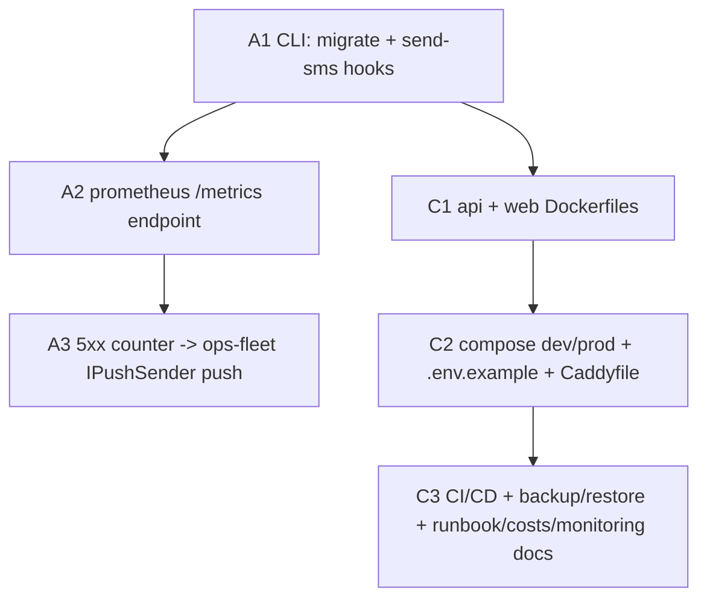

# UC-008 — Infra, CI/CD & operations — Work Items

Spec: docs/specs/in-progress/008_UC_008_infra-and-deployment.md — Assignment: .claude/state/08-infra-and-deployment.md

**INFRA/OPS UC — does NOT decompose into vertical feature slices.** 6 work items: 3 Lane-A api-**code** hooks (A1, A2, A3) + 3 **infra** config/docs WIs (C1, C2, C3). Topologically ordered, acyclic. The two chains (A1→A2→A3 and A1→C1→C2→C3) share only the A1 root; the A-chain is serialized because all three edit `Program.cs`, the C-chain because each infra WI references the prior artifact. **No migration in the whole UC** (no schema change).

## Assumptions

1. **This is an infra UC, not a feature UC.** Structure = a few small backend hooks (code, test-first where testable) + deployment artifacts (config + docs, conductor-verified, not dotnet/vitest). All 6 WIs carry `lane: "api"` because the lane enum has no `infra` value; the 3 config/docs WIs are tagged `[INFRA]` in the title.
2. **No `ops` fleet exists in code (labeled best-judgment, advisor-flagged scope gap).** Explore confirmed fleet lookup is by `Fleet.Slug` only; there is no `ops` concept. The 5xx alerter (A3) and the disk-alert `send-sms` recipient look up the fleet whose `Slug == config Ops:FleetSlug` (default `"ops"`). If the fleet or its FleetAdmin push subscriptions are absent, the alerter **logs a Warning and no-ops** (never throws — an infra-alert failure must not cascade). Surfaced here (and in the handoff notes) rather than via AskUserQuestion because the spec Mode line is autonomous-batch (interrupt only on 3-round blocks / gate failures / truly undecidable scope — this is decidable via a labeled assumption).
3. **The 5xx alert uses `IPushSender`, NOT `INotificationService` (advisor correction #1, load-bearing).** `INotificationService.NotifyAsync(evt, Order, ct)` is order-coupled (routing keys off event + order); a 5xx alert has no Order and would not compile. A3 resolves the ops fleet → its active `FleetAdmin` Users (`IgnoreQueryFilters`, mirroring `NotificationService`'s recipient lookup) → their `PushSubscription` rows → `Taxi.Api.Infrastructure.Notifications.IPushSender.SendAsync(subscription, PushMessage, ct)` directly.
4. **Migrate-on-start = a `migrate` arg-subcommand, not a `RUN_MIGRATIONS` env gate.** Mirrors the SOURCE-VERIFIED `create-superadmin` arg-intercept (Program.cs 198-219: after `builder.Build()`, run in an async scope, `return;` before `app.Run()`). Consistent with the existing CLI pattern, unit-testable, and pairs cleanly with `deploy.yml`'s explicit `docker compose run --rm api migrate` before `up`. The existing Development-only startup `MigrateAsync` (Program.cs 224-236) is **left as-is**; prod uses the explicit subcommand.
5. **`send-sms` resolves the Notifications `ISmsSender`, not the OTP one.** There are TWO interfaces: `Infrastructure.Sms.ISmsSender` (OTP: `SendAsync(phone, message, ct)`) and `Infrastructure.Notifications.ISmsSender` (real GoSMS/SMSbrana providers: `SendAsync(SmsMessage, ct) → SmsSendResult`). A disk-alert SMS must actually send in prod → resolve the **Notifications** one.
6. **`/metrics` internal-only is a cross-lane split (advisor).** A2 (code) only serves + scrapes the endpoint (200 + Prometheus text format). "Internal-network only / not publicly routable" is enforced by **C2** (Caddy does NOT proxy `/metrics` + compose internal network), never by code.
7. **prometheus-net.AspNetCore 8.2.1** is the current release supporting .NET 10 (preview 4+), ASP.NET-Core-10 compatible; integration is `app.UseHttpMetrics()` + `app.MapMetrics("/metrics")` (researched 2026-09-13, cite at impl; developer re-confirms net10.0 restore and pins an explicit 8.x version). A2 is the **only** `needs_library_research: true` WI.
8. **`aspnet:9.0` → `aspnet:10.0` correction (spec directive).** The assignment's Dockerfile example says `aspnet:9.0`; the project is `net10.0` (Taxi.Api.csproj, verified), so C1 uses `mcr.microsoft.com/dotnet/aspnet:10.0` and records the deviation in a Dockerfile comment + `docs/decisions.md`.
9. **Health endpoints exist** (Program.cs 266-274): `/health/live` (`Predicate _ => false`) and `/health/ready` (tag `ready` + `AddNpgSql`). C1 HEALTHCHECK targets `/health/live`; `deploy.yml` polls `/health/ready`.
10. **Operational ACs are not executable here** (no VPS/DNS/S3/pinger in this sandbox). Each is marked verbatim **"artifact produced + runbook-documented; operational verification deferred to real infra"** — none is phrased as a measured result. The cost sheet uses **published provider prices cited by date**, not invented/measured numbers.
11. **Code-verifiable HERE (must pass before ship):** A1/A2/A3 compile under `-warnaserror` + keep `dotnet test` green; C1 Dockerfiles structurally reviewed (+ `docker build` if feasible); C2 `docker compose config` validates both files + `caddy validate`; C3 workflow YAML well-formed (actionlint/yaml) + `infra/restore.sh` local `pg_dump -Fc` round-trip (`SELECT count(*) FROM orders`).

## Dependency Graph

**Edge notes:** A1→A2→A3 is serialized because all three edit `Program.cs` (advisor #3, UC-007 shared-file precedent) — no collision on concurrent `dotnet`/edits. A1→C1 so the `migrate` entrypoint contract exists before the Dockerfiles/deploy reference it. C1→C2→C3 because each infra WI references the prior artifact (compose references images; CI/deploy reference compose + the migrate step + the backup service).

---

## WI A1 — CLI hooks: `migrate` + `send-sms` (lane: api, M) — root

**Required reads:** 08-infra-and-deployment.md, 00-PROJECT-CONTEXT.md.
**Deliverables:** Two `Program.cs` arg-intercepts mirroring `create-superadmin` (after `builder.Build()`, async scope, `return;` before `app.Run()`, reuse `GetArgValue`). (1) `dotnet run -- migrate` → `db.Database.MigrateAsync()` then return (the deploy migrate step; leave the Development-only startup MigrateAsync untouched). (2) `dotnet run -- send-sms --to <e164> --message <text>` → resolve `Infrastructure.Notifications.ISmsSender`, build `SmsMessage`, send, log outcome (mask phone, no body), return. Root of the Program.cs-touching chain. No migration.
**Error paths:** missing `--to`/`--message` → log error + return (no send), mirroring create-superadmin's missing-flag guard.
**Tests:** MigrateCommand_Intercepts_AndReturnsBeforeHostBoots, SendSms_ValidArgs_InvokesSmsSenderWithParsedToAndMessage, SendSms_MissingToOrMessage_LogsErrorAndReturns.
**Verification:** dotnet test --filter FullyQualifiedName~Taxi.Api.Tests.Infra.SendSms.

## WI A2 — prometheus `/metrics` endpoint (lane: api, S) — depends A1 — needs_library_research

**Required reads:** 08-infra-and-deployment.md, 00-PROJECT-CONTEXT.md.
**Deliverables:** Add prometheus-net.AspNetCore (~8.2.1, explicit pin; re-confirm net10.0 restore) to Taxi.Api.csproj; wire `app.UseHttpMetrics()` (after UseAuthentication) + `app.MapMetrics("/metrics")` (near the health-check Map* calls). Endpoint returns 200 + Prometheus text format. Internal-only enforcement is **deferred to C2**, not code.
**Error paths:** none (pure exposure).
**Tests:** Metrics_Endpoint_Returns200AndPrometheusTextFormat.
**Verification:** dotnet test --filter FullyQualifiedName~Taxi.Api.Tests.Infra.Metrics.

## WI A3 — 5xx counter → ops-fleet push alert (lane: api, M) — depends A2

**Required reads:** 08-infra-and-deployment.md, 00-PROJECT-CONTEXT.md.
**Deliverables:** A middleware counts HTTP 5xx; a testable TimeProvider-driven `Common/Ops/FiveHundredRateAlerter` decides ">10 in a rolling minute → exactly one alert, reset next window, <=10 → none". Alert path = **`IPushSender`** to the active `FleetAdmin` Users (via `PushSubscription` rows) of the fleet whose `Slug == Ops:FleetSlug` (default `"ops"`, `IgnoreQueryFilters`, mirrors `NotificationService` recipient lookup). `OpsOptions` holds the config. Absent ops fleet / subscriptions → log Warning + no-op (never throw). No migration.
**Error paths:** no ops fleet / no subscriptions → Warning + no-op; alert send failure must not cascade (infra error, rules/error-handling.md).
**Tests:** FiveHundredAlerter_ElevenIn60s_FiresExactlyOneAlert, FiveHundredAlerter_NextWindow_ResetsAndCanFireAgain, FiveHundredAlerter_TenOrFewer_FiresNothing, FiveHundredAlerter_SendsPushToOpsFleetAdmins, FiveHundredAlerter_NoOpsFleet_LogsWarningAndNoOps.
**Verification:** dotnet test --filter FullyQualifiedName~Taxi.Api.Tests.Infra.FiveHundred.

## WI C1 — [INFRA] api + web Dockerfiles (lane: api, M) — depends A1 — conductor-verified

**Required reads:** 08-infra-and-deployment.md, 00-PROJECT-CONTEXT.md.
**Deliverables:** `api/Dockerfile` multi-stage (SDK 10.0 build → `mcr.microsoft.com/dotnet/aspnet:10.0` runtime; 9.0→10.0 deviation documented), non-root USER, HEALTHCHECK `/health/live`, small image (target <120 MB). `web/Dockerfile` Node build → `caddy:2-alpine` serving the SPA (index.html no-cache, hashed assets 1y) + `/api/*` + `/hubs/*` proxy with WebSocket. `.dockerignore` for both. Images tagged git-SHA + latest → GHCR by CI (C3). No secrets in images.
**Error paths:** n/a (artifacts).
**Tests / verification:** CONDUCTOR-VERIFIED INFRA — Dockerfiles structurally reviewed + `docker build` locally IF feasible (image-size/HEALTHCHECK on real build), else documented expectation. Image-size <120 MB: artifact + runbook-documented; operational verification deferred to real infra. `verification.tool=dotnet-build` is a placeholder (verifies nothing on a Dockerfile-only WI; enum has no `infra` value).

## WI C2 — [INFRA] compose (dev/prod) + .env.example + Caddyfile (lane: api, L) — depends C1 — conductor-verified

**Required reads:** 08-infra-and-deployment.md, 00-PROJECT-CONTEXT.md.
**Deliverables:** `infra/docker-compose.dev.yml` (db + api `dotnet watch` + web Vite + seed + Console SMS). `infra/docker-compose.prod.yml` (caddy/web/api/db/backup; api 512 MB / db 1 GB; `unless-stopped`; only caddy publishes 80/443; db no published port, internal network; `/metrics` reachable only internally — this is where A2's internal-only AC is enforced). `infra/.env.example` documents every variable (DB, Jwt, Cors, Notifications SMS + keys, VAPID, DOMAIN, DNS token, S3/backup creds, `Ops:FleetSlug`), placeholders only. `infra/Caddyfile` (prod): `{$DOMAIN}` + `*.{$DOMAIN}` wildcard via DNS challenge (Cloudflare + Hetzner variants; on-demand-TLS fallback documented), security headers, gzip/zstd, 1 MB body limit (300 KB logo note), `/api/v1/auth/*` rate-limit 60/min/IP, `/api/*` + `/hubs/*` (WebSocket) → api, SPA from web, per-fleet logos from `/data/fleets`.
**Error paths:** n/a (artifacts).
**Tests / verification:** CONDUCTOR-VERIFIED — `docker compose -f infra/docker-compose.{dev,prod}.yml config` validates (syntax + interpolation); `caddy validate` if available, else structural review. Postgres-not-reachable (nmap) / HTTPS+WebSockets on subdomains: artifact + runbook-documented; operational verification deferred to real infra. `verification.tool=dotnet-build` is a placeholder.

## WI C3 — [INFRA] CI/CD + backup/restore + runbook/costs/monitoring docs (lane: api, XL) — depends C2 — conductor-verified

**Required reads:** 08-infra-and-deployment.md, 00-PROJECT-CONTEXT.md, docs/runbook.md.
**Deliverables:** `.github/workflows/ci.yml` (restore + build -warnaserror + dotnet test + npm ci/lint/vitest + Playwright smoke; fails on warning). `.github/workflows/deploy.yml` (build+push GHCR images git-SHA+latest → SSH VPS → record previous tag → pull → `compose run --rm api migrate` (A1) → `up -d` → poll `/health/ready` 60 s → auto-rollback to previous tag on failure; secrets VPS_HOST/VPS_SSH_KEY/GHCR_TOKEN only). `.github/workflows/restore-test.yml` (weekly: download latest backup → restore into throwaway PG → `SELECT count(*) FROM orders` → open issue on failure). `backup` container (cron 02:30 Europe/Prague: `pg_dump -Fc` → gzip → S3 via rclone/aws-cli; 14 daily / 8 weekly; + `/data/fleets`). `infra/restore.sh <file>`. `docs/runbook.md` (extend UC-007: provision → DNS → deploy + create-superadmin + first fleet → add-fleet 10 min → rotate → restore → site-down checklist → cost). `docs/monitoring.md` (uptime pinger, Serilog JSON + docker logs + logrotate 100 MB/container, `/metrics` + optional Grafana `--profile ops`, disk-alert cron `>85%` → `dotnet run -- send-sms`). `docs/costs.md` (published prices cited by date; <€10/mo for 1 fleet + marginal ~SMS).
**Error paths:** n/a (artifacts).
**Tests / verification:** CONDUCTOR-VERIFIED — workflow YAML well-formed (actionlint/yaml parse); `infra/restore.sh` round-trips locally (`pg_dump -Fc` → throwaway PG → `SELECT count(*) FROM orders`). Operational, all deferred to real infra (artifact + runbook-documented): fresh-VPS <45 min, push-to-deploy + rollback, nightly backup + weekly restore-test green on real storage, idle <700 MB RAM, total cost <€10/mo. `verification.tool=dotnet-build` is a placeholder.
