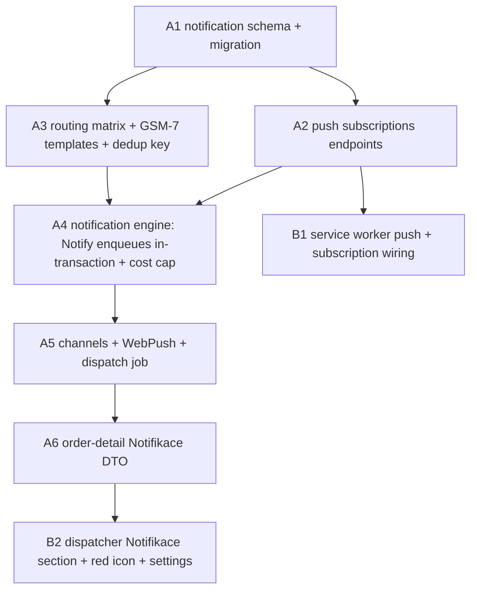

# UC-005 — Notifications (SMS + Web Push) — Work Items

8 work items: 6 Lane A (api) + 2 Lane B (web). Topologically ordered, acyclic. Agents: `backend-developer` (lane `api`), `frontend-developer` (lane `web`). TDD (red-green-refactor); stage only your lane's folder; never commit.

## Assumptions

- **Source (Phone vs App) — labeled best-judgment assumption.** `CreateOrderRequest` has no `Source` field today and `CreateOrderEndpoint` hardcodes `Source = isCustomer ? App : Dispatcher` (verified in source). AC#1 requires a "Phone-source order" and the routing footnote says "Phone orders (Source=Phone, no customer app)". Decision: add an additive `OrderSource? Source` to `CreateOrderRequest`; set `Source = isCustomer ? App : (req.Source ?? Dispatcher)`. The routing matrix keys on `(event, Source, customerHasPush)`, so the "App order but no push subscription → SMS" case is also covered. Decidable from spec text → proceeded without `AskUserQuestion` (spec renews the autonomous-batch directive).
- **Notify = enqueue (pre-commit), not send.** The assignment's "Notify after each committed transition" is reconciled with AC#3's "same transaction": `Notify` adds the `notification_outbox` row to the caller's DbContext *before* commit (same transaction); the actual send happens later in `NotificationDispatchJob`.
- **Tracking link for SMS.** The token is minted today only for customer app orders and the stored path is relative (`/c/t/{code}?k={token}`). The notification engine mints the token itself via `TrackingTokenService.Mint` and prepends a new dev-config `PublicBaseUrl` to produce an absolute URL (prod wiring → assignment 08).
- **WebPush package pin.** `WebPush 1.0.13` (NuGet id `WebPush`, author coryjthompson — the canonical web-push-csharp lib), netstandard2.1 + net8.0, compatible with .NET 10; VAPID via `VapidDetails`, 410 via `WebPushException.StatusCode == Gone`. Fallback: `Lib.Net.Http.WebPush 3.3.1` if 1.0.13 trips `-warnaserror` on .NET 10.
- **PushSubscription already exists** (entity + DbSet + config + migration in the snapshot; UserId-scoped, nullable FleetId, mirrors RefreshToken). No push_subscription migration; no existing endpoint (A2 builds it).
- **One migration only** (A1): `notification_outbox` + `notification_log` + the two `FleetSettings` cap columns → one coherent snapshot; everything else depends on A1.
- **Deferred (follow-ups, not in this UC):** the 90-day-unused push prune (the 410-prune *is* built); the `ScheduledOrderReminder` scheduling trigger (enum + routing support exist, no scan job); per-fleet routing-matrix override UI; live SMS-provider testing; prod VAPID/SMS/PublicBaseUrl secrets (→ 08).

## Dependency Graph

Topological order: `A1 → {A2, A3} → A4 → A5 → A6`; `B1` after `A2`; `B2` after `A6`. Lane A and Lane B run in parallel where files are disjoint.

---

## WI A1 — notification schema + migration

**Required Reads:** `.claude/state/05-notifications.md`, `.claude/state/00-PROJECT-CONTEXT.md`.

**Deliverables:** `NotificationOutbox` + `NotificationLog` entities (both `ITenantEntity`, FleetId-scoped, global query filters); `NotificationEvent`/`NotificationChannel`/`NotificationStatus` enums; `FleetSettings.SmsMonthlyCapCzk` (500) + `SmsUnitCostCzk` (1); EF configs; a **unique dedup index** on `notification_log (FleetId, Event, OrderId, Recipient, Channel)`; `PayloadJson` as jsonb; one migration `AddNotificationTablesAndSmsCap`.

**Error Paths:** dedup index raises 23505 on a duplicate log row (expected, asserted).

**Tests:** `NotificationSchema_OutboxAndLog_AreTenantScoped`, `NotificationSchema_DedupIndex_RejectsDuplicateLogRow`, `NotificationSchema_FleetSettingsCapDefaults_Are500And1`.

**Verification:** `dotnet test --filter FullyQualifiedName~Taxi.Api.Tests.Notifications.NotificationSchema`.

---

## WI A2 — push subscriptions endpoints

**Required Reads:** `.claude/state/05-notifications.md`, `.claude/state/00-PROJECT-CONTEXT.md`, `docs/specs/done/customer-pwa-work-items.md`.

**Deliverables:** `POST` / `DELETE /api/v1/push/subscriptions` over the existing `PushSubscription`; upsert by `(UserId, Endpoint)`, multi-device, prune on delete; all authenticated roles (add `AuthenticatedOnly` policy if none fits). UserId-scoped.

**Error Paths:** missing endpoint/keys → 400 (plain properties + `NotEmpty`, not `required` — STJ 500 trap); anonymous → 401; unknown endpoint on delete → 204 no-leak.

**Tests:** `PushSubscribe_NewEndpoint_Inserts`, `PushSubscribe_SameEndpointTwice_Upserts`, `PushSubscribe_MultipleDevices_AllPersist`, `PushSubscribe_MissingEndpoint_Returns400`, `PushUnsubscribe_RemovesOwnEndpoint`, `PushUnsubscribe_Unknown_Returns204NoLeak`, `PushSubscribe_Anonymous_Returns401`, `PushSubscribe_CustomerAndDriver_BothAllowed`.

**Verification:** `dotnet test --filter FullyQualifiedName~Taxi.Api.Tests.Notifications.PushSubscription`.

---

## WI A3 — routing matrix + GSM-7 templates + dedup key (pure)

**Required Reads:** `.claude/state/05-notifications.md`, `.claude/state/00-PROJECT-CONTEXT.md`.

**Deliverables:** pure `NotificationRouting.Resolve(evt, source, customerHasPush)` (static matrix per assignment §1); `SmsTemplates` + `PushTemplates` (Czech GSM-7 for SMS, diacritics OK for push); `GsmSevenValidator.IsGsm7AndWithinLimit`; `NotificationDedupKey.For`. No DbContext/IO.

**Tests:** `NotificationRouting_DriverArrived_SmsEvenWithPush`, `NotificationRouting_RideStarted_PushOnly`, `NotificationRouting_PhoneOrder_OnlyCreatedAndArrivedSms`, `NotificationRouting_AppNoPush_CreatedIsSms`, `SmsTemplates_AllTemplates_Fit160Gsm7WithLongestValues` (AC#5, 30-char fleet + 6-char code + absolute link — class **`NotificationSmsTemplateTests`** so the `~Notifications.Notification` filter catches it), `SmsTemplates_DiacriticInput_FailsGsm7`, `NotificationDedupKey_SameInputs_SameKey`.

**Verification:** `dotnet test --filter FullyQualifiedName~Taxi.Api.Tests.Notifications.Notification`.

---

## WI A4 — notification engine (in-transaction enqueue + cost cap)

**Required Reads:** `.claude/state/05-notifications.md`, `.claude/state/00-PROJECT-CONTEXT.md`.

**Deliverables:** `INotificationService.Notify` adds outbox rows to the **same scoped DbContext** (no `SaveChanges`, no new scope). Wired into `OrderService.TransitionAsync` **before line 68** (the single `SaveChangesAsync`, not the post-commit publish block) and into `CreateOrderEndpoint` **before line 206** (the retry-loop save). Absolute tracking link via `TrackingTokenService.Mint` + new dev-config `PublicBaseUrl`. Additive `OrderSource? Source` on `CreateOrderRequest`. Pure `NotificationCostCap.Decide` (cap → SkipCap except DriverArrived; 90% warning).

Outbox stores **intent only** (event, orderId, channel, recipient) — the SMS body is rendered at send-time in A5 (avoids the `PublicCode` retry-loop staleness). AC#7 dedup is enforced at **send-time** in A5 (claim-then-execute), not at enqueue.

**Error Paths:** cap reached → `SkippedCap` log, no send (DriverArrived always allowed); duplicate `Notify` enqueues a second outbox row (harmless — A5's claim blocks the second send).

**Tests:** `NotificationOutbox_WrittenInSameTransaction` (AC#3 atomicity — rollback leaves no outbox row), `NotificationOutbox_IsWrittenForCorrectFleet` (tenant), `NotificationDedup_DuplicateNotify_EnqueuesButSendGuardedByA5`, `NotificationCostCap_ThirdNonArrival_SkipsCap` + `NotificationCostCap_ArrivalAlwaysAllowed` + `NotificationCostCap_At90Percent_FlagsWarning` (AC#6, pure).

**Verification:** `dotnet test --filter FullyQualifiedName~Taxi.Api.Tests.Notifications.Notification`.

---

## WI A5 — channels + WebPush + dispatch job

**Required Reads:** `.claude/state/05-notifications.md`, `.claude/state/00-PROJECT-CONTEXT.md`, `docs/decisions.md`. **`needs_library_research: true`** (WebPush 1.0.13).

**Deliverables:** `ISmsSender` (`ConsoleSmsSender` default, `GoSmsSender` <80 lines, `SmsbranaSmsSender`, config-selected); `IPushSender` (`WebPushSender` with VAPID, `NoOpPushSender`); `NotificationDispatchJob : BackgroundService` with thin `ExecuteAsync` + public `RunTickAsync(ct)` (mirrors `OfferTimeoutJob`); scan cross-tenant → per-row fresh scope with `CurrentTenant.FleetId` set → **claim `notification_log` (unique-index insert) before send** (claim-then-execute, the `IdempotencyRecord` pattern — 23505 → skip send) → **render SMS body at send time** from the order's final `PublicCode` → send → update log Sent/Failed → backoff via `TimeProvider` → Failed after 3. A row's own failed send stays retryable (claim keyed to the outbox row). `WebPush 1.0.13` PackageReference. Appends `docs/decisions.md`.

**Error Paths:** 410 Gone → delete subscription (AC#4); 3× failure → `Failed` (AC#3); duplicate outbox → claim rejects second → **sender invoked once** (AC#7); OSRM/infra errors propagate.

**Tests:** `PhoneOrderSmsEndToEnd` (AC#1 — exactly one SMS, absolute link, ConsoleSmsSender asserted, single Sent log), `NotificationDispatchJob_SendFailsThreeTimes_MarksFailed` (AC#3, own `TaxiApiFactory` for FakeTime), `PushSender_Returns410_DeletesSubscription` (AC#4), `NotificationDispatchJob_DuplicateOutbox_InvokesSenderOnce` (AC#7, recording sender, count == 1), tenant-isolation on log writes.

**Verification:** `dotnet test --filter FullyQualifiedName~Taxi.Api.Tests.Notifications`.

---

## WI A6 — order-detail Notifikace DTO

**Required Reads:** `.claude/state/05-notifications.md`, `.claude/state/00-PROJECT-CONTEXT.md`.

**Deliverables:** additive `notifications` array on `OrderDetailDto` (`OrderNotificationDto`: Event, Channel, Recipient, Status, Error?, CreatedAt, SentAt?); `OrderDetailMapper`/`GetOrderEndpoint` project from `notification_log` (AsNoTracking, tenant-scoped, in-memory map). `{ order }` envelope unchanged.

**Tests:** `OrderDetail_IncludesSentAndFailedNotifications`, `OrderDetail_NotificationsAreTenantScoped`.

**Verification:** `dotnet test --filter FullyQualifiedName~Taxi.Api.Tests.Notifications.OrderDetailNotifications`.

---

## WI B1 — service worker push + subscription wiring

**Required Reads:** `docs/specs/in-progress/005_UC_005_notifications.md`, `.claude/state/05-notifications.md`, `docs/specs/done/customer-pwa-work-items.md`.

**Deliverables:** `pushSubscribe`/`pushUnsubscribe` in `client.ts`; SW push display + `notificationclick` → open/focus `url` (OfferToDriver → `requireInteraction: true` + driver sound); pure `pushPayload.ts` + `pushSubscriptionManager.ts`; driver mandatory subscribe at login (UC-003 priming), customer `PushPrompt` accept → subscribe (UC-004). VAPID public key = dev build-config.

**Error Paths:** permission denied / no push support → skip gracefully (pure manager decides).

**Tests:** `pushPayload.test.ts` (incl. OfferToDriver branch), `pushSubscriptionManager.test.ts`, `usePushSubscription.test.ts` (client mocked), `locales.parity.test.ts`.

**Verification:** `vitest` (`npm run tsc`, `npm run lint --max-warnings 0`, `npm run test`).

---

## WI B2 — dispatcher Notifikace section + red icon + settings

**Required Reads:** `docs/specs/in-progress/005_UC_005_notifications.md`, `.claude/state/05-notifications.md`, `docs/specs/done/dispatcher-web-work-items.md`.

**Deliverables:** `NotificationsSection` in /x order detail (sent/failed, Europe/Prague times); `OrderCard` red icon (i18n'd aria-label) when a Failed Sms exists; pure `notificationStatus.ts`; SMS monthly count + estimated cost + cap warning in Settings (read-only). Additive `notifications` type in `client.ts`.

**Error Paths:** failed state expressed via role/aria, not color alone (a11y).

**Tests:** `notificationStatus.test.ts`, `NotificationsSection` render + axe, `OrderCard` red-icon test, `locales.parity.test.ts`.

**Verification:** `vitest` (`npm run tsc`, `npm run lint --max-warnings 0`, `npm run test`).
