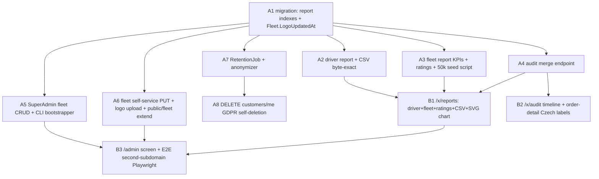

# UC-007 — Reports, audit view & tenant onboarding — Work Items

Spec: docs/specs/in-progress/007_UC_007_reports-audit-onboarding.md - Assignment: .claude/state/07-reports-audit-tenant-onboarding.md

11 work items: 8 Lane A (api, A1..A8) + 3 Lane B (web, B1..B3). Topologically ordered, acyclic. Lane A runs in parallel with Lane B where files are disjoint; the Playwright AC#3 WI (B3) depends on the relevant Lane A WIs for build-integrity.

## Assumptions

1. **Most of what the task said to "add" already exists (SOURCE-VERIFIED) - do NOT re-build it.** `UserRole.SuperAdmin` and `UserRole.System` (enum, string-stored -> NO migration). `SuperAdminOnly`, `AuthenticatedOnly`, `FleetAdminOnly` policies all exist. `Fleet.PrimaryColorHex`. `FleetSettings.WelcomeText`/`AutoDispatchEnabled`/`OfferTimeoutSeconds`/`SmsMonthlyCapCzk`/`SmsUnitCostCzk`/`SmsSenderName` all exist. The CLI only creates a SuperAdmin **user row** - the enum + policy are done. The ONLY genuinely-missing self-service persisted field is the **logo**.
2. **Logo = derived path, no new blob column (labeled best-judgment).** The file lives at /data/fleets/{id}/logo.png, derivable from the fleet id. A1 adds a nullable `Fleet.LogoUpdatedAt` (DateTimeOffset?) ONLY as a "has-logo + cache-bust" signal; public/fleet returns a logo URL when LogoUpdatedAt != null, else null. No blob column. The API stores the file + stamps LogoUpdatedAt; Caddy serves the static file (infra, 08).
3. **One serialized migration WI (A1) bundles EVERYTHING schema (UC-004/005/006 precedent).** Report perf indexes are a schema concern and AC#2 (<300 ms @ 50k) needs them up front - a later index = a second migration, which the one-snapshot rule forbids. A1 adds: Order indexes (FleetId, CreatedAt) + (FleetId, DriverId, CreatedAt) + (FleetId, Status, CreatedAt); the audit merge indexes OrderEvent (FleetId, At) + AuditLog (FleetId, At); and Fleet.LogoUpdatedAt. One migration AddReportIndexesAndFleetLogo. All other Lane-A WIs depends_on A1 so `dotnet ef` never regenerates the snapshot in parallel.
4. **Prague-day bucketing is SQL-translatable via date_trunc('day', "created_at" AT TIME ZONE 'Europe/Prague'); FromSql is the sanctioned fallback (AC#1+AC#2, SOURCE-VERIFIED risk).** `Order.CreatedAt` is UTC DateTimeOffset; owners read Prague days. A naive GroupBy(o => o.CreatedAt.Date) buckets in UTC (wrong day near midnight) and may not translate. Design: aggregate with a LINQ GroupBy over a Prague-local day key translated to date_trunc ... AT TIME ZONE, with conditional SUM(CASE WHEN PaymentType = Cash ...); if a specific key/aggregate will not translate, fall back to a single FromSql/SqlQuery aggregation (still server-side - NOT ToList-then-group - so AC#2 holds). The date-range FILTER uses the existing GetDayWindow UTC-boundary pattern from GetMySummaryEndpoint. **AC#1 hand-computed orders are seeded at mid-day** (same date in UTC and Prague) so the tz choice cannot shift a bucket and the CSV match is deterministic.
5. **Hours-online is a SEPARATE small bounded query, not folded into the 50k GROUP BY (AC#2).** driver_shifts interval sums (shifts cross midnight, clamp to the Prague window) are the other translation snag and are tiny in cardinality (driver x days). Mirror GetMySummaryEndpoint's in-memory clamp-and-sum over the shift rows for the range; merge into the per-day driver rows in memory. This is NOT the 50k perf path.
6. **Audit merge = Concat of two common-shape projections -> SQL UNION ALL, then OrderByDescending(At).Skip().Take() (SOURCE-VERIFIED risk).** Project order_events and audit_log into one shared DTO shape, .Concat(...), page server-side. If EF cannot translate the union+paging, fall back to two windowed queries merged in memory with an explicitly-bounded page window (documented). audit_log is near-empty today (only OverrideStatusEndpoint writes it), so the timeline is order_events-dominated; paging correctness still matters. Tenant-scoped via both entities' global query filters (both are ITenantEntity). jsonb (Payload/Diff) is NOT projected in SQL (CLAUDE.md WI-10) - load then read in memory if surfaced.
7. **SuperAdmin fleet-create is the ONE cross-tenant write - guard + test hard (carry-forward).** It writes FleetSettings + default Tariff + FleetAdmin User for a fleet that is NOT the caller's tenant, so it trips the SaveChanges tenant guard (CLAUDE.md WI-04). Reuse the seeder's null-tenant / explicit-FleetId technique. Guarded SuperAdminOnly; negative test (non-SuperAdmin -> 403) is mandatory.
8. **One shared anonymization helper** (Common/Gdpr/CustomerAnonymizer) used by BOTH RetentionJob (A7) and DELETE /api/v1/customers/me (A8): null CustomerUserId, set CustomerPhone = "+420000000000", CustomerName = "Anonymizovano". Order rows are KEPT (AC#6 - they remain in reports, anonymized). No logic duplication.
9. **CLI create-superadmin = a testable bootstrapper class + an args intercept after builder.Build() that returns before app.Run()** (mirrors the jobs' RunTick testable-shell). The bootstrapper is integration-tested against a DbContext directly; it never boots the web host.
10. **Charts = plain SVG, no heavy dep (carry-forward).** Rides-per-day bar chart is a hand-rolled <svg> pure component - `npm run size` must stay green; no chart library added.
11. **CSV = streamed, byte-exact, UTF-8 with BOM, ; separator (AC#7).** Pure Common/Reports/DriverReportCsv writer (no FastEndpoints) unit-tested on BYTES (BOM EF BB BF prefix + ; delimiters + CRLF). The CSV endpoint streams it. Hand-rolled, no CsvHelper.
12. **needs_library_research is false on every WI.** All pieces use APIs already present in the codebase.

## Dependency Graph

**Edge notes:** A7->A8 serializes the shared CustomerAnonymizer writer. A2/A3/A4/A5/A6/A7 all depend only on A1 (schema snapshot) and run in parallel (disjoint files; ErrorCodes.cs appends are the only shared file - serialize via the conductor if it cannot guarantee append-safety). B3 depends on A5+A6 (the onboarding + branding endpoints it drives) and B1 (customer-branding build-integrity) for the AC#3/AC#4 Playwright flow.

---

## WI A1 - Migration: report indexes + Fleet.LogoUpdatedAt (lane: api, S)

**Required reads:** 07-reports-audit-tenant-onboarding.md, 00-PROJECT-CONTEXT.md.
**Deliverables:** Fleet.LogoUpdatedAt (DateTimeOffset?, nullable) + config; Order indexes (FleetId, CreatedAt), (FleetId, DriverId, CreatedAt), (FleetId, Status, CreatedAt); OrderEvent (FleetId, At); AuditLog (FleetId, At). ONE migration AddReportIndexesAndFleetLogo (--output-dir Infrastructure/Migrations). Root of all Lane-A WIs; no engine/endpoint logic.
**Error paths:** none (schema-only).
**Tests:** ReportSchema_FleetLogoUpdatedAt_DefaultsNull, ReportSchema_OrderReportIndexes_Exist, ReportSchema_AuditMergeIndexes_Exist, ReportSchema_Migration_IsNonDestructive.
**Verification:** dotnet test --filter FullyQualifiedName~Taxi.Api.Tests.Reports.ReportSchema.

## WI A2 - Driver report + byte-exact CSV (lane: api, L) - depends A1

**Required reads:** 07-reports-audit-tenant-onboarding.md, 00-PROJECT-CONTEXT.md.
**Deliverables:** GET /api/v1/reports/drivers?driverId&from&to (FleetAdmin, tenant-scoped) - SQL per-Prague-day aggregation (assumption 4): rides completed, cancelled(no-show), cash/card/invoice/total CZK, price-override count; totals row; hours online merged from the separate bounded shift query (assumption 5); avg rating per driver. CSV export variant (?format=csv) via pure Common/Reports/DriverReportCsv (UTF-8 with BOM, ;, CRLF), streamed. A committed hand-computed expected CSV fixture (AC#1).
**Error paths:** cross-fleet driverId -> 404; non-FleetAdmin -> 403; bad date -> 400; to < from -> 400.
**Tests (AC#1, AC#7):** DriverReport_SeededData_MatchesHandComputedTable, DriverReport_Csv_MatchesExpectedBytes, DriverReport_PragueDayBucketing_MidDayOrdersStable, DriverReport_HoursOnline_ClampsToWindow, DriverReport_PriceOverrideCount, DriverReport_CrossTenant_Returns404, DriverReport_NonFleetAdmin_Returns403.
**Verification:** dotnet test --filter FullyQualifiedName~Taxi.Api.Tests.Reports.DriverReport.

## WI A3 - Fleet report KPIs + ratings + 50k seed script (lane: api, XL) - depends A1

**Required reads:** 07-reports-audit-tenant-onboarding.md, 00-PROJECT-CONTEXT.md, docs/decisions.md.
**Deliverables:** GET /api/v1/reports/fleet?from&to (FleetAdmin, tenant-scoped) - SQL KPIs: rides, revenue, avg price, avg time-to-assign (created->assigned), avg time-to-pickup (accepted->arrived), cancellation rate, app-vs-phone share (Order.Source), fixed-route share (PriceType/RouteId), SMS count + est cost (notification_log + SmsUnitCostCzk); rides-per-Prague-day series; top common routes by count. GET /api/v1/reports/ratings list (comment, order code, driver). A test/dev 50k seeding script (fleet-scoped, NOT the demo seeder, idempotent) producing 50000 orders for one fleet. AC#2 perf assertion <300 ms on the seeded set.
**Error paths:** non-FleetAdmin -> 403; bad date -> 400.
**Tests (AC#2):** FleetReport_Kpis_ComputedInSql_NoInMemoryGrouping, FleetReport_50kOrders_RespondsUnder300ms, FleetReport_AppVsPhoneShare, FleetReport_TimeToAssignAndPickup, FleetReport_TopRoutesByCount, Ratings_List_IncludesCommentCodeDriver, FleetReport_CrossTenant_OnlyCallerFleet.
**Verification:** dotnet test --filter FullyQualifiedName~Taxi.Api.Tests.Reports.FleetReport.

## WI A4 - Audit merge endpoint (lane: api, L) - depends A1

**Required reads:** 07-reports-audit-tenant-onboarding.md, 00-PROJECT-CONTEXT.md.
**Deliverables:** GET /api/v1/audit?actor&entity&from&to&orderCode&page (FleetAdmin, tenant-scoped, read-only) - paged unified timeline merging order_events + audit_log via Concat -> UNION ALL -> OrderByDescending(At).Skip().Take() (assumption 6). Common AuditEntryDto (source, actor, entity, action/eventType, orderCode?, at). Filters applied before paging. jsonb not projected in SQL.
**Error paths:** non-FleetAdmin -> 403; bad date/page -> 400.
**Tests:** Audit_MergesOrderEventsAndAuditLog_SortedByAtDesc, Audit_Paging_IsStableAcrossUnion, Audit_FilterByActor, Audit_FilterByOrderCode, Audit_FilterByEntityAndDate, Audit_CrossTenant_OnlyCallerFleet, Audit_NonFleetAdmin_Returns403.
**Verification:** dotnet test --filter FullyQualifiedName~Taxi.Api.Tests.Reports.Audit.

## WI A5 - SuperAdmin fleet CRUD + CLI bootstrapper (lane: api, XL) - depends A1

**Required reads:** 07-reports-audit-tenant-onboarding.md, 00-PROJECT-CONTEXT.md.
**Deliverables:** POST/GET /api/v1/admin/fleets + POST /api/v1/admin/fleets/{id:guid}/deactivate (SuperAdminOnly). Create (slug, name, phone, adminEmail -> returns one-time admin password) ALSO seeds FleetSettings defaults + default Tariff + the FleetAdmin user - the ONE cross-tenant write (assumption 7). List (all fleets, cross-fleet by design). Deactivate sets IsActive=false. CLI: a testable SuperAdminBootstrapper.CreateAsync(email, password) + a Program.cs args intercept (create-superadmin --email --password) that runs the bootstrapper and returns before app.Run() (assumption 9).
**Error paths:** duplicate slug -> 409; non-SuperAdmin -> 403 (mandatory negative test); malformed body -> 400.
**Tests (AC#3 server half):** AdminFleets_Create_SeedsSettingsTariffAndAdmin, AdminFleets_Create_ReturnsOneTimePassword, AdminFleets_Create_DuplicateSlug_Returns409, AdminFleets_Create_NonSuperAdmin_Returns403, AdminFleets_List_ReturnsAllFleets, AdminFleets_Deactivate_SetsInactive, SuperAdminBootstrapper_CreatesSuperAdminUser, SuperAdminBootstrapper_DuplicateEmail_IsIdempotentOrRejects.
**Verification:** dotnet test --filter FullyQualifiedName~Taxi.Api.Tests.Reports.AdminFleets.

## WI A6 - Fleet self-service PUT + logo upload + public/fleet extend (lane: api, L) - depends A1

**Required reads:** 07-reports-audit-tenant-onboarding.md, 00-PROJECT-CONTEXT.md.
**Deliverables:** PUT /api/v1/fleet/settings (FleetAdmin, tenant-scoped) persisting name, phone (on Fleet), primary color hex, welcome text, offer timeout, SMS cap, auto-dispatch toggle (v1.1-disabled but persisted). POST /api/v1/fleet/logo (multipart, <=200 KB, PNG) -> writes /data/fleets/{id}/logo.png, stamps Fleet.LogoUpdatedAt (assumption 2). Extend GetFleetResponse (public/fleet) additively with welcomeText + logoUrl (derived, null when no logo); name/primaryColorHex already present. Must not break the existing GetFleetSettingsEndpoint read.
**Error paths:** logo >200 KB -> 400; non-PNG -> 400; non-FleetAdmin -> 403; invalid color hex -> 400.
**Tests (AC#4 server half):** FleetSettings_Put_PersistsAllFields, FleetLogo_Upload_StoresFileAndStampsLogoUpdatedAt, FleetLogo_Over200kb_Returns400, PublicFleet_ReturnsWelcomeAndLogoUrl_WhenLogoSet, PublicFleet_SecondFleetBySlug_ReturnsOwnBranding, FleetSettings_NonFleetAdmin_Returns403.
**Verification:** dotnet test --filter FullyQualifiedName~Taxi.Api.Tests.Reports.FleetSettings.

## WI A7 - RetentionJob + shared anonymizer (lane: api, L) - depends A1

**Required reads:** 07-reports-audit-tenant-onboarding.md, 00-PROJECT-CONTEXT.md, docs/decisions.md.
**Deliverables:** RetentionJob : BackgroundService with the thin ExecuteAsync PeriodicTimer shell + public RunTickAsync(ct) (CLAUDE.md WI-14). Per tick (cross-tenant IgnoreQueryFilters, per-fleet fresh scope + CurrentTenant.FleetId): anonymize orders with CreatedAt > 24 months via the shared Common/Gdpr/CustomerAnonymizer (assumption 8); delete sms_codes > 1 day old; delete refresh_tokens expired > 30 days. Driver-position history: not in v1 (documented in docs/decisions.md). docs/gdpr.md (cs + en). Register in AddJobs.
**Error paths:** per-fleet exception logged + continue (no PII beyond ids in logs).
**Tests (AC#5):** RetentionJob_AnonymizesOrderOlderThan24Months, RetentionJob_LeavesOrderUnder24Months, RetentionJob_DeletesExpiredSmsCodes, RetentionJob_DeletesOldRefreshTokens, RetentionJob_IsTenantScopedPerFleet, CustomerAnonymizer_SetsSentinelPhoneAndName_KeepsOrderRow.
**Verification:** dotnet test --filter FullyQualifiedName~Taxi.Api.Tests.Reports.RetentionJob.

## WI A8 - DELETE customers/me GDPR self-deletion (lane: api, M) - depends A7

**Required reads:** 07-reports-audit-tenant-onboarding.md, 00-PROJECT-CONTEXT.md.
**Deliverables:** DELETE /api/v1/customers/me (CustomerOnly) confirmed by SMS code - reuses the existing SmsCode request/verify flow (Features/Auth/RequestCode+VerifyCode, CodeHash). Body carries the SMS code; on valid code, anonymize the caller's orders via the shared CustomerAnonymizer (assumption 8) and delete the User row. Orders REMAIN (anonymized) in reports (AC#6). New feature slice Features/Customers/DeleteMe.
**Error paths:** wrong/expired code -> 400/401; no customer user -> 404; anonymous -> 401.
**Tests (AC#6):** DeleteMe_ValidSmsCode_AnonymizesOrdersAndDeletesUser, DeleteMe_OrdersRemainInReportsAnonymized, DeleteMe_WrongCode_Returns400, DeleteMe_Anonymous_Returns401.
**Verification:** dotnet test --filter FullyQualifiedName~Taxi.Api.Tests.Reports.DeleteMe.

## WI B1 - /x/reports screen: driver + fleet + ratings + CSV + SVG chart (lane: web, XL) - depends A2, A3, A4

**Required reads:** UC-007 spec, 07-reports-audit-tenant-onboarding.md, docs/specs/done/dispatcher-web-work-items.md.
**Deliverables:** /x/reports (FleetAdmin) feature slice: driver report (filters driver + date range default this-month; per-day table + totals + CSV download via blob+filename), fleet report (KPI cards + rides-per-day bar chart = plain <svg> pure component, assumptions 10 + 11), ratings list. client.ts typed functions (named-envelope unwrap); CSV download hits the ?format=csv variant. Pure modules: reportTotals.ts, csvDownload.ts, ridesChartGeometry.ts. cs/en keys both locales.
**Error paths:** empty range -> friendly empty state; must not modify /d or /c routes.
**Tests:** reportTotals.test.ts, ridesChartGeometry.test.ts, csvDownload.test.ts, ReportsPage render + axe, RidesChart render + axe, locales.parity.test.ts; npm run size after build.
**Verification:** vitest (plus npm run tsc / lint --max-warnings 0 / build / size).

## WI B2 - /x/audit timeline + order-detail Czech labels (lane: web, L) - depends A4

**Required reads:** UC-007 spec, 07-reports-audit-tenant-onboarding.md, docs/specs/done/dispatcher-web-work-items.md.
**Deliverables:** /x/audit (FleetAdmin) paged filterable read-only timeline (actor, entity, date, order code); @tanstack/react-virtual only if > ~100 rows. Pure auditEventLabel.ts mapping every event type -> a Czech label (incl. price overrides + manual status overrides). Verify/extend the UC-002 order-detail drawer timeline to use the same Czech-label map for every event type. client.ts audit list function (envelope unwrap). cs/en keys both locales.
**Error paths:** must not modify /d or /c routes.
**Tests:** auditEventLabel.test.ts, AuditPage render + axe, an order-detail-timeline label regression test, locales.parity.test.ts.
**Verification:** vitest (plus tsc / lint).

## WI B3 - /admin screen + E2E second-subdomain Playwright (lane: web, XL) - depends A5, A6, B1

**Required reads:** UC-007 spec, 07-reports-audit-tenant-onboarding.md, docs/specs/done/dispatcher-web-work-items.md, docs/specs/done/customer-pwa-work-items.md.
**Deliverables:** minimal /admin (SuperAdmin) - 1 screen: list fleets + create-fleet form that shows the one-time admin password. /x/settings Fleet tab: self-service form (name, phone, logo upload <=200 KB + preview, color picker, welcome text, offer timeout, SMS cap, auto-dispatch toggle disabled-v1.1) wired to A6. Customer PWA applies name/primaryColorHex/logoUrl from public/fleet at runtime (no rebuild, AC#4). docs/runbook.md (Caddy wildcard *.{domain} -> web; API resolves tenant from Host; DNS; two local fleets demo.localhost + second.localhost). Playwright AC#3: onboarding.spec.ts - SuperAdmin create-fleet -> login as its admin -> add driver -> create order, on a second subdomain. DEMO.md manual Lighthouse a11y note.
**Error paths:** test-results/ + playwright-report/ gitignored; chromium pinned revision (CLAUDE.md).
**Tests:** AdminFleetsPage render + axe, FleetTab render + axe, locales.parity.test.ts, the onboarding.spec.ts Playwright spec (AC#3).
**Verification:** playwright (unit/axe parts run under vitest; full gate tsc/lint/build/size/playwright).
