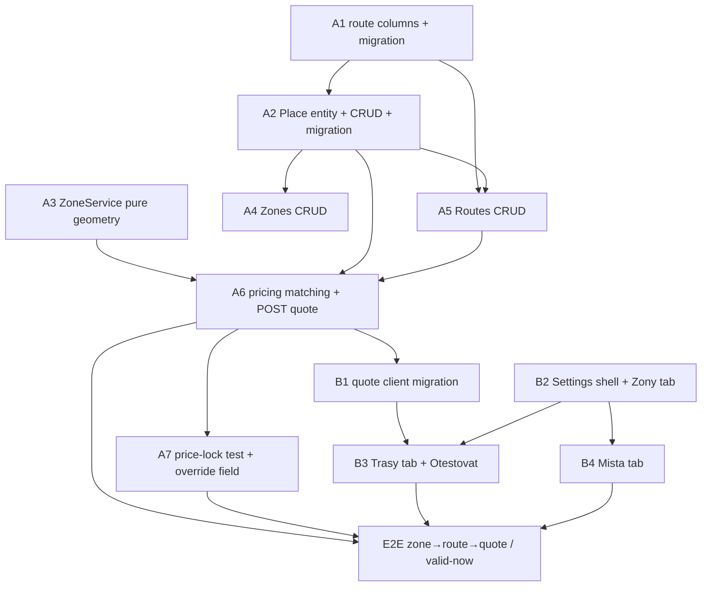

# UC-006 — Common routes, zones & pricing — Work Items

Spec: `docs/specs/in-progress/006_UC_006_routes-zones-pricing.md` · Assignment: `.claude/state/06-common-routes-and-zones.md`

12 work items: 7 Lane A (api, `A1..A7`) + 5 Lane B (web, `B1..B4` + `E2E`). Topologically ordered, acyclic. Lane A runs in parallel with Lane B where files are disjoint.

## Assumptions

1. **`routes/common` is the canonical public valid-now route listing** — it already exists (`ListCommonRoutesEndpoint`, AllowAnonymous, fleet-by-slug, `{ routes }` envelope, Europe/Prague valid-now filter), and the UC-004 web client already calls `getCommonRoutes() → GET /routes/common?validNow=true`. The assignment's `GET routes/available` is **satisfied-by** `routes/common` (superset: `fromLabel/toLabel` are covered by the existing name + pickup/dropoff addresses). **No second endpoint, no rename, zero client migration on the routes side.** `A5` adds admin CRUD and must not touch `ListCommonRoutesEndpoint`.
2. **`pricing/quote` is replaced, not extended.** The existing endpoint is `GET` + `CustomerOnly` with no Meter branch, no `routeId/routeName`, no `distanceKm/durationMin`. UC-006 needs precedence matching over the real route set, a Meter fallback (no-dropoff-outside-all-zones → Meter, flipping the current Estimate behavior), an `at?` param, a widened policy (any authenticated role + anonymous-by-slug), and the new response fields. **Decision: switch to `POST` with a JSON body** (the authoritative assignment verb; also sidesteps the cs-CZ double query-binding trap since numbers ride in the body). The shape change **forces** a Lane-B client migration (`B1`).
3. **AC#3 price-lock is structural.** `CreateOrderEndpoint` already copies `PriceType/FixedPriceCzk/EstimatedPriceCzk/RouteId` into the order row at creation, so AC#3's deliverable is the **integration test only** (`A7`), not a create rewrite. Server-side price **authority** (a customer can currently POST any `fixedPriceCzk` — a pre-existing trust hole) is a **labeled follow-up**, not bundled into UC-006.
4. **Zone entity already exists** (Circle/Polygon, jsonb `JsonDocument` Polygon, DbSet registered) → **no new Zone migration.** Only two migrations: `A1` Route ALTER + `A2` Place CREATE, serialized `A1→A2` so the model snapshot stays coherent.
5. **jsonb trap**: `Zone.Polygon` cannot be projected in a LINQ-to-SQL `Select` (runtime 500). `A3`/`A4`/`A6` `ToListAsync()` zones first, then read Polygon in memory.
6. **AC#6**: `OrderDetailDto` has `FinalPriceCzk` but not `PriceOverrideReason` → `A7` adds the additive field. The `PriceOverridden` event + timeline already exist (WI-07).
7. **AC#5**: the current seed has no 03:00–04:00-only route → `A6` seeds one.
8. `needs_library_research` is true only on **B2** (Leaflet draw interactions — circle click-drag, polygon click-to-close; the read-only lazy Leaflet map already exists from UC-004).

## Dependency Graph

**Note on A2→A4 / A2→A5:** those edges exist only to serialize the shared `ErrorCodes.cs` append (keeping at most 2 concurrent writers). A4 no longer depends on A3 — it shares no files with it and does not call `Contains` (the matcher consumer A6 depends on A3 directly), so A4 can run parallel to A3.

---

## WI A1 — Route columns + migration (`lane: api`, S)

**Required reads:** `06-common-routes-and-zones.md`, `00-PROJECT-CONTEXT.md`.
**Deliverables:** `FromRadiusMeters`/`ToRadiusMeters` (double, default 150), `IsBidirectional` (bool, default true) on `Route` + `RouteConfiguration` defaults + migration `AddRouteRadiusAndBidirectional` (`--output-dir Infrastructure/Migrations`). First of two serialized migrations.
**Error paths:** none (schema-only).
**Tests:** `RouteColumns_DefaultsApplied_NewRouteHas150And150AndTrue`, `RouteColumns_Migration_BackfillsExistingRows`.
**Verification:** `dotnet test --filter FullyQualifiedName~Taxi.Api.Tests.Routes.RouteColumns`.

## WI A2 — Place entity + CRUD + migration + seed (`lane: api`, M) — depends A1

**Required reads:** `06-common-routes-and-zones.md`, `00-PROJECT-CONTEXT.md`.
**Deliverables:** `Place : ITenantEntity`, DbSet, `PlaceConfiguration` (FleetId index), migration `AddPlacesTable` (after A1), vertical-slice CRUD (list/create/update/delete, FleetAdmin, tenant-scoped), 4 seeded demo places.
**Error paths:** cross-fleet id → 404; non-FleetAdmin → 403; invalid body → 400.
**Tests:** `Places_List_OrderedBySortOrder`, `Places_Create_Persists`, `Places_Update_ChangesFields`, `Places_Delete_Removes`, `Places_CrossTenant_Returns404`, `Places_NonFleetAdmin_Returns403`.
**Verification:** `dotnet test --filter FullyQualifiedName~Taxi.Api.Tests.Places`.

## WI A3 — ZoneService pure geometry (`lane: api`, M)

**Required reads:** `06-common-routes-and-zones.md`, `00-PROJECT-CONTEXT.md`.
**Deliverables:** `Common/Geo/ZoneService.Contains(zone, lat, lng)` — haversine circle + ray-casting polygon (Polygon parsed from jsonb in memory). Pure, no DbContext.
**Error paths:** null/empty Polygon or wrong-shape null radius → `false` (guard, not exception).
**Tests:** `ZoneService_CircleCenter_Contains`, `ZoneService_CircleJustOutside_Excludes`, `ZoneService_CircleOnBoundary_DocumentedConvention`, `ZoneService_PolygonInside_Contains`, `ZoneService_PolygonOutside_Excludes`, `ZoneService_PolygonOnEdge_DocumentedConvention` (AC#1 zone-edge).
**Verification:** `dotnet test --filter FullyQualifiedName~Taxi.Api.Tests.Geo.ZoneService`.

## WI A4 — Zones CRUD (`lane: api`, M) — depends A2 (ErrorCodes.cs serialization only)

**Required reads:** `06-common-routes-and-zones.md`, `00-PROJECT-CONTEXT.md`.
**Deliverables:** vertical-slice CRUD over the existing `Zone` entity (FleetAdmin, tenant-scoped). Per-shape validation (Circle: center+radius>0, Polygon null; Polygon: 3..200 pairs, radius null). jsonb Polygon written via `JsonDocument.Parse` + disposed; list materialized then read in memory.
**Error paths:** >200-point polygon → 400; cross-fleet → 404; non-FleetAdmin → 403.
**Tests:** `Zones_Create_Circle_Persists`, `Zones_Create_Polygon_PersistsJsonb`, `Zones_Create_PolygonOver200_Returns400`, `Zones_List_ReturnsShapes`, `Zones_Update_ChangesShape`, `Zones_Delete_Removes`, `Zones_CrossTenant_Returns404`, `Zones_NonFleetAdmin_Returns403`.
**Verification:** `dotnet test --filter FullyQualifiedName~Taxi.Api.Tests.Zones`.

## WI A5 — Routes CRUD (`lane: api`, L) — depends A1, A2 (ErrorCodes.cs serialization)

**Required reads:** `06-common-routes-and-zones.md`, `00-PROJECT-CONTEXT.md`.
**Deliverables:** list (Priority desc), create, update, **soft delete** (`DeletedAt`), `PATCH /{id}/enable`, `PATCH /{id}/priority` (FleetAdmin, tenant-scoped). Per-type validation. Must not touch `ListCommonRoutesEndpoint`.
**Error paths:** type/field mismatch → 400; cross-fleet → 404; non-FleetAdmin → 403.
**Tests:** `Routes_List_OrderedByPriorityDesc`, `Routes_Create_PointToPoint_Persists`, `Routes_Create_Zone_RequiresFromZone_Returns400WhenMissing`, `Routes_Create_ZoneToZone_Persists`, `Routes_Delete_SoftDeletesSetsDeletedAt`, `Routes_Enable_Toggles`, `Routes_Priority_Sets`, `Routes_CrossTenant_Returns404`, `Routes_NonFleetAdmin_Returns403`.
**Verification:** `dotnet test --filter FullyQualifiedName~Taxi.Api.Tests.Routes.RoutesCrud`.

## WI A6 — Pricing matching + POST quote (`lane: api`, XL) — depends A2, A3, A5

**Required reads:** `06-common-routes-and-zones.md`, `00-PROJECT-CONTEXT.md`, `docs/decisions.md`.
**Deliverables:** pure `Common/Pricing/RouteMatcher` (precedence PointToPoint→ZoneToZone→Zone; within-type Priority then lowest price; IsBidirectional; midnight-wrap validity in Europe/Prague). Replace `QuoteEndpoint` with `POST pricing/quote { pickupLat, pickupLng, dropoffLat?, dropoffLng?, at? }` → Fixed / Estimate(+distance) / Meter. Widen policy (any authed + anonymous-by-slug). Seed AC#2 example routes + AC#5 night route. Update `decisions.md` (routes/common canonical, pricing/quote replaced).
**Error paths:** no fleet → 400; OSRM failure → 502 `Geo.RouteUnavailable`; malformed body → 400.
**Tests (AC#1+AC#2):** `RouteMatcher_OverlappingRoutes_PrecedenceAndPriorityWin`, `RouteMatcher_ZoneToZone_BidirectionalMatchesBothDirections`, `RouteMatcher_NightWindow_WrapsMidnight`, `RouteMatcher_PickupOnZoneEdge_UsesZoneServiceConvention`, `Quote_KHStationToCenter_ReturnsFixed100`, `Quote_AnywhereInKH_ReturnsFixed110`, `Quote_KHToKolin_ReturnsFixed300_BothDirections`, `Quote_KolinToPrague_ReturnsEstimateRange`, `Quote_OutsideAllZonesNoDropoff_ReturnsMeter`, `Quote_CrossTenant_UsesCallerFleetOnly`, `Quote_Anonymous_BySlug_Returns200`, `Quote_Dispatcher_Returns200`, `Quote_OsrmDown_Returns502`.
**Verification:** `dotnet test --filter FullyQualifiedName~Taxi.Api.Tests.Pricing`.

## WI A7 — Price-lock test + override field (`lane: api`, M) — depends A6

**Required reads:** `06-common-routes-and-zones.md`, `00-PROJECT-CONTEXT.md`.
**Deliverables:** additive `priceOverrideReason` on `OrderDetailDto` + `GetOrderEndpoint` projection (AC#6). AC#3 integration test. **No `CreateOrderEndpoint` rewrite.**
**Error paths:** none new (additive projection).
**Tests:** `PriceLock_RouteEdit_DoesNotChangeExistingOrderPrice` (AC#3), `OrderDetail_AfterDriverOverride_IncludesPriceOverrideReason` (AC#6).
**Verification:** `dotnet test --filter FullyQualifiedName~Taxi.Api.Tests.Pricing.PriceLock`.

## WI B1 — Quote client migration (`lane: web`, L) — depends A6

**Required reads:** UC-006 spec, `06-common-routes-and-zones.md`, `customer-pwa-work-items.md`.
**Deliverables:** `client.ts` `pricingQuote` → POST body; `PriceQuoteResponse` discriminated union (Fixed+routeId/routeName, Estimate+distanceKm/durationMin, Meter); `interpretQuote` + Meter branch; `PriceRangeBadge` Meter render; driver `priceBadgeUtils` regression; **un-stub Zone/ZoneToZone customer ordering in `RouteOrderPage.tsx`** — in-zone pickup/dropoff validated via `pricing/quote` (spec Lane-B item 6 clause 2; pricing/quote *is* the zone-validation mechanism, no client-side polygon check); cs/en keys.
**Error paths:** 502 → "Cenu nelze spočítat, zavolejte nám"; Zone order not returning Fixed → plain-Czech "mimo zónu"; estimate never a single number (AC#4).
**Tests:** `priceQuote.test.ts`, `usePriceQuote.test.ts`, `PriceRangeBadge` render+axe, `priceBadgeUtils.test.ts`, `locales.parity.test.ts`.
**Verification:** `vitest` (plus `npm run tsc` / `lint --max-warnings 0`).

## WI B2 — Settings shell + Zóny tab (`lane: web`, XL) — `needs_library_research`

**Required reads:** UC-006 spec, `06-common-routes-and-zones.md`, `customer-pwa-work-items.md`.
**Deliverables:** "Trasy a zóny" area in `/x` Settings (FleetAdmin) with Zóny/Trasy/Místa tab group; Zóny tab (list + Leaflet draw circle/polygon, lazy), all zones on one labeled map; `zoneDraw.ts` pure module; zones client functions.
**Error paths:** must not modify `/d`/`/c` routes or existing Settings tabs.
**Tests:** `zoneDraw.test.ts`, `ZonesTab` render+axe, `locales.parity.test.ts`; `npm run size` after build (Leaflet stays out of the `/x` initial chunk).
**Verification:** `vitest` (plus `tsc`/`lint`/`build`/`size`).

## WI B3 — Trasy tab + Otestovat (`lane: web`, XL) — depends B1, B2

**Required reads:** UC-006 spec, `06-common-routes-and-zones.md`, `customer-pwa-work-items.md`.
**Deliverables:** priority-sorted list + drag-to-reorder (PATCH priority), type badge, price, validity summary, enable toggle; type-aware `RouteEditor`; live "Otestovat" panel calling the migrated `pricingQuote`; `validitySummary.ts` + `routeForm.ts` pure modules; routes-admin client functions.
**Error paths:** per-type required-field validation in `routeForm`.
**Tests:** `validitySummary.test.ts` (all-day + night-wrap), `routeForm.test.ts`, `RoutesTab` render+axe, `locales.parity.test.ts`.
**Verification:** `vitest` (plus `tsc`/`lint`).

## WI B4 — Místa tab (`lane: web`, L) — depends B2

**Required reads:** UC-006 spec, `06-common-routes-and-zones.md`, `customer-pwa-work-items.md`.
**Deliverables:** places list + editor (Name/Address/Lat-Lng via lazy map pin/SortOrder/enable); `placeForm.ts` pure module; places client functions.
**Error paths:** required-field validation in `placeForm`.
**Tests:** `placeForm.test.ts`, `PlacesTab` render+axe, `locales.parity.test.ts`.
**Verification:** `vitest` (plus `tsc`/`lint`).

## WI E2E — Playwright (`lane: web`, L) — depends A6, A7, B3, B4

**Required reads:** UC-006 spec, `06-common-routes-and-zones.md`, `customer-pwa-work-items.md`.
**Deliverables:** `routes-zones.spec.ts` (AC#4: draw polygon → Zone route → Otestovat → enable), `customer-valid-now-routes.spec.ts` (AC#5: night route hidden outside window); `DEMO.md` with manual Lighthouse a11y note.
**Error paths:** `test-results/` + `playwright-report/` gitignored; chromium pinned revision installed (CLAUDE.md).
**Tests:** the two specs above.
**Verification:** `playwright`.
